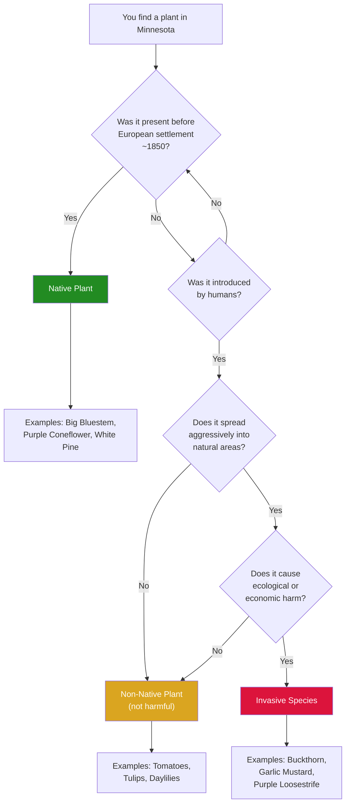
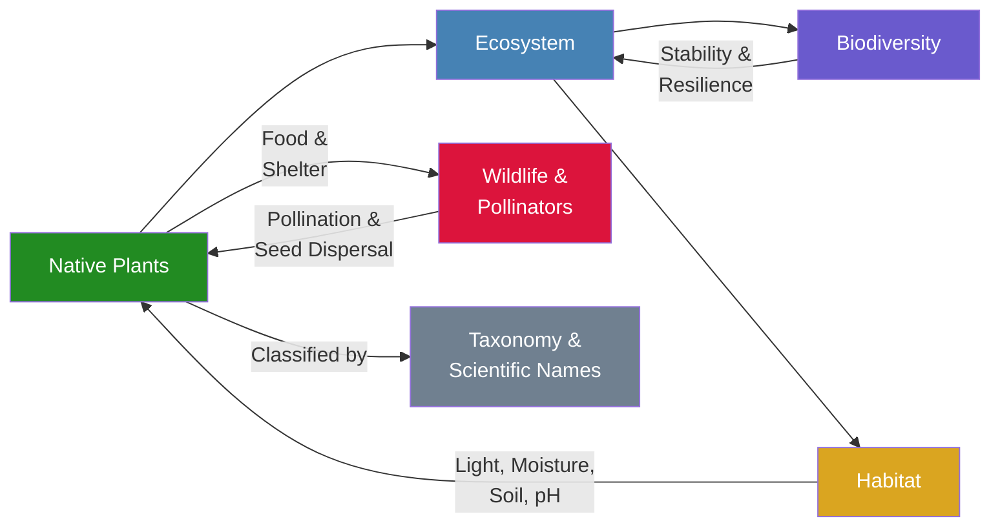

# Introduction to Native Plants and Ecology

!!! mascot-welcome "Welcome, Garden Friends!"
    
    Let's explore the prairie! I'm Bree, and I'll be your guide through the
    wonderful world of Minnesota's native plants. In this first chapter, we'll
    build the foundation you need to understand what makes a plant "native" and
    why that matters for our landscapes and ecosystems.

## Summary

This chapter introduces the foundational concepts you need before exploring specific plant communities. You will learn what defines a native plant, how it differs from non-native and invasive species, and why these distinctions matter for Minnesota's ecosystems. We also cover basic botany, plant identification, the concept of ecosystems, biodiversity, habitat, and how scientists name and classify plants.

## What Is a Native Plant?

A native plant is a species that has existed in a particular region for thousands of years — long before European settlement. In Minnesota, native plants are species that were growing here before approximately 1850, when large-scale agriculture and development began transforming the landscape.

Native plants have evolved alongside Minnesota's soils, climate, insects, and wildlife over thousands of years. This long history of co-evolution means they are uniquely adapted to local conditions. A native prairie grass, for example, may send roots 10 to 15 feet deep into the soil — far deeper than any lawn grass — allowing it to survive drought, hold soil in place, and filter rainwater.

!!! mascot-thinking "Key Insight"
    
    Every plant has a story! A native plant isn't just one that "grows here."
    It's a species that has been part of Minnesota's ecological community for
    millennia, shaping and being shaped by the landscape around it.

### Why "Native" Matters

Native plants provide critical services that non-native species often cannot:

- **Deep root systems** that prevent erosion and filter water
- **Food and shelter** for native pollinators, birds, and wildlife
- **Resilience** to local weather extremes — they are built for Minnesota winters
- **Low maintenance** once established — no fertilizer, little watering, no pesticides needed

Minnesota is home to over 1,800 native plant species. They range from towering White Pines in the north to delicate prairie wildflowers in the south, from aquatic plants in our 10,000+ lakes to mosses in boreal bogs.

The following decision tree can help you classify any plant you encounter as native, non-native, or invasive.

Test your understanding of plant classifications by sorting species into the correct category.

<iframe src="../../sims/native-vs-invasive-sorter/main.html" width="100%" height="500px" scrolling="no"></iframe>

Native vs. Invasive Plant Sorter

Type: microsim

**Learning Objective:** Students will be able to correctly classify common Minnesota plants as native, non-native, or invasive based on their characteristics and history.

**Controls:**
- Draggable plant name cards that can be placed into three bins
- Reset button to start over with a new set of plants
- Check Answers button to reveal correct/incorrect placements

**Visual Elements:**
- Three labeled bins: Native, Non-Native, and Invasive
- Plant name cards with common and scientific names
- Color-coded feedback (green for correct, red for incorrect)
- Score counter showing correct placements

**Behavior:**
- Plants are randomly selected from a pool of 15-20 Minnesota species
- Dragging a card to a bin snaps it into place
- Checking answers highlights correct and incorrect placements with brief explanations
- Resetting shuffles and draws a new set of plants

**Instructional Rationale:**
Active sorting reinforces the decision tree presented in the chapter and helps students internalize the distinctions between native, non-native, and invasive species through practice rather than passive reading.

## Non-Native Plants

A non-native plant (also called an exotic, introduced, or alien species) is one that humans have brought to a region where it did not naturally occur. Non-native plants arrive through many pathways:

- **Intentional introduction** — ornamental landscaping, agriculture, erosion control
- **Accidental introduction** — seeds in shipping containers, soil, or animal feed
- **Escaped cultivars** — garden plants that spread beyond their intended boundaries

Not all non-native plants are harmful. Many common garden flowers, vegetables, and crops are non-native species that behave well in cultivation. Tomatoes, tulips, and daylilies are all non-native to Minnesota but pose no ecological threat.

The key distinction is whether a non-native plant stays where it is planted or begins spreading aggressively into natural areas.

## Invasive Species

An invasive species is a non-native organism that spreads aggressively and causes ecological or economic harm. Not every non-native plant becomes invasive — but the ones that do can devastate natural ecosystems.

Invasive plants succeed because they arrive without the insects, diseases, and competitors that kept them in check in their home range. Freed from these natural controls, they can outcompete native species for light, water, and nutrients.

### Minnesota's Most Problematic Invasive Plants

- **Common Buckthorn** (*Rhamnus cathartica*) — A European shrub that forms dense thickets in woodlands, shading out native wildflowers and tree seedlings
- **Garlic Mustard** (*Alliaria petiolata*) — Releases chemicals into the soil that inhibit native plant growth
- **Spotted Knapweed** (*Centaurea stoebe*) — Displaces native prairie plants and reduces forage quality
- **Wild Parsnip** (*Pastinaca sativa*) — Causes severe skin burns and crowds out native roadside plants
- **Purple Loosestrife** (*Lythrum salicaria*) — Chokes wetlands, reducing habitat for wildlife

!!! mascot-warning "Watch Out for Invasives!"
    
    Buckthorn may look harmless — it even has berries that birds eat. But those
    berries spread seeds everywhere, and a single buckthorn tree can produce
    thousands of seeds per year. We'll cover removal strategies in later chapters.

## Botany Fundamentals

To identify and understand native plants, you need a few basic botanical concepts. You do not need to become a botanist — but knowing the parts of a plant and how plants function will make everything else in this course easier.

### Major Plant Parts

- **Roots** — Anchor the plant and absorb water and nutrients from the soil. Native prairie plants are famous for their extraordinarily deep root systems.
- **Stems** — Support the plant and transport water and nutrients between roots and leaves.
- **Leaves** — The primary site of photosynthesis, where plants convert sunlight into energy. Leaf shape is one of the most useful features for plant identification.
- **Flowers** — Reproductive structures that produce seeds. Flower structure varies enormously and is a key identification feature.
- **Fruits and Seeds** — The means by which plants reproduce and spread. Fruits can be berries, pods, capsules, nuts, or wind-dispersed plumes.

### How Plants Make Energy

All green plants use **photosynthesis** to convert sunlight, water, and carbon dioxide into sugars and oxygen. This process is the foundation of nearly every food web on Earth — plants capture the sun's energy and make it available to animals, insects, and fungi.

## Plant Identification Basics

Learning to identify plants is a skill that improves with practice. You do not need to memorize hundreds of species at once. Start with a few common natives and a few common invasives, and build from there.

### Key Features to Observe

When you encounter an unfamiliar plant, notice these features:

- **Leaf shape** — Is it broad or narrow? Smooth-edged or toothed? Simple or compound?
- **Leaf arrangement** — Are leaves opposite each other on the stem, or do they alternate?
- **Flower structure** — How many petals? What color? Are flowers clustered or solitary?
- **Plant height and growth habit** — Is it a ground cover, a shrub, or a tall grass?
- **Habitat** — Where is it growing? Prairie, woodland, wetland, roadside?
- **Season** — When is it blooming? Spring, summer, or fall?

!!! mascot-tip "Bree's Tip"
    
    Take photos! When you're starting out, photograph the whole plant, a close-up
    of the leaves, and a close-up of the flower. These three shots will help you
    identify it later using a field guide or plant ID app.

## Ecosystems

An **ecosystem** is a community of living organisms (plants, animals, fungi, microbes) interacting with each other and with their physical environment (soil, water, sunlight, climate). Ecosystems can be as large as a boreal forest or as small as a backyard rain garden.

Every ecosystem has two components:

- **Biotic** (living) — plants, animals, insects, fungi, bacteria
- **Abiotic** (non-living) — soil, water, sunlight, temperature, wind, rocks

Native plants are the foundation of healthy ecosystems. They capture sunlight, build soil, cycle nutrients, filter water, and provide food and shelter for the animals and insects that depend on them.

The diagram below shows how the key ecological concepts introduced in this chapter connect to one another.

### Minnesota's Major Ecosystems

Minnesota sits at the intersection of three major North American biomes:

- **Tallgrass Prairie** — once covered the western and southern third of the state
- **Deciduous Forest** — dominates the central and southeastern regions
- **Coniferous (Boreal) Forest** — stretches across the northeast

This convergence makes Minnesota one of the most ecologically diverse states in the upper Midwest.

## Biodiversity

**Biodiversity** refers to the variety of life at every level — the diversity of species, the genetic diversity within species, and the diversity of ecosystems across a landscape.

Why does biodiversity matter?

- **Ecosystem stability** — Diverse plant communities are more resilient to drought, disease, and extreme weather
- **Pollinator support** — Different pollinators need different flower shapes, colors, and bloom times
- **Pest resistance** — Monocultures (single-species plantings) are vulnerable to disease outbreaks; diverse plantings are not
- **Soil health** — Different root depths and structures improve soil in different ways

A healthy native prairie might contain 200 or more plant species per acre. Compare that to a conventional lawn, which is typically a single species of non-native grass.

## Habitat

A **habitat** is the natural environment where a particular species lives and finds the food, water, shelter, and space it needs to survive. Different species need different habitats.

For plants, habitat is defined by:

- **Light** — full sun, partial shade, or full shade
- **Moisture** — dry, mesic (medium), or wet
- **Soil type** — sandy, loamy, or clay
- **pH** — acidic, neutral, or alkaline

Understanding habitat is essential for selecting the right native plants for your site. A sun-loving prairie plant will struggle in deep woodland shade, and a bog plant will die on a dry hillside.

## Plant Taxonomy Basics

**Taxonomy** is the science of classifying and naming living organisms. Plants are organized into a hierarchy:

- **Kingdom** — Plantae (all plants)
- **Family** — Groups of related plants (e.g., Asteraceae, the daisy family)
- **Genus** — A smaller group within a family (e.g., *Echinacea*)
- **Species** — A specific type of plant (e.g., *Echinacea purpurea*)

You don't need to memorize the full classification system, but knowing plant families can be very helpful. Plants in the same family often share similar features — once you learn to recognize the daisy family (Asteraceae), you'll start noticing its members everywhere.

## Scientific Nomenclature

Every plant has a **scientific name** consisting of two parts: the genus and the species. This system, called **binomial nomenclature**, was developed by Carl Linnaeus in the 1700s and is used worldwide.

- **Common name**: Purple Coneflower
- **Scientific name**: *Echinacea purpurea*

Why do we use scientific names?

- **Precision** — Common names vary by region. "Bluebell" refers to completely different plants in different states.
- **Universality** — Scientific names are the same worldwide, regardless of language.
- **Relationships** — The genus name shows which plants are related. *Echinacea purpurea* and *Echinacea pallida* are clearly close relatives.

!!! mascot-tip "Bree's Tip"
    
    Don't worry about pronouncing scientific names perfectly. Even professional
    botanists disagree on pronunciation! The important thing is being able to
    look up the right plant when a common name is ambiguous.

## Chapter Summary

!!! mascot-celebration "Great Progress!"
    
    Let's grow together! You now have the foundational vocabulary to explore
    Minnesota's native plants with confidence. You can distinguish native from
    non-native from invasive, you know what to look for when identifying plants,
    and you understand how ecosystems, biodiversity, and habitat all connect.

In this chapter, you learned:

- A **native plant** is a species present in Minnesota before European settlement (~1850)
- **Non-native plants** were introduced by humans; most are harmless, but some become **invasive**
- **Invasive species** spread aggressively and displace native plants
- Basic **botany** — plant parts, photosynthesis, and key identification features
- An **ecosystem** includes all living and non-living components interacting together
- **Biodiversity** — the variety of life — makes ecosystems more resilient
- **Habitat** describes the specific conditions a species needs to thrive
- **Taxonomy** and **scientific nomenclature** provide a universal system for naming plants

## Concepts Covered

This chapter covers the following 10 concepts from the learning graph:

1. Native Plant Definition
2. Non-Native Plant Definition
3. Invasive Species Definition
4. Plant Identification Basics
5. Botany Fundamentals
6. Ecosystem Definition
7. Biodiversity
8. Habitat
9. Plant Taxonomy Basics
10. Scientific Nomenclature

## Prerequisites

This chapter assumes only the prerequisites listed in the [course description](../../course-description.md). No prior knowledge of botany or ecology is required.

## What's Next

In Chapter 2, we'll zoom in on Minnesota's geography — its ecoregions, hardiness zones, and soil types — so you can understand which native plants thrive where.
