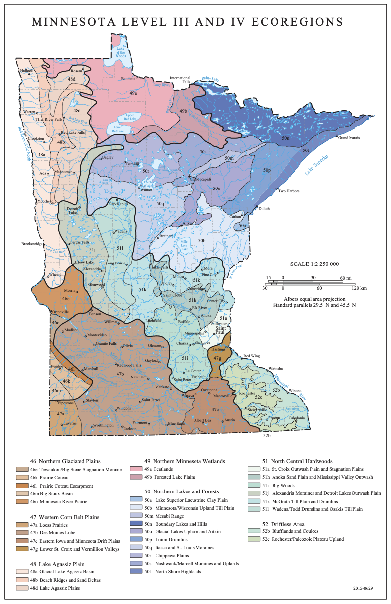
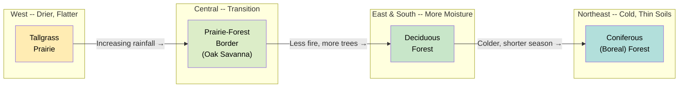
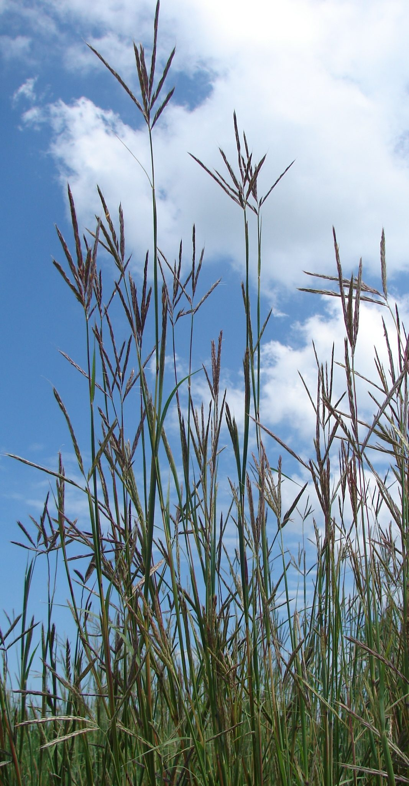
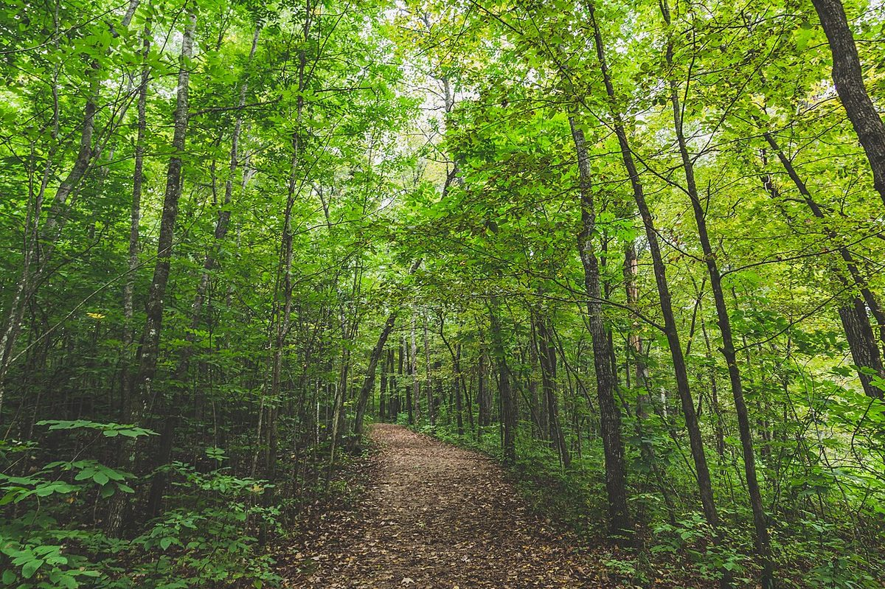
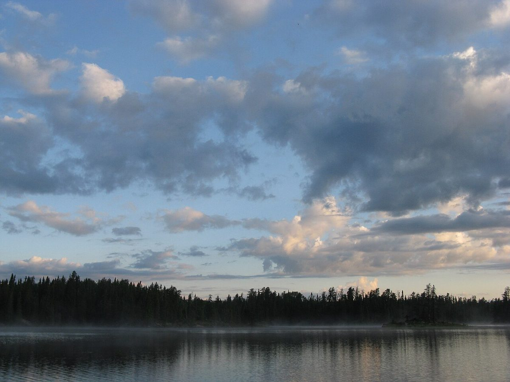
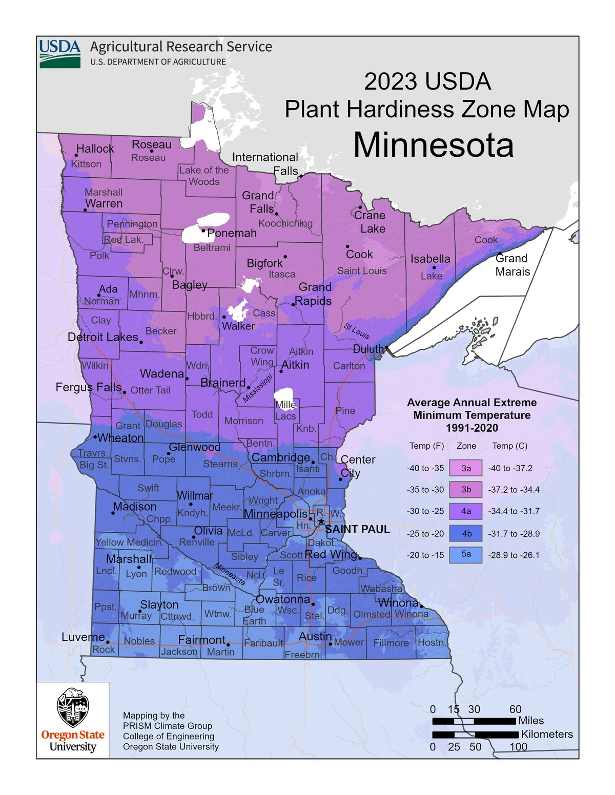
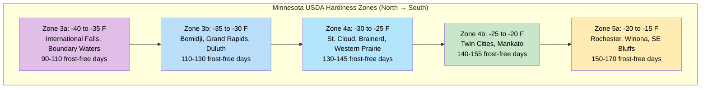

# Minnesota's Ecoregions and Growing Conditions

!!! mascot-welcome "Welcome Back, Plant Explorers!"
    
    Let's explore the prairie! In this chapter, we'll discover what makes
    Minnesota's landscape so wonderfully diverse. From tallgrass prairies in the
    west to boreal forests in the northeast, you'll learn why certain native
    plants thrive in certain places — and how to match the right plant to your
    own backyard.

## Summary

Minnesota sits at a remarkable ecological crossroads. Three major North American biomes meet within our borders, creating a patchwork of prairies, forests, and wetlands found in few other states. This chapter explores Minnesota's ecoregions, climate zones, soils, and growing conditions. Understanding these factors is the key to choosing native plants that will thrive in your specific location.

## Minnesota Ecoregions

An **ecoregion** is a large area of land defined by its climate, landforms, soils, and natural plant communities. Scientists use ecoregions to describe the major patterns of landscape and vegetation across a region.

Minnesota contains four major ecoregions:

- **Tallgrass Prairie** — the western and southwestern portion of the state
- **Deciduous Forest** — the central and southeastern regions
- **Coniferous (Boreal) Forest** — the northeastern corner and Boundary Waters area
- **Prairie-Forest Border** — the transition zone where prairie and forest intermingle

*Map: EPA Level III Ecoregions of Minnesota. Source: U.S. Environmental Protection Agency (public domain).*

The following diagram shows how Minnesota's ecoregions transition from west to east across the state, driven by increasing rainfall and changing fire frequency.

Explore Minnesota's ecoregions interactively by clicking on different regions of the map to see their characteristic plants and growing conditions.

<iframe src="../../sims/mn-ecoregion-explorer/main.html" width="100%" height="500px" scrolling="no"></iframe>

Minnesota Ecoregion Explorer

Type: microsim

**Learning Objective:** Students will understand the geographic distribution of Minnesota's four major ecoregions and the distinct plant communities, soil types, and climate conditions associated with each.

**Controls:**
- Clickable map regions for each ecoregion
- Toggle buttons to show/hide layers: dominant plants, soil types, annual rainfall

**Visual Elements:**
- Simplified map of Minnesota divided into four color-coded ecoregions
- Info panel displaying representative native plants, soil type, and climate data for the selected region
- Plant illustrations or icons for key species in each ecoregion

**Behavior:**
- Clicking a region highlights it and populates the info panel with ecoregion details
- Toggling layers overlays additional data (rainfall gradient, soil type shading) on the map
- Hovering over plant names shows a brief description

**Instructional Rationale:**
Spatial learning through an interactive map helps students connect geographic location to ecological conditions, reinforcing why certain plants thrive in certain parts of the state.

These ecoregions did not appear randomly. They result from differences in rainfall, temperature, fire history, glacial landforms, and soils. Western Minnesota is drier and flatter, favoring grasses. Eastern and northern Minnesota receives more moisture and has hillier terrain, favoring trees.

The Minnesota Department of Natural Resources (DNR) further divides these four broad regions into smaller **ecological subsections** — 26 in total — each with its own distinctive character. The Anoka Sand Plain near the Twin Cities, for example, has sandy soils and dry prairies. The Border Lakes region near Ely has thin soils over bedrock and old-growth boreal forest.

!!! mascot-thinking "Key Insight"
    
    Every plant has a story! Minnesota is one of the only places in North
    America where tallgrass prairie, deciduous forest, and boreal forest all
    meet. This ecological crossroads gives us extraordinary plant diversity —
    over 1,800 native species.

## Tallgrass Prairie Region

*Big Bluestem (Andropogon gerardii), the signature grass of the tallgrass prairie, can reach 6 to 8 feet tall. Photo: Jennifer Briggs / USFWS (CC BY 2.0).*

The **tallgrass prairie** once covered roughly one-third of Minnesota — about 18 million acres stretching across the western and southern parts of the state. Today, less than 2% of that original prairie remains, making it one of the most endangered ecosystems in North America.

### What Defines Tallgrass Prairie

Tallgrass prairie forms where annual rainfall is moderate (20 to 35 inches), summers are warm, and periodic fire prevents trees from taking over. The "tallgrass" name comes from the dominant grasses, which can reach heights of 6 to 8 feet by late summer.

Key tallgrass prairie plants include:

- **Big Bluestem** (*Andropogon gerardii*) — The signature prairie grass, growing up to 8 feet tall with distinctive three-pronged seed heads that resemble a turkey foot
- **Indian Grass** (*Sorghastrum nutans*) — A graceful grass with golden, plume-like seed heads
- **Prairie Dropseed** (*Sporobolus heterolepis*) — A fine-textured bunchgrass with a sweet fragrance
- **Purple Coneflower** (*Echinacea purpurea*) — A beloved wildflower with pink-purple petals and a spiny central cone
- **Black-eyed Susan** (*Rudbeckia hirta*) — A cheerful yellow wildflower found throughout Minnesota prairies

### What Lies Beneath

The true power of tallgrass prairie is underground. Prairie grasses send roots 10 to 15 feet deep into the soil. These massive root systems built the rich, dark topsoil that makes the Midwest such productive farmland. A single square yard of prairie soil can contain over 20 miles of roots.

### Where to See Tallgrass Prairie Today

You can experience remnant and restored tallgrass prairie at several locations across Minnesota:

- **Blue Mounds State Park** near Luverne in the far southwest
- **Glacial Lakes State Park** near Starbuck in west-central Minnesota
- **Bluestem Prairie** (The Nature Conservancy) near Moorhead
- **Schaefer Prairie** (The Nature Conservancy) near Glencoe

## Deciduous Forest Region

*A hiking trail winds through the deciduous forest canopy at Nerstrand Big Woods State Park, one of the best remaining Big Woods remnants in Minnesota. Photo: Wikimedia Commons (CC BY-SA 2.0).*

The **deciduous forest** region covers central and southeastern Minnesota. **Deciduous** means "falling off" — these are the hardwood trees that drop their leaves each autumn, painting the landscape in brilliant reds, oranges, and golds.

### What Defines Deciduous Forest

Deciduous forests develop where rainfall is higher than on the prairie (30 to 35 inches per year) and where terrain provides enough shelter from fire to allow trees to grow. The soils tend to be rich, deep, and well-drained.

Minnesota's deciduous forests include a mix of tree species:

- **Sugar Maple** (*Acer saccharum*) — The source of maple syrup, with brilliant orange fall color
- **Red Oak** (*Quercus rubra*) — A tall, stately tree that produces acorns critical to wildlife
- **American Basswood** (*Tilia americana*) — A large shade tree with fragrant summer flowers beloved by bees
- **White Birch** (*Betula papyrifera*) — An iconic Minnesota tree with peeling white bark
- **Ironwood** (*Ostrya virginiana*) — A tough understory tree common in mature forests

### The Forest Floor

Deciduous forests have a rich understory of shrubs and wildflowers. Because sunlight reaches the forest floor in spring before trees leaf out, many woodland wildflowers bloom early:

- **Bloodroot** (*Sanguinaria canadensis*) — One of the first spring wildflowers, with a single white flower
- **Wild Ginger** (*Asarum canadense*) — A ground-cover plant with heart-shaped leaves
- **Jack-in-the-Pulpit** (*Arisaema triphyllum*) — An unusual flower shaped like a hooded preacher in a canopied pulpit

### Where to See Deciduous Forest

- **Nerstrand Big Woods State Park** in Rice County — one of the best remaining Big Woods remnants
- **Whitewater State Park** in the bluff country of southeastern Minnesota
- **Frontenac State Park** along the Mississippi River near Red Wing

## Coniferous Forest Region

*Boreal forest surrounds a lake in the Boundary Waters Canoe Area Wilderness, northeastern Minnesota. Photo: U.S. Forest Service (public domain).*

The **coniferous forest** (also called the boreal forest) blankets northeastern Minnesota. **Coniferous** means "cone-bearing" — these are the evergreen trees that keep their needles year-round: spruces, pines, and firs.

### What Defines Coniferous Forest

Coniferous forests develop where winters are long and harsh, summers are short, and soils are thin and acidic. Northeastern Minnesota has some of the coldest temperatures in the lower 48 states. The growing season may be as short as 90 days in the far north.

Key coniferous forest species include:

- **White Spruce** (*Picea glauca*) — A common boreal tree with short, stiff blue-green needles
- **Balsam Fir** (*Abies balsamea*) — The classic Christmas tree, with flat, fragrant needles
- **Red Pine** (*Pinus resinosa*) — Minnesota's state tree, with long needles in bundles of two and distinctive reddish bark
- **White Pine** (*Pinus strobus*) — Once the giant of Minnesota forests, with soft needles in bundles of five
- **Paper Birch** (*Betula papyrifera*) — Found in both deciduous and boreal forests, thriving on disturbed sites

### The Boreal Understory

The coniferous forest floor is quite different from deciduous woods. Acidic needle litter and deep shade create conditions suited to specialized plants:

- **Wild Blueberry** (*Vaccinium angustifolium*) — A low shrub producing small, intensely flavored berries
- **Bunchberry** (*Cornus canadensis*) — A tiny dogwood relative that carpets the forest floor with white flowers
- **Large-leaved Aster** (*Eurybia macrophylla*) — A shade-tolerant wildflower common in northern forests

### Where to See Coniferous Forest

- **Boundary Waters Canoe Area Wilderness** — over one million acres of boreal forest and lakes
- **Superior National Forest** — stretching along the Lake Superior shoreline
- **Itasca State Park** — home to old-growth red and white pine stands, and the headwaters of the Mississippi River

## Prairie-Forest Border

The **prairie-forest border** (also called the tension zone or ecotone) is the transitional band where prairie and forest meet. This region runs diagonally through Minnesota from the northwest to the southeast.

### A Dynamic Boundary

This boundary is not a sharp line. It is a broad zone where patches of prairie and woodland interweave. Historically, fire was the primary force determining where this boundary fell. Frequent fires pushed the border eastward, favoring grasses. Fire suppression allowed trees to advance westward.

The prairie-forest border contains a unique blend of communities:

- **Oak savannas** — open woodlands with widely spaced Bur Oak (*Quercus macrocarpa*) trees and a prairie grass understory
- **Brushland** — thickets of shrubs and small trees along waterways
- **Mixed grassland-woodland mosaics** — patches of prairie and forest side by side

### Why It Matters for Gardeners

If you live in the Twin Cities metro area, you sit squarely in the prairie-forest border. This means your yard may support native plants from both prairie and woodland communities. You have a particularly wide palette of native species to choose from.

!!! mascot-tip "Bree's Tip"
    
    Let's grow together! Not sure which ecoregion you're in? Visit the Minnesota
    DNR's Ecological Classification System page online. Enter your county and it
    will tell you exactly which ecological province and subsection your property
    falls within.

## Minnesota Wetland Types

Minnesota is known as the "Land of 10,000 Lakes," but it actually has more than 11,800 lakes and over 10 million acres of wetlands. **Wetlands** are areas where water covers the soil or is present at or near the surface for part or all of the year.

### Major Wetland Categories

Minnesota's wetlands fall into several broad types:

- **Marshes** — Shallow-water wetlands dominated by emergent plants like cattails and bulrushes. Common around lake edges and along slow-moving streams.
- **Wet meadows** — Seasonally flooded grasslands. The soil is saturated in spring but may dry out by midsummer. Home to sedges, rushes, and moisture-loving wildflowers.
- **Bogs** — Acidic wetlands with a thick mat of sphagnum moss. Bogs receive water mainly from rain, making them nutrient-poor. They support specialized plants like pitcher plants and Labrador tea.
- **Fens** — Groundwater-fed wetlands that are less acidic than bogs. Fens support a high diversity of sedges, grasses, and rare orchids.
- **Swamps** — Forested wetlands dominated by trees like [Black Ash](../../plants/black-ash.md) (*Fraxinus nigra*), [Tamarack](../../plants/tamarack.md) (*Larix laricina*), or Northern White Cedar (*Thuja occidentalis*).
- **Floodplain forests** — Wooded areas along rivers that are periodically flooded, supporting [Silver Maple](../../plants/silver-maple.md) (*Acer saccharinum*) and cottonwoods.

### Why Wetlands Matter

Wetlands provide outsized ecological benefits:

- **Flood control** — They absorb and slow floodwaters like giant sponges
- **Water filtration** — Wetland plants and soils filter pollutants and excess nutrients
- **Wildlife habitat** — Wetlands support waterfowl, amphibians, turtles, and countless insects
- **Carbon storage** — Peatlands in northern Minnesota store enormous quantities of carbon

Minnesota has lost over 50% of its original wetland area since European settlement. Protecting and restoring wetlands is a critical conservation priority.

## USDA Hardiness Zones

*USDA Plant Hardiness Zone Map for Minnesota, showing Zones 3a through 5a. Source: USDA Agricultural Research Service (public domain).*

If you have ever bought a perennial plant at a garden center, you have probably seen a label that says something like "Hardy to Zone 4." What does that mean?

The **USDA Plant Hardiness Zone Map** divides North America into zones based on the average annual extreme minimum temperature. Each zone represents a 10-degree Fahrenheit range. The zones tell you whether a perennial plant can survive winter in your area.

### How Zones Work

The system is straightforward:

- Lower zone numbers mean colder winters
- Higher zone numbers mean milder winters
- Each zone is further divided into "a" (colder half) and "b" (warmer half), representing a 5-degree difference

For example, Zone 4a has average minimum temperatures of -30 to -25 degrees Fahrenheit. Zone 4b has average minimums of -25 to -20 degrees.

A plant labeled "Hardy to Zone 4" can survive winter temperatures as low as -30 degrees Fahrenheit. If you live in Zone 3, that plant may not survive your coldest winters.

!!! mascot-thinking "Key Insight"
    
    Let's explore the prairie! Hardiness zones tell you the coldest temperature
    a plant can survive — but they don't tell you everything. A plant might be
    zone-hardy but still fail if your soil is wrong, your site is too shady, or
    summer rainfall is insufficient. Always consider the full picture.

## Zones 3a Through 5a

Minnesota spans USDA Hardiness Zones 3a through 5a. That range represents a significant difference in winter cold — from -40 degrees Fahrenheit in the far north to -15 degrees in the southeastern corner.

The chart below summarizes Minnesota's hardiness zones from coldest in the north to warmest in the southeast.

Use this interactive tool to look up the USDA hardiness zone for any Minnesota location and see which native plants are recommended for that zone.

<iframe src="../../sims/hardiness-zone-lookup/main.html" width="100%" height="500px" scrolling="no"></iframe>

Hardiness Zone Lookup

Type: microsim

**Learning Objective:** Students will be able to determine the USDA hardiness zone for a given Minnesota location and identify native plants suited to that zone's temperature extremes.

**Controls:**
- Text input for zip code lookup
- Clickable map of Minnesota for point-based lookup
- Dropdown to filter recommended plants by type (grasses, wildflowers, shrubs, trees)

**Visual Elements:**
- Minnesota map color-coded by hardiness zone (3a through 5a)
- Selected location marker on the map
- Zone information panel showing temperature range and frost-free days
- Scrollable list of recommended native plants for the selected zone

**Behavior:**
- Entering a zip code or clicking the map highlights the corresponding zone and displays zone details
- The plant list updates to show species hardy to the selected zone
- Clicking a plant name shows a brief profile with bloom time and habitat preferences

**Instructional Rationale:**
Personalizing the hardiness zone concept to the student's own location makes the abstract zone system immediately practical and motivates plant selection decisions grounded in real conditions.

### Zone 3a (-40 to -35 degrees F)

Zone 3a covers the far northern tier of Minnesota, including International Falls, Roseau, and the Boundary Waters region. This is some of the coldest territory in the lower 48 states. Plants here must tolerate extreme cold, short growing seasons, and heavy snow loads.

Native plants well suited to Zone 3a:

- White Spruce, Balsam Fir, Paper Birch
- Wild Blueberry, Bunchberry, Large-leaved Aster
- Native sedges and boreal wildflowers

### Zone 3b (-35 to -30 degrees F)

Zone 3b covers much of northern Minnesota, including Bemidji, Grand Rapids, and Duluth. Conditions are still very cold, but the growing season is slightly longer.

### Zone 4a (-30 to -25 degrees F)

Zone 4a covers a broad swath of central Minnesota, including St. Cloud, Brainerd, and much of the western prairie region. The majority of Minnesota's population lives in Zones 4a and 4b.

### Zone 4b (-25 to -20 degrees F)

Zone 4b covers the Twin Cities metro area, Mankato, and surrounding regions. This is the most commonly referenced zone for Twin Cities gardeners. Most Minnesota native plants are hardy to at least Zone 4b.

### Zone 5a (-20 to -15 degrees F)

Zone 5a is limited to a small area in extreme southeastern Minnesota, near Rochester, Winona, and along the Mississippi River bluffs. The river valley moderates winter cold, and the bluffs provide shelter from wind. Gardeners here can grow a few species that would not survive farther north.

## Growing Season Length

The **growing season** is the number of days between the last spring frost and the first fall frost. This determines how long warm-season plants have to grow, flower, and set seed.

Minnesota's growing season varies dramatically:

- **Northern Minnesota** (Zone 3a): approximately 90 to 110 frost-free days. The last spring frost may not arrive until late May, and the first fall frost can come in early September.
- **Central Minnesota** (Zones 4a-4b): approximately 130 to 150 frost-free days. The Twin Cities typically sees its last spring frost around May 10 and first fall frost around October 5.
- **Southern Minnesota** (Zones 4b-5a): approximately 150 to 170 frost-free days. Rochester and the far southeast enjoy the longest growing season in the state.

### What This Means for Native Plants

Minnesota's native plants have evolved to complete their life cycles within the local growing season. A prairie plant from the southwest part of the state may flower and set seed on a schedule tuned to a 160-day growing season. If you move that same species to a garden near Duluth with a 120-day season, it may not have time to fully mature.

This is why sourcing plants and seeds from **local ecotypes** — populations adapted to your specific region — matters. A Big Bluestem grown from seed collected in Goodhue County will perform better in a Twin Cities garden than one from seed collected in Kansas.

!!! mascot-tip "Bree's Tip"
    
    Every plant has a story! When buying native plants or seeds, ask your
    supplier about seed origin. Reputable native plant nurseries in Minnesota
    track the geographic source of their seed and can help you choose plants
    adapted to your growing season.

## Minnesota Soil Types

Soil is the foundation of every garden and every natural plant community. Understanding your soil helps you choose the right native plants and set realistic expectations for what will grow.

### How Minnesota's Soils Formed

Minnesota's soils were shaped primarily by glaciers. Over the past two million years, massive ice sheets advanced and retreated across the state multiple times, grinding bedrock, depositing sediments, and carving lake basins. The result is a complex patchwork of soil types.

### Major Soil Categories

Minnesota has several major soil types that correspond to its ecoregions:

- **Prairie soils (Mollisols)** — Deep, dark, nutrient-rich soils formed under thousands of years of prairie grass growth. These soils are found across western and southern Minnesota and are among the most fertile in the world. They are typically loamy with high organic matter.
- **Forest soils (Alfisols)** — Lighter-colored, moderately fertile soils formed under deciduous forest. Found across central and southeastern Minnesota. These soils have a distinct layer structure and moderate organic content.
- **Boreal soils (Spodosols and Histosols)** — Thin, acidic, sandy soils in the northeast, often over bedrock. Northern peatland soils (Histosols) are composed largely of partially decomposed plant material and can be many feet deep.
- **Sandy soils (Entisols)** — Found in areas like the Anoka Sand Plain north of the Twin Cities and parts of central Minnesota. These well-drained soils dry out quickly and support dry prairie and oak savanna communities.
- **Clay soils** — Heavy, poorly drained soils found in parts of the Red River Valley and in glacial lake beds. These soils hold water well but can be difficult to work and are slow to warm in spring.

### Soil and Plant Selection

Matching plants to your soil type is just as important as matching them to your hardiness zone:

- **Sandy soils** suit drought-tolerant prairie species like Prairie Dropseed, [Butterfly Milkweed](../../plants/butterfly-milkweed.md) (*Asclepias tuberosa*), and [Pasque Flower](../../plants/pasque-flower.md) (*Anemone patens*)
- **Clay soils** suit moisture-tolerant species like [Blue Flag Iris](../../plants/blue-flag-iris.md) (*Iris versicolor*), [Joe Pye Weed](../../plants/joe-pye-weed.md) (*Eutrochium maculatum*), and [Swamp Milkweed](../../plants/swamp-milkweed.md) (*Asclepias incarnata*)
- **Rich loam** supports the widest variety of native plants, from prairie wildflowers to woodland species
- **Acidic, sandy soils** in the northeast support blueberries, ferns, and boreal wildflowers

A simple soil test from your local University of Minnesota Extension office can tell you your soil's texture, pH, and nutrient levels. This is one of the most valuable steps you can take before planting.

## Chapter Summary

!!! mascot-celebration "Wonderful Progress!"
    
    Let's grow together! You now have a solid understanding of Minnesota's
    landscape — its ecoregions, climate zones, growing seasons, and soils. This
    knowledge is your compass for choosing the right native plants for your
    specific corner of the state.

In this chapter, you learned:

- Minnesota contains four major **ecoregions**: tallgrass prairie, deciduous forest, coniferous forest, and the prairie-forest border
- The **tallgrass prairie** once covered 18 million acres but less than 2% remains today
- **Deciduous forests** are defined by broadleaf trees that drop their leaves each fall
- **Coniferous forests** in the northeast feature evergreen trees adapted to harsh, cold conditions
- The **prairie-forest border** is a dynamic transition zone — especially relevant for Twin Cities gardeners
- Minnesota has diverse **wetland types** including marshes, bogs, fens, and swamps
- **USDA Hardiness Zones** indicate the coldest temperatures a plant can survive
- Minnesota spans **Zones 3a through 5a**, from -40 to -15 degrees Fahrenheit minimum temperatures
- **Growing season length** ranges from 90 days in the north to 170 days in the southeast
- Minnesota's **soil types** were shaped by glaciers and vary from rich prairie loams to thin boreal sands

## Concepts Covered

This chapter covers the following 10 concepts from the learning graph:

1. Minnesota Ecoregions
2. Tallgrass Prairie Region
3. Deciduous Forest Region
4. Coniferous Forest Region
5. Prairie-Forest Border
6. Minnesota Wetland Types
7. USDA Hardiness Zones
8. Zones 3a Through 5a
9. Growing Season Length
10. Minnesota Soil Types

## Prerequisites

This chapter builds on the foundational concepts from [Chapter 1: Introduction to Native Plants and Ecology](../../chapters/01-intro-native-plants-ecology/index.md). You should be comfortable with the definitions of native plants, ecosystems, biodiversity, and habitat before proceeding.

## What's Next

In Chapter 3, we'll dive into the plants of Minnesota's prairies and grasslands — the wildflowers, grasses, and forbs that make up one of the most beautiful and ecologically important plant communities on the continent.

## Image Credits

- Ecoregion map: U.S. Environmental Protection Agency, Level III Ecoregions of Minnesota (public domain)
- Tallgrass prairie photo: Jennifer Briggs / USFWS Mountain-Prairie (CC BY 2.0)
- Deciduous forest photo: Wikimedia Commons contributor (CC BY-SA 2.0)
- Boreal forest photo: U.S. Forest Service (public domain)
- USDA Hardiness Zone map: USDA Agricultural Research Service, 2023 Plant Hardiness Zone Map (public domain)

[See Annotated References](./references.md)
