# Prairie Plants and Grassland Ecosystems

!!! mascot-welcome "Welcome to the Prairie!"
    
    Let's explore the prairie! I'm Bree, and this chapter is one of my favorites
    because prairies are where pollinators like me feel right at home. We'll walk
    through the grasses, wildflowers, soils, and fire that make Minnesota's
    prairies one of the most remarkable ecosystems on Earth.

## Summary

This chapter explores the tallgrass prairie, the iconic grassland ecosystem that once covered a vast portion of Minnesota. You will learn about the history and current state of prairies, meet the major grasses and wildflowers that define them, and discover how soil ecology, fire, and deep root systems work together to keep prairies healthy. By the end of this chapter, you will understand why prairies matter, which plants to look for, and how land managers use fire to maintain these landscapes.

---

## Part 1: The Prairie Ecosystem

### Prairie Ecosystem Overview

A prairie is a grassland ecosystem dominated by grasses, wildflowers (called forbs), and sedges, with few or no trees. Prairies develop in regions where the climate is too dry for forests but wet enough to support dense herbaceous vegetation. Wind, periodic drought, grazing by large animals, and fire all play roles in keeping prairies open and treeless.

Minnesota's prairies are part of the tallgrass prairie region, the easternmost band of North America's Great Plains grasslands. Tallgrass prairies receive more rainfall than the mixed-grass and shortgrass prairies farther west, which allows their dominant grasses to reach impressive heights of six feet or more.

What makes a prairie more than just a field of grass is its extraordinary diversity. A healthy tallgrass prairie can support 200 to 300 plant species per acre, along with hundreds of insect species, dozens of bird species, and a complex underground community of fungi, bacteria, and invertebrates.

### Tallgrass Prairie History

Before European settlement, tallgrass prairie covered roughly one-third of Minnesota — approximately 18 million acres stretching across the western and southern portions of the state. For thousands of years, this landscape was shaped by three forces:

- **Fire** — Lightning strikes and fires set by Indigenous peoples swept across the prairie every few years, killing tree seedlings and recycling nutrients
- **Grazing** — Vast herds of bison moved across the grasslands, cropping vegetation unevenly and disturbing the soil
- **Climate** — Hot summers, cold winters, periodic drought, and strong winds favored deep-rooted grasses over shallow-rooted trees

Indigenous peoples, including the Dakota, managed the prairie with fire for millennia. They burned strategically to encourage new grass growth, attract bison, improve travel routes, and maintain open landscapes. The prairie that European settlers encountered was not a wilderness untouched by humans — it was a landscape actively shaped by human stewardship.

Settlement in the mid-1800s transformed Minnesota's prairies rapidly. The deep, rich soils that thousands of years of prairie growth had built turned out to be extraordinarily fertile for agriculture. Within a few decades, the steel plow converted most of Minnesota's tallgrass prairie into cropland.

### Prairie Remnants

Today, less than 2 percent of Minnesota's original tallgrass prairie remains — roughly 235,000 acres out of the original 18 million. These surviving fragments are called **prairie remnants**, and they are among the most endangered ecosystems in North America.

Prairie remnants survive in places that were difficult to plow:

- **Rocky or steep terrain** where plows could not reach
- **Railroad rights-of-way** that were never cultivated
- **Pioneer cemeteries** that were left undisturbed
- **Roadsides and ditches** with native soil intact
- **State and federal preserves** set aside for conservation

These remnants are irreplaceable. They contain plant communities that took thousands of years to develop, including species that are extremely difficult to establish from seed. They also harbor unique soil microbiology — fungal networks and bacterial communities — that cannot be recreated in a restored prairie.

Minnesota protects prairie remnants through programs managed by the Minnesota Department of Natural Resources, The Nature Conservancy, the U.S. Fish and Wildlife Service, and local conservation organizations. Volunteer-led prairie surveys continue to discover previously unknown remnants across the state.

---

## Part 2: Prairie Grasses

### Prairie Grasses Overview

Grasses are the backbone of every prairie. They make up the majority of the plant biomass, build the soil with their deep roots, and create the structure that other prairie species depend on. Minnesota's prairies support both warm-season and cool-season grasses, each filling a different ecological role.

#### Warm-Season Grasses

Warm-season grasses (also called C4 grasses) are the signature plants of the tallgrass prairie. They begin growing in late spring, reach peak growth in the heat of summer, and go dormant after the first hard frost. Their photosynthetic pathway (called C4 photosynthesis) is more efficient in hot, sunny conditions than the pathway used by cool-season grasses.

The major warm-season prairie grasses include Big Bluestem, Little Bluestem, Switchgrass, Indian Grass, and Prairie Dropseed. These are the species that give the tallgrass prairie its character — they are the tall, swaying grasses that dominate the summer and fall landscape.

<a href="../../plants/big-bluestem/" class="plant-gallery-card">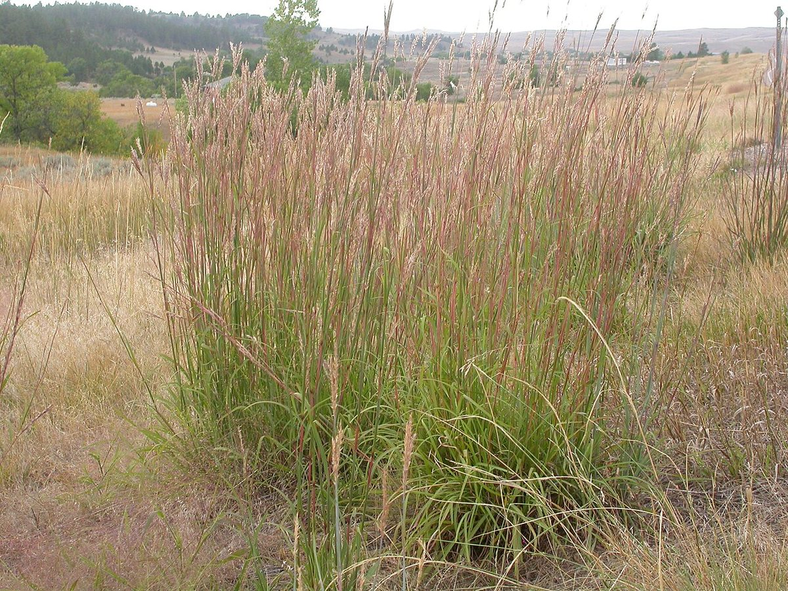
Big Bluestem <em>Andropogon gerardii</em>
</a>
<a href="../../plants/little-bluestem/" class="plant-gallery-card">
Little Bluestem <em>Schizachyrium scoparium</em>
</a>
<a href="../../plants/switchgrass/" class="plant-gallery-card">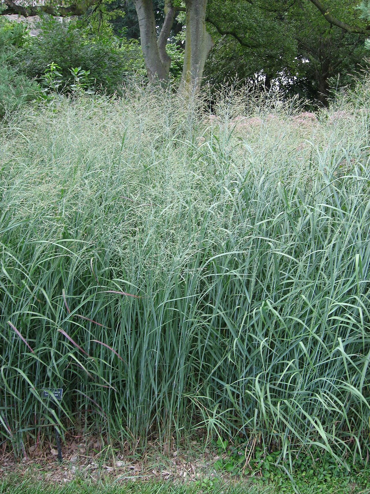
Switchgrass <em>Panicum virgatum</em>
</a>
<a href="../../plants/indian-grass/" class="plant-gallery-card">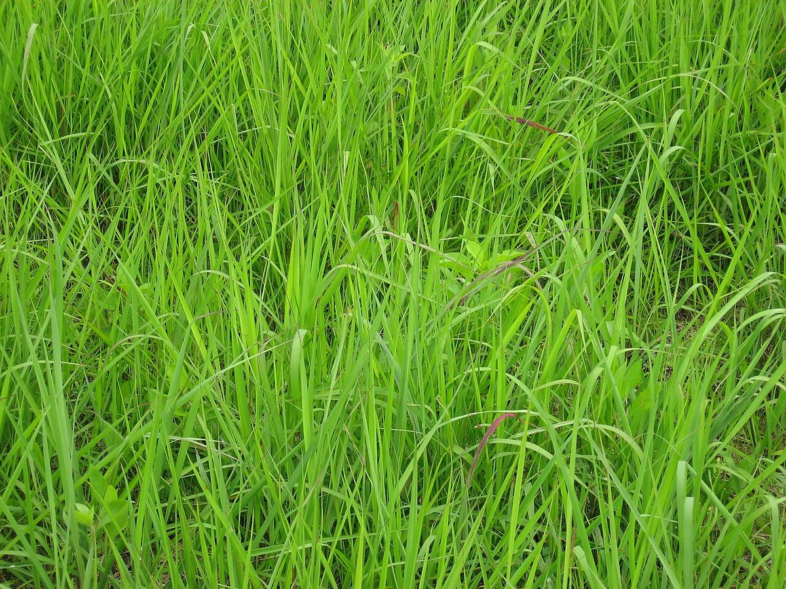
Indian Grass <em>Sorghastrum nutans</em>
</a>
<a href="../../plants/prairie-dropseed/" class="plant-gallery-card">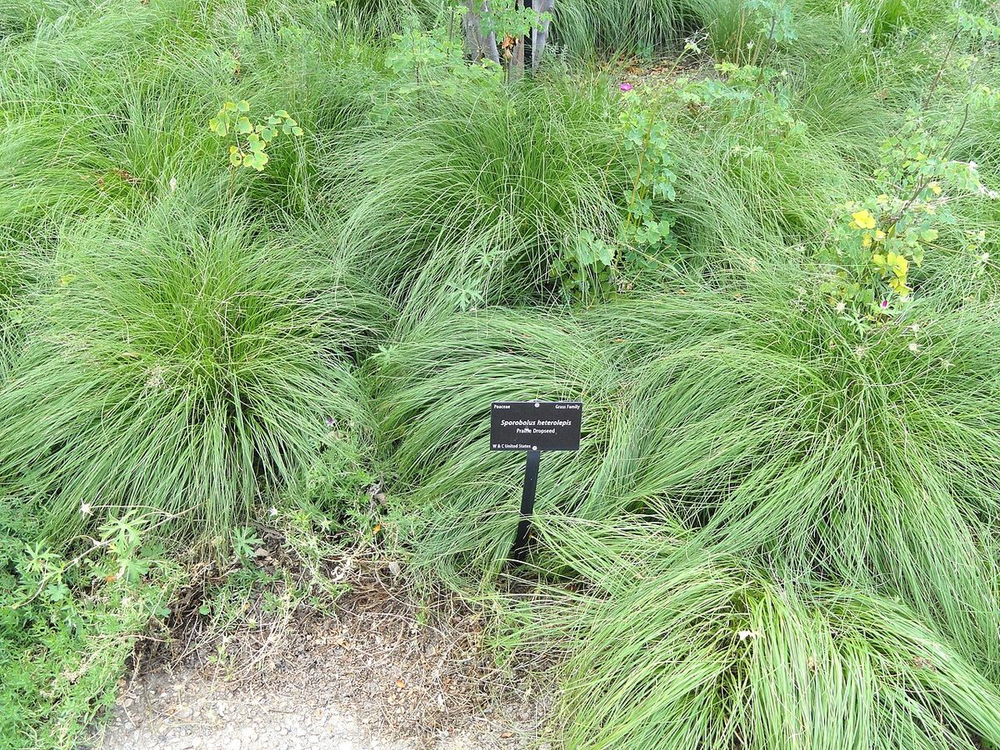
Prairie Dropseed <em>Sporobolus heterolepis</em>
</a>

Warm-season grasses share several traits:

- They thrive in full sun and tolerate heat and drought
- They grow most actively from June through September
- They develop extensive, deep root systems
- They provide excellent habitat structure for ground-nesting birds
- They turn striking shades of copper, bronze, and gold in autumn

#### Cool-Season Grasses

Cool-season grasses (C3 grasses) grow most actively in spring and fall when temperatures are moderate. They green up earlier in the season and provide important early cover and food for wildlife before warm-season grasses emerge.

Native cool-season grasses found in Minnesota prairies include:

- **Canada Wild Rye** (*Elymus canadensis*) — a tall, arching grass with distinctive drooping seed heads
- **June Grass** (*Koeleria macrantha*) — a compact bunchgrass common on dry prairies
- **Porcupine Grass** (*Hesperostipa spartea*) — named for its long, twisted awns that resemble porcupine quills

Cool-season grasses are valuable in prairie restorations because they establish quickly and provide ground cover while slower-growing warm-season grasses take hold. However, non-native cool-season grasses such as [Smooth Brome](../../plants/smooth-brome/) (*Bromus inermis*) and [Kentucky Bluegrass](../../plants/kentucky-bluegrass/) (*Poa pratensis*) are aggressive invaders of prairie remnants and restoration sites.

### Big Bluestem

[Big Bluestem](../../plants/big-bluestem/) (*Andropogon gerardii*) is the undisputed king of the tallgrass prairie. This towering warm-season grass can reach heights of six to eight feet in a good year, and its roots may extend eight to ten feet below the surface. It is so closely associated with the tallgrass prairie that the ecosystem is sometimes called the "Big Bluestem prairie."

Big Bluestem gets its name from the bluish-purple color at the base of its stems in summer. Its most recognizable feature is the seed head, which typically splits into three finger-like branches — earning it the nickname "turkey foot."

Key characteristics:

- **Height**: 4 to 8 feet
- **Bloom time**: August to September
- **Soil preference**: Deep, moist to mesic (medium moisture) soils
- **Sun**: Full sun
- **Fall color**: Rich bronze to copper-red

Big Bluestem is a sod-forming grass, spreading by underground stems called rhizomes. In a mature prairie, it can form dense stands that provide excellent nesting habitat for grassland birds such as Bobolinks, Dickcissels, and Grasshopper Sparrows. It is also an important forage grass for livestock and was a primary food source for bison.

### Little Bluestem

[Little Bluestem](../../plants/little-bluestem/) (*Schizachyrium scoparium*) is the most widespread native grass in North America and one of the most versatile plants in the prairie. Despite its name, it is not simply a smaller version of Big Bluestem — it belongs to a different genus entirely.

Little Bluestem is a bunchgrass, growing in distinct clumps rather than spreading by rhizomes. It typically reaches two to four feet tall. In autumn, it turns a spectacular reddish-bronze color, and its fluffy white seed heads catch the light beautifully. This fall display has made it one of the most popular native grasses for home landscaping.

Key characteristics:

- **Height**: 2 to 4 feet
- **Bloom time**: August to September
- **Soil preference**: Dry to mesic soils; very drought tolerant
- **Sun**: Full sun
- **Fall color**: Brilliant copper-red to mahogany

Little Bluestem grows in a wider range of conditions than Big Bluestem, tolerating drier, sandier, and rockier soils. It is found in dry prairies, bluff prairies, savannas, and open woodlands across Minnesota.

### Switchgrass

[Switchgrass](../../plants/switchgrass/) (*Panicum virgatum*) is a tall, robust warm-season grass that grows four to six feet tall in dense, upright clumps. It is common on moist prairies, along stream banks, and in low-lying areas where moisture collects.

Switchgrass produces an open, airy seed head that spreads wide above the foliage, giving it an elegant, fountain-like appearance. Its seeds are an important food source for sparrows, juncos, and other seed-eating birds during fall and winter.

Key characteristics:

- **Height**: 3 to 6 feet
- **Bloom time**: July to September
- **Soil preference**: Moist to mesic soils; tolerates occasional flooding
- **Sun**: Full sun to light shade
- **Fall color**: Golden yellow

Switchgrass has received attention as a potential biofuel crop because of its high biomass production and ability to grow on marginal farmland. In the garden, it is valued for its upright form, fine texture, and golden fall color.

### Indian Grass

[Indian Grass](../../plants/indian-grass/) (*Sorghastrum nutans*) is one of the most beautiful grasses in the tallgrass prairie. It grows four to six feet tall with a graceful, arching habit, and its golden-bronze, plume-like seed heads are stunning in late summer and fall.

Indian Grass is a warm-season bunchgrass that often grows intermixed with Big Bluestem and Switchgrass. It is distinguished by its distinctive "rifle sight" ligule — a small, claw-like projection where the leaf blade meets the stem — which is the most reliable way to identify it when it is not in flower.

Key characteristics:

- **Height**: 3 to 6 feet
- **Bloom time**: August to September
- **Soil preference**: Mesic to moist soils
- **Sun**: Full sun
- **Fall color**: Rich golden-orange

Indian Grass is an excellent choice for meadow plantings and naturalized areas. Its seed heads remain attractive through winter, providing both visual interest and food for birds.

### Prairie Dropseed

[Prairie Dropseed](../../plants/prairie-dropseed/) (*Sporobolus heterolepis*) is a compact, fine-textured bunchgrass that occupies a special place in high-quality prairies. Unlike the tall, showy grasses described above, Prairie Dropseed grows just two to three feet tall in neat, rounded mounds of extremely fine, hair-like foliage.

What makes Prairie Dropseed remarkable is what you smell before what you see. When it blooms in late summer, its delicate, open seed heads release a distinctive fragrance that some describe as buttered popcorn or cilantro. This unusual trait makes it immediately identifiable on a late-summer prairie walk.

Key characteristics:

- **Height**: 2 to 3 feet
- **Bloom time**: August to September
- **Soil preference**: Dry to mesic, well-drained soils
- **Sun**: Full sun
- **Fall color**: Golden-orange
- **Notable feature**: Fragrant seed heads

Prairie Dropseed is extremely long-lived — individual plants may persist for decades — but it is very slow to establish from seed, often taking three or more years to reach maturity. Its presence in a prairie is considered an indicator of high quality, because it typically does not colonize disturbed or recently restored sites.

!!! mascot-thinking "Key Insight"
    
    Every plant has a story! The five major warm-season grasses — Big Bluestem,
    Little Bluestem, Switchgrass, Indian Grass, and Prairie Dropseed — each fill
    a different niche in the prairie. Big Bluestem dominates moist, deep soils.
    Little Bluestem handles dry, rocky ground. Switchgrass thrives near water.
    Together, they cover every condition the prairie offers.

---

## Part 3: Prairie Wildflowers

### Prairie Wildflowers Overview

While grasses provide the structural framework of a prairie, wildflowers (called **forbs** in ecological terminology) provide much of its color, diversity, and ecological function. A healthy tallgrass prairie typically contains three to four times as many forb species as grass species. These wildflowers bloom in overlapping waves from April through October, ensuring that pollinators have continuous access to nectar and pollen throughout the growing season.

Prairie wildflowers have evolved remarkable adaptations:

- **Deep taproots** that access water far below the surface
- **Specialized flower shapes** that attract specific pollinators
- **Drought tolerance** — many can wilt during dry spells and recover when rain returns
- **Fire tolerance** — growing points are protected below ground level
- **Seed dormancy** — seeds may wait years in the soil for the right germination conditions

The wildflowers described below represent some of the most recognizable and ecologically important species in Minnesota's prairies.

<a href="../../plants/purple-coneflower/" class="plant-gallery-card">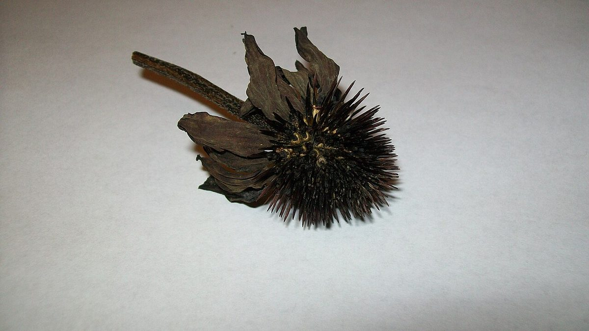
Purple Coneflower <em>Echinacea purpurea</em>
</a>
<a href="../../plants/black-eyed-susan/" class="plant-gallery-card">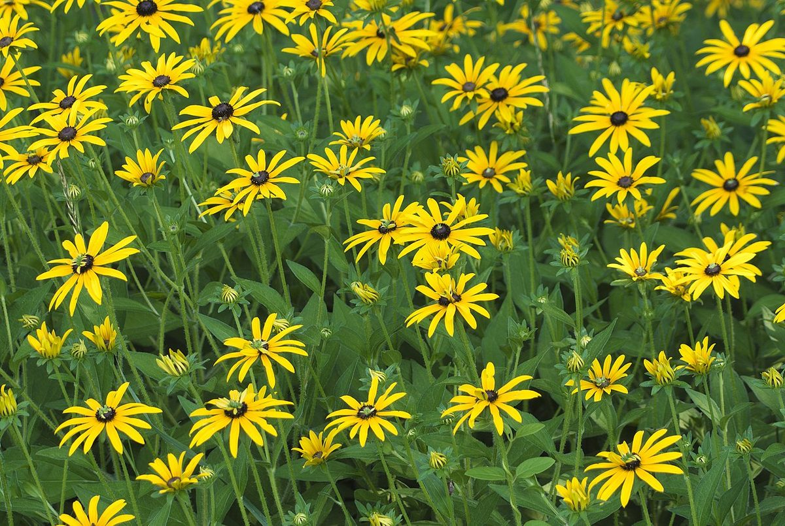
Black-Eyed Susan <em>Rudbeckia hirta</em>
</a>
<a href="../../plants/wild-bergamot/" class="plant-gallery-card">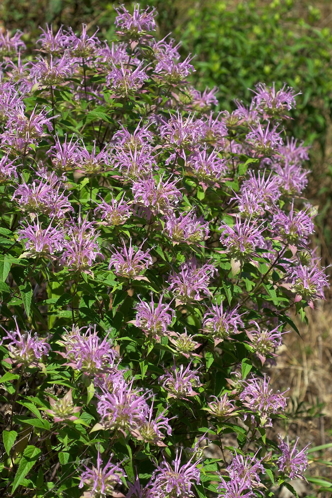
Wild Bergamot <em>Monarda fistulosa</em>
</a>
<a href="../../plants/blazing-star/" class="plant-gallery-card">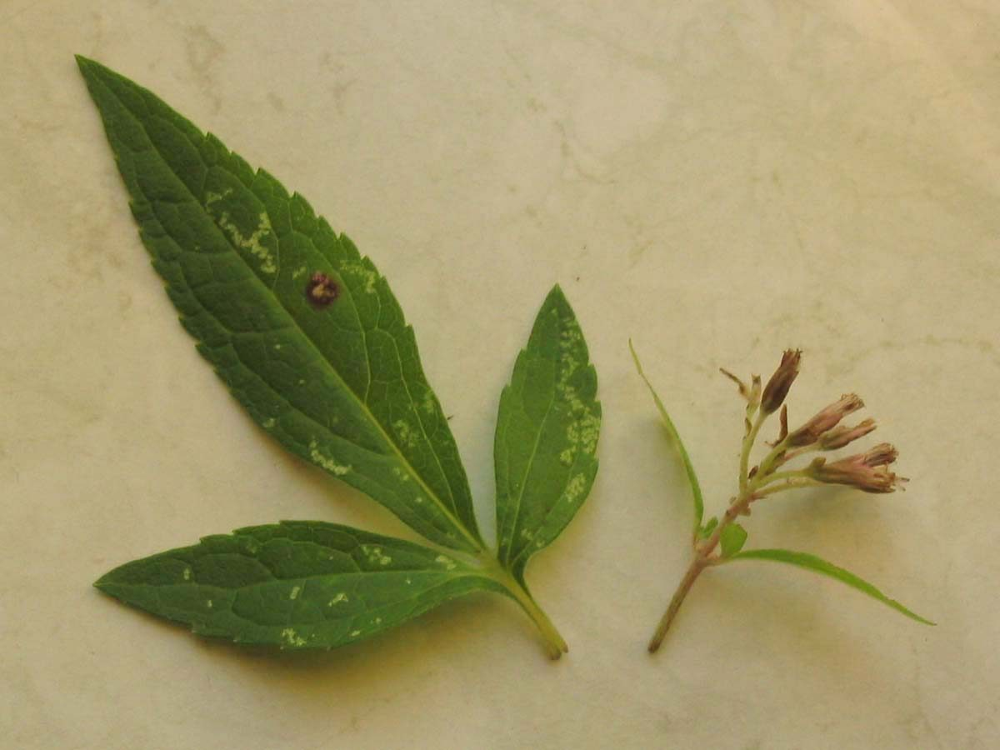
Blazing Star <em>Liatris ligulistylis</em>
</a>
<a href="../../plants/butterfly-milkweed/" class="plant-gallery-card">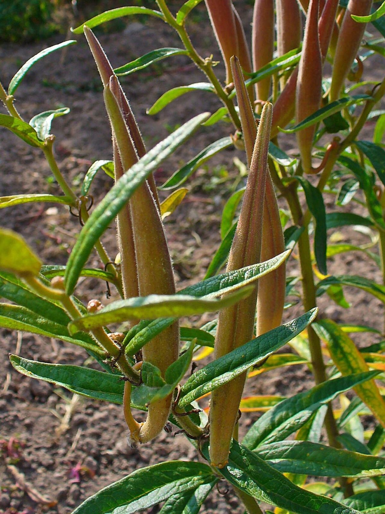
Butterfly Milkweed <em>Asclepias tuberosa</em>
</a>

### Purple Coneflower

[Purple Coneflower](../../plants/purple-coneflower/) (*Echinacea purpurea*) is one of the most widely recognized prairie wildflowers, thanks in part to its popularity in herbal medicine and home gardens. It produces large, daisy-like flowers with drooping pink-purple petals surrounding a spiny, dome-shaped central cone. The cone is actually made up of hundreds of tiny individual flowers (called florets), each of which produces a seed.

Key characteristics:

- **Height**: 2 to 4 feet
- **Bloom time**: June to August
- **Flower color**: Pink-purple petals with an orange-brown central cone
- **Soil preference**: Dry to mesic, well-drained soils
- **Sun**: Full sun to light shade

Minnesota is also home to the [Pale Purple Coneflower](../../plants/pale-purple-coneflower/) (*Echinacea pallida*), which has narrower, more drooping petals, and the rare [Topeka Purple Coneflower](../../plants/topeka-purple-coneflower/) (*Echinacea atrorubens*). All coneflowers are important pollinator plants, attracting bees, butterflies, and beneficial insects. Their seed heads persist through winter and provide food for goldfinches and other seed-eating birds.

### Black-Eyed Susan

[Black-Eyed Susan](../../plants/black-eyed-susan/) (*Rudbeckia hirta*) is perhaps the most cheerful wildflower on the prairie — its bright golden-yellow petals surrounding a dark brown-black central disk are unmistakable. It blooms abundantly from June through September and is one of the easiest native wildflowers to grow from seed.

Key characteristics:

- **Height**: 1 to 3 feet
- **Bloom time**: June to September
- **Flower color**: Golden yellow with a dark brown center
- **Soil preference**: Adaptable; grows in dry to moist soils
- **Sun**: Full sun to light shade

Black-Eyed Susan is technically a short-lived perennial or biennial, meaning individual plants may only live two to three years. However, it self-seeds readily and maintains persistent populations. It is often one of the first wildflowers to appear in prairie restorations and roadside plantings, providing quick color while slower-establishing species take hold.

### Wild Bergamot

[Wild Bergamot](../../plants/wild-bergamot/) (*Monarda fistulosa*) is a member of the mint family that produces rounded clusters of lavender-pink, tubular flowers at the top of its stems. It blooms from July through September and is one of the most important pollinator plants in the prairie, attracting bumblebees, butterflies, hummingbird moths, and even hummingbirds.

Key characteristics:

- **Height**: 2 to 4 feet
- **Bloom time**: July to September
- **Flower color**: Lavender-pink
- **Soil preference**: Dry to mesic soils
- **Sun**: Full sun to partial shade

The entire plant is aromatic — crushing a leaf releases a strong, pleasant scent reminiscent of oregano. Indigenous peoples used Wild Bergamot medicinally and as a seasoning, and it is the wild relative of the Bee Balm cultivars popular in gardens. It spreads by both seed and rhizomes and can form attractive colonies in garden settings.

### Blazing Star

Blazing Star refers to several species in the genus *Liatris* that are among the most visually striking plants on the prairie. Their tall, dense spikes of fluffy purple flowers bloom from the top downward — the opposite of most spike-flowering plants — creating a distinctive display from August into October.

Minnesota is home to several Blazing Star species:

- **Rough Blazing Star** (*Liatris aspera*) — button-like flower heads spaced along the stem; prefers dry prairies
- **Dotted Blazing Star** (*Liatris punctata*) — dense flower spikes; extremely drought tolerant
- **Marsh Blazing Star** (*Liatris spicata*) — dense spikes; prefers moist soils
- **Prairie Blazing Star** (*Liatris pycnostachya*) — tall, densely packed spikes; mesic to moist prairies

All Blazing Stars are exceptional pollinator plants. They bloom during monarch butterfly migration in late summer and early fall, providing a critical nectar source for monarchs fueling their journey south. They grow from a corm (a bulb-like underground storage organ), which allows them to survive fire and drought.

### Prairie Clover

Prairie Clover includes two common species that add both beauty and ecological value to the tallgrass prairie. [White Prairie Clover](../../plants/white-prairie-clover/) (*Dalea candida*) and [Purple Prairie Clover](../../plants/purple-prairie-clover/) (*Dalea purpurea*) are legumes, meaning they partner with specialized soil bacteria to convert atmospheric nitrogen into a form that plants can use — a process called nitrogen fixation.

Key characteristics:

- **Height**: 1 to 3 feet
- **Bloom time**: June to August
- **Flower color**: White (D. candida) or rosy-purple (D. purpurea)
- **Soil preference**: Dry to mesic, well-drained soils
- **Sun**: Full sun

Prairie Clovers bloom in small, dense, cylindrical flower heads that open from the bottom upward in a ring pattern. As legumes, they play an important role in prairie nutrient cycling — their nitrogen-fixing ability enriches the soil and benefits neighboring plants. Their deep taproots (sometimes reaching five feet or more) also make them highly drought tolerant.

### Goldenrod Species

Goldenrods (genus *Solidago*) are late-season powerhouses that paint the autumn prairie in shades of gold and yellow. Minnesota is home to more than 20 Goldenrod species, making them one of the most diverse native plant groups in the state.

Common prairie Goldenrod species include:

- **Stiff Goldenrod** (*Solidago rigida*) — flat-topped flower clusters; prefers dry prairies
- **Showy Goldenrod** (*Solidago speciosa*) — dense, plume-like clusters; one of the showiest species
- **Canada Goldenrod** (*Solidago canadensis*) — gracefully arching plumes; common in meadows and roadsides
- **Gray Goldenrod** (*Solidago nemoralis*) — compact, one-sided plumes; thrives in poor, dry soils

A common misconception blames Goldenrod for hay fever. In reality, Goldenrod pollen is heavy and sticky, carried by insects rather than wind. The true culprit is [Common Ragweed](../../plants/common-ragweed/) (*Ambrosia artemisiifolia*), which blooms at the same time and releases vast quantities of wind-borne pollen. Goldenrod is falsely accused because its bright yellow flowers are visible, while Ragweed's tiny green flowers go unnoticed.

Goldenrods are among the most valuable late-season pollinator plants, supporting bees, butterflies, beetles, and beneficial wasps when few other flowers are available.

### Aster Species

Asters (now reclassified into the genus *Symphyotrichum* and related genera) are the prairie's farewell performance. Blooming from late August through October, they extend the flowering season into fall and provide the last major nectar source before winter.

Common prairie asters in Minnesota include:

- **Smooth Blue Aster** (*Symphyotrichum laeve*) — sky-blue flowers on arching stems; dry to mesic prairies
- **New England Aster** (*Symphyotrichum novae-angliae*) — large, deep purple flowers; moist prairies and meadows
- **Aromatic Aster** (*Symphyotrichum oblongifolium*) — lavender-blue flowers; dry prairies and bluffs
- **Sky Blue Aster** (*Symphyotrichum oolentangiense*) — pale blue flowers; dry to mesic prairies

Together with Goldenrods, Asters form the classic gold-and-purple color palette of the autumn prairie. Both genera belong to the Asteraceae (daisy) family and share a similar flower structure: what appears to be a single flower is actually a composite of many tiny florets arranged in a disk-and-ray pattern.

### Milkweed Species

Milkweeds (genus *Asclepias*) have gained widespread attention for their role as the sole food source for monarch butterfly caterpillars. Female monarchs lay their eggs exclusively on milkweed plants, and the larvae feed on the leaves, absorbing toxic compounds called cardenolides that make them unpalatable to predators.

Minnesota supports several native Milkweed species:

- **Common Milkweed** (*Asclepias syriaca*) — the most abundant species; large, fragrant, pink-purple flower clusters; spreads aggressively by rhizomes
- **Butterfly Milkweed** (*Asclepias tuberosa*) — brilliant orange flowers; does not spread by rhizomes; prefers dry, sandy soils
- **Swamp Milkweed** (*Asclepias incarnata*) — pink flowers; grows in wet prairies and along shorelines
- **Whorled Milkweed** (*Asclepias verticillata*) — delicate, white flowers; fine-textured leaves; dry prairies

All milkweeds produce their characteristic milky white sap (latex) when stems or leaves are broken — except Butterfly Milkweed, which produces clear sap. Their complex, intricate flowers are pollinated primarily by large bees and butterflies, and their seeds are carried on silky parachutes that float on the wind.

!!! mascot-tip "Bree's Tip"
    
    If you want to help monarch butterflies, plant at least three species of
    milkweed with different bloom times and moisture preferences. Common Milkweed
    for general areas, Butterfly Milkweed for dry sunny spots, and Swamp Milkweed
    for rain gardens or low areas. More milkweed variety means more monarchs!

### Prairie Sedges

Sedges (genus *Carex* and related genera) are grass-like plants that play an underappreciated role in prairie ecosystems. The old botanical saying "sedges have edges" refers to their triangular stems, which distinguish them from the round or flat stems of true grasses.

Prairie sedges include:

- **Prairie Sedge** (*Carex prairea*) — common in mesic to wet prairies
- **Sun Sedge** (*Carex inops ssp. heliophila*) — a drought-tolerant groundcover for dry prairies
- **Heavy Sedge** (*Carex gravida*) — found in mesic prairies and open woodlands

Sedges contribute to prairie ground cover, soil stabilization, and species diversity. They are especially important in wet prairies and the transition zones between upland prairies and wetlands. While they lack the showy flowers of prairie forbs, sedges provide essential habitat structure for ground-nesting insects and small animals.

---

## Part 4: Below the Surface — Prairie Soil Ecology

### Prairie Soil Ecology

The most impressive part of a prairie is the part you cannot see. Below the surface lies an intricate living system that is far more massive than the above-ground vegetation. Prairie soils are among the richest, deepest, and most biologically active soils on Earth.

A single teaspoon of healthy prairie soil may contain:

- **Billions of bacteria** that decompose organic matter and cycle nutrients
- **Miles of fungal hyphae** that connect plant roots in underground networks
- **Thousands of protozoa and nematodes** that regulate bacterial populations
- **Hundreds of mites and springtails** that break down plant litter

Over thousands of years, prairie plants have built soil by sending down deep roots, dying back each winter, and adding organic matter season after season. The resulting soil — rich, dark, and deep — is what made Minnesota's prairie region so attractive for agriculture. The irony is that farming this soil has steadily depleted the organic matter that prairie plants spent millennia creating.

Mycorrhizal fungi are especially important in prairies. These fungi form symbiotic partnerships with plant roots: the fungus extends the plant's root network, accessing water and nutrients (especially phosphorus) that roots alone cannot reach, and in return the plant shares sugars produced through photosynthesis. More than 80 percent of prairie plant species depend on mycorrhizal partnerships.

### Prairie Root Systems

The following diagram illustrates the vertical structure of a tallgrass prairie, from the sky down to the deepest roots. Most of the living biomass is hidden underground.

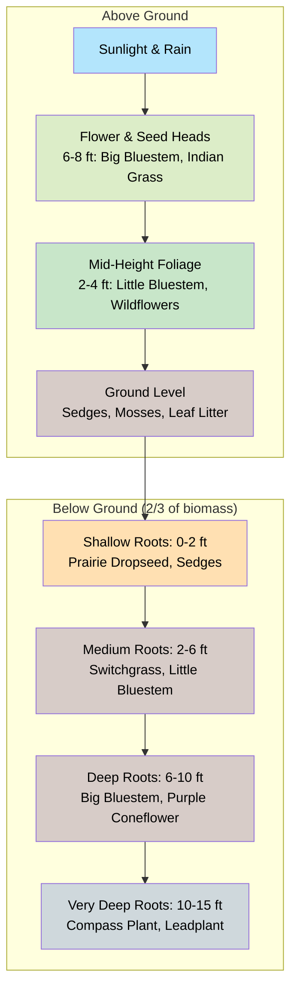

Use the slider below to compare the root depths of native prairie plants against a typical lawn grass side by side.

<iframe src="../../sims/prairie-root-depth/main.html" width="100%" height="500px" scrolling="no"></iframe>

Prairie Root Depth Comparison

Type: microsim

**Learning Objective:** Students will visualize and appreciate the dramatic difference in root depth between native prairie plants and conventional lawn grass, understanding how deep roots contribute to drought resilience, soil building, and water filtration.

**Controls:**
- Slider to select which prairie species to compare against lawn grass
- Toggle to show/hide soil layers, water table, and root biomass indicators
- Zoom slider to scale the vertical view

**Visual Elements:**
- Side-by-side cross-section showing lawn grass roots (2-4 inches) vs. selected prairie plant roots (up to 15 feet)
- Soil horizon layers labeled with depth markers
- Root mass density visualization using color intensity
- Labels for each species with root depth in feet

**Behavior:**
- Moving the species slider swaps the prairie plant shown (Big Bluestem, Compass Plant, Prairie Dropseed, etc.)
- The root visualization scales dynamically to show true proportional depth
- Toggling soil layers reveals how roots interact with different soil horizons

**Instructional Rationale:**
The vast difference between lawn grass and prairie roots is one of the most compelling facts in prairie ecology, but it is difficult to appreciate from text alone. An interactive visual comparison makes this contrast visceral and memorable.

If you could see a cross-section of a tallgrass prairie, you would discover that the real action is underground. Prairie plants invest far more energy in roots than in above-ground growth — some species allocate two-thirds or more of their total biomass below ground.

Root depths of common prairie plants:

- **Big Bluestem** — roots reach 8 to 10 feet deep
- **Switchgrass** — roots reach 6 to 8 feet deep
- **Prairie Dropseed** — roots reach 4 to 5 feet deep
- **Purple Coneflower** — taproot reaches 5 feet or more
- **Compass Plant** (*Silphium laciniatum*) — taproot may reach 15 feet deep
- **Leadplant** (*Amorpha canescens*) — taproot may reach 15 feet or more

These deep root systems serve multiple functions:

- **Drought survival** — accessing moisture far below the surface during dry periods
- **Soil building** — roots die and decompose, adding organic matter deep into the soil profile
- **Carbon storage** — prairie root systems store enormous amounts of carbon underground
- **Erosion control** — the dense root network holds soil firmly in place
- **Water filtration** — rainwater filters through the root zone, emerging cleaner in groundwater

The combined root mass in a mature tallgrass prairie is staggering. Studies have found more than three tons of root biomass per acre in the top foot of soil alone — and that is only a fraction of the total, since roots extend many feet deeper.

!!! mascot-thinking "Key Insight"
    
    Let's grow together! Think of the prairie as an upside-down forest. While a
    forest stores most of its carbon in trunks and branches above ground, a
    prairie stores most of its carbon in roots and soil below ground. This is why
    prairies are so important for carbon storage — and why plowing prairie soil
    releases so much stored carbon into the atmosphere.

---

## Part 5: Fire Ecology and Prairie Management

### Fire Ecology

Fire is not a catastrophe for the prairie — it is a necessity. Tallgrass prairies evolved with fire over thousands of years, and without periodic burning, they gradually convert to shrubland and eventually forest. Fire is the primary force that keeps prairies open and prevents woody plants from taking over.

The diagram below shows the cyclical role fire plays in maintaining a healthy prairie ecosystem.

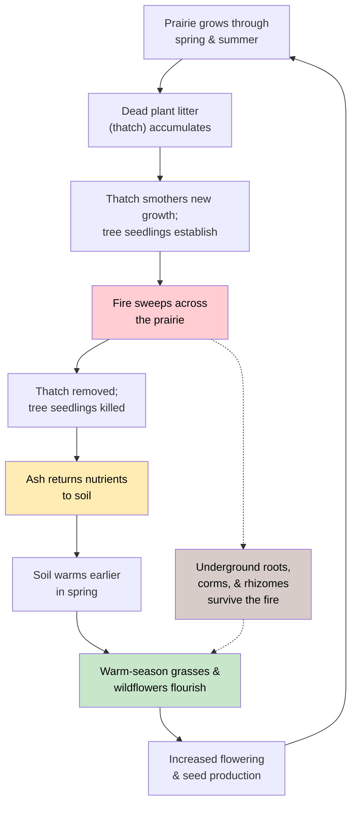

Simulate how prescribed burns affect prairie health over multiple years by adjusting burn frequency and observing the changes in plant composition.

<iframe src="../../sims/fire-ecology-sim/main.html" width="100%" height="500px" scrolling="no"></iframe>

Prairie Fire Ecology Simulator

Type: microsim

**Learning Objective:** Students will understand how fire frequency affects prairie plant composition, woody encroachment, thatch accumulation, and overall ecosystem health over time.

**Controls:**
- Play/Pause button to advance the simulation year by year
- Burn frequency selector (every 1, 2, 3, 5 years, or never)
- Season-of-burn toggle (spring vs. fall)
- Reset button to restart the simulation

**Visual Elements:**
- Animated prairie cross-section showing grasses, wildflowers, shrub seedlings, and thatch layer
- Year counter and timeline bar
- Bar charts tracking warm-season grass cover, wildflower diversity, woody plant encroachment, and thatch depth
- Fire animation when a burn year occurs

**Behavior:**
- With regular burns, warm-season grasses and wildflowers thrive while woody plants are suppressed
- Without fire, thatch accumulates, woody plants encroach, and prairie diversity declines over 10-20 years
- Spring burns favor warm-season grasses; fall burns slightly favor certain wildflowers
- The simulation runs for up to 30 years, showing long-term trends

**Instructional Rationale:**
Fire's role in prairie ecology is counterintuitive for many students. Simulating multi-year outcomes lets students discover for themselves that fire is beneficial, not destructive, and that burn timing and frequency produce different ecological outcomes.

When a prairie burns, the fire:

- **Removes dead plant litter** (called thatch) that accumulates on the soil surface and smothers new growth
- **Warms the soil** earlier in spring, giving warm-season grasses and wildflowers a head start
- **Kills tree and shrub seedlings** that would otherwise shade out prairie plants
- **Recycles nutrients** — ash returns minerals to the soil in a form plants can immediately use
- **Stimulates flowering** — many prairie plants bloom more profusely the season after a burn

Prairie plants survive fire because their growing points are protected underground. Grasses regrow from root crowns and rhizomes. Wildflowers regenerate from deep taproots and corms. Within weeks of a spring burn, the blackened ground erupts with fresh green growth, and by midsummer the prairie looks as lush as ever.

Not all prairie species respond to fire in the same way. Warm-season grasses like Big Bluestem are strongly favored by fire, while some cool-season grasses and certain forbs may temporarily decline. This variation is why land managers use different burn frequencies and timings — to favor different plant communities depending on management goals.

### Prescribed Burns

A **prescribed burn** (also called a controlled burn) is a carefully planned and managed fire set intentionally by trained professionals to maintain prairie health. Prescribed burning is the single most important management tool for prairies in Minnesota.

Prescribed burns are conducted under specific conditions:

- **Weather** — moderate wind speed and direction, adequate humidity, appropriate temperature
- **Season** — most burns occur in spring (March to May) before warm-season grasses emerge, though fall burns are also used
- **Firebreaks** — mowed or plowed strips around the burn area prevent fire from spreading beyond the intended boundary
- **Crew and equipment** — trained personnel with drip torches, water pumps, and fire-resistant clothing

Land managers vary the timing and frequency of burns to achieve different outcomes:

- **Annual or biennial burns** favor warm-season grasses
- **Burns every 3 to 5 years** allow forbs (wildflowers) to accumulate seed and increase diversity
- **Fall burns** may benefit certain wildflower species and reduce thatch differently than spring burns
- **Rotational burning** — burning different sections in different years — ensures that wildlife always has unburned refugia

!!! mascot-warning "Safety First!"
    
    Prescribed burns must always be conducted by trained professionals with proper
    permits and equipment. Never attempt to burn prairie on your own. Contact
    your county Soil and Water Conservation District, the Minnesota DNR, or a
    local prescribed burn association if your land needs a burn.

---

## Chapter Summary

!!! mascot-celebration "What a Journey!"
    
    Every plant has a story! You have just explored one of North America's most
    remarkable ecosystems — the tallgrass prairie. From the towering Big Bluestem
    to the hidden world of roots and fungi below ground, you now understand what
    makes prairies work and why they are worth protecting and restoring.

In this chapter, you learned:

- The **tallgrass prairie** once covered 18 million acres of Minnesota; less than 2 percent remains today as **prairie remnants**
- **Warm-season grasses** (Big Bluestem, Little Bluestem, Switchgrass, Indian Grass, Prairie Dropseed) form the structural backbone of the prairie
- **Cool-season grasses** (Canada Wild Rye, June Grass, Porcupine Grass) complement warm-season grasses by growing in spring and fall
- **Prairie wildflowers** bloom in overlapping waves from spring through fall, supporting pollinators continuously
- Key wildflowers include **Purple Coneflower**, **Black-Eyed Susan**, **Wild Bergamot**, **Blazing Star**, **Prairie Clover**, **Goldenrod**, **Aster**, and **Milkweed** species
- **Prairie sedges** contribute ground cover and habitat in wet and mesic prairies
- **Prairie soils** are among the richest on Earth, built by thousands of years of root growth and decomposition
- **Prairie root systems** extend many feet underground, storing carbon, filtering water, and surviving drought and fire
- **Fire** is essential for prairie health — it removes thatch, recycles nutrients, and prevents woody encroachment
- **Prescribed burns** are carefully managed fires used to maintain prairies, with timing and frequency varied to support different management goals

## Concepts Covered

This chapter covers the following 25 concepts from the learning graph:

1. Prairie Ecosystem Overview
2. Tallgrass Prairie History
3. Prairie Remnants
4. Prairie Grasses
5. Big Bluestem
6. Little Bluestem
7. Switchgrass
8. Indian Grass
9. Prairie Dropseed
10. Prairie Wildflowers
11. Purple Coneflower
12. Black-Eyed Susan
13. Wild Bergamot
14. Blazing Star
15. Prairie Clover
16. Goldenrod Species
17. Aster Species
18. Milkweed Species
19. Prairie Sedges
20. Prairie Soil Ecology
21. Fire Ecology
22. Prescribed Burns
23. Prairie Root Systems
24. Warm Season Grasses
25. Cool Season Grasses

## Prerequisites

This chapter builds on concepts from:

- [Chapter 1: Introduction to Native Plants and Ecology](../01-intro-native-plants-ecology/index.md) — native plant definitions, botany fundamentals, ecosystem concepts, and plant identification basics
- [Chapter 2: Minnesota Geography and Ecoregions](../02-minnesota-geography-ecoregions/index.md) — ecoregions, climate zones, and soil types that determine where prairies occur

## What's Next

In Chapter 4, we'll move from the open prairie into the shade of Minnesota's forests, exploring the woodland wildflowers, understory shrubs, and canopy trees that make up the state's deciduous and coniferous forest ecosystems.

[See Annotated References](./references.md)
