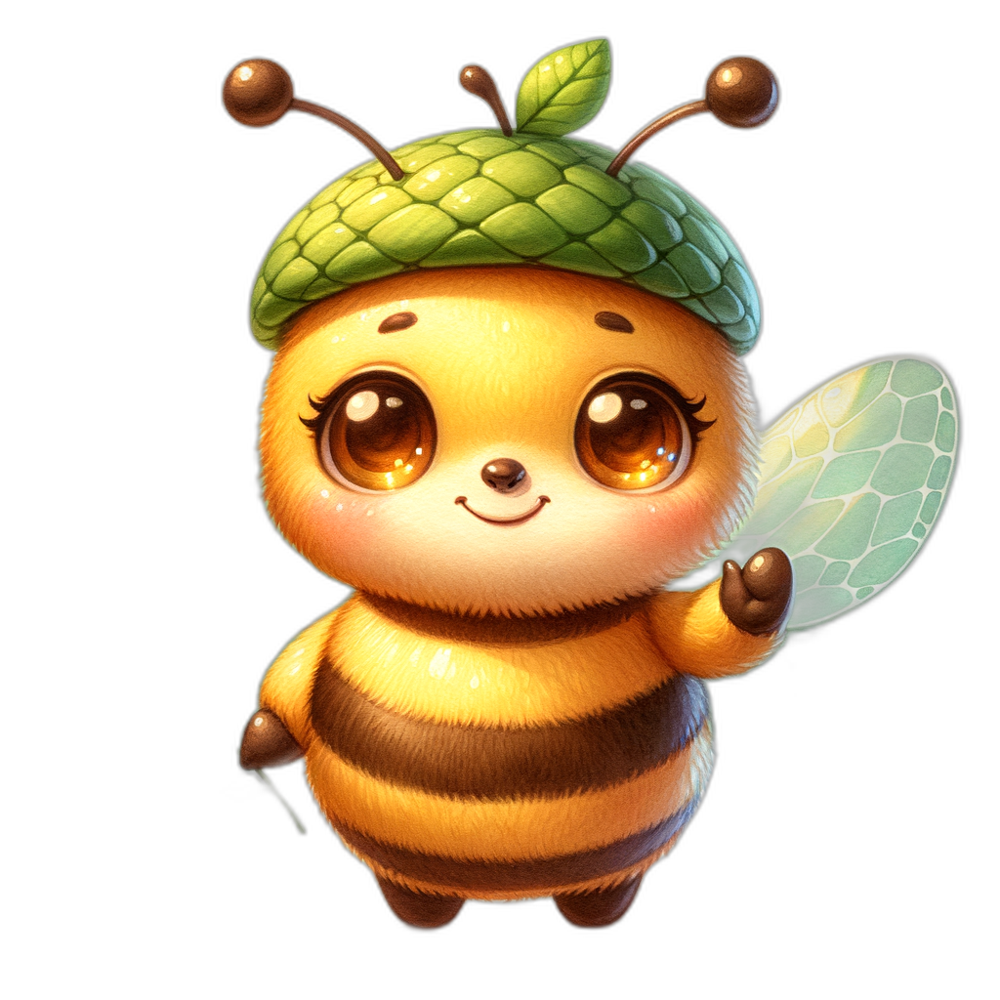
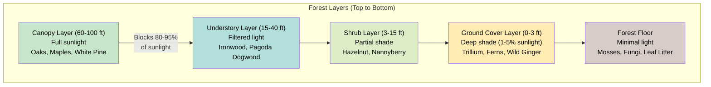
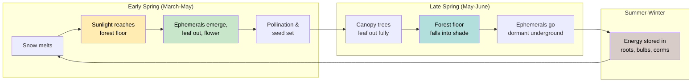

# Woodland and Forest Plants

!!! mascot-welcome "Welcome to the Woods!"
    
    Time to step into the shade! In this chapter, we'll explore Minnesota's
    woodlands and forests — from towering canopy trees to the tiniest wildflowers
    on the forest floor. These layered plant communities are some of the most
    beautiful and complex ecosystems in the state.

## Summary

This chapter introduces Minnesota's woodland and forest plant communities. You will learn how forests are organized into distinct layers, discover the spring ephemeral wildflowers that bloom before the canopy leafs out, explore key native ferns, shrubs, and vines, and get to know the major native tree species that define Minnesota's forested landscapes. Whether you are identifying plants on a woodland hike or planning a shade garden, this chapter gives you the knowledge you need.

## Woodland Ecosystem Overview

A woodland ecosystem is a plant community dominated by trees, where the canopy provides varying degrees of shade and the leaf litter creates rich, organic soil. Minnesota's woodlands range from open oak savannas with scattered trees and sunlit gaps to dense maple-basswood forests where the canopy blocks most direct sunlight.

What makes woodland ecosystems special is their vertical complexity. Unlike prairies, where most of the action happens at ground level, forests stack life in layers from the soil surface to the treetops. Each layer has its own microclimate — different levels of light, humidity, wind, and temperature — and each supports a distinct community of plants and animals.

Minnesota's forest types vary dramatically across the state:

- **Deciduous hardwood forests** — maple, basswood, and oak communities in the south and central regions
- **Coniferous boreal forests** — spruce, fir, and pine in the northeast
- **Mixed forests** — combinations of conifers and hardwoods in transitional zones
- **Oak savannas** — open, fire-maintained woodlands at the prairie-forest border

Woodland soils are typically rich in organic matter from centuries of decomposing leaves. This deep, humus-rich soil holds moisture well and supports a vast network of fungi, including mycorrhizal fungi that form partnerships with tree roots, helping them absorb nutrients in exchange for sugars.

## Forest Layers

A mature forest is organized into distinct horizontal layers, each with different conditions and different plant species adapted to those conditions. Understanding these layers is one of the most useful frameworks for learning woodland plants — once you know which layer a plant belongs to, you immediately understand a lot about its needs and habits.

The five main forest layers, from top to bottom, are:

- **Canopy layer** — the tallest trees that form the "roof" of the forest
- **Understory layer** — shorter trees and tall shrubs growing beneath the canopy
- **Shrub layer** — woody plants typically 3 to 15 feet tall
- **Herbaceous (ground cover) layer** — wildflowers, ferns, grasses, and low-growing plants
- **Forest floor** — mosses, fungi, leaf litter, and decomposing organic matter

The following diagram illustrates these five layers, the light conditions at each level, and representative species.

Explore each forest layer interactively to discover the species found at each level and how light, moisture, and temperature change from canopy to forest floor.

<iframe src="../../sims/forest-layers-explorer/main.html" width="100%" height="500px" scrolling="no"></iframe>

Forest Layers Explorer

Type: microsim

**Learning Objective:** Students will understand the vertical structure of a mature forest, identifying representative species at each layer and how light availability decreases from canopy to forest floor.

**Controls:**
- Clickable layer labels or regions to select a forest layer
- Toggle between deciduous forest and coniferous forest views
- Light meter slider showing percentage of sunlight at each layer

**Visual Elements:**
- Illustrated forest cross-section with all five layers clearly delineated
- Species icons and labels positioned at their respective layers
- Light gradient overlay showing sunlight penetration from 100% at canopy to 1-5% at ground level
- Info panel with species list, ecological role, and adaptations for the selected layer

**Behavior:**
- Clicking a layer highlights it and populates the info panel with layer-specific details
- The light meter updates to show the percentage of sunlight reaching that layer
- Switching between forest types changes the species and visual appearance
- Hovering over a species icon shows a brief description

**Instructional Rationale:**
The layered structure of forests is a foundational concept for understanding woodland ecology. An interactive cross-section lets students explore each layer at their own pace and see how conditions change vertically, reinforcing why different species are found at different heights.

Not every forest has all five layers fully developed. A young forest may have a dense canopy but little understory. An old-growth forest may have all five layers thriving. The diversity of layers is one indicator of forest health.

!!! mascot-thinking "Key Insight"
    
    Think of the forest like a building with multiple floors. Each "floor" gets
    different amounts of sunlight, rain, and wind. The plants on each floor have
    evolved specialized strategies to thrive in their particular conditions. A
    canopy tree and a forest floor moss live in the same forest but experience
    very different worlds.

## Canopy Layer

The canopy layer is the uppermost level of the forest, formed by the crowns of the tallest mature trees. In Minnesota's deciduous forests, the canopy typically reaches 60 to 100 feet high. These trees receive full sunlight and are exposed to wind, rain, and temperature extremes.

The canopy is the engine of the forest ecosystem. Through photosynthesis, canopy trees capture enormous amounts of solar energy and convert it to sugars that fuel the entire food web below. A single large oak can produce hundreds of thousands of leaves per year.

The canopy also controls conditions for everything beneath it:

- **Light filtering** — the canopy intercepts 80 to 95 percent of sunlight in summer, creating deep shade below
- **Rainfall redistribution** — rain drips along branches and flows down trunks, concentrating moisture in some areas and leaving others dry
- **Temperature moderation** — forest interiors stay cooler in summer and warmer in winter than open areas
- **Wind protection** — the canopy shields lower layers from drying winds

In deciduous forests, the canopy is seasonal. The dramatic leaf-out in spring and leaf-drop in fall create a cycle of shifting light that drives the timing of life for all the plants below.

## Understory Layer

The understory layer consists of smaller trees and tall shrubs that grow beneath the main canopy, typically reaching 15 to 40 feet in height. These are species that can tolerate or even prefer partial shade.

Common understory trees in Minnesota include:

- **Ironwood** (*Ostrya virginiana*) — an extremely hard-wooded small tree common in mesic forests
- **Blue Beech** (*Carpinus caroliniana*) — also called Musclewood for its smooth, sinewy trunk
- **Pagoda Dogwood** (*Cornus alternifolia*) — layered, horizontal branches with clusters of white flowers
- **American Hornbeam** (*Carpinus caroliniana*) — produces small, ribbed nutlets in papery husks

Understory trees play important ecological roles. They provide nesting habitat for birds that avoid both the exposed canopy and the dense ground cover. Their fruits and seeds feed wildlife through summer and fall. And they create an intermediate shade layer that further moderates the forest environment.

Some understory trees are simply young canopy trees on their way up. Others are species that will never grow taller — they have evolved to complete their entire life cycle in partial shade.

## Ground Cover Layer

The ground cover layer includes all the non-woody plants growing at ground level — wildflowers, ferns, sedges, grasses, and mosses. This layer is where you will find many of the most beloved native woodland plants, including the spring ephemerals.

Ground cover plants face a fundamental challenge: very little light reaches the forest floor during summer. In a dense maple-basswood forest, only 1 to 5 percent of sunlight may penetrate to the ground. Plants in this layer have evolved several strategies to cope:

- **Spring ephemerals** — complete their entire above-ground life cycle in the brief window of spring sunlight before the canopy leafs out
- **Shade adaptation** — large, thin leaves to capture maximum light at low levels
- **Evergreen leaves** — some species keep leaves year-round to photosynthesize whenever light is available, even in winter
- **Vegetative spread** — clonal growth through rhizomes and runners, reducing dependence on energy-expensive flowering and seed production

The ground cover layer is also where the forest recycles itself. Fallen leaves decompose into rich humus, feeding the soil organisms that make nutrients available to plants. This decomposition layer supports an incredible diversity of fungi, insects, and microorganisms that are invisible to most hikers but essential to the forest.

## Spring Ephemerals

Spring ephemerals are among the most enchanting native woodland plants. These wildflowers emerge in early spring — sometimes pushing through the last snow — and complete their entire above-ground growing season in just four to six weeks, before the tree canopy fully closes.

The diagram below shows the seasonal strategy of spring ephemerals, exploiting the narrow window of sunlight before canopy leaf-out.

Their strategy is elegant: they exploit the brief window between snowmelt and canopy leaf-out, when warm sunlight floods the forest floor. During this time, they grow leaves, flower, set seed, and store enough energy in their underground roots or bulbs to survive the rest of the year in dormancy.

By late May or early June, most spring ephemerals have disappeared entirely above ground. If you visit the same forest in July, you would never know they were there.

Spring ephemerals include some of Minnesota's most beautiful and recognizable wildflowers. They are indicators of high-quality, undisturbed forest — they take years to establish and do not colonize disturbed sites quickly. Finding a diverse community of spring ephemerals tells you that the forest has been relatively stable for decades or centuries.

Common Minnesota spring ephemerals include Bloodroot, Trillium, Hepatica, Dutchman's Breeches, Virginia Bluebells, Trout Lily, and Spring Beauty.

## Bloodroot

Bloodroot (*Sanguinaria canadensis*) is one of the earliest spring ephemerals to appear, often blooming in April when patches of snow still linger nearby. Its common name comes from the bright red-orange sap in its roots and stems — a feature unique among Minnesota wildflowers.

Key identification features:

- **Flowers** — pure white with 8 to 12 petals, about 2 inches across, with a cluster of yellow stamens at the center
- **Leaves** — a single large, round leaf with deeply scalloped lobes wraps around the flower stalk as it emerges, then unfurls flat after blooming
- **Height** — 6 to 10 inches
- **Bloom time** — early to mid-April, lasting only a few days per flower
- **Habitat** — rich, moist deciduous woodlands, often on slopes or near streams

Bloodroot flowers are exceptionally short-lived — each bloom lasts only one to two days. The petals drop at the slightest disturbance. But because a colony of Bloodroot may contain dozens or hundreds of plants, the overall display can last a week or more as different individuals open on different days.

The red sap was used historically by Indigenous peoples for dye and medicinal purposes. Today, Bloodroot is widely available from native plant nurseries and makes an excellent addition to shade gardens.

## Trillium

Trilliums are the signature wildflowers of Minnesota's deciduous forests. Their name comes from the Latin for "three" — everything about a Trillium comes in threes: three petals, three sepals, three leaves.

The most common species in Minnesota is Large-flowered Trillium (*Trillium grandiflorum*), which produces showy white flowers that gradually turn pink as they age. Other Minnesota trilliums include:

- **Red Trillium** (*Trillium erectum*) — deep red-maroon flowers with an unpleasant scent that attracts fly pollinators
- **Nodding Trillium** (*Trillium cernuum*) — white flowers that hang downward beneath the leaves
- **Snow Trillium** (*Trillium nivale*) — the smallest and earliest-blooming species

Key identification features of Large-flowered Trillium:

- **Flowers** — three large white petals, 2 to 4 inches across, aging to pink
- **Leaves** — three broad, diamond-shaped leaves in a whorl at the top of the stem
- **Height** — 12 to 18 inches
- **Bloom time** — late April through May
- **Habitat** — rich mesic woodlands with deep, humus-rich soil

Trilliums are slow-growing plants. A seed may take five to seven years to produce its first flower. This is why large Trillium colonies are indicators of old, undisturbed forest. Never pick Trillium flowers — removing the flower also removes the leaves, which the plant needs to photosynthesize and store energy for the following year.

## Hepatica

Hepatica (*Hepatica nobilis* var. *acuta*, also classified as *Anemone acutiloba*) is one of the very first wildflowers to bloom in spring, sometimes appearing as early as late March. Its flowers emerge before its new leaves, rising on fuzzy stems from last year's still-intact foliage.

Key identification features:

- **Flowers** — small, delicate blooms with 5 to 9 petal-like sepals in white, pink, lavender, or blue
- **Leaves** — three-lobed, leathery leaves that persist through winter (turning bronze or purple) and are replaced by new green leaves after flowering
- **Height** — 4 to 6 inches
- **Bloom time** — late March through April
- **Habitat** — dry to mesic deciduous woodlands, often on slopes with well-drained, slightly alkaline soil

The name "Hepatica" comes from the Greek word for liver, because the three-lobed leaves were thought to resemble the shape of a liver. Under the old Doctrine of Signatures, this led people to believe the plant could treat liver ailments — there is no scientific evidence for this use.

Hepatica is a wonderful indicator of spring's arrival. Look for it on south-facing wooded slopes where the ground warms earliest.

## Dutchman's Breeches

Dutchman's Breeches (*Dicentra cucullaria*) is one of the most whimsically named spring ephemerals. Its white flowers hang upside down from an arching stem and look exactly like tiny pairs of old-fashioned pantaloons hung on a clothesline to dry.

Key identification features:

- **Flowers** — white to pale yellow, with two inflated spurs pointing upward, about 3/4 inch long, hanging in a row from an arching stem
- **Leaves** — finely dissected, fern-like, blue-green foliage
- **Height** — 6 to 12 inches
- **Bloom time** — April through early May
- **Habitat** — rich, moist deciduous woodlands with deep humus

Dutchman's Breeches grows from small, grain-like bulblets clustered underground. It is pollinated primarily by early-emerging queen bumblebees, which are among the few insects strong enough to pry open the flowers and reach the nectar hidden inside the spurs.

A close relative, Squirrel Corn (*Dicentra canadensis*), blooms at the same time and in the same habitats. Squirrel Corn has heart-shaped flowers without the pronounced spurs, and its underground bulblets resemble kernels of corn.

## Wild Ginger

Wild Ginger (*Asarum canadense*) is not a spring ephemeral — it keeps its leaves through the growing season — but it is one of the most useful and attractive native woodland ground covers. Its large, heart-shaped, velvety leaves form dense mats that suppress weeds and stabilize soil.

Key identification features:

- **Flowers** — small, dark reddish-brown, cup-shaped, with three pointed lobes, hidden at ground level beneath the leaves
- **Leaves** — large (4 to 6 inches), heart-shaped, softly fuzzy, in pairs
- **Height** — 6 to 8 inches
- **Bloom time** — April through May
- **Habitat** — mesic to moist deciduous woodlands

The flowers of Wild Ginger bloom at ground level, pollinated by ground-crawling beetles and flies rather than bees or butterflies. This is an unusual pollination strategy that reflects the plant's low-light habitat, where flying pollinators are scarce.

Wild Ginger gets its common name from the spicy fragrance of its roots, which were used historically as a ginger substitute. However, it is not related to culinary ginger (*Zingiber officinale*). The roots contain compounds that may be harmful if consumed in large quantities, so Wild Ginger is best appreciated as an ornamental ground cover rather than a food plant.

## Jack-In-The-Pulpit

Jack-in-the-Pulpit (*Arisaema triphyllum*) is one of the most distinctive and recognizable native woodland plants. Its unusual flower structure makes it a favorite of hikers and naturalists.

Key identification features:

- **Flower** — a club-shaped spike (the "Jack") enclosed by a hooded, striped sheath (the "pulpit"), green with purple-brown stripes
- **Leaves** — one or two compound leaves, each with three leaflets, rising above the flower on long stalks
- **Height** — 12 to 24 inches
- **Bloom time** — May through June
- **Fruit** — a tight cluster of bright red berries in late summer and fall
- **Habitat** — moist to wet deciduous woodlands, floodplains, and shaded seeps

Jack-in-the-Pulpit has a remarkable ability to change sex. Young or stressed plants produce only male flowers. As the plant grows larger and stores more energy in its corm, it switches to producing female flowers, which require more energy to develop into fruit. A single plant may switch between male and female in different years depending on its resources.

!!! mascot-tip "Bree's Tip"
    
    In autumn, look for the bright red berry cluster of Jack-in-the-Pulpit
    standing alone on a bare stalk after the leaves have withered. It's one of
    the most striking sights on a fall woodland walk. But don't eat the berries
    — they contain calcium oxalate crystals that cause intense burning.

## Solomon's Seal

Solomon's Seal (*Polygonatum biflorum*) is an elegant woodland perennial with long, arching stems and pairs of small, bell-shaped flowers dangling beneath the leaves. It is one of the most graceful native plants for shade gardens.

Key identification features:

- **Flowers** — small, greenish-white bells, usually in pairs, hanging from the underside of the stem at each leaf node
- **Leaves** — alternate, broadly oval, with prominent parallel veins, arranged along an arching stem
- **Height** — 1 to 3 feet
- **Bloom time** — May through June
- **Fruit** — dark blue-black berries in fall
- **Habitat** — mesic to dry deciduous woodlands, forest edges

A closely related species, False Solomon's Seal (*Maianthemum racemosum*), looks similar at first glance but has an entirely different flower arrangement — a fluffy plume of tiny white flowers at the tip of the stem rather than dangling bells along its length. Distinguishing these two is an excellent identification exercise.

The common name "Solomon's Seal" refers to the round scars left on the rhizome where previous years' stems were attached. These circular marks were thought to resemble the seal of King Solomon.

## Native Ferns

Ferns are ancient plants that reproduce through spores rather than seeds — they have been on Earth for over 360 million years, long before flowering plants evolved. Minnesota is home to approximately 70 native fern species, and they are prominent members of the woodland ground cover layer.

Key characteristics that distinguish ferns from flowering plants:

- **No flowers or seeds** — ferns reproduce through microscopic spores produced in structures called sori, usually found on the undersides of fronds
- **Fronds** — fern leaves are called fronds, and most are divided into smaller segments called pinnae
- **Fiddleheads** — new fern fronds emerge as tightly coiled spirals that gradually unfurl, a feature unique to ferns
- **Rhizomes** — most ferns spread underground through horizontal root-like stems

Ferns thrive in the moist, shaded conditions found on the woodland floor. They are among the best plants for stabilizing soil on shaded slopes and filling the ground cover layer beneath trees. Some species are deciduous, dying back in winter, while others are semi-evergreen.

Common woodland ferns in Minnesota include Maidenhair Fern, Lady Fern (*Athyrium filix-femina*), Christmas Fern (*Polystichum acrostichoides*), Ostrich Fern (*Matteuccia struthiopteris*), and Sensitive Fern (*Onoclea sensibilis*).

## Maidenhair Fern

Maidenhair Fern (*Adiantum pedatum*) is widely considered one of the most beautiful ferns in North America. Its delicate, fan-shaped fronds and distinctive dark, wiry stems make it immediately recognizable and a prized addition to shade gardens.

Key identification features:

- **Fronds** — arranged in a horseshoe or fan shape, with fingerlike divisions radiating from the top of the stem
- **Stems (stipes)** — thin, dark brown to black, shiny, and wiry
- **Pinnae** — small, light green, roughly triangular segments along each division
- **Height** — 12 to 20 inches
- **Habitat** — rich, moist, shaded woodlands with neutral to slightly alkaline soil, often near limestone

Maidenhair Fern is a slow-growing species that does not tolerate disturbance well. Finding it in a forest is a good indicator of stable, mature woodland conditions. In the garden, it needs consistent moisture and protection from drying winds. It pairs beautifully with spring ephemerals and other shade-loving woodland natives.

The common name refers to the dark, hair-like stems, which were once compared to human hair. A related species, Southern Maidenhair (*Adiantum capillus-veneris*), does not occur in Minnesota.

## Native Shrubs of the Woodland

The shrub layer is an often-overlooked but ecologically vital component of the forest. Native woodland shrubs provide fruit for birds and mammals, nesting habitat for songbirds, and structural complexity that supports a diverse animal community.

Important native woodland shrubs in Minnesota include:

- **Pagoda Dogwood** (*Cornus alternifolia*) — layered branches, white flower clusters, blue-black fruit on red stalks beloved by birds
- **American Hazelnut** (*Corylus americana*) — produces edible nuts in papery husks; an important wildlife food source
- **Beaked Hazelnut** (*Corylus cornuta*) — similar to American Hazelnut but with a long, tubular husk around each nut
- **Nannyberry** (*Viburnum lentago*) — a tall shrub with flat-topped white flower clusters and sweet, blue-black fall fruit
- **Maple-leaved Viburnum** (*Viburnum acerifolium*) — shade-tolerant shrub with maple-shaped leaves and excellent fall color
- **Red-berried Elder** (*Sambucus racemosa*) — early-blooming with pyramidal flower clusters and bright red berry clusters
- **Leatherwood** (*Dirca palustris*) — a unique shrub with extremely flexible branches that are nearly impossible to break

!!! mascot-warning "Watch Out for Invasive Shrubs!"
    
    One of the biggest threats to Minnesota woodlands is Common Buckthorn
    (*Rhamnus cathartica*), an invasive shrub that forms dense thickets and
    shades out native wildflowers. Learn to tell native shrubs from Buckthorn
    — we'll cover identification and removal in Chapters 8 and 9.

When selecting shrubs for a woodland garden, native species are far superior to non-native ornamentals. A single Nannyberry bush, for example, can produce hundreds of fruits that sustain migrating songbirds, while most non-native ornamental shrubs offer little or no wildlife value.

## Native Trees Overview

Trees are the defining organisms of woodland and forest ecosystems. They create the canopy that shapes the entire forest environment, and they are the longest-lived organisms in Minnesota's landscape — some White Pines and Bur Oaks have lived for 300 to 400 years.

Minnesota is home to approximately 52 native tree species. They fall into two broad categories:

- **Deciduous (hardwood) trees** — lose their leaves in fall and grow new ones each spring. Includes oaks, maples, basswood, elms, and ashes.
- **Coniferous (softwood) trees** — most keep their needles year-round (evergreen). Includes pines, spruces, firs, and cedars. The notable exception is Tamarack, a conifer that drops its needles in fall.

The distribution of tree species across Minnesota follows a general pattern:

- **Southern and central Minnesota** — dominated by deciduous hardwoods, especially oaks and maples
- **Northeastern Minnesota** — dominated by boreal conifers, including spruce, fir, and White Pine
- **Transitional zones** — mixed forests with both hardwoods and conifers

Trees provide irreplaceable ecosystem services: carbon storage, oxygen production, soil stabilization, water filtration, wildlife habitat, and climate moderation. A single mature tree can absorb 48 pounds of carbon dioxide per year and release enough oxygen for two people.

## Oak Species

Oaks are arguably the most ecologically important trees in Minnesota. They support more species of moths and butterflies than any other tree genus — over 500 species nationally — and their acorns are a critical food source for deer, turkeys, squirrels, blue jays, and dozens of other animals.

Minnesota's major native oak species include:

- **Bur Oak** (*Quercus macrocarpa*) — the most drought-tolerant and fire-resistant Minnesota oak, with thick, corky bark and large acorns with fringed caps. Found across the state, especially at the prairie-forest border.
- **Red Oak** (*Quercus rubra*) — a fast-growing, adaptable species with pointed leaf lobes and excellent fall color. Common in mesic forests statewide.
- **White Oak** (*Quercus alba*) — produces sweet acorns preferred by wildlife. Rounded leaf lobes. Long-lived, with some specimens exceeding 300 years.
- **Pin Oak** (*Quercus palustris*) — tolerates wet soils. Distinctive drooping lower branches and deeply cut leaves.
- **Swamp White Oak** (*Quercus bicolor*) — thrives in wet areas and floodplains, with peeling bark on upper branches.

Oaks are divided into two groups based on leaf shape and acorn development:

- **White oak group** (Bur Oak, White Oak, Swamp White Oak) — rounded leaf lobes, acorns mature in one season, sweet-tasting acorns
- **Red oak group** (Red Oak, Pin Oak) — pointed, bristle-tipped leaf lobes, acorns take two years to mature, bitter acorns

Oak savannas — open woodlands with widely spaced oaks and an understory of prairie grasses and wildflowers — were once one of Minnesota's most widespread ecosystems. Today, less than 1 percent of the original oak savanna remains, making it one of the rarest plant communities in North America.

## Maple Species

Maples are among the most recognizable trees in Minnesota, known for their opposite branching, distinctive lobed leaves, and spectacular fall color. They are dominant canopy trees in many of the state's mesic forests.

Minnesota's native maple species include:

- **Sugar Maple** (*Acer saccharum*) — the classic maple, with five-lobed leaves, brilliant orange-red fall color, and sap that can be boiled down to make maple syrup. Dominant canopy tree in rich mesic forests of southern and central Minnesota.
- **Red Maple** (*Acer rubrum*) — one of the first trees to flower in spring (small red flowers before leaves emerge), tolerates a wide range of soil conditions. Brilliant red fall color.
- **Silver Maple** (*Acer saccharinum*) — fast-growing, with deeply cut leaves that show their silvery undersides in the wind. Common along rivers and floodplains.
- **Boxelder** (*Acer negundo*) — the only Minnesota maple with compound leaves (three to five leaflets). A tough, fast-growing colonizer of disturbed sites and streambanks.

Maples play a major ecological role in Minnesota forests. Sugar Maple is one of the most shade-tolerant canopy trees, meaning its seedlings can grow in deep shade and gradually replace less shade-tolerant species like oaks. In the absence of fire, many Minnesota forests are transitioning from oak dominance to maple dominance — a process called succession that has significant implications for wildlife that depends on oak acorns.

The famous "helicopter seeds" of maples (technically called samaras) are a key identification feature. Each samara has a single wing that causes it to spin as it falls, carrying the seed away from the parent tree.

## Birch Species

Birches are graceful, fast-growing trees known for their distinctive bark, which peels or curls in papery layers. In Minnesota, birches are most abundant in the northern forests but several species grow statewide.

Minnesota's native birch species include:

- **Paper Birch** (*Betula papyrifera*) — the iconic white-barked birch of the north woods. Bark peels in large, papery sheets. A pioneer species that colonizes openings after fire or logging but is relatively short-lived (80 to 100 years).
- **Yellow Birch** (*Betula alleghaniensis*) — golden-bronze bark that peels in small, curly strips. Twigs have a wintergreen scent when scratched. Found in rich, moist forests of northeastern Minnesota. Can live 200 to 300 years.
- **River Birch** (*Betula nigra*) — salmon-pink to reddish-brown peeling bark. Naturally found along streams and floodplains in southeastern Minnesota.

Birches are ecologically important as pioneer trees — they are among the first trees to establish after disturbance, providing shade and shelter that allows slower-growing, more shade-tolerant species to establish beneath them. Paper Birch forests are a classic feature of Minnesota's north woods landscape.

Birch bark has been used for centuries by Indigenous peoples for canoe building, container making, and other essential purposes. The bark can be harvested sustainably from fallen trees, but stripping bark from living trees damages and often kills them.

## White Pine

White Pine (*Pinus strobus*) is Minnesota's state tree and one of its most historically significant species. Before European settlement, vast White Pine forests covered much of northern Minnesota, with individual trees reaching 150 feet or more in height and 4 to 5 feet in diameter.

Key identification features:

- **Needles** — soft, flexible, blue-green, in bundles of five (the only five-needled pine in Minnesota)
- **Cones** — long (4 to 8 inches), narrow, with thin, smooth scales
- **Bark** — smooth and gray-green on young trees, developing deep furrows and broad ridges with age
- **Height** — commonly 80 to 100 feet at maturity, occasionally taller
- **Shape** — young trees are symmetrically conical; mature trees develop an irregular, flat-topped crown

White Pine's bundled needles make it easy to identify — just remember: "White" has five letters, and White Pine has five needles per bundle.

The logging of Minnesota's White Pine forests in the late 1800s and early 1900s was one of the most dramatic episodes of resource extraction in American history. Billions of board feet of lumber were harvested, fueling the growth of cities across the Midwest. The old-growth White Pine forests that once covered millions of acres were reduced to scattered remnants.

Today, White Pine is slowly recovering across northern Minnesota, though the forests will take centuries to approach their pre-settlement grandeur. Itasca State Park and the Boundary Waters Canoe Area Wilderness contain some of the best remaining old-growth White Pine stands.

## Shade Tolerant Plants

Shade tolerance is one of the most important characteristics for understanding woodland plant communities. A shade-tolerant plant can grow, flower, and reproduce in low light conditions — a critical ability in the forest, where the canopy may block 95 percent of available sunlight.

Shade tolerance is not an all-or-nothing trait. Plants fall on a spectrum:

- **Very shade tolerant** — Sugar Maple, Balsam Fir, Maidenhair Fern, Wild Ginger
- **Moderately shade tolerant** — Red Maple, Basswood, Solomon's Seal, most ferns
- **Shade intolerant** — Bur Oak, Paper Birch, most prairie plants

Shade-tolerant plants have specific adaptations:

- **Large, thin leaves** — maximize light capture with minimal investment in leaf tissue
- **Dark green color** — higher chlorophyll concentration to absorb more light
- **Slow growth** — lower metabolic rates to survive on limited energy
- **Efficient energy use** — can maintain a positive energy balance at very low light levels
- **Patience** — some shade-tolerant tree seedlings can survive for decades in deep shade, growing slowly until a canopy gap opens above them

Understanding shade tolerance helps explain forest succession — the process by which one tree community gradually replaces another over time. In Minnesota, fire-dependent, shade-intolerant species like oaks are slowly being replaced by shade-tolerant maples in areas where fire has been suppressed. This shift changes the entire character of the forest and the wildlife it supports.

## Woodland Wildflowers

Beyond the spring ephemerals, Minnesota woodlands support wildflowers that bloom throughout the growing season. These later-blooming species have adapted to flower and set seed in the deep shade of summer or in the dappled light of forest edges and gaps.

Notable summer and fall woodland wildflowers include:

- **Wild Geranium** (*Geranium maculatum*) — pink-lavender flowers in May and June, one of the most common woodland wildflowers
- **Virginia Waterleaf** (*Hydrophyllum virginianum*) — clusters of white to pale purple flowers, often forming large colonies
- **Blue Cohosh** (*Caulophyllum thalictroides*) — small yellow-green flowers followed by striking bright blue berry-like seeds
- **White Baneberry** (*Actaea pachypoda*) — also called Doll's Eyes for its white berries with a conspicuous black dot, borne on thick red stalks
- **Zigzag Goldenrod** (*Solidago flexicaulis*) — one of the few goldenrods that thrives in shade, blooming in late summer and fall
- **Blue-stemmed Goldenrod** (*Solidago caesia*) — another shade-tolerant goldenrod with clusters of tiny yellow flowers along an arching, blue-purple stem
- **Large-leaved Aster** (*Eurybia macrophylla*) — a shade-loving aster with large, heart-shaped basal leaves and pale lavender flowers in late summer
- **White Snakeroot** (*Ageratina altissima*) — flat-topped clusters of fuzzy white flowers in late summer and fall

These later-blooming species are important because they provide nectar and pollen for pollinators at times of year when fewer flowers are available. Migrating butterflies, in particular, benefit from the fall-blooming woodland wildflowers.

!!! mascot-tip "Bree's Tip"
    
    If you only visit woodlands in spring, you're missing half the show! Make a
    point of returning to the same woodland in July, August, and September to
    see the summer and fall wildflowers. Keep a seasonal log of what's blooming
    — you'll be amazed at how the forest changes throughout the year.

## Native Vines

Native vines are an often-forgotten component of the woodland plant community. Unlike invasive vines that can smother and kill trees, Minnesota's native vines have coevolved with forest trees and play a balanced role in the ecosystem.

Minnesota's native woodland vines include:

- **Virginia Creeper** (*Parthenocissus quinquefolia*) — identified by its compound leaves with five leaflets (unlike Poison Ivy, which has three). Brilliant scarlet fall color. Berries are an important food source for songbirds.
- **Wild Grape** (*Vitis riparia*) — vigorous climber with lobed leaves and clusters of small, tart grapes. Provides both fruit and dense nesting cover for birds.
- **Bittersweet** (*Celastrus scandens*) — also called American Bittersweet. Twining vine with yellow-orange fruit capsules that split open to reveal bright red berries. Caution: the invasive Oriental Bittersweet (*Celastrus orbiculatus*) is often confused with the native species.
- **Moonseed** (*Menispermum canadense*) — a twining vine with round, shield-shaped leaves and small blue-black fruits. All parts are poisonous.
- **Hog Peanut** (*Amphicarpaea bracteata*) — a delicate, low-climbing vine in the bean family that produces both aerial seed pods and underground peanut-like seeds

Native vines provide important ecological value:

- **Food for wildlife** — grapes, Virginia Creeper berries, and Bittersweet fruits are consumed by dozens of bird species
- **Nesting habitat** — dense vine tangles provide protected nesting sites for songbirds
- **Structural diversity** — vines add vertical complexity to the forest, connecting the ground cover layer to the canopy

When identifying vines, remember the old saying: "Leaves of three, let it be." This refers to Poison Ivy (*Toxicodendron radicans*), which is native to Minnesota but causes allergic skin reactions in most people. Virginia Creeper's five leaflets and Wild Grape's single lobed leaf are your best visual cues for distinguishing them from Poison Ivy.

## Chapter Summary

!!! mascot-celebration "Great Progress!"
    
    You've explored the forest from canopy to forest floor! You now know how
    woodland ecosystems are layered, which spring ephemerals to look for in
    April, and how to identify Minnesota's most important native trees, shrubs,
    ferns, and vines. Get out there and take a woodland walk!

In this chapter, you learned:

- **Woodland ecosystems** are complex, layered communities shaped by their canopy trees
- Forests are organized into distinct **layers** — canopy, understory, shrub, ground cover, and forest floor
- **Spring ephemerals** exploit the brief window of sunlight before canopy leaf-out to complete their life cycle
- Key ephemerals include **Bloodroot**, **Trillium**, **Hepatica**, and **Dutchman's Breeches**
- **Wild Ginger** and **Jack-in-the-Pulpit** are distinctive woodland ground cover plants with unusual pollination strategies
- **Solomon's Seal** is a graceful shade garden perennial easily confused with False Solomon's Seal
- **Native ferns**, including **Maidenhair Fern**, are ancient, spore-reproducing plants that thrive in woodland shade
- **Native shrubs** like Nannyberry and American Hazelnut provide critical wildlife food and nesting habitat
- Minnesota's major native tree groups include **oaks**, **maples**, **birches**, and **White Pine**
- **Shade tolerance** is the key trait that determines which plants grow where in the forest
- **Woodland wildflowers** bloom from spring through fall, not just in the ephemeral season
- **Native vines** like Virginia Creeper and Wild Grape add structural diversity and wildlife value

## Concepts Covered

This chapter covers the following 24 concepts from the learning graph:

1. Woodland Ecosystem Overview
2. Forest Layers
3. Canopy Layer
4. Understory Layer
5. Ground Cover Layer
6. Spring Ephemerals
7. Bloodroot
8. Trillium
9. Hepatica
10. Dutchman's Breeches
11. Wild Ginger
12. Jack-In-The-Pulpit
13. Solomon's Seal
14. Native Ferns
15. Maidenhair Fern
16. Native Shrubs Woodland
17. Native Trees Overview
18. Oak Species
19. Maple Species
20. Birch Species
21. White Pine
22. Shade Tolerant Plants
23. Woodland Wildflowers
24. Native Vines

## Prerequisites

Before reading this chapter, you should be familiar with the foundational concepts covered in:

- **Chapter 1: Introduction to Native Plants and Ecology** — especially native plant definitions, botany fundamentals, ecosystem concepts, and biodiversity
- **Chapter 2: Ecoregions and Growing Conditions** — especially Minnesota's ecoregions, hardiness zones, and soil types, which determine which woodland communities grow where

## What's Next

In Chapter 5, we'll move from the forest to the water's edge, exploring Minnesota's wetland and shoreline plants — the native species that thrive in marshes, bogs, lakeshores, and stream corridors.
