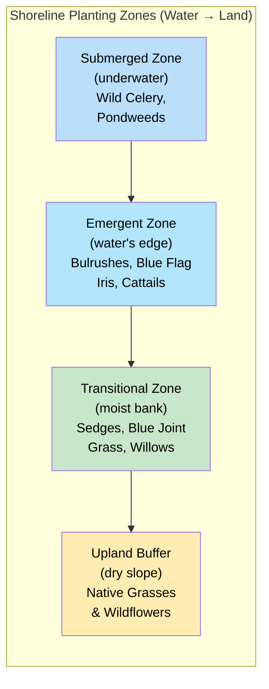
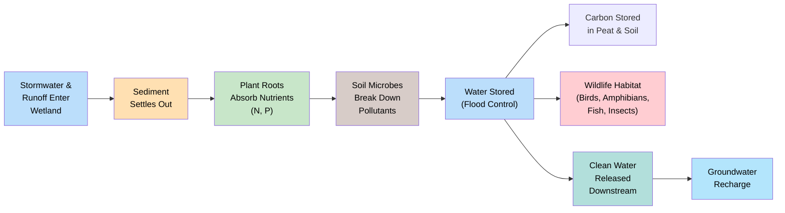

# Wetland and Shoreline Plants

!!! mascot-welcome "Welcome to the Water's Edge!"
    
    Time to get our feet wet! In this chapter, we'll explore Minnesota's
    wetlands, bogs, marshes, and shorelines — some of the most productive
    and important ecosystems in our state. These water-loving plants do
    incredible work filtering water, preventing floods, and supporting wildlife.

## Summary

This chapter explores Minnesota's wetland and shoreline plant communities. You will learn how different wetland types — marshes, bogs, and sedge meadows — support distinct plant communities, and you will meet standout species like Blue Flag Iris, Cardinal Flower, Joe-Pye Weed, native cattails, and Wild Rice. We also cover the practical side: how native plants stabilize shorelines, power rain gardens, filter stormwater, and reduce flooding. By the end, you will understand why wetland plants are essential infrastructure for clean water and healthy landscapes.

## Wetland Ecosystem Overview

A wetland is any landscape where water saturates the soil for at least part of the growing season. That water — whether it comes from rainfall, snowmelt, groundwater, or a nearby lake — defines everything about the plant community that grows there.

Minnesota has more wetland acreage than almost any other state in the lower 48. Before European settlement, the state contained roughly 18.6 million acres of wetlands. Today, about 10.6 million acres remain — still a vast area, but a significant loss that makes protecting and restoring what remains critically important.

Wetlands are not just soggy ground. They are among the most biologically productive ecosystems on Earth, rivaling tropical rainforests in the amount of living material they generate each year. They support specialized plant communities that cannot survive anywhere else, and in turn those plants provide services — water filtration, flood control, carbon storage, wildlife habitat — that benefit every Minnesotan.

### Types of Minnesota Wetlands

Minnesota's wetlands fall into several broad categories based on water depth, water chemistry, and the plant communities they support:

- **Marshes** — Shallow, nutrient-rich wetlands dominated by emergent plants like cattails and bulrushes
- **Bogs** — Acidic, nutrient-poor wetlands fed primarily by rainwater, with sphagnum moss and specialized shrubs
- **Fens** — Groundwater-fed wetlands with higher mineral content than bogs, supporting sedges and wildflowers
- **Sedge meadows** — Open, grassy wetlands dominated by various sedge species
- **Floodplain forests** — Wooded wetlands along rivers that experience periodic flooding
- **Shallow open water** — Ponds and lake edges with submerged and floating-leaved plants

Each type supports a different community of native plants adapted to its specific water levels, soil chemistry, and nutrient availability.

## Marsh Plants

Marshes are the wetlands most people picture when they hear the word. They feature standing water up to a few feet deep and are dominated by tall, emergent plants — species that root underwater but push their stems and leaves above the surface.

Minnesota marshes are incredibly productive. The combination of abundant water, sunlight, and nutrients fuels rapid plant growth, which in turn supports dense populations of insects, amphibians, birds, and mammals.

### Common Minnesota Marsh Plants

- **Cattails** (*Typha* species) — The iconic marsh plant, forming dense stands along lake edges and ditches
- **Bulrushes** (*Schoenoplectus* species) — Tall, round-stemmed plants that provide excellent wildlife cover
- **Arrowhead** (*Sagittaria latifolia*) — Named for its distinctive arrow-shaped leaves; tubers are edible
- **Wild Rice** (*Zizania palustris*) — Minnesota's state grain, growing in shallow lakes and slow rivers
- **Pickerelweed** (*Pontederia cordata*) — Produces spikes of purple-blue flowers in summer
- **Blue Flag Iris** (*Iris versicolor*) — Showy blue-violet flowers at the water's edge

Marsh plants share several adaptations that let them thrive in waterlogged conditions. Many have hollow stems that transport oxygen from above-water leaves down to submerged roots — a feature called aerenchyma. Others tolerate anaerobic (oxygen-poor) soil conditions that would kill most upland species.

## Bog Plants

Bogs are among Minnesota's most unusual ecosystems. Found primarily in the northern third of the state, they form in poorly drained basins where sphagnum moss slowly accumulates over centuries, creating thick mats of peat.

What makes bogs special is their chemistry. Because bogs receive most of their water from rainfall rather than groundwater, they are extremely low in nutrients and highly acidic — conditions that would stress most plants but create an opening for specialists.

### Bog Plant Adaptations

Bog plants have evolved remarkable strategies for surviving in nutrient-poor, acidic conditions:

- **Carnivorous plants** — Sundews (*Drosera* species) and pitcher plants (*Sarracenia purpurea*) supplement their nutrition by trapping and digesting insects
- **Ericaceous shrubs** — Leatherleaf (*Chamaedaphne calyculata*), Labrador Tea (*Rhododendron groenlandicum*), and bog cranberry (*Vaccinium oxycoccos*) have tough, waxy leaves that conserve nutrients
- **Sphagnum moss** (*Sphagnum* species) — The bog builder itself, capable of holding 20 times its dry weight in water and actively acidifying its surroundings
- **Orchids** — Several native orchid species, including the showy lady's slipper, grow in bog margins where conditions are less extreme
- **Tamarack** (*Larix laricina*) — Minnesota's only native deciduous conifer, common in bog margins

!!! mascot-thinking "Fascinating Adaptation"
    
    Pitcher plants have turned the food chain upside down! In a nutrient-starved
    bog, these plants get their nitrogen and phosphorus by catching insects in
    their fluid-filled, tube-shaped leaves. The insects slide in but cannot
    climb out due to downward-pointing hairs inside the pitcher.

## Sedge Meadows

Sedge meadows are open, grass-like wetlands dominated by various species of sedge (*Carex* and related genera). They typically occupy the zone between upland prairie and deeper marshes, where the soil is consistently moist but rarely submerged under deep water.

Though they may look like ordinary grassland at first glance, sedge meadows are ecologically distinct. The famous saying among botanists — "sedges have edges, rushes are round, grasses have knees that bend to the ground" — refers to the triangular cross-section of sedge stems, which distinguishes them from true grasses.

### Why Sedge Meadows Matter

- **Biodiversity hotspots** — A healthy sedge meadow can contain dozens of sedge species plus wildflowers, providing habitat for rare butterflies and grassland birds
- **Water storage** — Their dense root systems act like sponges, absorbing excess rainfall and releasing it slowly
- **Transition zones** — They buffer deeper wetlands from upland runoff, filtering sediment and nutrients before they reach open water

Common sedge meadow plants include Tussock Sedge (*Carex stricta*), which forms distinctive raised mounds, Blue Joint Grass (*Calamagrostis canadensis*), Spotted Joe-Pye Weed (*Eutrochium maculatum*), and [Swamp Milkweed](../../plants/swamp-milkweed.md) (*Asclepias incarnata*).

## Shoreline Stabilization

Lakeshores and riverbanks are dynamic places where water and land constantly interact. Without vegetation to hold the soil, these areas erode — sometimes rapidly — losing valuable land and sending sediment into the water.

Native shoreline plants are the most effective and sustainable solution for stabilizing these vulnerable areas. Their root systems bind soil, slow the force of waves and currents, and trap sediment carried by flowing water.

### Native Plants for Shoreline Stabilization

The diagram below shows the four planting zones used in a living shoreline, from open water to upland.

Plants used for shoreline work fall into zones based on their relationship to the water line:

- **Submerged zone** — Wild Celery (*Vallisneria americana*), pondweeds (*Potamogeton* species) — roots hold bottom sediments
- **Emergent zone** — Bulrushes, native cattails, Blue Flag Iris — roots knit shoreline soils together while stems absorb wave energy
- **Transitional zone** — Sedges, Blue Joint Grass, native willows (*Salix* species) — stabilize the bank above typical water levels
- **Upland buffer** — Native grasses and wildflowers — intercept runoff before it reaches the shore

The best shoreline stabilization projects use plants from multiple zones, creating a continuous band of vegetation from underwater to upland. This approach is often called a "living shoreline" and is increasingly preferred by lake associations and watershed districts over hard structures like riprap and retaining walls.

## Rain Garden Plants

A rain garden is a shallow, planted depression designed to capture and absorb stormwater runoff from impervious surfaces like roofs, driveways, and sidewalks. Native plants are ideal for rain gardens because their deep root systems create channels in the soil that dramatically improve water infiltration.

### How Rain Gardens Work

When rain hits a roof or driveway, it flows into the rain garden instead of running into storm drains. The garden fills with a few inches of water, which then soaks into the ground over 24 to 48 hours. During that time, plant roots and soil microbes filter out pollutants like phosphorus, nitrogen, oil, and heavy metals.

### Top Rain Garden Plants for Minnesota

Rain garden plants must tolerate both temporary flooding and dry periods between storms. These species handle that cycle well:

- **Joe-Pye Weed** (*Eutrochium maculatum*) — Tall, mauve-pink flower clusters loved by butterflies; tolerates wet feet
- **Cardinal Flower** (*Lobelia cardinalis*) — Brilliant red blooms that attract hummingbirds; thrives in consistently moist soil
- **Blue Flag Iris** (*Iris versicolor*) — Elegant blue-violet flowers; excellent for the lowest, wettest zone of a rain garden
- **Swamp Milkweed** (*Asclepias incarnata*) — Pink flowers that support monarch butterflies; handles wet-to-mesic conditions
- **Prairie Blazing Star** (*Liatris pycnostachya*) — Tall purple spikes; works well on the drier edges of a rain garden
- **Fox Sedge** (*Carex vulpinoidea*) — A workhorse sedge that handles the wet-dry cycle exceptionally well
- **Blue Lobelia** (*Lobelia siphilitica*) — Blue flowers that complement Cardinal Flower; less finicky about moisture

Design your own rain garden by placing native plants into the correct moisture zones of a cross-section diagram.

<iframe src="../../sims/rain-garden-designer/main.html" width="100%" height="500px" scrolling="no"></iframe>

Rain Garden Designer

Type: microsim

**Learning Objective:** Students will understand how rain garden moisture zones (wet center, moist middle, dry edge) determine plant placement, and will practice selecting appropriate native species for each zone.

**Controls:**
- Draggable plant cards for 10-12 native rain garden species
- Three labeled drop zones representing moisture levels (wet, moist, dry)
- Check Placement button to validate choices
- Reset button to start over

**Visual Elements:**
- Cross-section illustration of a rain garden showing the bowl shape with three distinct moisture zones
- Water level indicator showing typical ponding depth
- Plant cards with species name, moisture preference icon, and small illustration
- Color-coded feedback when placements are checked (green for correct zone, yellow for acceptable, red for wrong zone)

**Behavior:**
- Dragging a plant card to a zone snaps it into position within that zone
- Checking placements reveals which species are correctly placed and provides brief explanations for misplacements
- Students can rearrange plants and recheck until all are correctly placed
- A completion message summarizes the key principle: wettest plants in the center, driest on the edges

**Instructional Rationale:**
Rain garden design is a practical application of wetland plant ecology. By placing plants into moisture zones, students reinforce their understanding of species-specific moisture tolerances while practicing a skill they can apply in their own landscapes.

!!! mascot-tip "Bree's Rain Garden Tip"
    
    When planting a rain garden, think in zones. Put the most water-tolerant
    plants (like Blue Flag Iris and Fox Sedge) in the deepest center, medium-
    moisture plants (like Joe-Pye Weed) on the middle slopes, and drier-
    condition plants (like Blazing Star) around the upper edges.

## Blue Flag Iris

[Blue Flag Iris](../../plants/blue-flag-iris.md) (*Iris versicolor*) is one of Minnesota's most beautiful native wetland wildflowers. Growing 2 to 3 feet tall, it produces striking blue-violet flowers with intricate yellow and white markings that guide pollinators to the nectar.

### Identification and Habitat

- **Leaves** — Sword-shaped, blue-green, growing in flat fans from the base
- **Flowers** — 3 to 4 inches across, with three drooping sepals (falls) and three upright petals (standards); bloom in June
- **Habitat** — Marshes, wet meadows, stream banks, and lake margins; full sun to light shade
- **Roots** — Thick rhizomes that spread to form colonies, making it excellent for shoreline stabilization

### Ecological Value

Blue Flag Iris provides early-season nectar for bumblebees and other pollinators. Its dense rhizome mats stabilize wet soils, and its upright foliage provides cover for small wildlife. It naturalizes well and is widely available from native plant nurseries, making it a top choice for rain gardens, shoreline plantings, and wetland restorations.

!!! mascot-warning "Important Distinction"
    
    Do not confuse native Blue Flag Iris with Yellow Flag Iris (*Iris
    pseudacorus*), an invasive European species that has escaped into Minnesota
    wetlands. Yellow Flag is a regulated invasive in Minnesota — never plant it.
    If you see yellow iris in a wild wetland, report it to your county.

## Cardinal Flower

[Cardinal Flower](../../plants/cardinal-flower.md) (*Lobelia cardinalis*) may be the most eye-catching native wildflower found along Minnesota's streams and wetlands. Its spikes of brilliant scarlet-red flowers are unmistakable in late summer.

### Identification and Habitat

- **Flowers** — Tubular, brilliant red, arranged in a spike up to 12 inches long; bloom July through September
- **Leaves** — Lance-shaped, dark green, toothed, alternating up the stem
- **Height** — 2 to 4 feet
- **Habitat** — Stream banks, wet meadows, swamp edges, and floodplains; partial shade to full sun with consistent moisture

### Ecological Value

Cardinal Flower is one of relatively few native plants pollinated primarily by hummingbirds. The long, tubular flower shape is perfectly adapted for the hummingbird's long bill and hovering flight — most insects cannot reach the nectar. Ruby-throated Hummingbirds are the primary pollinator in Minnesota.

Cardinal Flower can be short-lived as an individual plant, but it persists by producing basal offshoots and reseeding. It prefers consistently moist soil and will struggle if it dries out. In garden settings, reliable moisture is the key to success.

## Joe-Pye Weed

Spotted Joe-Pye Weed (*Eutrochium maculatum*), often simply called Joe-Pye Weed, is a tall, late-summer perennial that dominates moist meadows, stream banks, and roadside ditches across Minnesota. Growing 4 to 7 feet tall, it is impossible to miss when its large, domed clusters of dusty pink-to-mauve flowers appear in August.

### Identification and Habitat

- **Flowers** — Large, flat-topped to domed clusters of tiny pink-mauve flowers; bloom August to September
- **Stems** — Stout, green to purple, with distinctive purple spots or speckles (the "spotted" in its name)
- **Leaves** — Whorled in groups of 4 to 5, lance-shaped, toothed
- **Height** — 4 to 7 feet
- **Habitat** — Moist meadows, stream banks, wet prairies, roadside ditches; full sun to light shade

### Ecological Value

Joe-Pye Weed is one of the premier butterfly plants in Minnesota. Its late-summer bloom time coincides with peak butterfly activity, and its large flower clusters provide a generous landing platform. Swallowtails, monarchs, fritillaries, and many other species visit regularly. It also attracts native bees and beneficial insects.

The name "Joe-Pye" is often attributed to a Native American healer, though the exact origin is debated. Various Indigenous peoples used the plant medicinally.

## Native Cattail

Cattails are the most recognizable wetland plants in North America. Their brown, sausage-shaped seed heads and tall, flat leaves are synonymous with marshes and pond edges. However, not all cattails in Minnesota are the same — and the distinction matters.

### Native vs. Invasive Cattails

Minnesota has two native cattail species and one highly problematic hybrid:

- **Broad-leaved Cattail** (*Typha latifolia*) — Native; wide leaves (up to 1 inch), fat seed heads with no gap between male and female portions
- **Narrow-leaved Cattail** (*Typha angustifolia*) — Considered non-native or adventive in much of Minnesota; narrower leaves, a distinct gap between male and female portions of the seed head
- **Hybrid Cattail** (*Typha x glauca*) — A cross between the two; highly aggressive and the primary problem species in many Minnesota wetlands

Hybrid cattail combines the toughness of both parents. It forms dense monocultures that crowd out native marsh plants, reduce wildlife diversity, and alter wetland hydrology. Many "cattail-choked" wetlands in Minnesota are dominated by this hybrid rather than the native broad-leaved species.

### Ecological Value of Native Cattail

When present in balanced numbers, native Broad-leaved Cattail is a valuable wetland plant:

- **Wildlife habitat** — Red-winged Blackbirds, Marsh Wrens, muskrats, and many other species depend on cattail stands
- **Water filtration** — Cattail roots absorb excess nutrients, particularly nitrogen and phosphorus
- **Erosion control** — Dense root networks stabilize shorelines and wetland edges
- **Food source** — Nearly every part of native cattail is edible, and it was an important food for Indigenous peoples

## Wild Rice

Wild Rice (*Zizania palustris*), known as *manoomin* in the Ojibwe language, is Minnesota's state grain and one of its most culturally and ecologically significant plants. It is an annual aquatic grass that grows in shallow lakes, rivers, and streams across the northern half of the state.

### Growth and Habitat

Wild Rice is an annual plant, meaning it completes its entire life cycle — germination, growth, flowering, seed production, and death — in a single growing season.

- **Germination** — Seeds that overwintered on the lake bottom sprout in spring
- **Submerged stage** — Young plants grow underwater, with ribbon-like leaves floating on the surface
- **Emergent stage** — Stems rise above the water to heights of 3 to 8 feet by mid-summer
- **Flowering and seed set** — Plants flower in July and August; seeds ripen in late August to September
- **Habitat requirements** — Soft, organic lake bottoms; slow-flowing or still water 1 to 4 feet deep; clean water with low turbidity

### Cultural Significance

Wild Rice holds deep cultural and spiritual importance for the Ojibwe, Dakota, and other Indigenous peoples of Minnesota. Harvesting wild rice has been a sacred tradition for centuries, and the grain remains a staple food and an anchor of cultural identity.

Traditional harvesting involves two people in a canoe — one poling through the rice beds while the other uses knockers (wooden sticks) to bend the stalks over the canoe and gently tap the ripe grains free. This method is sustainable because it leaves many seeds to fall into the water and grow the following year.

### Threats to Wild Rice

Wild Rice faces several threats in Minnesota:

- **Water level manipulation** — Dams and water control structures can raise or lower water beyond the narrow range Wild Rice needs
- **Nutrient pollution** — Excess phosphorus and nitrogen from agricultural runoff fuels algae growth that shades out Wild Rice
- **Sulfate contamination** — Sulfate from mining operations is particularly toxic to Wild Rice, which is sensitive to sulfide in sediments
- **Invasive species** — Non-native species can displace Wild Rice from its habitat
- **Climate change** — Altered precipitation patterns and warming water temperatures affect growing conditions

## Native Water Plants

Beyond the emergent and shoreline plants we have discussed, Minnesota's lakes and rivers support a rich community of submerged and floating-leaved aquatic plants that spend their entire lives in or on the water.

### Submerged Plants

These species grow entirely underwater, though some send flowers to the surface:

- **Wild Celery** (*Vallisneria americana*) — Long, ribbon-like leaves; a favorite food of diving ducks, especially Canvasbacks
- **Pondweeds** (*Potamogeton* species) — A large genus with many species; leaves may be submerged, floating, or both
- **Coontail** (*Ceratophyllum demersum*) — Has no true roots; floats freely or anchors loosely to the bottom
- **Water Milfoil** (*Myriophyllum sibiricum*) — The native species, with finely divided, feathery leaves

### Floating-Leaved Plants

- **White Water Lily** (*Nymphaea odorata*) — Large, fragrant white flowers and round floating leaves; found in quiet, shallow water
- **Yellow Pond Lily** (*Nuphar variegata*) — Smaller yellow flowers; tolerates more shade and current than White Water Lily
- **Duckweeds** (*Lemna* species) — Tiny, free-floating plants that form green carpets on calm water surfaces

### Ecological Roles of Aquatic Plants

Native aquatic plants perform essential functions:

- **Oxygen production** — Submerged plants release oxygen into the water, supporting fish and invertebrates
- **Fish habitat** — Underwater vegetation provides spawning areas, nursery habitat for young fish, and cover from predators
- **Wildlife food** — Waterfowl depend heavily on aquatic plants; Wild Celery and pondweeds are among the most important food sources
- **Water clarity** — Rooted plants stabilize bottom sediments, and their leaves absorb nutrients that would otherwise fuel algae blooms
- **Wave buffering** — Beds of aquatic plants reduce wave energy, protecting shorelines from erosion

## Riparian Buffer Plants

A riparian buffer is a strip of permanent vegetation — usually native grasses, wildflowers, shrubs, and trees — planted along the banks of streams, rivers, lakes, and ditches. The word "riparian" comes from the Latin *ripa*, meaning riverbank.

Riparian buffers serve as the critical interface between land and water. In Minnesota, state law (the Buffer Law, passed in 2015) requires vegetative buffers along public waters and public ditches, recognizing their essential role in protecting water quality.

### How Riparian Buffers Work

When rain falls on farm fields, parking lots, or lawns, it picks up sediment, fertilizer, pesticides, and other pollutants as it flows toward the nearest waterway. A riparian buffer intercepts this runoff before it reaches the water:

- **Roots** slow the flow of water, allowing sediment to settle out
- **Plants** take up dissolved nitrogen and phosphorus, removing these nutrients from the water
- **Soil microbes** in the root zone break down pesticides and other contaminants
- **Dense vegetation** filters out debris and stabilizes the bank against erosion

### Recommended Buffer Plants

Effective riparian buffers include plants from multiple layers:

- **Grasses and sedges** — [Switchgrass](../../plants/switchgrass.md) (*Panicum virgatum*), [Big Bluestem](../../plants/big-bluestem.md) (*Andropogon gerardii*), various sedges (*Carex* species)
- **Wildflowers** — Joe-Pye Weed, Boneset (*Eupatorium perfoliatum*), [Great Blue Lobelia](../../plants/great-blue-lobelia.md) (*Lobelia siphilitica*), Swamp Milkweed
- **Shrubs** — Red-osier Dogwood (*Cornus sericea*), native willows (*Salix* species), Elderberry (*Sambucus canadensis*)
- **Trees** — [Silver Maple](../../plants/silver-maple.md) (*Acer saccharinum*), Swamp White Oak (*Quercus bicolor*), [Tamarack](../../plants/tamarack.md) (*Larix laricina*)

A minimum 50-foot buffer captures the majority of sediment and nutrients. Wider buffers — 100 feet or more — provide additional wildlife habitat and greater pollutant removal.

## Wetland Functions

Wetlands are often called nature's kidneys, sponges, and nurseries — and for good reason. They perform a suite of ecological functions that benefit both wildlife and human communities.

The following diagram shows how water moves through a wetland and the services provided at each stage.

### Ecological Functions

- **Water purification** — Wetland plants and soils trap sediment, absorb nutrients, and break down pollutants
- **Flood storage** — Wetlands absorb and slowly release floodwaters, reducing peak flows downstream
- **Carbon storage** — Wetland soils, especially in bogs and fens, store enormous amounts of carbon in peat
- **Groundwater recharge** — Many wetlands allow surface water to percolate into underground aquifers
- **Biodiversity support** — Wetlands support a disproportionately large number of species relative to their area

### Wildlife Support

Minnesota's wetlands provide critical habitat for:

- **Waterfowl** — Minnesota is one of the most important duck-producing states in the nation; wetlands are essential for nesting and brood-rearing
- **Amphibians** — Frogs, toads, and salamanders depend on wetlands for breeding
- **Shorebirds** — Migrating sandpipers, plovers, and other shorebirds refuel at wetland stopover sites
- **Fish** — Floodplain wetlands serve as spawning and nursery habitat for many fish species
- **Insects** — Dragonflies, damselflies, and many other invertebrates have aquatic larval stages

### Economic Value

Studies consistently show that the services wetlands provide — water purification, flood reduction, groundwater recharge, recreation — are worth thousands of dollars per acre per year. Replacing these services with engineered infrastructure (water treatment plants, flood control dams) costs far more than protecting and restoring wetlands.

## Stormwater Management

Stormwater is water from rain or snowmelt that flows over land surfaces instead of soaking into the ground. In developed areas, impervious surfaces like roads, rooftops, and parking lots prevent water from infiltrating the soil, dramatically increasing the volume and speed of stormwater runoff.

This runoff picks up pollutants — oil from roads, fertilizer from lawns, sediment from construction sites — and carries them directly into lakes and streams. In Minnesota, stormwater is one of the largest sources of pollution to surface waters.

### Native Plant Solutions for Stormwater

Native plants offer several tools for managing stormwater:

- **Rain gardens** — Planted depressions that capture and infiltrate rooftop and driveway runoff
- **Bioswales** — Vegetated channels that slow and filter stormwater as it moves across a landscape
- **Green roofs** — Rooftop plantings that absorb rainfall before it becomes runoff
- **Permeable plantings** — Native prairie plantings whose deep roots create soil channels that improve infiltration rates by 10 to 20 times compared to turf grass

### Why Native Plants Outperform Turf Grass

The key difference is roots. A typical lawn grass has roots 2 to 4 inches deep. Native prairie grasses send roots 6 to 15 feet deep, creating an extensive network of channels through the soil. When rain falls on a native planting, water follows these root channels deep into the ground. Studies have measured infiltration rates 4 to 10 times higher in native prairie plantings compared to conventional turf.

!!! mascot-tip "Bree's Stormwater Tip"
    
    Even a small rain garden — 100 to 300 square feet — can make a real
    difference. A rain garden sized at about 10 percent of the impervious area
    draining to it can capture and infiltrate most rainstorms. That is a lot of
    pollutants kept out of your local lake or stream!

## Water Filtration Role

One of the most valuable services wetland and shoreline plants provide is water filtration. In a state with more than 10,000 lakes and 92,000 miles of rivers and streams, this function is hard to overstate.

### How Plants Filter Water

Native wetland plants clean water through several interconnected mechanisms:

- **Sediment trapping** — Plant stems slow the flow of water, causing suspended soil particles to settle out. A dense stand of bulrushes or native grasses can remove 80 to 90 percent of sediment from runoff.
- **Nutrient uptake** — Plants absorb dissolved nitrogen and phosphorus through their roots, converting these pollutants into plant tissue. When plant material decomposes, some nutrients are permanently stored in the soil.
- **Microbial breakdown** — The root zone of wetland plants supports dense communities of soil bacteria and fungi that decompose organic pollutants, including some pesticides and petroleum products.
- **Phosphorus binding** — Wetland soils chemically bind phosphorus, locking it in the sediment and preventing it from reaching open water. This is particularly important in Minnesota, where phosphorus is the primary driver of algae blooms in lakes.

### Practical Applications

Understanding plants' filtration role has led to engineered solutions that mimic natural processes:

- **Constructed wetlands** — Designed systems that use native wetland plants to treat wastewater, agricultural runoff, or stormwater
- **Vegetated filter strips** — Bands of native grasses and forbs along field edges that filter agricultural runoff
- **Riparian buffers** — Permanent native vegetation along waterways that intercepts and filters overland flow
- **Bioretention cells** — Engineered rain gardens with specially designed soil media and native plantings for maximum pollutant removal

## Flood Mitigation

Flooding is a recurring challenge in Minnesota, and it is likely to become more frequent as climate patterns shift toward more intense rainfall events. Native wetland and shoreline plants play a significant role in reducing flood damage — naturally and affordably.

### How Wetland Plants Reduce Flooding

Wetlands function as natural sponges and detention basins:

- **Water storage** — A single acre of wetland can store 1 to 1.5 million gallons of floodwater. The dense root systems and organic soils of wetlands absorb water like a sponge.
- **Peak flow reduction** — By absorbing and slowly releasing water, wetlands reduce the peak height and speed of floodwaters downstream. This means the difference between a flood that stays in its banks and one that overflows.
- **Runoff interception** — Native plantings on uplands and slopes slow overland flow, giving water more time to infiltrate the soil before it reaches streams.
- **Floodplain vegetation** — Trees, shrubs, and grasses in floodplains slow floodwaters, dissipate their energy, and trap sediment.

### The Cost of Lost Wetlands

When wetlands are drained for development or agriculture, their flood storage capacity disappears. The water that would have been absorbed now rushes downstream, arriving faster and in greater volume. Communities downstream pay the price in flood damage, erosion, and the cost of engineered flood control infrastructure.

Minnesota's Reinvest in Minnesota (RIM) Reserve program and federal Wetlands Reserve Program both recognize this connection, compensating landowners for permanently restoring wetlands and their flood-reduction functions.

!!! mascot-celebration "Water Heroes!"
    
    You've explored the incredible world of Minnesota's wetland and shoreline
    plants! From tiny duckweeds to towering Joe-Pye Weed, from sacred Wild
    Rice to hardworking rain garden plants, these species are the unsung heroes
    of clean water and healthy landscapes. Next time you visit a lakeshore or
    walk past a marshy area, take a closer look — you'll see these plants hard
    at work.

## Chapter Summary

In this chapter, you learned:

- **Wetland ecosystems** include marshes, bogs, fens, sedge meadows, and floodplain forests, each supporting distinct plant communities
- **Marsh plants** like cattails, bulrushes, and arrowhead thrive in standing water using adaptations like aerenchyma
- **Bog plants** survive nutrient-poor, acidic conditions; some, like pitcher plants and sundews, are carnivorous
- **Sedge meadows** are grass-like wetlands that serve as biodiversity hotspots and water storage areas
- **Shoreline stabilization** with native plants is more effective and sustainable than hard structures like riprap
- **Rain gardens** use deep-rooted native plants to capture and filter stormwater from impervious surfaces
- **Blue Flag Iris**, **Cardinal Flower**, and **Joe-Pye Weed** are standout native wetland wildflowers with high ecological value
- **Native Cattail** is valuable wildlife habitat, but hybrid cattails are aggressively invasive
- **Wild Rice** is ecologically, culturally, and nutritionally important, and faces threats from pollution and water management
- **Native water plants** provide oxygen, fish habitat, wildlife food, and water clarity in lakes and rivers
- **Riparian buffers** filter pollutants from runoff before they reach waterways
- **Wetland functions** include water purification, flood storage, carbon sequestration, and biodiversity support
- **Stormwater management** using native plants is effective because deep root systems improve water infiltration dramatically
- **Water filtration** by wetland plants removes sediment, nutrients, and contaminants from water
- **Flood mitigation** depends on intact wetlands that store and slowly release floodwaters

## Concepts Covered

This chapter covers the following 17 concepts from the learning graph:

1. Wetland Ecosystem Overview
2. Marsh Plants
3. Bog Plants
4. Sedge Meadows
5. Shoreline Stabilization
6. Rain Garden Plants
7. Blue Flag Iris
8. Cardinal Flower
9. Joe-Pye Weed
10. Native Cattail
11. Wild Rice
12. Native Water Plants
13. Riparian Buffer Plants
14. Wetland Functions
15. Stormwater Management
16. Water Filtration Role
17. Flood Mitigation

## Prerequisites

This chapter builds on concepts introduced in earlier chapters:

- **Chapter 1: Introduction to Native Plants and Ecology** — Understanding of native plant definitions, ecosystem concepts, biodiversity, and habitat
- **Chapter 2: Ecoregions and Growing Conditions** — Knowledge of Minnesota's ecoregions, soil types, and moisture conditions that determine where wetland communities occur

## What's Next

In Chapter 6, we'll explore the animals that depend on these plants — the pollinators, birds, and wildlife that make native plant communities come alive.

[See Annotated References](./references.md)
