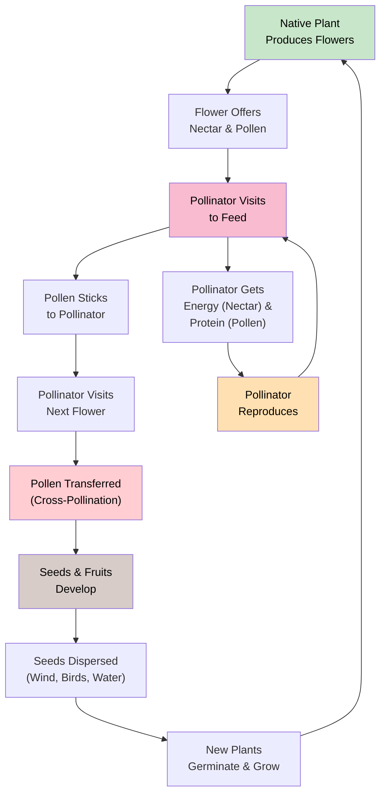
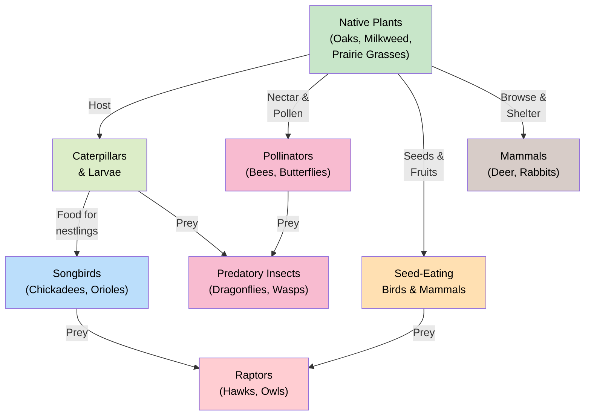

# Pollinators, Wildlife, and Plant Relationships

!!! mascot-welcome "Welcome to My Favorite Chapter!"
    
    This chapter is personal for me! I'm Bree, a native bee, and the
    relationships between pollinators, wildlife, and plants are at the heart of
    everything I care about. Let's explore how Minnesota's native plants support
    an incredible web of life -- from tiny sweat bees to migrating monarchs to
    nesting songbirds.

## Summary

This chapter explores the vital connections between Minnesota's native plants and the animals that depend on them. You will learn about the diversity of pollinators in our state, the crisis they face, and the specific plants that sustain them. We also cover how native plants support birds, mammals, and beneficial insects, and how bloom timing and flower structure shape which creatures visit which plants.

## Pollinator Overview

A **pollinator** is any animal that moves pollen from one flower to another, enabling plants to reproduce. While wind pollinates grasses and many trees, the majority of flowering plants depend on animal pollinators.

Minnesota's pollinator community includes:

- **Bees** -- over 400 native species, from large bumblebees to tiny metallic sweat bees
- **Butterflies and moths** -- including the iconic monarch and dozens of native species
- **Flies** -- hoverflies, bee flies, and other flower-visiting flies are underappreciated pollinators
- **Beetles** -- some of the oldest pollinators on Earth, they visit open, bowl-shaped flowers
- **Hummingbirds** -- Ruby-Throated Hummingbirds visit tubular red and orange flowers
- **Wasps** -- many wasp species visit flowers and transfer pollen while hunting for nectar

The following diagram illustrates the pollination cycle -- the mutualistic exchange between flowers and their pollinators.

Pollination is not charity -- it is a transaction. Plants offer nectar (sugar energy) and pollen (protein) as rewards, and pollinators carry pollen between flowers as they feed. This mutualism has driven the evolution of both flowers and pollinators for over 100 million years.

## Native Bee Species

Minnesota is home to more than 400 species of native bees. Most people picture the European Honeybee (*Apis mellifera*) when they hear "bee," but honeybees are not native to North America. Our native bees are far more diverse and, flower for flower, are often more effective pollinators.

### Major Groups of Native Bees

- **Bumblebees** (*Bombus* species) -- Large, fuzzy, social bees that nest in the ground or in abandoned rodent burrows. Minnesota has about 20 bumblebee species. They can fly in cooler temperatures than most bees, making them essential spring and fall pollinators.

- **Sweat bees** (family Halictidae) -- Small, often metallic green or bronze bees. They are among the most abundant native bees and visit a wide range of flowers.

- **Mining bees** (*Andrena* species) -- Solitary ground-nesting bees that are especially active in spring. They are important pollinators of early-blooming wildflowers and fruit trees.

- **Leafcutter bees** (*Megachile* species) -- Solitary bees that cut small circles from leaves to line their nest cells. They are excellent pollinators of many wildflowers and garden plants.

- **Mason bees** (*Osmia* species) -- Solitary bees that nest in hollow stems and woodpecker holes. Blue Orchard Mason Bees (*Osmia lignaria*) are exceptionally efficient pollinators.

- **Squash bees** (*Peponapis* and *Xenoglossa* species) -- Specialists that pollinate squash, pumpkin, and gourd flowers, often before dawn.

!!! mascot-thinking "Think About This"
    
    About 70% of native bee species nest in the ground. That means bare soil,
    sandy patches, and undisturbed earth are just as important as flowers.
    A perfectly mulched garden may look tidy, but it can be a housing crisis
    for native bees like me!

### Solitary vs. Social Bees

Most native bees are **solitary** -- each female builds her own nest, provisions it with pollen, and lays her eggs alone. Only bumblebees among Minnesota's natives form true social colonies with a queen and workers, and even their colonies are small (50-400 individuals) compared to honeybee hives (30,000-60,000).

## Monarch Butterfly

The Monarch Butterfly (*Danaus plexippus*) is one of the most recognizable insects in North America and an important symbol of pollinator conservation. With its bold orange-and-black wings spanning 3.5 to 4 inches, the monarch is hard to miss in a Minnesota prairie.

Monarchs are milkweed specialists. Their caterpillars feed exclusively on plants in the milkweed family (Asclepiadaceae), and the toxins they absorb from milkweed make both caterpillars and adult butterflies distasteful to predators. The bright orange coloring is a warning signal -- it tells birds and other predators that this butterfly is not a good meal.

Minnesota sits in the heart of the monarch's summer breeding range. The prairies and roadsides of western and southern Minnesota are critical habitat for monarchs, providing the milkweed they need to reproduce and the wildflowers they need for nectar.

## Monarch Migration

The monarch migration is one of the most extraordinary journeys in the animal kingdom. Each fall, monarchs east of the Rocky Mountains travel up to 3,000 miles from their breeding grounds in the northern United States and southern Canada to overwintering sites in the mountains of central Mexico.

### The Migration Cycle

- **Spring (March-April)** -- Overwintering monarchs leave Mexico and fly north. This generation breeds along the Gulf Coast states and dies.
- **Late spring (May-June)** -- A second generation continues northward, reaching Minnesota and other northern states.
- **Summer (June-August)** -- Two or more breeding generations may occur in Minnesota. Each generation lives 2-5 weeks.
- **Fall (September-October)** -- A special "super generation" emerges. These monarchs do not breed. Instead, they enter a state of reproductive dormancy and begin the long flight south to Mexico.
- **Winter (November-February)** -- Monarchs cluster by the millions in oyamel fir forests in the mountains of Michoacan, Mexico, waiting for spring.

The fall super generation lives 8-9 months -- far longer than the 2-5 weeks of summer generations. No single monarch makes the entire round trip. It takes 3-5 generations to complete one annual cycle, yet the fall generation somehow navigates to the same few mountaintops their great-great-grandparents left the previous spring.

## Butterfly Life Cycle

All butterflies and moths undergo **complete metamorphosis** -- a four-stage life cycle that transforms them completely between hatching and adulthood.

### The Four Stages

1. **Egg** -- A female butterfly lays eggs on or near the host plant her caterpillars will eat. Monarchs lay single eggs on the undersides of milkweed leaves.

2. **Larva (caterpillar)** -- The caterpillar hatches and begins eating. This is the growth stage. Caterpillars shed their skin (molt) several times as they grow, passing through stages called instars. A monarch caterpillar goes through five instars over about two weeks.

3. **Pupa (chrysalis)** -- The caterpillar forms a protective casing and undergoes a dramatic internal reorganization. For monarchs, the chrysalis is jade green with a band of gold dots. This stage lasts about 10-14 days.

4. **Adult (butterfly)** -- The fully formed butterfly emerges, expands and dries its wings, and begins feeding on nectar and searching for mates. Adults use long, coiled mouthparts called a proboscis to drink nectar from flowers.

Understanding the life cycle matters for gardeners because caterpillars and adults often need completely different plants. A garden with only nectar flowers supports adult butterflies but not their offspring. To sustain butterfly populations, you need host plants where females can lay eggs and caterpillars can feed.

## Pollinator Decline Causes

Pollinator populations worldwide have been declining for decades. This is not a single problem with a single cause -- it is a convergence of multiple threats acting together.

### Major Threats to Pollinators

- **Habitat loss** -- The conversion of prairies, meadows, and hedgerows to agriculture and development has eliminated vast areas of pollinator habitat. Minnesota has lost over 99% of its original tallgrass prairie.

- **Pesticide exposure** -- Insecticides, especially neonicotinoids, can kill pollinators directly or impair their navigation, foraging, and reproduction at sub-lethal doses. Herbicides eliminate the wildflowers pollinators depend on for food.

- **Disease and parasites** -- Pathogens and parasites, some spread from managed honeybee colonies to wild bees, weaken pollinator populations. The Varroa mite has devastated honeybee colonies, and spillover of diseases to wild bumblebees is a growing concern.

- **Climate change** -- Shifting temperatures disrupt the timing between when flowers bloom and when pollinators emerge. Plants may bloom before their pollinators are active, or pollinators may emerge before their food plants flower.

- **Invasive species** -- Invasive plants can displace the native wildflowers pollinators need. Some invasive plants attract pollinators with abundant nectar but provide poor nutrition compared to native species.

- **Light pollution** -- Artificial light at night disrupts nocturnal pollinators, especially moths, interfering with their navigation and feeding behavior.

## Pollinator Habitat Needs

Supporting healthy pollinator populations requires more than planting a few flowers. Pollinators need a full range of resources throughout their life cycle and across the seasons.

### The Four Essentials

- **Food** -- A continuous supply of blooming flowers from early spring through late fall. Gaps in bloom time can be devastating, especially in spring when overwintering bees first emerge.

- **Nesting sites** -- Ground-nesting bees need patches of bare, undisturbed soil. Cavity-nesting bees need hollow stems, old woodpecker holes, or bee houses. Bumblebees use abandoned rodent burrows.

- **Overwintering habitat** -- Many native bees overwinter as dormant adults or pupae in the soil or in plant stems. Queen bumblebees hibernate underground. Leaving plant stems standing through winter and not disturbing soil provides crucial overwintering sites.

- **Water** -- Pollinators need accessible water sources. Shallow dishes with pebbles, muddy puddles, and stream edges all serve this purpose. Butterflies often gather at mud puddles to drink minerals -- a behavior called "puddling."

!!! mascot-tip "Bree's Habitat Tip"
    
    One of the best things you can do for pollinators is to leave the leaves!
    In fall, skip the raking in garden beds. Many native bees, butterflies, and
    beneficial insects overwinter in leaf litter. That "messy" garden bed is
    actually a wildlife sanctuary.

### Pesticide-Free Zones

Even small amounts of pesticides can harm pollinators. Creating pesticide-free areas in your yard or community gives pollinators a safe place to feed and nest. If pest management is necessary, use targeted approaches rather than broad-spectrum sprays, and never apply pesticides to blooming plants.

## Nectar Sources

**Nectar** is a sugary liquid produced by flowers to attract pollinators. It is the primary energy source for adult butterflies, hummingbirds, and many bees. Different pollinators prefer different nectar concentrations and flower shapes.

### Top Native Nectar Plants for Minnesota

Spring:

- [Wild Columbine](../../plants/wild-columbine.md) (*Aquilegia canadensis*) -- hummingbirds and long-tongued bees
- Wild Lupine (*Lupinus perennis*) -- bumblebees
- [Virginia Bluebells](../../plants/virginia-bluebells.md) (*Mertensia virginica*) -- bumblebees and butterflies

Summer:

- [Purple Coneflower](../../plants/purple-coneflower.md) (*Echinacea purpurea*) -- butterflies, bees, and skippers
- [Wild Bergamot](../../plants/wild-bergamot.md) (*Monarda fistulosa*) -- bumblebees, hummingbirds, and butterflies
- Joe-Pye Weed (*Eutrochium maculatum*) -- a magnet for butterflies and bees
- Common Milkweed (*Asclepias syriaca*) -- heavily visited by many pollinator species
- [Black-Eyed Susan](../../plants/black-eyed-susan.md) (*Rudbeckia hirta*) -- broad appeal across pollinator groups

Fall:

- [New England Aster](../../plants/new-england-aster.md) (*Symphyotrichum novae-angliae*) -- critical late-season nectar for migrating monarchs
- [Stiff Goldenrod](../../plants/stiff-goldenrod.md) (*Solidago rigida*) -- bees and butterflies rely on goldenrod in autumn
- [Showy Goldenrod](../../plants/showy-goldenrod.md) (*Solidago speciosa*) -- one of the last major nectar sources of the season

## Pollen Sources

While nectar provides energy (carbohydrates), **pollen** provides protein and fats. Pollen is essential for bees, which collect it to feed their developing larvae. Without adequate pollen, bee populations cannot reproduce.

Some important native pollen plants include:

- **Sunflowers** (*Helianthus* species) -- produce abundant pollen visited by many bee species
- **Wild Rose** (*Rosa blanda*) -- open flowers with accessible pollen
- **Prairie Clover** (*Dalea* species) -- valuable for both pollen and nectar
- **Asters** (*Symphyotrichum* species) -- late-season pollen when little else is available
- **Willows** (*Salix* species) -- among the very first pollen sources in spring, critical for early-emerging bees
- **Golden Alexanders** (*Zizia aurea*) -- important spring pollen source

### Pollen Specialists

Some native bees are **oligolectic** -- they collect pollen from only one plant genus or family. These specialist bees are entirely dependent on their host plants:

- Squash bees collect pollen exclusively from squash-family flowers
- Some *Andrena* mining bees specialize on willows or spring-blooming plants
- Certain sweat bees specialize on sunflower-family plants

When specialist bees lose their host plants, they cannot switch to alternatives. This makes preserving native plant diversity directly tied to preserving bee diversity.

## Host Plants

A **host plant** is a plant that a particular insect uses for egg-laying and larval feeding. This concept is crucial for butterfly and moth conservation because caterpillars are often specialists -- they can only eat one plant species or a small group of related plants.

### Why Host Plants Matter

Adult butterflies can sip nectar from many different flowers, but their caterpillars are far more restricted. A butterfly garden full of nectar flowers but lacking host plants is like a restaurant with no nursery -- adults can eat, but they cannot raise the next generation.

### Important Host Plant Relationships in Minnesota

- **Monarch** -- milkweeds (*Asclepias* species) only
- **Black Swallowtail** -- plants in the parsley family (Golden Alexanders, Prairie Parsley)
- **Painted Lady** -- thistles, asters, and other composites
- **Great Spangled Fritillary** -- violets (*Viola* species)
- **Red Admiral** -- nettles (*Urtica* and *Boehmeria* species)
- **Viceroy** -- willows (*Salix* species) and poplars
- **Baltimore Checkerspot** -- White Turtlehead (*Chelone glabra*)
- **Karner Blue** -- Wild Lupine (*Lupinus perennis*) only

Test your knowledge of pollinator-plant relationships by matching pollinator species to their preferred native host and nectar plants.

<iframe src="../../sims/pollinator-match/main.html" width="100%" height="500px" scrolling="no"></iframe>

Pollinator-Plant Matching Game

Type: microsim

**Learning Objective:** Students will learn the specific relationships between Minnesota pollinators and their preferred native plants, reinforcing the concepts of host plants, nectar sources, and pollination syndromes.

**Controls:**
- Draggable pollinator cards (monarch, bumblebee, hummingbird, swallowtail, etc.)
- Target plant cards showing species name and flower image
- Check Matches button to validate pairings
- Difficulty toggle (beginner shows hints, advanced does not)

**Visual Elements:**
- Pollinator illustrations on the left side
- Native plant illustrations on the right side
- Connection lines drawn between matched pairs
- Color-coded feedback on correctness (green for correct, red for incorrect)
- Score display and brief explanation for each pairing

**Behavior:**
- Dragging a pollinator to a plant creates a match connection
- Some pollinators match multiple plants; students earn partial credit for any correct pairing
- Checking matches reveals the correct relationships with a one-sentence explanation of each
- Beginner mode shows flower color and shape hints aligned with pollination syndromes

**Instructional Rationale:**
Matching exercises engage active recall and help students move beyond memorization to understanding why certain pollinators prefer certain flowers (tube shape for hummingbirds, flat landing platforms for butterflies, etc.), connecting back to the pollination syndromes concept.

## Milkweed and Monarchs

The relationship between monarchs and milkweed is one of the best-studied plant-insect partnerships in ecology. It deserves special attention because it illustrates the depth and complexity of co-evolved relationships.

### Minnesota's Native Milkweeds

Minnesota has about a dozen native milkweed species. The most important for monarchs include:

- **Common Milkweed** (*Asclepias syriaca*) -- the primary monarch host plant in Minnesota. It grows in prairies, roadsides, and field edges. Its pink flower clusters produce abundant nectar visited by many pollinator species.

- **Butterfly Milkweed** (*Asclepias tuberosa*) -- bright orange flowers, thrives in dry prairies and sandy soils. Unlike most milkweeds, it has clear sap rather than milky latex.

- **Swamp Milkweed** (*Asclepias incarnata*) -- pink flowers, grows in wet meadows and shoreline areas. An excellent garden plant for moist sites.

- **Whorled Milkweed** (*Asclepias verticillata*) -- delicate white flowers on thin stems. Found in dry prairies and open woodlands.

### The Chemical Defense

Milkweeds produce toxic compounds called **cardenolides** (cardiac glycosides) in their milky sap. Most insects cannot tolerate these toxins, but monarch caterpillars have evolved the ability to eat milkweed leaves and sequester the cardenolides in their own bodies. This makes the caterpillars and adult butterflies toxic to predators -- a phenomenon called **aposematism**, where bright warning colors advertise toxicity.

### Milkweed Decline

The widespread use of herbicide-tolerant crops since the late 1990s has eliminated milkweed from millions of acres of agricultural land in the Midwest. This habitat loss is considered a primary driver of the monarch population decline. Restoring milkweed along roadsides, in gardens, and in conservation plantings is one of the most direct actions individuals can take to support monarchs.

## Bird Habitat Plants

Native plants support birds in ways that non-native ornamental landscapes simply cannot. The connection flows through the food web: native plants host native insects, and insects are the primary food source for most nesting songbirds -- even species we think of as "seed eaters" feed insects to their chicks.

The diagram below shows the food web that connects native plants to wildlife -- every link depends on native plants as the foundation.

### How Native Plants Support Birds

- **Insects for nestlings** -- Nearly all terrestrial bird species feed caterpillars and other insects to their young. A single clutch of Black-Capped Chickadees requires thousands of caterpillars. Native oaks, cherries, and willows host far more caterpillars than non-native trees.

- **Seeds and fruits** -- Native grasses, wildflowers, and shrubs produce seeds and berries that sustain birds through fall and winter. Many native fruits ripen at exactly the time migrating birds need fuel.

- **Nesting cover** -- Dense native shrubs and grasses provide protected nesting sites. Grassland birds like Bobolinks and Meadowlarks require large areas of undisturbed native grasses to nest.

- **Winter shelter** -- Evergreen trees and dense shrub thickets protect birds from wind and cold during Minnesota's harsh winters.

### Key Native Trees and Shrubs for Birds

- **Oaks** (*Quercus* species) -- support more caterpillar species than any other tree genus in North America; acorns feed woodpeckers, jays, and turkeys
- **Wild Plum** (*Prunus americana*) -- fruits, nesting cover, and abundant spring insects
- **Elderberry** (*Sambucus* species) -- berries are heavily consumed by over 40 bird species
- **Dogwoods** (*Cornus* species) -- high-fat berries fuel fall migration
- **Viburnums** (*Viburnum* species) -- persistent berries provide winter food

## Songbird Species Support

Minnesota's native plant communities support a rich diversity of songbirds. Different habitats attract different species, and plant diversity within a habitat increases the number of bird species it can support.

### Prairie and Grassland Birds

Native prairies and grasslands host specialized bird species that cannot survive in other habitats:

- **Bobolink** -- nests in undisturbed tallgrass prairie; males sing a distinctive bubbling song in flight
- **Dickcissel** -- a grassland sparrow-like bird that depends on large prairie tracts
- **Western Meadowlark** -- Minnesota's unofficial prairie bird, found in open grasslands
- **Grasshopper Sparrow** -- named for its insect-like buzzing song, nests in sparse grasslands

### Woodland and Forest Birds

- **Wood Thrush** -- nests in deciduous forests with a rich understory of native shrubs
- **Scarlet Tanager** -- breeds in mature oak forests
- **Baltimore Oriole** -- builds hanging nests in large deciduous trees; feeds on caterpillars and fruit

### Wetland and Shoreline Birds

- **Red-Winged Blackbird** -- nests in native cattail and bulrush marshes
- **Common Yellowthroat** -- a warbler that breeds in dense wetland vegetation
- **Marsh Wren** -- requires tall emergent vegetation like native bulrushes

Grassland birds are among the most rapidly declining bird groups in North America. Preserving and restoring native prairies is critical for their survival.

## Mammal Habitat Plants

Native plants provide essential food and shelter for Minnesota's mammals, from tiny meadow voles to white-tailed deer and black bears.

### Small Mammals

- **Prairie Voles and Meadow Voles** -- live in dense native grass stands; their tunnels aerate soil and their activity cycles nutrients
- **Thirteen-Lined Ground Squirrels** -- a prairie specialist that feeds on seeds and insects in grasslands
- **Eastern Cottontail Rabbits** -- shelter in dense native shrub thickets and feed on native grasses and forbs

### Larger Mammals

- **White-Tailed Deer** -- browse on native shrubs and forbs; acorns from oaks are a critical fall food source
- **Black Bears** -- feast on native berries including chokecherries (*Prunus virginiana*), blueberries (*Vaccinium* species), and hazelnuts (*Corylus americana*)
- **Beavers** -- depend on native willows, aspens (*Populus tremuloides*), and birches for food and dam-building material

### Bat Habitat

Minnesota's bats are important nocturnal insect predators. Native plant communities support the moth and beetle populations that bats feed on. A single Little Brown Bat can consume hundreds of mosquito-sized insects per hour. Diverse native plantings that host abundant insect populations indirectly support healthy bat populations.

## Beneficial Insects

Not all important insects are pollinators. Many native insects play crucial roles as predators, parasitoids, and decomposers that keep ecosystems functioning and reduce the need for pesticides in gardens and farms.

### Predatory Insects

- **Lady Beetles** (family Coccinellidae) -- both adults and larvae consume large numbers of aphids. Minnesota has many native species; the introduced Asian Lady Beetle (*Harmonia axyridis*) is the one that invades homes in fall.

- **Lacewings** (order Neuroptera) -- their larvae, sometimes called "aphid lions," are voracious predators of aphids, mites, and small caterpillars.

- **Ground Beetles** (family Carabidae) -- nocturnal predators that patrol the soil surface eating slugs, caterpillars, and weed seeds. Native ground covers and leaf litter provide their habitat.

- **Dragonflies and Damselflies** (order Odonata) -- powerful aerial predators of mosquitoes and other flying insects. Their aquatic larvae are also predators in ponds and wetlands.

### Parasitoid Wasps

Tiny parasitoid wasps lay their eggs inside or on pest insects. The developing wasp larvae consume the host from within. These wasps are among the most effective natural pest control agents and are supported by native wildflower plantings that provide nectar for the adult wasps.

### Decomposers

- **Dung beetles** -- recycle animal waste and improve soil
- **Carrion beetles** -- break down dead animals, returning nutrients to the soil
- **Fungus gnats and soil-dwelling insects** -- help decompose organic matter

!!! mascot-tip "Bree's Garden Tip"
    
    If you see aphids on your native plants, resist the urge to spray! Give it
    a few days. Lady beetle larvae, lacewing larvae, and parasitoid wasps are
    probably already on the way. A healthy native garden manages most pest
    problems on its own.

## Pollinator Syndromes

**Pollination syndromes** are sets of flower traits that have evolved to attract specific types of pollinators. While no flower is visited by only one pollinator, these patterns help explain why certain flowers look, smell, and bloom the way they do.

### Common Pollination Syndromes

**Bee-pollinated flowers** tend to be:

- Blue, purple, yellow, or white
- Mildly fragrant with a sweet or minty scent
- Tubular or with a landing platform
- Open during the day
- Examples: Wild Bergamot (*Monarda fistulosa*), Lead Plant (*Amorpha canescens*)

**Butterfly-pollinated flowers** tend to be:

- Bright red, orange, yellow, or pink
- Mildly fragrant
- Flat-topped or clustered, providing a landing platform
- Open during the day with deep nectar tubes
- Examples: Joe-Pye Weed (*Eutrochium maculatum*), Blazing Star (*Liatris* species)

**Hummingbird-pollinated flowers** tend to be:

- Red, orange, or deep pink
- Odorless (hummingbirds have a poor sense of smell)
- Tubular and pendant (hanging), so only hovering birds can reach the nectar
- Examples: Wild Columbine (*Aquilegia canadensis*), [Cardinal Flower](../../plants/cardinal-flower.md) (*Lobelia cardinalis*)

**Moth-pollinated flowers** tend to be:

- White or pale-colored (visible at night)
- Strongly fragrant, especially in the evening
- Open or deepen at dusk
- Examples: Evening Primrose (*Oenothera biennis*), some native honeysuckles

**Beetle-pollinated flowers** tend to be:

- White or dull-colored
- Strongly scented, sometimes fruity or fermented
- Open and bowl-shaped with easily accessible pollen
- Examples: Wild Rose (*Rosa blanda*), some magnolia relatives

**Fly-pollinated flowers** tend to be:

- Dull red, brown, or purple
- Sometimes foul-smelling (mimicking rotting material)
- Open and accessible
- Examples: [Wild Ginger](../../plants/wild-ginger.md) (*Asarum canadense*), [Jack-in-the-Pulpit](../../plants/jack-in-the-pulpit.md) (*Arisaema triphyllum*)

## Bloom Timing and Pollinators

One of the most important -- and most often overlooked -- aspects of pollinator gardening is **bloom timing**. Pollinators need food from the moment they emerge in early spring until they go dormant in late fall. A garden that blooms only in July leaves pollinators hungry for most of the year.

### Why Continuous Bloom Matters

- **Spring** is critical. Queen bumblebees emerge from hibernation hungry and need immediate nectar and pollen. Spring mining bees depend on early-blooming wildflowers. A gap in spring bloom can mean colony failure for bumblebees.

- **Midsummer** is when most gardens peak, and most pollinators are active. This is the easiest season to plan for.

- **Late summer and fall** are essential for migrating monarchs that need nectar fuel for their long journey to Mexico, and for bumblebee colonies building up reserves for winter. Late-blooming asters and goldenrods are irreplaceable fall resources.

### A Minnesota Bloom Calendar

**Early Spring (April-May):**

- [Pasque Flower](../../plants/pasque-flower.md) (*Anemone patens*) -- one of the very first prairie blooms
- Virginia Bluebells (*Mertensia virginica*)
- Wild Columbine (*Aquilegia canadensis*)
- [Golden Alexanders](../../plants/golden-alexanders.md) (*Zizia aurea*)

**Late Spring (May-June):**

- Wild Lupine (*Lupinus perennis*)
- Spiderwort (*Tradescantia ohiensis*)
- Cream Gentian (*Gentiana alba*)

**Early Summer (June-July):**

- Wild Bergamot (*Monarda fistulosa*)
- [Butterfly Milkweed](../../plants/butterfly-milkweed.md) (*Asclepias tuberosa*)
- Purple Coneflower (*Echinacea purpurea*)
- Black-Eyed Susan (*Rudbeckia hirta*)

**Midsummer (July-August):**

- Joe-Pye Weed (*Eutrochium maculatum*)
- [Blazing Star](../../plants/blazing-star.md) (*Liatris ligulistylis*) -- a monarch magnet
- [Cup Plant](../../plants/cup-plant.md) (*Silphium perfoliatum*)
- Common Milkweed (*Asclepias syriaca*)

**Late Summer (August-September):**

- Ironweed (*Vernonia fasciculata*)
- Cardinal Flower (*Lobelia cardinalis*)
- [Great Blue Lobelia](../../plants/great-blue-lobelia.md) (*Lobelia siphilitica*)

**Fall (September-October):**

- New England Aster (*Symphyotrichum novae-angliae*)
- [Smooth Blue Aster](../../plants/smooth-blue-aster.md) (*Symphyotrichum laeve*)
- Stiff Goldenrod (*Solidago rigida*)
- Showy Goldenrod (*Solidago speciosa*)

Explore the interactive bloom calendar below to see which native plants provide nectar and pollen in each month of the growing season.

<iframe src="../../sims/bloom-calendar/main.html" width="100%" height="500px" scrolling="no"></iframe>

Interactive Bloom Calendar

Type: microsim

**Learning Objective:** Students will understand the seasonal progression of native plant bloom times and be able to select species that provide continuous pollinator resources from spring through fall.

**Controls:**
- Month selector or timeline slider spanning April through October
- Filter checkboxes for plant type (wildflower, grass, shrub) and habitat (prairie, woodland, wetland)
- Toggle to highlight gap months where few species are blooming

**Visual Elements:**
- Horizontal timeline with months labeled across the top
- Colored bars for each plant species showing their bloom period
- Plant names with small flower color indicators
- Gap warning highlights for months with fewer than three blooming species in the selected filter

**Behavior:**
- Selecting a month highlights all species blooming during that period and shows a summary count
- Filtering by habitat or plant type narrows the displayed species
- The gap detector identifies months where pollinator resources may be thin, encouraging students to add species to fill those gaps
- Clicking a species name shows a brief profile with pollinator associations

**Instructional Rationale:**
Continuous bloom is one of the most important and most overlooked principles of pollinator gardening. The visual calendar format makes bloom gaps immediately obvious and motivates students to think about seasonal coverage rather than focusing only on midsummer flowers.

!!! mascot-celebration "You're a Pollinator Champion!"
    
    You now understand the web of relationships that connects Minnesota's
    native plants to pollinators, birds, mammals, and beneficial insects.
    Every native plant you grow strengthens these connections.
    On behalf of bees everywhere -- thank you!

## Chapter Summary

In this chapter, you learned:

- Minnesota has over **400 native bee species**, most of which are solitary ground-nesters
- **Monarch butterflies** depend entirely on milkweed for reproduction and undergo a remarkable multi-generational migration
- All butterflies pass through four life stages: **egg, larva, pupa, and adult**, each with different plant needs
- Pollinator declines result from **habitat loss, pesticides, disease, and climate change** acting together
- Pollinators need **food, nesting sites, overwintering habitat, and water** -- not just flowers
- **Nectar** provides energy while **pollen** provides protein; both are essential
- **Host plants** are the specific plants caterpillars and larvae need to eat and grow
- Native plants support **birds** by hosting the caterpillars that nestlings require
- **Beneficial insects** like lady beetles and lacewings provide natural pest control in native plantings
- **Pollinator syndromes** explain why different flowers have different colors, shapes, and scents
- **Continuous bloom from spring through fall** is essential for sustaining pollinator populations

## Concepts Covered

This chapter covers the following 17 concepts from the learning graph:

1. Pollinator Overview
2. Native Bee Species
3. Monarch Butterfly
4. Monarch Migration
5. Butterfly Life Cycle
6. Pollinator Decline Causes
7. Pollinator Habitat Needs
8. Nectar Sources
9. Pollen Sources
10. Host Plants
11. Milkweed And Monarchs
12. Bird Habitat Plants
13. Songbird Species Support
14. Mammal Habitat Plants
15. Beneficial Insects
16. Pollinator Syndromes
17. Bloom Timing Pollinators

## Prerequisites

This chapter builds on concepts from the following earlier chapters:

- **Chapter 1** -- Native Plant Definition, Ecosystem Definition, Biodiversity, and Habitat
- **Chapter 2** -- Ecoregions and Growing Conditions that determine which plants and pollinators are present
- **Chapter 3** -- Prairie Plants and Grasslands, the primary habitat for many pollinators
- **Chapter 4** -- Woodland and Forest Plants that support forest-dwelling pollinators and birds
- **Chapter 5** -- Wetland and Shoreline Plants that host aquatic insects and wetland birds

## What's Next

In Chapter 7, we'll sharpen your plant identification skills with detailed techniques for recognizing native species by their leaves, flowers, seeds, and growth habits -- so you can find and name the pollinator plants you just learned about.

[See Annotated References](./references.md)
