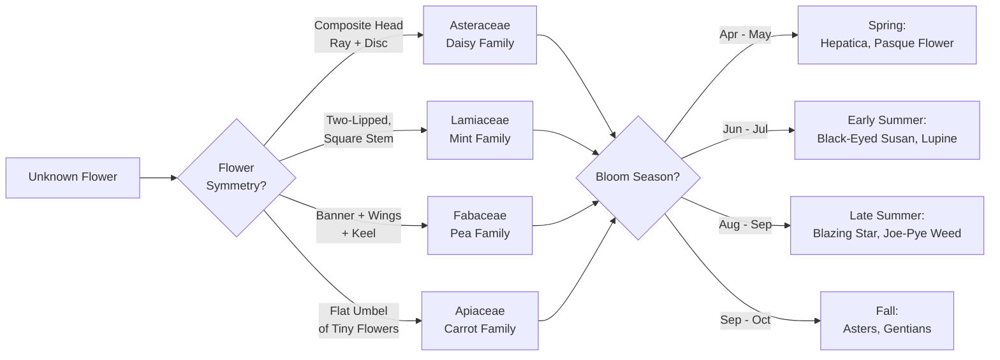
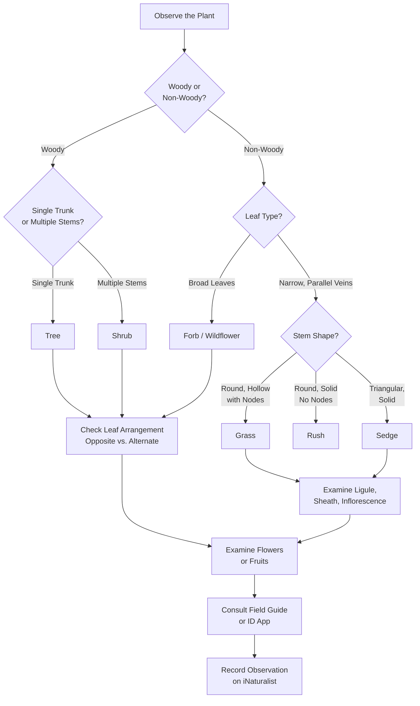

# Plant Identification Skills

!!! mascot-welcome "Welcome to Plant ID!"
    
    Ready to sharpen your plant identification skills? In this chapter, we'll
    move beyond the basics and build practical techniques you can use in the
    field. Whether you're walking a prairie trail or exploring your own backyard,
    these skills will help you name what you see with confidence.

## Summary

This chapter builds your practical plant identification toolkit. You will learn how to read leaf shapes, flower structures, fruits, seeds, and bark. You will discover how growth habit, seasonal changes, and habitat clues all contribute to accurate identification. We also cover field guides, digital tools, and the specific techniques needed to tell native species from invasive look-alikes — including the notoriously tricky grasses and sedges.

## Leaf Shape Identification

Leaves are often the first and most available clue when identifying a plant. They are present for most of the growing season, and their shapes are remarkably consistent within a species.

### Key Leaf Characteristics

When examining a leaf, pay attention to these features:

- **Simple vs. compound** — A simple leaf has one blade per stalk. A compound leaf is divided into multiple leaflets, like the five leaflets of Virginia Creeper or the many leaflets of a Wild Lupine.
- **Margin (edge)** — Is the leaf edge smooth (entire), toothed (serrate), lobed, or deeply divided?
- **Shape** — Common shapes include lance-shaped (lanceolate), heart-shaped (cordate), oval (elliptic), and arrow-shaped (sagittate).
- **Arrangement on the stem** — Are leaves opposite (in pairs), alternate (staggered), or whorled (three or more at the same point)?
- **Surface texture** — Smooth, hairy, waxy, rough, or sticky?
- **Venation** — Are veins parallel (common in grasses and lilies) or branching in a net pattern (common in broadleaf plants)?

### Minnesota Examples

- **Big Bluestem** (*Andropogon gerardii*) — Long, narrow leaves with parallel veins, often with a bluish tint at the base
- **Wild Bergamot** (*Monarda fistulosa*) — Opposite, lance-shaped leaves with toothed margins and a minty aroma
- **Bloodroot** (*Sanguinaria canadensis*) — Large, deeply lobed basal leaf that wraps around the stem when emerging

!!! mascot-thinking "Key Insight"
    
    Leaf arrangement is one of the most underrated identification clues.
    Opposite vs. alternate leaves can narrow your options dramatically. Many
    field guides organize plants partly by leaf arrangement, so noticing this
    first can save you a lot of page-flipping.

Practice narrowing down a plant by selecting leaf features in the interactive tool below.

<iframe src="../../sims/leaf-shape-identifier/main.html" width="100%" height="500px" scrolling="no"></iframe>

Leaf Shape Identifier MicroSim

Type: microsim

**Learning Objective:** Students will understand how combining multiple leaf characteristics — shape, margin, arrangement, and venation — systematically narrows plant identification possibilities.

**Controls:**

- Dropdown for leaf shape (lanceolate, cordate, elliptic, sagittate, linear)
- Dropdown for margin type (entire, serrate, lobed, deeply divided)
- Dropdown for arrangement (opposite, alternate, whorled)
- Dropdown for venation (parallel, net/branching)
- Reset button to clear all selections

**Visual Elements:**

- A dynamic illustration of a leaf that updates to reflect the selected features
- A results panel listing Minnesota native species that match the selected combination
- A count showing how many candidates remain after each selection

**Behavior:**

- Each feature selection filters the candidate list, reducing matches progressively
- Hovering over a result shows a brief description and image of the matching species
- Incompatible combinations display a message explaining why no species match

**Instructional Rationale:**
By selecting features one at a time and watching the candidate list shrink, students internalize the process of systematic elimination that field botanists use. This builds confidence before working with a physical field guide.

### Leaf Arrangement Memory Aid

A helpful way to remember common Minnesota trees and shrubs with opposite leaves is the acronym **MADCap Horse**: **M**aple, **A**sh, **D**ogwood, **Cap**rifoliaceae (honeysuckle family), **Horse** chestnut. Most other woody plants have alternate leaves.

## Flower Structure ID

Flowers are the most reliable feature for precise plant identification. While leaves can vary with growing conditions, flower structure is genetically fixed and highly consistent within a species.

### Parts of a Flower

- **Petals** — The colorful parts that attract pollinators. Count them — petal number is a key diagnostic feature.
- **Sepals** — The green (usually) structures below the petals that protected the flower bud.
- **Stamens** — The male parts, producing pollen. Note their number, color, and arrangement.
- **Pistil** — The female part in the center, where seeds develop.
- **Inflorescence type** — How flowers are arranged: solitary, in clusters (umbels), in spikes, in flat-topped groups (corymbs), or in branching sprays (panicles).

### Flower Families to Recognize

Learning to recognize a few major flower families unlocks identification across dozens of species:

- **Asteraceae (Daisy/Composite family)** — What looks like one flower is actually a head of many tiny flowers. Includes coneflowers, asters, goldenrods, and sunflowers. Look for ray florets around the edge and disc florets in the center.
- **Fabaceae (Pea/Bean family)** — Irregular flowers with a banner petal on top, two wing petals on the sides, and a keel below. Includes lupines, prairie clovers, and wild indigo.
- **Lamiaceae (Mint family)** — Two-lipped flowers, square stems, and opposite leaves. Includes wild bergamot, giant hyssop, and mountain mint.
- **Apiaceae (Carrot/Parsley family)** — Flat-topped clusters (umbels) of tiny flowers. Includes Golden Alexanders, but also toxic and invasive species like Wild Parsnip — handle with care.

### Bloom Season Matters

The following diagram shows how flower family recognition and bloom season work together to narrow an identification.

Different species bloom at different times. Knowing when a flower appears helps narrow identification:

- **Spring** (April-May) — Hepatica, Bloodroot, Trillium, Pasque Flower
- **Early summer** (June-July) — Wild Lupine, Black-Eyed Susan, Spiderwort
- **Late summer** (August-September) — Blazing Star, Joe-Pye Weed, Ironweed
- **Fall** (September-October) — Asters, Gentians, late Goldenrods

## Fruit And Seed ID

After flowers fade, fruits and seeds offer valuable identification clues — especially in late summer, fall, and winter when flowers are gone.

### Types of Fruits

- **Dry fruits** — Capsules (Blazing Star), achenes with fluffy plumes (milkweed, goldenrod), pods (wild indigo, prairie clover), and samaras (maple "helicopters")
- **Fleshy fruits** — Berries (elderberry, bunchberry), drupes (chokecherry, plum), and pomes (hawthorn, crabapple)
- **Seed heads** — Many prairie plants hold their dried seed heads through winter, creating recognizable silhouettes. The spiky spheres of Purple Coneflower and the fluffy wands of Big Bluestem are easy to spot even in January.

### Seed Dispersal Clues

How a plant spreads its seeds tells you something about its identity:

- **Wind-dispersed** — Look for plumes, wings, or light, fluffy seeds (milkweed, cottonwood, goldenrod)
- **Animal-dispersed** — Fleshy, colorful fruits that attract birds (elderberry, dogwood) or burred seeds that stick to fur and clothing (tick trefoil, burdock)
- **Self-dispersed** — Pods that pop open and eject seeds (wild geranium, touch-me-not)
- **Water-dispersed** — Buoyant seeds found on shoreline plants (many sedges, bulrushes)

## Bark Identification

Bark is the identification feature that works year-round, even in the dead of a Minnesota winter when leaves, flowers, and seeds are long gone.

### Bark Characteristics to Note

- **Texture** — Smooth, furrowed, plated, peeling, shaggy, or corky?
- **Color** — Gray, brown, white, reddish, or greenish?
- **Pattern** — Vertical ridges, diamond-shaped plates, horizontal lenticels, or papery strips?

### Minnesota Tree Bark Examples

- **Paper Birch** (*Betula papyrifera*) — White bark that peels in papery horizontal strips. Minnesota's state tree equivalent in recognizability.
- **Bur Oak** (*Quercus macrocarpa*) — Deeply furrowed gray bark with thick, corky ridges. One of the most rugged-looking trees on the prairie.
- **Red Pine** (*Pinus resinosa*) — Reddish-brown bark that breaks into large, irregular plates. Scratch the surface and it turns distinctly red.
- **American Elm** (*Ulmus americana*) — Gray bark with alternating light and dark layers visible in cross-section, and interlacing ridges.
- **Ironwood** (*Ostrya virginiana*) — Shreddy bark that hangs in narrow, loose strips, giving the trunk a uniquely shaggy appearance.

## Growth Habit Recognition

The overall shape and structure of a plant — its growth habit — is often the first thing you notice from a distance, even before you can see any details of leaves or flowers.

### Common Growth Habits

- **Forbs (wildflowers)** — Non-woody plants with broad leaves and showy flowers. Most prairie wildflowers are forbs.
- **Grasses** — Narrow-leaved, usually with hollow, jointed stems and inconspicuous flowers.
- **Sedges** — Grass-like plants with solid, triangular stems (more on these later).
- **Shrubs** — Woody plants with multiple stems arising from the base. Dogwood, hazelnut, and sumac are common native shrubs.
- **Trees** — Woody plants typically with a single main trunk. Oaks, maples, birches, and pines.
- **Vines** — Plants that climb or trail. Virginia Creeper and Wild Grape are common native vines.
- **Ferns** — Non-flowering plants that reproduce by spores. Ostrich Fern and Maidenhair Fern are woodland natives.
- **Ground covers** — Low-growing plants that spread to form mats. Wild Strawberry and Bunchberry are native examples.

### Using Growth Habit as a First Filter

When approaching an unfamiliar plant, ask yourself:

1. Is it woody or non-woody?
2. If woody, is it a tree (single trunk) or a shrub (multiple stems)?
3. If non-woody, is it a broadleaf forb, a grass, or a sedge?
4. How tall is it? Ankle-height, knee-height, waist-height, or overhead?
5. Is it growing alone or in a colony?

These five questions can eliminate entire categories of plants before you examine a single leaf.

## Using Field Guides

A good field guide is an identification tool you can hold in your hand. It pairs descriptions and photographs or illustrations with range maps and habitat notes, making it an essential companion for anyone learning to identify plants.

### Choosing a Field Guide

Look for a guide that is specific to your region. A guide covering all of North America will include thousands of species you will never encounter in Minnesota, making it harder to find what you need.

Recommended qualities in a field guide:

- **Regional focus** — Minnesota, the Upper Midwest, or the Great Plains
- **Clear photographs or illustrations** — Illustrations sometimes show diagnostic features more clearly than photos
- **Organized logically** — By flower color, habitat, bloom time, or plant family
- **Dichotomous keys or visual keys** — Step-by-step tools that walk you through identification
- **Range maps** — Showing where each species actually occurs

### How to Use a Field Guide Effectively

1. **Note the habitat first** — Is the plant in a wetland, prairie, forest, or disturbed area? Skip to that section.
2. **Narrow by flower color** — Many guides let you filter by bloom color.
3. **Compare multiple features** — Never rely on a single characteristic. Check leaves, flowers, stem, and habitat together.
4. **Read the full description** — Pay attention to notes about similar species and how to distinguish them.
5. **Use the range map** — If a species doesn't occur in Minnesota, keep looking.

!!! mascot-tip "Bree's Tip"
    
    Keep a small notebook with your field guide. Jot down date, location,
    habitat, and a rough sketch alongside any photos you take. Over time,
    your notebook becomes a personalized field guide for the places you
    visit most often.

## Plant ID Apps And Tools

Digital tools have transformed plant identification in recent years. A smartphone in your pocket can now do much of what once required a shelf of reference books — though these tools work best when combined with field knowledge.

### Popular Plant ID Apps

- **iNaturalist** — A community science platform where you upload photos and receive identification suggestions from both AI and experienced naturalists. Your observations contribute to real scientific research.
- **Seek by iNaturalist** — A simplified version of iNaturalist designed for beginners. It identifies plants in real time through your phone's camera.
- **Google Lens** — Built into many Android phones and available on iPhone. Point your camera at a plant and it will suggest matches.
- **PictureThis** and **PlantNet** — Dedicated plant ID apps that use image recognition to match your photos against large databases.

### Tips for Better Results with Apps

- **Photograph multiple parts** — Take shots of the whole plant, a close-up of the flower, a leaf (top and bottom), and the stem. More images lead to better identifications.
- **Include scale** — Place your hand, a coin, or a pen next to the plant for size reference.
- **Check the confidence level** — Most apps give a probability score. If the confidence is below 80%, treat the suggestion as a starting point, not a definitive answer.
- **Verify with a second source** — Cross-reference the app's suggestion with a field guide or a trusted online resource like the Minnesota Wildflowers website (minnesotawildflowers.info).

### When Apps Struggle

Plant ID apps are weakest in these situations:

- **Grasses, sedges, and rushes** — These groups look similar to each other and to the AI models
- **Plants without flowers** — Vegetative identification is harder for algorithms
- **Young or damaged plants** — Incomplete or unusual specimens confuse image recognition
- **Rare species** — Apps are trained on common species and may suggest a common look-alike instead of a rare native

In these cases, your own observation skills — the techniques covered in this chapter — become essential.

## Seasonal ID Features

Plants look dramatically different across Minnesota's four seasons. A skilled plant identifier learns to use seasonal clues rather than being stumped by them.

### Spring Clues

- **Emerging shoots** — Many spring wildflowers emerge with distinctively colored or shaped shoots before their leaves fully unfold. Skunk Cabbage pushes up a mottled purple hood, while Jack-in-the-Pulpit unfurls its striped spathe.
- **Bark and buds** — On trees and shrubs, bud shape, size, and arrangement are key winter-to-spring ID features. Red Maple buds are rounded and red; Bur Oak buds are clustered at branch tips.
- **Ephemeral wildflowers** — Spring ephemerals bloom before the tree canopy closes. Look for Bloodroot, Trillium, and Dutchman's Breeches in April and May.

### Summer Clues

- **Full foliage** — Leaves are fully developed, making leaf shape identification most reliable.
- **Flowers** — The peak identification season. Most prairie and woodland wildflowers bloom between June and September.
- **Insects** — What's visiting the flower? Specialist pollinators can confirm plant identity. If you see Monarch caterpillars, you've found milkweed.

### Fall Clues

- **Fall color** — Some species have distinctive autumn colors. Sumac turns vivid red, Tamarack turns gold, and Virginia Creeper turns deep crimson.
- **Fruits and seeds** — Many plants are easiest to identify in fruit. The spiky balls of Sweetgum, the clusters of Red Elderberry, and the silky plumes of Prairie Smoke are unmistakable.
- **Persistent leaves** — Some species hold their leaves longer than others. Bur Oak may hold brown leaves through much of winter.

### Winter Clues

- **Bark** — The primary identification feature for trees and shrubs.
- **Dried seed heads** — Standing dead stalks with persistent seed heads. Coneflower, goldenrod, and many grasses remain recognizable all winter.
- **Growth form and branching** — The silhouette of a tree against the sky can be diagnostic. American Elm has a vase shape; Bur Oak has thick, gnarled branches.
- **Habitat** — Even in winter, location tells a story. A shrub in a wetland narrows the possibilities to a handful of species.

!!! mascot-thinking "Key Insight"
    
    Don't think of winter as the "off season" for plant ID. Some seasoned
    botanists actually prefer winter for tree identification because bark,
    buds, and branching patterns are visible without leaves in the way.
    Try visiting a favorite trail in every season and see how your ID skills
    grow.

## Native Vs Invasive ID

One of the most important reasons to build identification skills is to tell native plants apart from invasive look-alikes. Several common invasive species in Minnesota closely resemble natives, and confusing them can lead to removing a beneficial plant or ignoring a harmful one.

### Commonly Confused Pairs

**Golden Alexanders vs. Wild Parsnip**

- [Golden Alexanders](../../plants/golden-alexanders/) (*Zizia aurea*) is a native prairie plant with yellow umbel flowers that blooms in May-June. Its stems are smooth, and its leaves are compound with toothed leaflets.
- [Wild Parsnip](../../plants/wild-parsnip/) (*Pastinaca sativa*) is an invasive that looks similar but blooms later (June-July), grows taller (up to 5 feet), and has grooved, angular stems. Its sap causes severe chemical burns on skin exposed to sunlight.

**Native Grapes vs. Porcelain Berry**

- [Wild Grape](../../plants/wild-grape/) (*Vitis riparia*) is a native vine with simple, lobed leaves and dark purple-black fruit.
- [Porcelain Berry](../../plants/porcelain-berry/) (*Ampelopsis brevipedunculata*) is an invasive vine with deeply lobed leaves and colorful (blue, pink, purple) berries. It smothers native vegetation.

**Native Cattails vs. Narrow-Leaved Cattail**

- [Broad-Leaved Cattail](../../plants/broad-leaved-cattail/) (*Typha latifolia*) is native. Its flower spike has the male and female portions touching with no gap.
- [Narrow-Leaved Cattail](../../plants/narrow-leaved-cattail/) (*Typha angustifolia*) is invasive. Look for a clear gap between the male and female portions of the flower spike.

### General Rules for Telling Them Apart

- **Check multiple features** — Never rely on a single characteristic. Compare leaf shape, stem structure, bloom time, and habitat together.
- **Note the context** — Invasive species often grow in dense, single-species stands that crowd out everything else. A monoculture is a red flag.
- **Know your region's watch list** — The Minnesota Department of Natural Resources maintains a list of regulated invasive species. Familiarize yourself with the top offenders in your area.
- **When in doubt, don't pull** — If you can't confirm the identification, leave the plant alone. Removing a native by mistake does more harm than leaving an invasive for another day.

## Grass Identification

Grasses are a vast and important plant family, but many people find them intimidating to identify. The good news is that grasses have a consistent set of features you can learn to read, and Minnesota has a manageable number of common native species.

### Grass Anatomy

- **Blade** — The flat, narrow leaf. Note its width, color, and whether it is folded or flat.
- **Sheath** — The lower part of the leaf that wraps around the stem. Is it open (split along one side) or closed (forming a tube)?
- **Ligule** — A small membrane or fringe of hairs where the blade meets the sheath. This tiny feature is one of the most reliable identification characteristics.
- **Auricles** — Small ear-like appendages at the base of the blade. Present in some species, absent in others.
- **Node** — The joints along the stem where leaves attach. Feel the stem — grass nodes create a slight swelling you can detect with your fingers.
- **Inflorescence** — The flowering/seed head at the top. Is it a spike, a raceme, a panicle, or a plume?

### Common Minnesota Native Grasses

- **Big Bluestem** (*Andropogon gerardii*) — The iconic tallgrass prairie grass, reaching 4-8 feet. Named for its blue-green stem bases. The seed head splits into three parts, earning the nickname "turkey foot."
- **Little Bluestem** (*Schizachyrium scoparium*) — Shorter (2-4 feet), turning copper-bronze in fall. Fluffy white seed heads catch winter light beautifully.
- **Prairie Dropseed** (*Sporobolus heterolepis*) — A fine-textured bunchgrass with a distinctive sweet, popcorn-like aroma when in bloom.
- **Indian Grass** (*Sorghastrum nutans*) — Tall (3-6 feet) with a golden, plume-like seed head. Distinctive rifle-sight ligule.
- **Switchgrass** (*Panicum virgatum*) — Tall (3-5 feet) with an airy, open seed head. Dense root system makes it excellent for erosion control.

## Sedge Identification

If grasses make people nervous, sedges make them break into a cold sweat. Minnesota has over 150 species of sedge in the genus *Carex* alone. But the fundamentals are straightforward, and knowing even a few common sedges will set you apart.

### The Classic Mnemonic

There is a time-honored saying in botany that helps you distinguish three similar-looking plant groups:

> **"Sedges have edges, rushes are round, grasses have knees that bend to the ground."**

This refers to the stem cross-section:

- **Sedges** — Triangular stems. Roll a stem between your fingers and you'll feel three distinct edges.
- **Rushes** — Round, solid stems with no joints.
- **Grasses** — Round, hollow stems with swollen nodes (the "knees" that bend).

!!! mascot-tip "Bree's Tip"
    
    Try the "roll test" right now if you have a sedge, a grass, and a rush
    nearby. Roll each stem between your thumb and forefinger. The sedge
    will feel distinctly triangular. Once you've felt the difference, you'll
    never forget it.

### Sedge Characteristics

Beyond the triangular stem, sedges share these features:

- **Leaves in three ranks** — Sedge leaves emerge from three sides of the stem, arranged in a spiral pattern of three rows
- **Closed sheaths** — The leaf sheath wraps completely around the stem, forming a tube (grass sheaths are typically split)
- **Perigynia** — The small sac-like structures that enclose sedge fruits. Their shape is often the most important feature for identifying sedge species
- **Habitat** — Most sedges prefer moist to wet conditions, though some grow in dry prairies or forests

### Common Minnesota Sedges

- **Pennsylvania Sedge** (*Carex pensylvanica*) — A woodland sedge that forms attractive ground cover in dry to medium shade. Popular in native landscaping as a lawn alternative.
- **Fox Sedge** (*Carex vulpinoidea*) — A wetland sedge with dense, bristly seed heads that resemble a fox tail. Common along shorelines and in rain gardens.
- **Tussock Sedge** (*Carex stricta*) — Forms distinctive raised mounds (tussocks) in wetlands. These tussocks create microhabitat for other plants and provide nesting sites for birds.
- **Bottlebrush Sedge** (*Carex hystericina*) — Named for its distinctive bristly seed heads that look like bottle brushes. Found in wet meadows and along streams.

## Putting It All Together

Plant identification is not about memorizing a checklist for every species. It is about training your eye to notice patterns and building a mental library of what "looks right" and what "looks off." Every time you identify a new plant, the next one becomes a little easier.

### A Field Identification Workflow

The following decision tree shows how to move from initial observation to a confident plant identification by examining features in sequence.

Here is the workflow in step-by-step form:

1. **Step back** — Note the habitat, the growth habit, and the overall size of the plant.
2. **Look at the leaves** — Check shape, arrangement, margins, and texture.
3. **Examine the flowers or fruits** — Count petals, note colors, observe the inflorescence type.
4. **Check the stem** — Round, square, triangular? Smooth, hairy, hollow?
5. **Consult your resources** — Use a field guide or app to confirm or narrow your identification.
6. **Record your observation** — Take photos, write notes, and upload to iNaturalist to get community feedback.

!!! mascot-celebration "You've Got This!"
    
    Every plant you identify makes you a better observer. Don't worry about
    getting it perfect on the first try — even professional botanists carry
    field guides. The more you practice, the more the natural world opens up
    around you.

## Chapter Summary

In this chapter, you learned:

- **Leaf shape identification** — How to read leaf margins, arrangement, shape, and venation to narrow down species
- **Flower structure** — How petal count, symmetry, and inflorescence type reveal a plant's family and species
- **Fruits and seeds** — How to use seed heads, berries, and dispersal strategies as identification clues
- **Bark identification** — How texture, color, and pattern on bark enable year-round tree identification
- **Growth habit** — How the overall form of a plant (forb, grass, shrub, tree, vine) serves as a first filter
- **Field guides** — How to choose and use regional field guides effectively
- **Digital tools** — How to use plant ID apps well and recognize their limitations
- **Seasonal clues** — How to identify plants across all four Minnesota seasons
- **Native vs. invasive** — How to distinguish commonly confused native-invasive pairs
- **Grasses** — Key anatomical features of grasses including blades, sheaths, ligules, and inflorescences
- **Sedges** — How to identify sedges by their triangular stems and other distinguishing features, remembering that "sedges have edges, rushes are round, grasses have knees that bend to the ground"

## Concepts Covered

This chapter covers the following 11 concepts from the learning graph:

1. Leaf Shape Identification
2. Flower Structure ID
3. Fruit And Seed ID
4. Bark Identification
5. Growth Habit Recognition
6. Using Field Guides
7. Plant ID Apps And Tools
8. Seasonal ID Features
9. Native Vs Invasive ID
10. Grass Identification
11. Sedge Identification

## Prerequisites

This chapter builds on concepts introduced in Chapters 1 through 5:

- **Chapter 1** — Plant Identification Basics, Botany Fundamentals, and Native vs. Non-Native vs. Invasive definitions
- **Chapter 2** — Understanding Minnesota's ecoregions and growing conditions to interpret habitat clues
- **Chapter 3** — Familiarity with prairie plant communities and common prairie species
- **Chapter 4** — Familiarity with woodland and forest plant communities
- **Chapter 5** — Familiarity with wetland and shoreline plant communities

## What's Next

In Chapter 8, we'll put your identification skills to work on one of the most pressing challenges in Minnesota land management — identifying invasive species in the field so you can take action before they take over.

[See Annotated References](./references.md)
