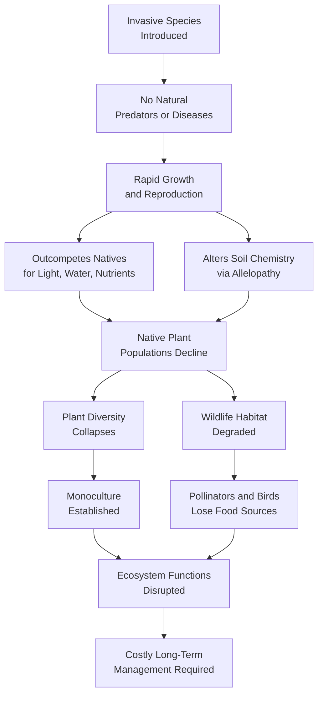
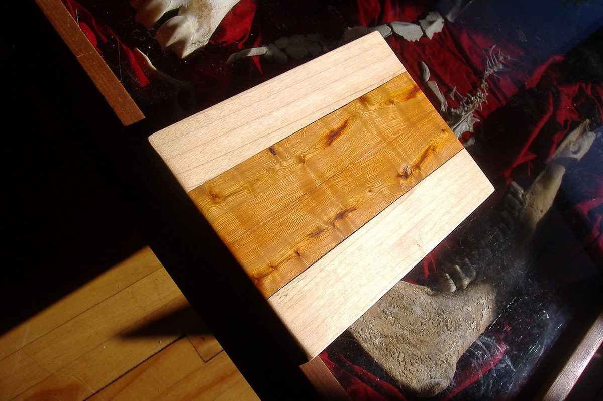
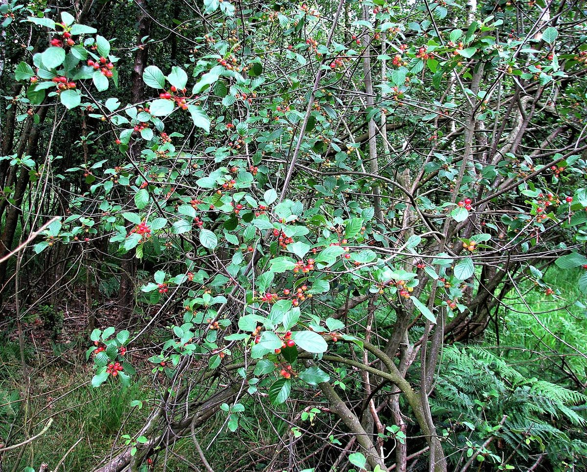
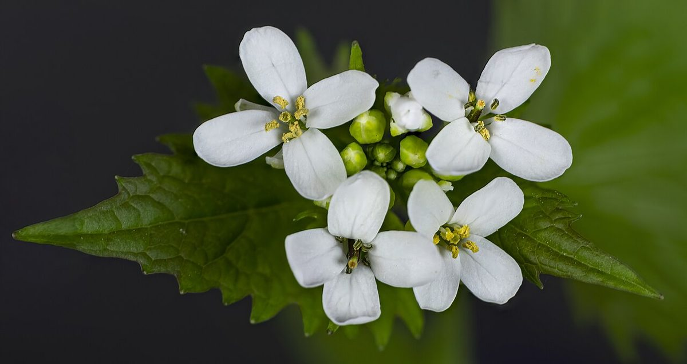
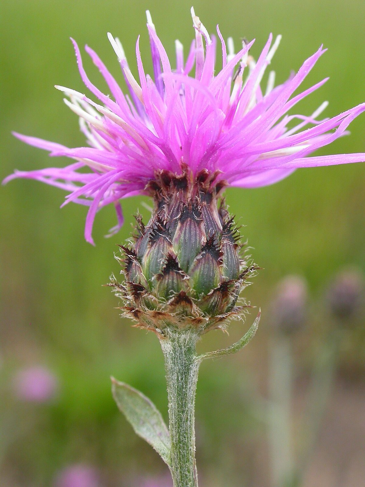
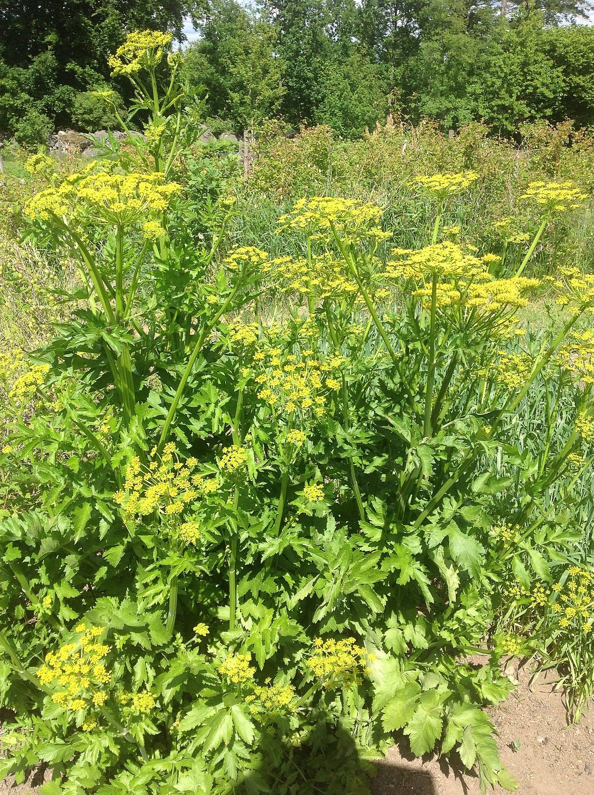
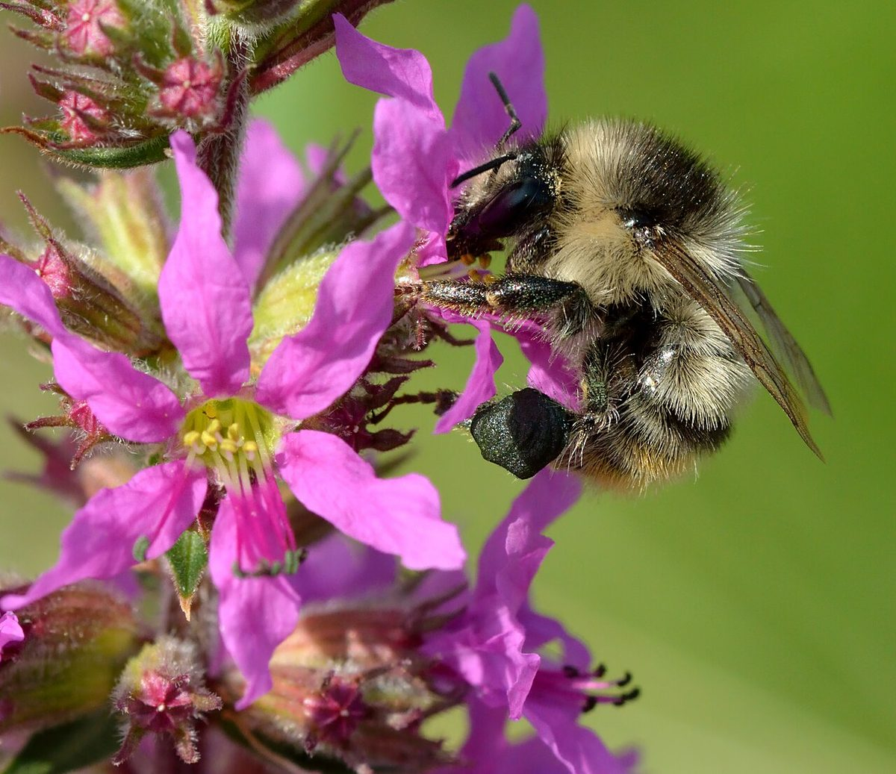
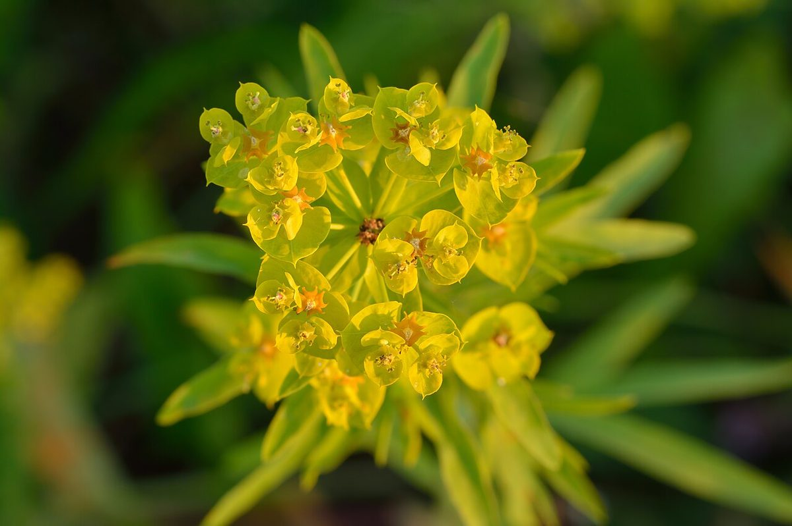
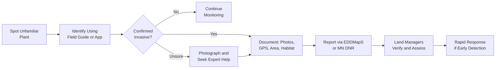

# Invasive Species Identification

!!! mascot-welcome "Know Your Enemy"
    
    Welcome back! This chapter is one of the most important in the entire course.
    Knowing how to identify invasive species is the first step toward protecting
    Minnesota's native plant communities. If you can spot an invader early, you
    can stop it before it takes over. Let's get to work.

## Summary

This chapter teaches you to identify Minnesota's most damaging invasive species in the field. You will learn what makes invasive species so destructive, how to recognize twelve of the worst offenders by their physical features, and how to report sightings to the Minnesota Department of Natural Resources (MN DNR). We also cover practical identification methods and early detection monitoring strategies that every Minnesotan can use.

## Invasive Species Impact

Before learning to identify individual species, it is important to understand the scale of the problem. Invasive species are not just a nuisance — they are one of the leading causes of biodiversity loss in Minnesota and across North America.

Invasive species cause harm in several ways:

- **Displacing native plants** by outcompeting them for light, water, and nutrients
- **Altering soil chemistry** so native plants can no longer germinate or grow
- **Reducing wildlife habitat** by replacing diverse plant communities with monocultures
- **Disrupting food webs** — many native insects and birds cannot use invasive plants for food
- **Causing economic damage** to forestry, agriculture, and property values
- **Threatening human health** — some invasive plants cause burns, rashes, or allergic reactions

In Minnesota, invasive species cost an estimated hundreds of millions of dollars per year in management, lost timber, reduced crop yields, and ecological restoration. The state lists over 100 species as invasive or potentially invasive, and new arrivals are detected regularly.

!!! mascot-warning "The Scope of the Threat"
    
    A single Common Buckthorn tree can produce thousands of seeds per year, and
    birds spread those seeds across miles of forest. Once an invasive species
    becomes established, eradication is often impossible — only long-term
    management can keep it in check. Early detection saves enormous effort.

The following diagram illustrates how invasive species displace native plant communities through a cascade of ecological impacts.

### Why Invasive Species Succeed

Invasive species thrive in Minnesota because they arrive without the insects, diseases, and herbivores that controlled their populations in their native range. Freed from these natural checks, they can grow and reproduce unchecked. Many invasive plants also share traits that give them an advantage:

- **Early leaf-out** — leafing out before native plants in spring, capturing sunlight first
- **Late leaf retention** — holding leaves longer in fall, extending their growing season
- **Prolific seed production** — producing enormous quantities of seeds
- **Rapid growth rates** — growing faster than native competitors
- **Allelopathy** — releasing chemicals that inhibit the growth of surrounding plants
- **Tolerance of disturbed soils** — thriving in roadsides, construction sites, and degraded habitats where native plants struggle

### Invasive Species at a Glance

The rest of this chapter covers Minnesota's most problematic invasive plants in detail. Here they are side by side for quick visual identification:

<a href="../../plants/common-buckthorn/" class="plant-gallery-card">
Common Buckthorn <em>Rhamnus cathartica</em>
</a>
<a href="../../plants/glossy-buckthorn/" class="plant-gallery-card">
Glossy Buckthorn <em>Frangula alnus</em>
</a>
<a href="../../plants/garlic-mustard/" class="plant-gallery-card">
Garlic Mustard <em>Alliaria petiolata</em>
</a>
<a href="../../plants/spotted-knapweed/" class="plant-gallery-card">
Spotted Knapweed <em>Centaurea stoebe</em>
</a>
<a href="../../plants/wild-parsnip/" class="plant-gallery-card">
Wild Parsnip <em>Pastinaca sativa</em>
</a>
<a href="../../plants/purple-loosestrife/" class="plant-gallery-card">
Purple Loosestrife <em>Lythrum salicaria</em>
</a>
<a href="../../plants/leafy-spurge/" class="plant-gallery-card">
Leafy Spurge <em>Euphorbia esula</em>
</a>

!!! mascot-warning "Learn before you pull"
    
    Correctly identifying an invasive species is the first step in managing it. Some native plants look similar to invasives — always verify before removing.

## Common Buckthorn

[Common Buckthorn](../../plants/common-buckthorn/) (*Rhamnus cathartica*) is arguably Minnesota's most widespread and damaging woody invasive plant. Originally from Europe, it was introduced to North America in the 1800s as a hedgerow and ornamental plant. It has since invaded woodlands, prairies, and wetland edges across the entire state.

### How to Identify Common Buckthorn

- **Size**: A tall shrub or small tree, typically 10 to 25 feet tall
- **Leaves**: Oval, finely toothed, with 3 to 5 pairs of curved veins that follow the leaf margin. Leaves are sub-opposite (nearly opposite on the stem). Buckthorn leaves stay green well into late fall, long after native species have dropped theirs
- **Bark**: Gray to brown, often with a slightly rough or peeling texture. Inner bark is yellow-orange when scraped
- **Thorns**: Small, sharp thorn at the tip of many twigs (the "thorn" in buckthorn)
- **Berries**: Clusters of small, round, black berries in late summer and fall. Each berry contains 3 to 4 seeds
- **Growth habit**: Often forms dense thickets in the understory of woodlands, creating deep shade that prevents native seedlings from establishing

### Where to Look

Common Buckthorn invades oak woodlands, forest edges, floodplains, roadsides, and even well-tended backyards. It is found in all 87 Minnesota counties.

### Why It Is Harmful

Buckthorn shades out native wildflowers and tree seedlings, reducing woodland biodiversity. Its berries have a laxative effect on birds, which spreads seeds widely while also reducing the birds' ability to absorb nutrients from other foods. Buckthorn-dominated forests lose their native ground layer — species like Bloodroot, Trillium, and Wild Ginger disappear as buckthorn takes over.

## Glossy Buckthorn

[Glossy Buckthorn](../../plants/glossy-buckthorn/) (*Frangula alnus*), also called Alder Buckthorn, is closely related to Common Buckthorn but prefers wetter habitats. It is a serious threat to Minnesota's bogs, fens, sedge meadows, and wetland edges.

### How to Identify Glossy Buckthorn

- **Size**: A shrub or small tree, typically 10 to 20 feet tall
- **Leaves**: Glossy, dark green, untoothed (smooth margins), with 6 to 9 pairs of parallel veins. Leaves are alternate on the stem — this is a key difference from Common Buckthorn
- **Bark**: Gray-brown with prominent light-colored lenticels (small raised dots)
- **Thorns**: None — Glossy Buckthorn lacks the twig-tip thorns found on Common Buckthorn
- **Berries**: Ripen in stages from red to dark purple-black, often with multiple colors present on the same branch at the same time
- **No thorns, glossy leaves, smooth leaf edges** — these three features distinguish Glossy from Common Buckthorn

### Where to Look

Glossy Buckthorn invades wetlands, bogs, fens, sedge meadows, lakeshores, and moist forest edges. It is most common in central and northern Minnesota but continues to spread.

### Why It Is Harmful

Glossy Buckthorn can transform open wetlands into dense shrub thickets, eliminating native sedges, orchids, and wetland wildflowers. Bog and fen communities are among Minnesota's most fragile and irreplaceable ecosystems.

!!! mascot-thinking "Buckthorn Quick Comparison"
    
    Confused between the two buckthorns? Remember: **Common** Buckthorn has
    **toothed** leaves, **sub-opposite** leaf arrangement, and **thorns**.
    **Glossy** Buckthorn has **smooth-edged** leaves, **alternate** leaf
    arrangement, and **no thorns**. Both have dark berries and yellow-orange
    inner bark.

## Garlic Mustard

[Garlic Mustard](../../plants/garlic-mustard/) (*Alliaria petiolata*) is a biennial herb from Europe that invades woodland understories across Minnesota. It is one of the most damaging invasive plants in deciduous forests.

### How to Identify Garlic Mustard

- **First-year plants**: Low rosettes of kidney-shaped, scalloped leaves close to the ground. Leaves remain green through winter.
- **Second-year plants**: Upright stems 1 to 4 feet tall with triangular, sharply toothed leaves. Produces small clusters of white, four-petaled flowers in spring (April through June).
- **Seed pods**: Long, narrow siliques (seed pods) that split open to release tiny black seeds
- **Garlic smell**: Crushed leaves and stems produce a distinctive garlic or onion odor — this is the single most reliable identification feature

### Where to Look

Garlic Mustard invades deciduous forests, woodland edges, floodplains, roadsides, and shaded trails. It thrives in partial to full shade with moist, rich soil.

### Why It Is Harmful

Garlic Mustard releases allelopathic compounds into the soil that disrupt the mycorrhizal fungi that native plants depend on. Without these fungal partners, native tree seedlings and wildflowers cannot absorb nutrients effectively. Dense patches of Garlic Mustard can eliminate native spring wildflowers within a few years. A single plant can produce hundreds of seeds that remain viable in the soil for up to five years.

## Spotted Knapweed

[Spotted Knapweed](../../plants/spotted-knapweed/) (*Centaurea stoebe*) is a perennial plant from Europe that aggressively invades prairies, roadsides, and open areas. It is well-established across Minnesota.

### How to Identify Spotted Knapweed

- **Size**: 1 to 4 feet tall, with wiry, branching stems
- **Leaves**: Deeply lobed, almost fern-like, grayish-green
- **Flowers**: Pink to purple, thistle-like flower heads at the tips of branches. Bloom time is July through September.
- **Bracts**: The key identification feature — the bracts (small leaf-like structures) below each flower head have dark, comb-like fringed tips that give them a "spotted" appearance
- **Root**: A deep taproot that makes mature plants difficult to pull

### Where to Look

Spotted Knapweed invades prairies, pastures, roadsides, gravel pits, trail edges, and any open, well-drained area. It is especially common along highway corridors.

### Why It Is Harmful

Spotted Knapweed releases allelopathic chemicals that suppress surrounding plants. It displaces native prairie species, reduces forage quality for livestock and wildlife, and can form dense monocultures. A single plant can produce up to 25,000 seeds.

## Wild Parsnip

[Wild Parsnip](../../plants/wild-parsnip/) (*Pastinaca sativa*) is a biennial plant from Europe that has spread aggressively along Minnesota roadsides, ditches, and prairies. It poses a direct threat to human health.

### How to Identify Wild Parsnip

- **Size**: 2 to 5 feet tall in the second (flowering) year
- **Leaves**: Compound, with 5 to 15 sharply toothed leaflets arranged along a central stalk — similar to celery leaves
- **Flowers**: Flat-topped clusters (umbels) of small yellow flowers, resembling Queen Anne's Lace in shape but yellow in color. Blooms June through July.
- **Stems**: Grooved, hollow, and sturdy
- **First-year plants**: A low rosette of compound leaves close to the ground

!!! mascot-warning "Serious Health Hazard"
    
    Wild Parsnip sap contains chemicals called furanocoumarins that cause
    **phytophotodermatitis** — severe burns and blisters when skin contacts the
    sap and is then exposed to sunlight. Always wear long sleeves, gloves, and
    eye protection when working near Wild Parsnip. If sap contacts your skin,
    wash immediately and avoid sun exposure on that area.

### Where to Look

Wild Parsnip is extremely common along roadsides, highway medians, ditches, and field edges. It is found in nearly every Minnesota county and is still spreading.

### Why It Is Harmful

Beyond the burn hazard to humans, Wild Parsnip displaces native roadside and prairie plants. Its dense stands crowd out native wildflowers and grasses. The burn risk also limits outdoor recreation and land management activities in infested areas.

## Purple Loosestrife

[Purple Loosestrife](../../plants/purple-loosestrife/) (*Lythrum salicaria*) is a perennial wetland plant from Europe that has devastated Minnesota's marshes, lakeshores, and river corridors.

### How to Identify Purple Loosestrife

- **Size**: 3 to 7 feet tall, with multiple erect stems from a single rootstock
- **Leaves**: Lance-shaped, opposite or whorled, stalkless (clasping the stem directly)
- **Flowers**: Showy spikes of magenta-purple flowers with 5 to 7 petals each. Blooms July through September. The tall purple flower spikes are highly visible and distinctive.
- **Stems**: Square or slightly ridged in cross-section, often woody at the base
- **Root**: A massive, woody rootstock that can be extremely difficult to remove

### Where to Look

Purple Loosestrife invades marshes, wet meadows, lakeshores, river banks, ditches, and any wetland edge. It is found across Minnesota.

### Why It Is Harmful

Purple Loosestrife forms dense, monotypic stands that replace native cattails, sedges, and wetland wildflowers. A single mature plant can produce over two million seeds per year. The loss of native wetland vegetation destroys nesting habitat for waterfowl and marsh birds, and reduces food sources for wildlife. Biological control using specialized leaf-feeding beetles (*Galerucella* species) has been partially successful in Minnesota, but Purple Loosestrife remains a serious problem.

## Reed Canary Grass

[Reed Canary Grass](../../plants/reed-canary-grass/) (*Phalaris arundinacea*) is a perennial grass that dominates wetlands, floodplains, and shorelines across Minnesota. While a native form exists in North America, the aggressive invasive strains are of European origin and are the ones causing widespread ecological damage.

### How to Identify Reed Canary Grass

- **Size**: 2 to 6 feet tall, forming dense, extensive stands
- **Leaves**: Flat, broad grass blades (up to 3/4 inch wide), blue-green to medium green, with rough edges
- **Stems**: Stout, hollow, smooth, with prominent nodes
- **Seed head**: A compact, branching panicle that starts green-purple and turns tan as seeds ripen. Blooms June through July.
- **Growth habit**: Spreads aggressively by thick, horizontal rhizomes (underground stems), forming impenetrable monocultures

### Where to Look

Reed Canary Grass invades wet meadows, shorelines, stream banks, ditches, floodplains, and stormwater ponds. It tolerates both standing water and dry periods.

### Why It Is Harmful

Reed Canary Grass is one of the most difficult invasive species to control. Its dense stands exclude nearly all other vegetation, converting diverse wetlands into single-species grasslands. It alters hydrology by trapping sediment, and its dense root mat prevents native seeds from reaching the soil. Wetland restorations frequently fail because Reed Canary Grass recolonizes faster than native plantings can establish.

## Leafy Spurge

[Leafy Spurge](../../plants/leafy-spurge/) (*Euphorbia esula*) is a deep-rooted perennial from Eurasia that has invaded prairies and grasslands, particularly in western and northwestern Minnesota.

### How to Identify Leafy Spurge

- **Size**: 1 to 3 feet tall, with smooth, upright stems
- **Leaves**: Narrow, linear, alternate, blue-green, about 1 to 4 inches long
- **Flowers**: Small, inconspicuous true flowers surrounded by showy, yellowish-green, heart-shaped bracts that are often mistaken for petals. Blooms May through July.
- **Milky sap**: All parts of the plant exude a white, milky latex when broken — this is a key identification feature
- **Root system**: Extremely deep and extensive, sometimes reaching 15 feet or more, with numerous lateral buds that can sprout new plants

### Where to Look

Leafy Spurge invades prairies, rangeland, roadsides, riverbanks, and open woodlands. It is most problematic in western and northwestern Minnesota but is found across the state.

### Why It Is Harmful

Leafy Spurge displaces native prairie plants and reduces rangeland productivity. Cattle will not graze in infested areas because the milky sap irritates their mouths and digestive tracts. Its deep, extensive root system makes it nearly impossible to eradicate by pulling or mowing. Biological control using flea beetles (*Aphthona* species) has shown success in some areas of Minnesota.

## European Earthworms

European Earthworms (multiple species, including *Lumbricus terrestris* and *Dendrobaena octaedra*) may seem like a surprising entry on an invasive species list. Most people consider earthworms beneficial — but in Minnesota's northern hardwood forests, they are causing serious ecological damage.

### Understanding the Problem

Minnesota's northern forests evolved without earthworms. Glaciers eliminated native earthworms roughly 10,000 years ago, and native forests developed in their absence. The thick, spongy layer of decomposing leaves (called the "duff layer") on the forest floor is essential habitat for native plants, insects, salamanders, and ground-nesting birds.

European Earthworms — introduced through fishing bait, landscaping soil, and compost — rapidly consume this duff layer, fundamentally changing forest soil structure.

### How to Identify the Problem

You will not typically identify individual earthworm species in the field. Instead, look for signs of earthworm invasion in forests:

- **Missing duff layer** — bare mineral soil visible on the forest floor instead of thick leaf litter
- **Middens** — small mounds of earthworm castings (pelletized soil) on the surface
- **Loss of native wildflowers** — species like Large-flowered Trillium, Wild Ginger, and Solomon's Seal decline as the duff layer disappears
- **Simplified understory** — fewer plant species, more bare ground, increased dominance of Pennsylvania Sedge

### Why They Are Harmful

European Earthworms consume the duff layer that native plants need to germinate and grow. They change soil chemistry, increase compaction, and expose tree roots. Research in Minnesota's northern forests has shown dramatic declines in native plant diversity and abundance in earthworm-invaded areas. Unfortunately, there is no practical method for removing earthworms from forests once they are established.

!!! mascot-warning "Dump Bait Responsibly"
    
    If you fish, never dump unused bait worms on the ground or in the water.
    Dispose of them in the trash. This simple act can prevent earthworm
    invasions in forests that have not yet been affected. It is also the law
    in Minnesota.

## Emerald Ash Borer

[Emerald Ash Borer](../../plants/emerald-ash-borer/) (*Agrilus planipennis*), commonly called EAB, is an invasive beetle from Asia that has devastated ash tree populations across Minnesota and the eastern United States. While it is an insect rather than a plant, EAB belongs in this chapter because of its catastrophic impact on Minnesota's native forests.

### How to Identify Emerald Ash Borer

- **Adult beetle**: Small (about 1/2 inch long), narrow, metallic green. Adults are active June through August but are rarely seen.
- **D-shaped exit holes**: The most reliable field sign — small, D-shaped holes (about 1/8 inch wide) in ash tree bark where adult beetles have emerged
- **S-shaped galleries**: Serpentine, S-shaped feeding tunnels under the bark, created by larvae
- **Bark splitting**: Vertical bark splits over larval galleries
- **Canopy dieback**: Thinning leaves, starting at the top of the tree and progressing downward
- **Epicormic sprouting**: New branches growing from the trunk, a stress response by the dying tree
- **Woodpecker activity**: Increased woodpecker damage as birds feed on larvae under the bark

### Where to Look

EAB attacks all native ash species — [Green Ash](../../plants/green-ash/) (*Fraxinus pennsylvanica*), [White Ash](../../plants/white-ash/) (*Fraxinus americana*), and [Black Ash](../../plants/black-ash/) (*Fraxinus nigra*). It has been confirmed in dozens of Minnesota counties and continues to spread.

### Why It Is Harmful

EAB larvae feed under the bark of ash trees, destroying the tissues that transport water and nutrients. Infested trees typically die within 3 to 5 years. Minnesota has an estimated one billion ash trees, and EAB threatens every one of them. Black Ash is particularly important to northern wetland forests and to Ojibwe communities who use it for basket-making. The loss of Black Ash could transform the hydrology of entire wetland landscapes.

## Japanese Barberry

[Japanese Barberry](../../plants/japanese-barberry/) (*Berberis thunbergii*) is an ornamental shrub from Japan that is still widely sold in nurseries despite its invasive potential. It is an increasing problem in Minnesota's woodlands and forest edges.

### How to Identify Japanese Barberry

- **Size**: A dense, arching shrub, typically 2 to 6 feet tall
- **Leaves**: Small (about 1/2 to 1 inch), spoon-shaped, smooth-edged, clustered in rosettes along the stems. Some cultivated varieties have purple or red foliage.
- **Thorns**: Sharp, single spines at each leaf node — very noticeable when handling the plant
- **Flowers**: Small, pale yellow, drooping flowers in spring
- **Berries**: Bright red, oblong berries that persist through winter
- **Growth habit**: Dense, mounded form with arching branches that root where they touch the ground

### Where to Look

Japanese Barberry escapes from landscaping into woodlands, forest edges, roadsides, and disturbed areas. It tolerates deep shade, making it a threat to forest understories.

### Why It Is Harmful

Japanese Barberry forms dense thickets that displace native shrubs and wildflowers. Its dense growth creates humid microhabitats that favor blacklegged ticks (deer ticks), potentially increasing tick-borne disease risk. Research in the eastern United States has shown significantly higher tick densities in barberry-infested forests compared to forests with native understory plants.

## Invasive ID Methods

Identifying invasive species in the field becomes easier with practice and the right approach. Here are practical methods anyone can use.

### Visual Identification

The most common method. Learn to recognize key features:

- **Leaf shape and arrangement** — opposite vs. alternate, toothed vs. smooth
- **Flower structure and color** — petal count, bloom time, cluster shape
- **Bark and stem features** — thorns, color, texture, inner bark color
- **Fruits and seeds** — berry color, seed pod shape, timing
- **Growth habit** — single stem vs. multi-stemmed, upright vs. arching, height

### Seasonal Timing

Many invasive species are easier to identify at certain times of year:

- **Spring**: Garlic Mustard rosettes and flowering plants, Buckthorn leafing out early before native shrubs
- **Summer**: Wild Parsnip and Spotted Knapweed in bloom, Purple Loosestrife flowering in wetlands
- **Fall**: Buckthorn holding green leaves after native plants have gone dormant
- **Winter**: Buckthorn retains some green leaves, Japanese Barberry retains red berries, Reed Canary Grass forms tan stands in wetlands

### Plant Identification Apps

Smartphone apps can be helpful starting tools, though they should not be your only method:

- **iNaturalist** — combines photo identification with community verification
- **Google Lens** — quick visual identification, useful for initial leads
- **Minnesota Wildflowers** (minnesotawildflowers.info) — an outstanding website with detailed photos and descriptions of both native and invasive species

### Field Guides

Printed field guides remain valuable for learning invasive species identification:

- Minnesota DNR invasive species field guides (available free online and in print)
- Regional wildflower and weed identification guides specific to the upper Midwest

!!! mascot-tip "Build Your Skills Gradually"
    
    Start by learning to identify just three or four of the most common invasives
    in your area — Buckthorn, Garlic Mustard, and Wild Parsnip are good ones
    to learn first. Once you can spot these confidently, add more species to
    your mental list. Field identification is a skill that improves with
    practice, not memorization.

Test your knowledge of Minnesota's invasive species with these interactive flashcards.

<iframe src="../../sims/invasive-species-flashcards/main.html" width="100%" height="500px" scrolling="no"></iframe>

Invasive Species Flashcards MicroSim

Type: microsim

**Learning Objective:** Students will be able to recognize Minnesota's most common invasive species by their key identifying features and understand why each is harmful.

**Controls:**

- Flip button to reveal the identification features on the back of each card
- Next/Previous buttons to cycle through species cards
- Shuffle button to randomize card order
- Category filter to focus on woody plants, herbaceous plants, or insects

**Visual Elements:**

- Front of card shows the species common name and a representative illustration
- Back of card lists key ID features, look-alike species, habitat, and why it is harmful
- Progress indicator showing how many cards have been reviewed
- A score tracker for self-assessment (know it / still learning)

**Behavior:**

- Clicking the card or pressing the flip button reveals identification details
- Cards marked "still learning" appear more frequently when shuffled
- Completing all cards displays a summary of which species need more review

**Instructional Rationale:**
Spaced repetition through flashcards builds rapid recall of invasive species features, which is essential for field identification where quick recognition prevents invasives from going unnoticed.

## Reporting Invasive Species

When you find an invasive species, reporting it to the proper authorities is one of the most valuable things you can do. Early reports of new infestations can trigger rapid response efforts that prevent small populations from becoming unmanageable.

The following diagram shows the process from first spotting an invasive species through reporting and response.

### How to Report to the MN DNR

The Minnesota Department of Natural Resources maintains a formal system for invasive species reports:

- **EDDMapS (Early Detection and Distribution Mapping System)** — The primary reporting tool. Visit eddmaps.org/midwest to submit reports online. You can also use the EDDMapS app on your smartphone to report sightings with GPS coordinates and photos directly from the field.
- **MN DNR Invasive Species Program** — Contact the DNR directly through their website at dnr.state.mn.us or call the invasive species reporting line. Staff can help verify identifications and coordinate response efforts.
- **Report a Sighting form** — The MN DNR website has a dedicated reporting form for terrestrial and aquatic invasive species.

### What to Include in a Report

A useful invasive species report includes:

- **Location** — GPS coordinates are ideal, but a detailed description of the site (nearest intersection, park name, trail marker) is also helpful
- **Photos** — Clear photos of the whole plant, leaves, flowers or fruits, and stems. Include something for scale (a coin, your hand, a ruler).
- **Date and time** of the observation
- **Estimated area** of the infestation — is it a single plant, a small patch, or a large stand?
- **Habitat description** — woodland, wetland, roadside, prairie, urban lot
- **Your contact information** — so managers can follow up with questions

### County and Local Reporting

Many Minnesota counties have their own invasive species programs and Cooperative Weed Management Areas (CWMAs). Local land managers, park staff, and county agricultural inspectors are often the first responders for new infestations. Check with your county's environmental services department.

### Citizen Science Programs

Several organized programs train volunteers to identify and report invasive species:

- **Minnesota Master Naturalist** — trains volunteers in natural resource education and monitoring
- **Invasive Species Action Network** — coordinates volunteer removal events across the state
- **Great Lakes Worm Watch** — specifically focused on documenting earthworm invasions in northern forests

## Early Detection Monitoring

Early detection is the most cost-effective strategy for managing invasive species. Finding a new infestation when it consists of a few plants is far easier and cheaper than managing it after it covers acres of land.

### What Is Early Detection Monitoring?

Early detection monitoring is the systematic, ongoing observation of natural areas to find new invasive species before they become established. It does not require expensive equipment or advanced training — just regular visits, careful observation, and the ability to recognize common invasive species.

### Where to Monitor

Focus monitoring efforts on areas where new invasive species are most likely to appear:

- **Trailheads and trail edges** — seeds travel on boots, tires, and equipment
- **Roadsides and highway corridors** — major pathways for invasive species spread
- **Construction and disturbance sites** — exposed soil is prime habitat for invaders
- **Waterways and shorelines** — water carries seeds and plant fragments downstream
- **Property boundaries** — invasive species frequently spread from neighboring land
- **Recently restored areas** — restoration sites are vulnerable during the establishment period

### How to Monitor

Effective monitoring follows a few basic principles:

- **Walk regularly** — visit the same areas multiple times per year, across different seasons
- **Look for what doesn't belong** — plants that look different from the surrounding native vegetation
- **Learn the "usual suspects"** — knowing the most common invasive species in your area makes unfamiliar species stand out
- **Document what you find** — date, location, photos, and species (or best guess)
- **Report promptly** — early reports give managers the best chance of rapid response

### Rapid Response

When a new invasive species is detected early, land managers can often eradicate it before it spreads. Rapid response typically involves:

- **Confirming the identification** with experts
- **Assessing the extent** of the infestation
- **Removing or treating** the plants using appropriate methods (hand-pulling, cutting, herbicide)
- **Monitoring the site** for several years to catch any regrowth from seeds or root fragments

The MN DNR coordinates rapid response efforts for priority invasive species. Your early detection report could be the trigger that saves a natural area.

!!! mascot-celebration "You Are Part of the Solution"
    
    Every person who learns to identify invasive species and report sightings
    becomes part of Minnesota's early warning network. You don't need to be a
    biologist — you just need to pay attention, learn a few key species, and
    share what you find. Together, we can protect the native plants and
    ecosystems that make Minnesota special.

## Chapter Summary

In this chapter, you learned:

- **Invasive species** displace native plants, alter ecosystems, and cause economic and health damage across Minnesota
- **Common Buckthorn** has toothed, sub-opposite leaves, thorns, and black berries, and invades woodlands statewide
- **Glossy Buckthorn** has smooth-edged, alternate leaves, no thorns, and invades wetlands
- **Garlic Mustard** is identified by its garlic smell, white four-petaled flowers, and ability to destroy mycorrhizal fungi in forest soils
- **Spotted Knapweed** has pink-purple flowers with dark-fringed bracts and invades prairies and roadsides
- **Wild Parsnip** has yellow flower umbels and sap that causes severe burns — always wear protective clothing
- **Purple Loosestrife** produces showy magenta flower spikes in wetlands and can release millions of seeds per plant
- **Reed Canary Grass** forms impenetrable monocultures in wetlands and is one of the hardest invasives to control
- **Leafy Spurge** has milky white sap, yellowish-green bracts, and extremely deep roots
- **European Earthworms** destroy the forest duff layer that native plants depend on — never dump fishing bait
- **Emerald Ash Borer** kills ash trees and is identified by D-shaped exit holes and canopy dieback
- **Japanese Barberry** escapes from landscaping and increases tick habitat in forests
- **Field identification** improves with practice using visual features, seasonal timing, apps, and field guides
- **Reporting** sightings to the MN DNR through EDDMapS or the DNR invasive species program is critical
- **Early detection monitoring** is the most effective and affordable invasive species strategy

## Concepts Covered

This chapter covers the following 15 concepts from the learning graph:

1. Invasive Species Impact
2. Common Buckthorn
3. Glossy Buckthorn
4. Garlic Mustard
5. Spotted Knapweed
6. Wild Parsnip
7. Purple Loosestrife
8. Reed Canary Grass
9. Leafy Spurge
10. European Earthworms
11. Emerald Ash Borer
12. Japanese Barberry
13. Invasive ID Methods
14. Reporting Invasive Species
15. Early Detection Monitoring

## Prerequisites

Before reading this chapter, you should have completed:

- **Chapter 1: Introduction to Native Plants and Ecology** — for foundational concepts including the definitions of native, non-native, and invasive species, basic plant identification, and ecosystem fundamentals
- **Chapter 7: Wetlands and Aquatic Plants** — for understanding the wetland habitats where several invasive species in this chapter (Purple Loosestrife, Glossy Buckthorn, Reed Canary Grass) cause their greatest damage

## What's Next

In Chapter 9, we will move from identifying invasive species to taking action against them — learning practical strategies for invasive species removal, habitat restoration, and long-term land management that supports native plant communities.

[See Annotated References](./references.md)
