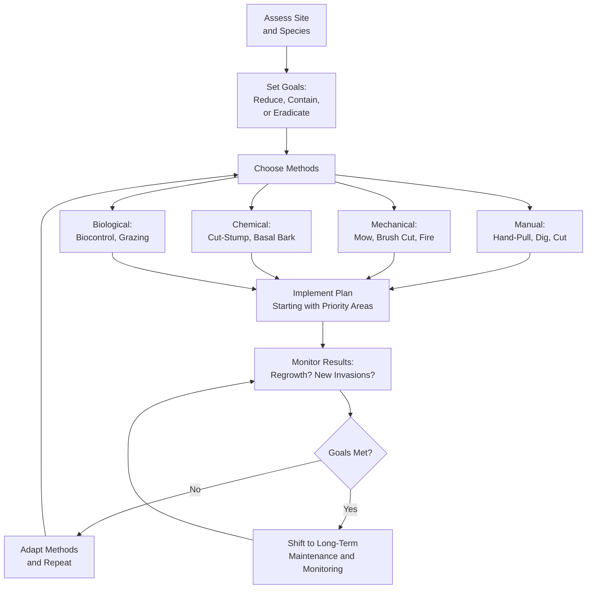
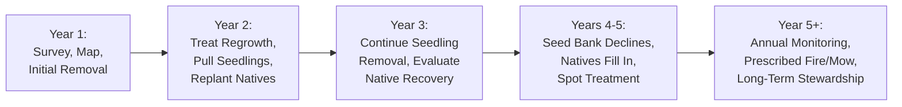

# Invasive Species Removal and Management

!!! mascot-welcome "Time to Take Action!"
    
    Now that you can identify Minnesota's most troublesome invasive species, it's
    time to learn how to fight back. In this chapter, we'll cover practical removal
    strategies, from pulling garlic mustard by hand to managing multi-year buckthorn
    battles. Fair warning: this work takes patience, persistence, and a good plan.

## Summary

This chapter moves from identification to action. You will learn the major approaches to invasive species removal — manual, mechanical, chemical, and biological — and how to combine them into an integrated management plan. We give special attention to buckthorn, Minnesota's most widespread woody invader, including the challenge of its persistent seed bank. You will also learn about proper timing, follow-up monitoring, preventing re-invasion, and restoring sites after removal. The central message of this chapter is that successful invasive removal is a multi-year commitment, not a one-time event.

## Removal Strategy Overview

Before you grab a shovel or a bottle of herbicide, step back and think strategically. Effective invasive removal starts with assessment, not action.

A good removal strategy answers these questions:

- **What species are you dealing with?** Different invaders require different approaches.
- **How large is the infestation?** A handful of garlic mustard plants calls for a different plan than a five-acre buckthorn thicket.
- **What is the site like?** Slopes, wetlands, and areas near water require extra care.
- **What resources do you have?** Budget, labor, equipment, and time all shape your plan.
- **What is your end goal?** Are you restoring a prairie, protecting a woodland, or maintaining a garden?

The four main categories of removal are manual, mechanical, chemical, and biological. Most effective plans combine two or more of these methods — a principle called integrated pest management. No single approach works for every species or every site.

!!! mascot-thinking "Key Insight"
    
    Think of invasive removal like treating a chronic condition, not performing
    emergency surgery. Quick fixes rarely work. The most successful projects are
    the ones that plan for years of follow-up from the very beginning.

### Prioritizing Your Efforts

Not all invasions can be tackled at once. Prioritize based on:

- **Ecological value of the site** — Protect your best remaining native areas first
- **Stage of invasion** — Small, early infestations are far easier and cheaper to control than established ones
- **Feasibility** — Can you realistically manage this site with the resources you have?
- **Species aggressiveness** — Some invaders spread faster than others and need urgent attention

A common and effective approach is to start at the edges of an infestation and work inward, or to protect high-quality areas first and then expand your efforts outward.

Use the interactive tool below to input your site conditions and receive a recommended removal approach.

<iframe src="../../sims/removal-strategy-selector/main.html" width="100%" height="500px" scrolling="no"></iframe>

Removal Strategy Selector MicroSim

Type: microsim

**Learning Objective:** Students will understand how site conditions, species identity, and available resources determine which combination of removal methods is most appropriate.

**Controls:**

- Dropdown for target invasive species (Buckthorn, Garlic Mustard, Wild Parsnip, Purple Loosestrife, Reed Canary Grass, Spotted Knapweed)
- Dropdown for infestation size (a few plants, small patch, large area covering an acre or more)
- Dropdown for site type (prairie, woodland, wetland, shoreline, residential yard)
- Checkbox for proximity to water
- Checkbox for whether herbicide use is acceptable
- Submit button to generate recommendation

**Visual Elements:**

- A results panel displaying the recommended removal strategy with primary and secondary methods
- A timeline bar showing the recommended multi-year treatment schedule
- Icons indicating which tools and safety equipment are needed
- A difficulty rating (low, moderate, high) for the recommended approach

**Behavior:**

- Selecting different combinations of inputs produces tailored removal strategies
- Water proximity automatically restricts chemical options and flags manual alternatives
- The timeline adjusts based on species and infestation size, showing expected years of follow-up
- Hovering over each recommended method reveals a brief description of the technique

**Instructional Rationale:**
Matching removal methods to real-world conditions teaches students to think strategically rather than defaulting to a single approach. This mirrors the integrated pest management decision-making process used by professional land managers.

## Manual Removal Methods

Manual removal means using your hands and simple tools to physically remove invasive plants. It is the oldest, simplest, and often the most appropriate method for small infestations and sensitive sites.

### Hand-Pulling

Hand-pulling works best for:

- Small plants with shallow root systems
- Seedlings of woody invaders like buckthorn
- Herbaceous invaders like garlic mustard
- Areas near water where chemicals are restricted

**Technique matters.** Pull slowly and steadily, gripping the plant as close to the ground as possible. Pull when the soil is moist — after rain is ideal — so roots come out more completely. Shake off excess soil and pile plants where they won't re-root.

### Digging

For plants with deeper roots or taproots, use a garden fork, spade, or specialized weed wrench. The goal is to remove as much of the root system as possible. Many invasive plants can resprout from root fragments left in the soil.

### Cutting and Girdling

- **Cutting** — Use loppers, hand saws, or pruning shears to cut woody stems at ground level. Cutting alone is rarely sufficient because most woody invaders will resprout vigorously from the stump.
- **Girdling** — Removing a ring of bark around a tree's trunk to kill it slowly. This works for larger trees but takes time and does not prevent seed production during the dying process.

### Advantages of Manual Removal

- No chemicals involved — safe near water, gardens, and children
- Minimal disturbance to surrounding native plants
- Low cost (mostly labor)
- Can target individual plants precisely

### Limitations

- Extremely labor-intensive for large areas
- Ineffective against plants with extensive underground root systems (e.g., Canada thistle)
- Soil disturbance from pulling and digging can stimulate dormant weed seeds

## Mechanical Removal Methods

Mechanical removal uses powered equipment to clear invasive plants over larger areas. It bridges the gap between hand removal and chemical treatment.

### Common Mechanical Methods

- **Mowing** — Repeated mowing can weaken some invasive species by depleting their root reserves. Effective against herbaceous invaders in open areas, but timing and frequency matter.
- **Brush cutting** — Gas-powered brush cutters and clearing saws can handle dense stands of woody invaders that are too thick for hand tools.
- **Forestry mowing** — Specialized tracked equipment can mulch entire stands of buckthorn and other woody invaders. Useful for large-scale projects.
- **Prescribed fire** — While technically a management tool rather than mechanical removal, fire is one of the most powerful tools for maintaining prairies and savannas. Many native prairie plants evolved with fire and thrive after burns, while many invasives do not.

### When Mechanical Methods Make Sense

- Large infestations covering an acre or more
- Dense woody thickets that are impractical to remove by hand
- Sites where repeated treatment is needed to exhaust root reserves
- Prairie and savanna restoration where prescribed fire is appropriate

### Limitations

- Equipment can damage soil structure and compact wet soils
- Mowing and cutting do not kill roots — regrowth is common
- Forestry mowing creates large amounts of mulch that can smother native seedlings if too thick
- Prescribed fire requires training, permits, and careful planning

## Chemical Control Methods

Herbicides are sometimes necessary for managing invasive species, especially large-scale infestations and species that resprout aggressively from roots.

!!! mascot-warning "Use Chemicals Carefully"
    
    Herbicides are powerful tools, but they are not magic bullets. Misuse can
    damage native plants, harm pollinators, and contaminate water. Always read
    the label, follow all directions, and consider whether a non-chemical
    approach might work for your situation.

### Common Herbicide Methods

- **Cut-stump treatment** — Cut a woody plant at ground level, then immediately apply herbicide (typically triclopyr or glyphosate) to the freshly cut stump surface. This is one of the most effective and targeted methods for woody invaders like buckthorn.
- **Basal bark treatment** — Apply oil-based herbicide to the bark of thin-stemmed woody plants (less than 6 inches in diameter). The herbicide penetrates the bark and kills the plant. Can be done year-round.
- **Foliar spray** — Spray herbicide on the leaves of actively growing plants. Effective but less targeted — overspray can damage nearby native plants.
- **Hack-and-squirt** — Make downward cuts into the bark of a standing tree and apply herbicide into the cuts. Useful for large trees that you want to kill in place.

### Key Principles for Chemical Control

- **Read the label.** The label is the law. It specifies which plants, application rates, safety precautions, and environmental restrictions apply.
- **Use the most targeted method possible.** Cut-stump and basal bark treatments affect only the treated plant. Foliar sprays carry drift risk.
- **Time applications carefully.** Late summer and fall applications are often most effective for woody plants, when they are transporting nutrients to their roots.
- **Minimize non-target impacts.** Avoid spraying on windy days, near water, or when pollinators are active.

## Biological Control Methods

Biological control uses living organisms — insects, pathogens, or grazing animals — to suppress invasive species. It's the approach that most closely mimics natural ecosystem processes.

### Classical Biological Control

Researchers identify natural enemies of an invasive species in its home range, test them extensively to ensure they won't harm native species, and then release them in the invaded region. This process takes years of research and regulatory approval.

**Minnesota success story:** Galerucella beetles were introduced to control purple loosestrife in Minnesota wetlands. After years of careful testing and release, these beetles have dramatically reduced purple loosestrife populations across the state, allowing native wetland plants to recover.

### Targeted Grazing

Goats and sheep will eat many invasive plants that cattle avoid. Targeted grazing can be effective for managing:

- Buckthorn seedlings and resprouts
- Leafy spurge
- Dense herbaceous invasives

Grazing does not eliminate invasive species, but it can weaken them and reduce their competitive advantage over natives.

### Limitations of Biological Control

- Classical biocontrol takes years of research and is only available for a few species
- Biocontrol agents reduce invasive populations but rarely eliminate them
- Grazing animals are not selective enough to remove only target species
- Not every invasive species has a viable biocontrol agent

## Integrated Pest Management

Integrated Pest Management (IPM) combines multiple control methods into a coordinated strategy tailored to the specific site and species. It is the gold standard for invasive species management.

The following diagram shows the Integrated Pest Management cycle, from initial assessment through adaptive follow-up.

An IPM approach follows these steps:

1. **Assess** — Survey the site, identify the species, and determine the extent of the infestation
2. **Set goals** — Define realistic outcomes (reduction, containment, or eradication)
3. **Choose methods** — Select the combination of manual, mechanical, chemical, and biological methods that best fits the site
4. **Implement** — Carry out the plan, starting with the highest-priority areas
5. **Monitor** — Track results and check for regrowth or new invasions
6. **Adapt** — Adjust your methods based on what's working and what isn't

The key insight of IPM is that no single method is sufficient. A typical IPM plan for a buckthorn-infested woodland might include forestry mowing to remove the bulk of the plants, cut-stump herbicide treatment to prevent regrowth, hand-pulling of seedlings over subsequent years, and seeding native species to fill the gaps.

## Buckthorn Removal Challenges

Common buckthorn (*Rhamnus cathartica*) and glossy buckthorn (*Frangula alnus*) are Minnesota's most widespread and damaging woody invasive species. They deserve special attention because removing them is uniquely difficult.

### Why Buckthorn Is So Hard to Remove

- **Prolific seed production** — A mature buckthorn can produce thousands of berries per year, each containing seeds that remain viable in the soil for years
- **Aggressive resprouting** — Cut a buckthorn and it sends up multiple new stems from the stump, often growing back denser than before
- **Shade tolerance** — Unlike many invaders, buckthorn thrives in deep shade, allowing it to invade intact woodlands
- **Extended growing season** — Buckthorn leafs out before native trees in spring and holds its leaves after native trees drop theirs in fall, giving it a competitive advantage
- **Bird dispersal** — Birds eat buckthorn berries and spread seeds widely, often into the best remaining natural areas

!!! mascot-warning "The Buckthorn Trap"
    
    Here's the painful truth: if you cut buckthorn without treating the stumps,
    you will often make the problem worse. Each cut stump can send up five to
    ten new stems. Cutting without follow-up treatment is one of the most common
    and costly mistakes in invasive management.

### Effective Buckthorn Removal Approaches

The most effective strategy combines methods:

1. **Cut** large stems with a saw or brush cutter
2. **Treat** every cut stump immediately with herbicide (triclopyr or glyphosate)
3. **Return** the following year to pull or treat seedlings
4. **Repeat** seedling removal for three to five years until the seed bank is exhausted
5. **Replant** with native species to fill the ecological gaps buckthorn leaves behind

For large infestations, forestry mowing followed by herbicide treatment of regrowth is often the most practical first step.

## Buckthorn Seed Bank

Even after every adult buckthorn is removed from a site, the battle is far from over. Buckthorn seeds persist in the soil for several years, creating a "seed bank" that will continue producing new seedlings long after the parent plants are gone.

### Understanding the Seed Bank

- Buckthorn seeds can remain viable in the soil for **up to five years or more**
- A heavily infested site may have **hundreds of seeds per square meter** in the soil
- Seeds germinate readily in disturbed soil and in the increased light conditions that follow removal of the canopy
- The seed bank is the primary reason that one-time removal efforts fail

### Managing the Seed Bank

- **Plan for at least three to five years of follow-up** after initial removal
- **Monitor regularly** — check the site at least twice per year (spring and late summer) for new seedlings
- **Pull seedlings early** — first-year buckthorn seedlings are easy to hand-pull when the soil is moist
- **Minimize soil disturbance** — disturbed soil exposes buried seeds to light and stimulates germination
- **Establish native cover** — dense native plantings compete with buckthorn seedlings for light and resources

The seed bank is why invasive removal is a multi-year commitment. Anyone who tells you that buckthorn can be dealt with in a single season is either mistaken or selling something.

## Garlic Mustard Removal

Garlic mustard (*Alliaria petiolata*) is a biennial herb that invades woodlands and forest edges across Minnesota. While less visually dramatic than buckthorn, garlic mustard is insidious because it releases chemicals into the soil (a process called allelopathy) that inhibit native plant growth and disrupt the soil fungi that native trees depend on.

### Life Cycle and Timing

Understanding garlic mustard's two-year life cycle is essential for effective removal:

- **Year 1 (rosette stage)** — Low-growing cluster of rounded, scalloped leaves close to the ground. Plants overwinter in this form.
- **Year 2 (flowering stage)** — Plants bolt upward, producing small white flowers in spring, followed by long thin seed pods. Each plant can produce hundreds of seeds. Plants die after setting seed.

### Removal Methods

- **Hand-pulling** is the most effective method for small to moderate infestations. Pull second-year plants in spring before they set seed. Grasp at the base and pull gently to remove the entire root.
- **Bag and remove** all pulled plants from the site. Garlic mustard can continue to ripen seeds even after being pulled.
- **Cut flower stalks** if pulling is not possible. Cut at ground level before seed pods mature.
- **Herbicide** (glyphosate) can be applied to rosettes in fall or early spring when native plants are dormant, reducing non-target damage.

### Persistence Required

Like buckthorn, garlic mustard has a seed bank that requires multiple years of removal. Plan to return to the same site for at least **four to six years** to exhaust the seed supply. Many land managers report that consistent annual pulling gradually reduces garlic mustard populations, but skipping even a single year can undo several years of progress.

## Removal Timing

When you remove invasive species matters as much as how you remove them. Poorly timed efforts can waste labor, spread seeds, or even make infestations worse.

### General Timing Principles

- **Remove before seed set.** This is the single most important timing rule. If an invasive plant produces seeds before you remove it, you've added to the seed bank instead of reducing it.
- **Pull and dig when soil is moist.** Roots come out more completely in moist soil, reducing the chance of regrowth from root fragments.
- **Apply herbicide to stumps immediately after cutting.** Delays of even a few hours reduce effectiveness as the cut surface begins to seal.
- **Fall is often the best season for woody plant removal.** Cut-stump herbicide treatment is most effective in late summer and fall when plants are moving carbohydrates to their roots.

### Species-Specific Timing

- **Garlic mustard** — Pull in spring (April-May) before seed pods mature
- **Buckthorn** — Cut and treat stumps in late summer through fall; pull seedlings in spring
- **Wild parsnip** — Cut root below the crown in spring before flowering (wear protective clothing to avoid sap burns)
- **Purple loosestrife** — Pull or cut before seeds mature in late summer
- **Spotted knapweed** — Pull or cut in early summer before flowers open

## Follow-Up Monitoring

Removal without monitoring is like planting a garden and never weeding it again. Follow-up monitoring is what separates successful projects from expensive failures.

### What to Monitor

- **Regrowth** — Are treated plants resprouting from stumps or root fragments?
- **New seedlings** — Are seeds from the soil seed bank germinating?
- **New invasions** — Are different invasive species moving into the disturbed area?
- **Native recovery** — Are native plants returning, or is the site still bare?

### Monitoring Schedule

- **First year after removal** — Visit the site at least three to four times during the growing season
- **Years two through five** — Visit at least twice per year (spring and late summer)
- **Ongoing** — Annual checks for at least five years after the last invasive plant is detected

### Recording Your Observations

Keep simple records of what you find:

- Date and weather conditions
- Location of any regrowth or new seedlings
- Approximate number of invasive plants found
- Native species observed
- Actions taken (pulling, cutting, herbicide application)

Written records help you track trends over time and demonstrate whether your management is working.

## Re-Invasion Prevention

Removing invasive species from a site is only half the battle. Without active prevention, the same species — or new ones — will reinvade the disturbed ground.

### Why Re-Invasion Happens

- **Bare ground invites weeds.** Removal creates open soil and increased light — exactly the conditions most invasive species thrive in.
- **Seed sources remain.** Neighboring properties, roadsides, and bird-dispersed seeds can continuously reseed your site.
- **Soil disturbance stimulates germination.** The act of removal itself can trigger dormant invasive seeds in the soil to sprout.

### Prevention Strategies

- **Replant with natives immediately.** The best defense against re-invasion is a vigorous cover of native plants that outcompetes invasive seedlings. Seeding or planting natives should be part of every removal plan.
- **Mulch appropriately.** A layer of leaf litter or wood chip mulch can suppress invasive seed germination in the short term.
- **Maintain buffers.** If neighboring properties harbor invasive species, create a buffer zone that you monitor and manage regularly.
- **Control seed sources.** Remove seed-producing invasive plants from the edges of your property first to reduce incoming seed rain.
- **Educate neighbors.** Many invasive infestations cross property boundaries. Coordinated neighborhood or community efforts are far more effective than solo work.

!!! mascot-tip "Bree's Tip"
    
    Think of re-invasion prevention as an ecological race. Your goal is to get
    native plants established and growing before invasive seeds find the open ground.
    Seeding natives within a few weeks of removal gives them the best head start.

## Removal Trade-Offs

Every removal method involves trade-offs. Understanding these trade-offs helps you make informed decisions rather than ideological ones.

### Chemical vs. Non-Chemical Methods

- Herbicides are often the most effective option for woody invaders like buckthorn, but they carry risks to non-target plants, pollinators, and water quality.
- Non-chemical methods are safer for the environment but require significantly more labor and are less effective against some species.
- Many land managers use a pragmatic middle ground: targeted herbicide application (like cut-stump treatment) combined with hand-pulling of seedlings.

### Removing vs. Leaving in Place

- Removing a large buckthorn canopy floods the forest floor with light, which can trigger a flush of invasive seedlings from the seed bank. Sometimes phased removal — taking out a portion each year — produces better outcomes than clearing everything at once.
- In some cases, heavily invaded sites may have lost so much native ground cover that rapid removal leads to erosion. Stabilizing the soil before or during removal may be necessary.

### Cost vs. Effectiveness

- Professional forestry mowing and herbicide application are expensive but cover large areas quickly.
- Volunteer hand-pulling is free but slow and limited in scope.
- Most projects benefit from a mix: professional treatment for the initial heavy removal, followed by volunteer labor for ongoing maintenance.

### Ecological Disruption

- Removing large stands of buckthorn changes the light, moisture, and wind patterns in a woodland. Wildlife that was using the invasive cover (even though it's poor habitat) may be temporarily displaced.
- Rapid removal can cause soil erosion on slopes.
- Accepting that removal causes short-term disruption for long-term ecological gain is an important part of setting realistic expectations.

## Multi-Year Removal Plans

Single-season removal projects almost always fail. The seed bank, root resprouting, and continuous seed dispersal from surrounding areas mean that invasive management is an ongoing process.

The following diagram outlines the multi-year removal timeline, showing how effort shifts from heavy removal to maintenance over five or more years.

### Building a Multi-Year Plan

A realistic multi-year plan includes:

**Year 1 — Assessment and Initial Removal**

- Survey the site and map invasive infestations
- Prioritize areas for treatment
- Perform initial removal (cutting, mowing, herbicide treatment)
- Order native seeds and plants for restoration

**Year 2 — Follow-Up and First Replanting**

- Return to treat regrowth and pull seedlings
- Seed or plant native species in cleared areas
- Monitor for new invasive species
- Adjust methods based on first-year results

**Year 3 — Continued Management**

- Pull or treat remaining invasive seedlings
- Evaluate native plant establishment
- Expand removal to additional areas if resources allow
- Continue monitoring

**Years 4-5 — Maintenance and Monitoring**

- Seedling removal becomes less intensive as the seed bank declines
- Native plantings begin to fill in and compete with invaders
- Shift from active removal to monitoring with spot treatment
- Assess overall progress against initial goals

**Year 5+ — Long-Term Stewardship**

- Annual monitoring visits
- Spot treatment of any returning invaders
- Prescribed fire or mowing to maintain restored prairie or savanna
- Celebrate progress while remaining vigilant

!!! mascot-encourage "Stay the Course!"
    
    Multi-year plans can feel overwhelming, but here's the good news: each year
    gets easier. The heaviest work is in years one and two. By year three, you're
    mainly pulling scattered seedlings. By year five, you're admiring the native
    wildflowers that have returned. The effort pays off — keep going!

### Common Planning Mistakes

- **Underestimating follow-up needs** — Budgeting all resources for initial removal with nothing left for years two through five
- **Ignoring the seed bank** — Assuming the job is done once the adult plants are removed
- **Failing to replant** — Leaving bare ground that invaders will quickly recolonize
- **Working alone** — Not coordinating with neighbors whose properties harbor the same invasive species
- **Losing momentum** — Skipping a year of follow-up and losing the gains from previous years

## Site Restoration After Removal

Removing invasive species creates an opportunity — and an obligation — to restore native plant communities. A site cleared of buckthorn but left bare is not a success; it's an invitation for the next invasion.

### Assessing Post-Removal Conditions

After removal, evaluate:

- **Soil condition** — Is the soil compacted, eroded, or depleted? Invasive species can alter soil chemistry and microbial communities.
- **Light levels** — Removing a dense buckthorn canopy dramatically increases light to the forest floor. Choose restoration species that match the new light conditions.
- **Remaining native plants** — What native species survived under the invasion? These are your foundation for recovery.
- **Slope and drainage** — Steep or wet sites may need erosion control before or during restoration planting.

### Restoration Approaches

- **Natural recovery** — In lightly invaded sites with intact native seed banks, simply removing the invaders and monitoring may be enough. Native plants can recover on their own if the seed source is still present.
- **Seeding** — Broadcasting native seed mixes is the most cost-effective way to restore large areas. Match the seed mix to the site's light, moisture, and soil conditions. Fall seeding (September through November) is generally best in Minnesota, as many native seeds need a period of cold stratification to germinate.
- **Planting plugs and transplants** — For species that are difficult to establish from seed, or to accelerate recovery in key areas, planting nursery-grown native plugs can be very effective. This is more expensive than seeding but provides faster results.
- **Erosion control** — On slopes, use biodegradable erosion blankets, straw mulch, or cover crops to stabilize soil while native plants establish.

### Choosing Restoration Species

Select native species based on:

- **Pre-invasion community** — What was here before the invasion? Historical records, soil surveys, and remaining native plants provide clues.
- **Current conditions** — Light, moisture, and soil conditions may have changed since the invasion.
- **Diversity** — Plant a mix of grasses, wildflowers, and (in woodlands) shrubs and trees. Diversity builds resilience.
- **Bloom times** — Include species that bloom in spring, summer, and fall to support pollinators throughout the growing season.
- **Local genotypes** — Whenever possible, use seed and plants sourced from Minnesota or the upper Midwest to ensure genetic adaptation to local conditions.

### Patience with Recovery

Native plant communities take time to establish. A seeded prairie may look weedy in its first year — that's normal. Most native prairie grasses and wildflowers spend their first one to two years building root systems before producing showy top growth. By year three, the planting should begin to look like a recognizable native community.

Woodland restoration is even slower. Native woodland wildflowers and tree seedlings may take five to ten years to establish a visible presence. Patience and continued monitoring are essential.

## Chapter Summary

!!! mascot-celebration "You're Ready to Make a Difference!"
    
    You now have the knowledge to plan and carry out effective invasive species
    removal — and the wisdom to know it takes more than one weekend. Whether you're
    tackling a backyard patch of garlic mustard or organizing a community buckthorn
    removal project, you have the tools and strategies to make a real difference
    for Minnesota's native ecosystems.

In this chapter, you learned:

- Successful removal starts with **strategic assessment** — matching methods to species, site, and resources
- **Manual methods** (hand-pulling, digging, cutting) work best for small infestations and sensitive areas
- **Mechanical methods** (mowing, brush cutting, prescribed fire) handle larger areas efficiently
- **Chemical methods** (cut-stump, basal bark, foliar spray) are sometimes necessary, especially for woody invaders
- **Biological control** uses natural enemies like insects and grazing animals to suppress invaders
- **Integrated Pest Management** combines multiple methods for the best results
- **Buckthorn** is uniquely challenging because of its aggressive resprouting and prolific seed production
- The **buckthorn seed bank** means follow-up is needed for three to five years after initial removal
- **Garlic mustard** requires persistent annual pulling to exhaust its seed bank
- **Timing** removal correctly — especially before seed set — is critical for success
- **Follow-up monitoring** separates successful projects from expensive failures
- **Re-invasion prevention** means replanting natives and managing seed sources
- Every removal method involves **trade-offs** between effectiveness, cost, and ecological disruption
- **Multi-year plans** are essential — single-season removal almost always fails
- **Site restoration** after removal is not optional; bare ground invites re-invasion

## Concepts Covered

This chapter covers the following 15 concepts from the learning graph:

1. Removal Strategy Overview
2. Manual Removal Methods
3. Mechanical Removal Methods
4. Chemical Control Methods
5. Biological Control Methods
6. Integrated Pest Management
7. Buckthorn Removal Challenges
8. Buckthorn Seed Bank
9. Garlic Mustard Removal
10. Removal Timing
11. Follow-Up Monitoring
12. Re-Invasion Prevention
13. Removal Trade-Offs
14. Multi-Year Removal Plans
15. Site Restoration After Removal

## Prerequisites

Before reading this chapter, you should have completed [Chapter 8: Invasive Species Identification](../08-invasive-species-id/index.md), which covers how to recognize Minnesota's most common invasive plants. Effective removal begins with accurate identification.

## What's Next

In Chapter 10, we'll shift from fighting invasives to designing with natives. You'll learn how to plan and design gardens, landscapes, and restoration projects using Minnesota native plants — putting the ecological knowledge from this chapter into beautiful, practical action.
