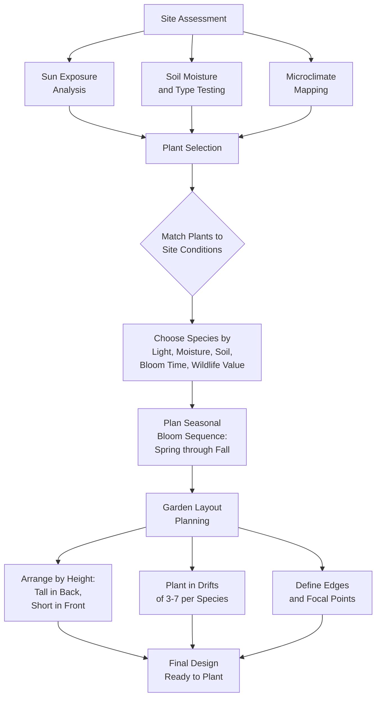
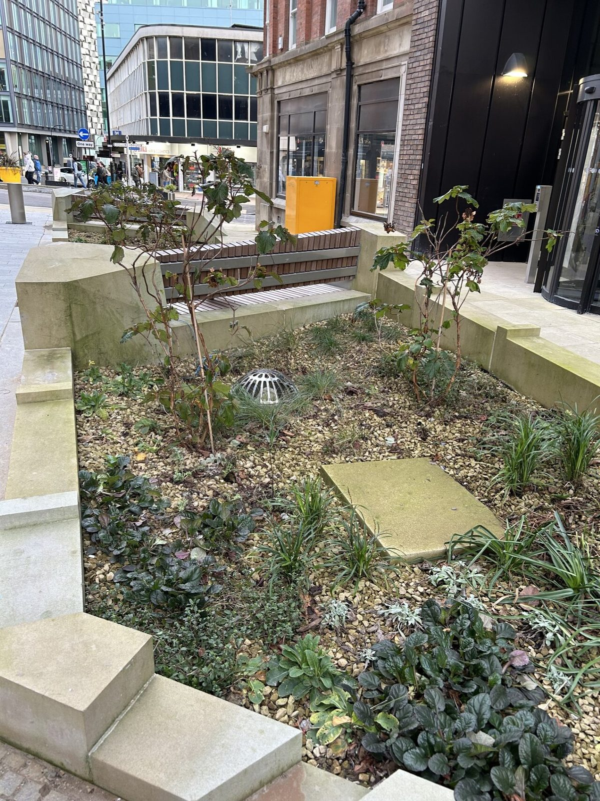
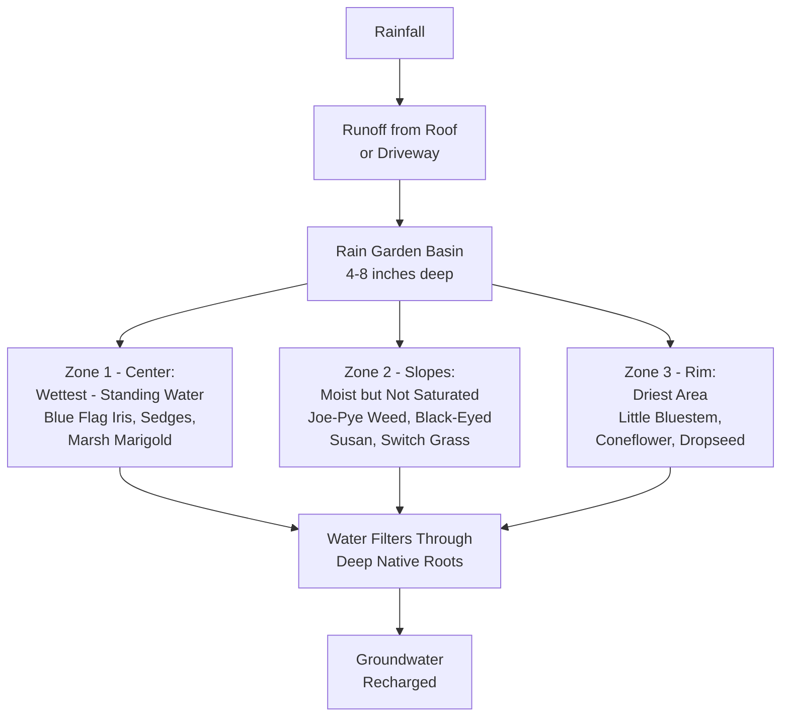
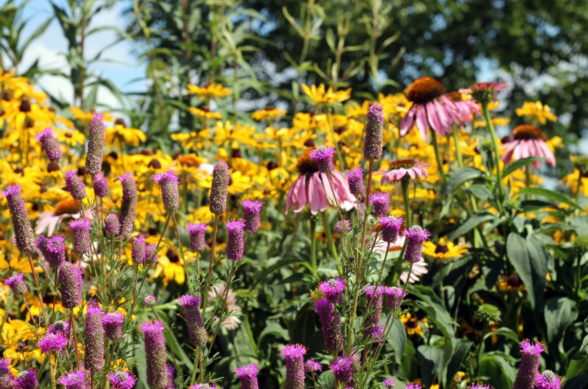
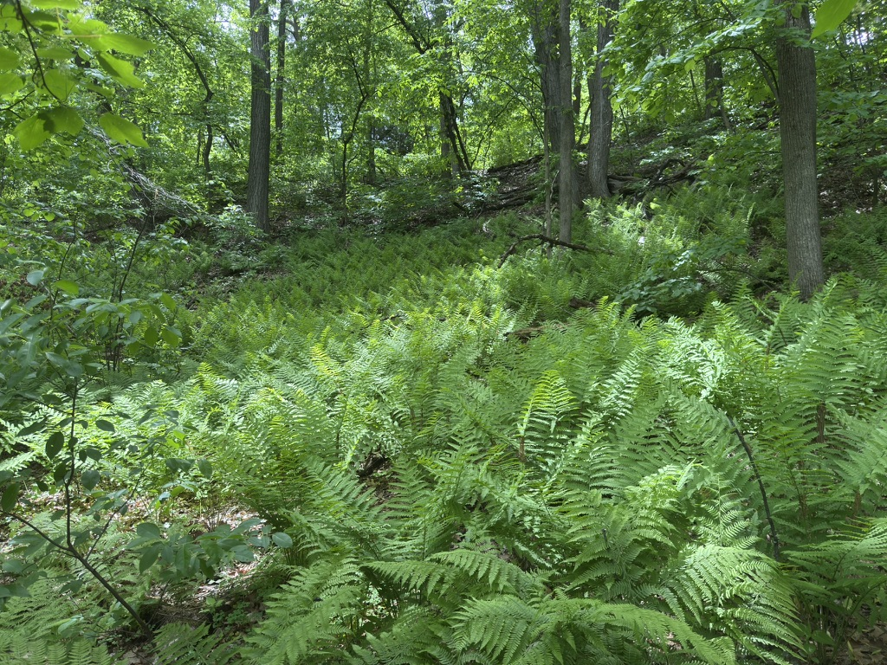
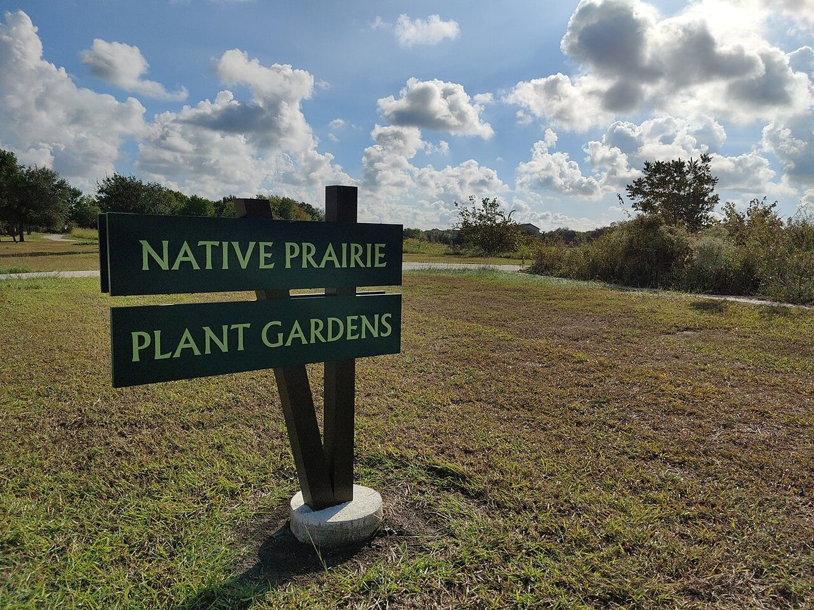

# Garden Design With Native Plants

!!! mascot-welcome "Welcome, Future Garden Designers!"
    
    Ready to bring the prairie home? In this chapter, we'll walk through every
    step of designing a native plant garden — from reading your site's soil and
    sunlight to choosing layouts that bloom from spring through fall. Whether you
    have a small front yard or several acres, these principles will help you
    create a landscape that is beautiful, low-maintenance, and alive with
    pollinators.

## Summary

This chapter covers the practical process of designing gardens with Minnesota native plants. You will learn how to assess your site's conditions — sunlight, soil, moisture, and microclimates — then apply that knowledge to select plants and arrange them in effective layouts. We explore several popular garden styles, including rain gardens, pollinator gardens, shade gardens, and prairie plantings, and discuss how to achieve year-round visual interest while supporting local ecosystems.

## Site Assessment

Every successful native garden begins with a thorough site assessment. Before you buy a single plant, you need to understand the conditions your garden offers. Plants that are matched to their site establish faster, need less care, and are more resilient over time.

A site assessment answers four fundamental questions:

- How much **sunlight** does each area receive?
- How **wet or dry** is the soil throughout the year?
- What **type of soil** do you have?
- Are there any **microclimates** — sheltered spots, frost pockets, or heat traps?

Walk your property at different times of day and during different seasons. Conditions in April look very different from conditions in August. Take notes and sketch a rough map showing sunny areas, shady areas, slopes, low spots, and any existing vegetation you plan to keep.

Enter your site conditions below to receive native plant recommendations matched to your property.

<iframe src="../../sims/site-assessment-tool/main.html" width="100%" height="500px" scrolling="no"></iframe>

Site Assessment Tool MicroSim

Type: microsim

**Learning Objective:** Students will understand how sunlight, soil type, and moisture conditions interact to determine which native plant species will thrive on a given site.

**Controls:**

- Dropdown for sun exposure (full sun, partial shade, full shade)
- Dropdown for soil type (sandy, clay, loam)
- Dropdown for moisture level (dry, mesic/medium, wet)
- Dropdown for USDA hardiness zone (3a, 3b, 4a, 4b)
- Filter checkboxes for plant type (grasses, forbs, shrubs, trees)
- Reset button to clear selections

**Visual Elements:**

- A results list of recommended native species, each with common name, scientific name, bloom time, and height
- Color-coded badges indicating wildlife value (pollinator, bird, butterfly host)
- A seasonal bloom timeline bar showing when each recommended species flowers
- A count of total matching species for the selected conditions

**Behavior:**

- Changing any input immediately updates the plant recommendations list
- Selecting stricter conditions narrows the list; relaxing them broadens it
- Clicking on a species name expands a brief description with planting tips
- The bloom timeline highlights gaps in the seasonal sequence, prompting the student to consider additional species

**Instructional Rationale:**
By experimenting with different site condition combinations, students learn that plant selection is driven by environmental factors rather than personal preference alone. This reinforces the "right plant, right place" principle central to native garden design.

## Sun Exposure Analysis

Sunlight is the single most important factor in plant selection. A wildflower that needs full sun will grow leggy and barely bloom in shade, while a woodland plant will scorch in an open south-facing bed.

### Categories of Sun Exposure

- **Full sun** — 6 or more hours of direct sunlight per day. South- and west-facing areas typically qualify.
- **Partial sun / partial shade** — 3 to 6 hours of direct sunlight per day, or dappled light throughout the day. East-facing areas and spots shaded by a single large tree often fall here.
- **Full shade** — fewer than 3 hours of direct sunlight per day. North sides of buildings, dense woodland understory, and areas beneath evergreen canopies.

### How to Measure

Choose a sunny day in midsummer (late June or July) and check each garden area every two hours from 8 a.m. to 6 p.m. Record whether it is in direct sun, dappled light, or full shade at each check. After a full day, tally the hours. Repeat on a second day to confirm.

Keep in mind that sun patterns shift through the year. A spot that is sunny in March — before deciduous trees leaf out — may be deeply shaded by June. For woodland gardens, this spring window of sunlight is exactly what ephemeral wildflowers like Bloodroot and Virginia Bluebells depend on.

## Soil Moisture Assessment

Soil moisture determines which native communities your garden can support. Prairie plants thrive in well-drained soils, while sedges and blue flag iris need consistently wet ground.

### Observing Natural Drainage

- **Dry sites** — Water drains away quickly after rain. Soil feels gritty or powdery a day after a storm. Slopes and sandy ridges are typical dry sites.
- **Mesic (medium) sites** — Soil stays moist for a day or two after rain but does not remain saturated. This is the most common condition in Minnesota yards.
- **Wet sites** — Water stands on the surface after rain or snowmelt, sometimes for hours or days. Low spots, ditches, and areas near downspouts are often wet sites.

### The Percolation Test

Dig a hole about 12 inches deep and 12 inches across. Fill it with water and let it drain completely. Then fill it again and time how long it takes to drain.

- **Less than 1 hour** — fast drainage (dry site)
- **1 to 4 hours** — moderate drainage (mesic site)
- **More than 4 hours** — slow drainage (wet site)

This simple test tells you more about your yard than any plant label can.

## Soil Type Testing

Soil type affects drainage, nutrient availability, and root development. Minnesota has a wide range of soil types, from the sandy outwash plains of Anoka County to the heavy clay of the Twin Cities metro to the rich loam of the Minnesota River valley.

### The Jar Test

This easy at-home test separates your soil into its component parts:

1. Collect a cup of soil from your garden area, removing rocks and debris
2. Place the soil in a clear quart jar and fill with water
3. Add a teaspoon of dish soap, cap tightly, and shake vigorously
4. Let the jar sit undisturbed for 24 to 48 hours
5. Sand settles first (bottom layer), then silt (middle), then clay (top)

Measure each layer to determine your soil's proportions. Roughly equal parts of sand, silt, and clay indicate loam — the ideal garden soil. Heavy clay soils will show a thick top layer, while sandy soils will be mostly bottom layer.

### What Your Soil Tells You

- **Sandy soil** — drains fast, low fertility, warms quickly in spring. Good for dry prairie species like Butterfly Weed and Little Bluestem.
- **Clay soil** — drains slowly, holds nutrients, slow to warm. Many native species tolerate clay well, including Wild Bergamot, Joe-Pye Weed, and New England Aster.
- **Loam** — balanced drainage and fertility. Supports the widest range of native species.

!!! mascot-thinking "Key Insight"
    
    One of the biggest advantages of native plants is that many of them are
    adapted to the "problem" soils that frustrate conventional gardeners. Heavy
    clay? There's a native for that. Bone-dry sand? There's a native for that
    too. Work with your soil rather than against it.

## Microclimate Assessment

Microclimates are small-scale variations in temperature, wind, and moisture within your property. A south-facing brick wall radiates warmth well into fall, while a low spot between two buildings may collect cold air and frost weeks earlier than the rest of your yard.

### Common Microclimates in Minnesota Yards

- **Heat sinks** — south-facing walls, driveways, and patios absorb and radiate heat, creating a zone a half-hardiness-zone warmer than the surrounding area
- **Frost pockets** — low-lying areas where cold air pools on clear, calm nights. These spots experience the first fall frost and the last spring frost.
- **Wind corridors** — gaps between buildings or along fence lines that funnel winter winds. Exposed plants here face desiccation and wind chill.
- **Rain shadows** — areas under roof overhangs or on the leeward side of buildings that receive significantly less rainfall
- **Wet spots** — areas near downspouts, sump pump outlets, or at the base of slopes where water collects

Map these microclimates on your site sketch. They influence which plants will thrive and which will struggle, sometimes over a distance of just a few feet.

## Native Garden Design

With your site assessment complete, you are ready to design. Native garden design follows many of the same principles as conventional garden design — but with a focus on ecological function alongside visual beauty.

The following diagram shows the complete native garden design process, from site assessment through final layout.

### Design Principles

- **Right plant, right place** — Match every plant to the sunlight, moisture, and soil conditions you documented in your site assessment. This is the single most important rule.
- **Ecological function** — Every plant should serve at least one ecological role: feeding pollinators, providing bird habitat, stabilizing soil, or filtering runoff.
- **Aesthetic appeal** — Native gardens can and should be beautiful. Use color, texture, height, and form to create visual interest throughout the seasons.
- **Low maintenance** — Design for the long term. A well-designed native garden requires less work each year as plants establish, not more.

Use the interactive garden design planner below to experiment with plant placement, color combinations, and layout patterns for different garden styles.

<iframe src="../../sims/garden-design-planner/main.html" width="100%" height="600px" scrolling="no"></iframe>

### Starting Small

If you are new to native plant gardening, start with a single bed rather than converting your entire yard at once. A 10-by-10-foot pollinator garden or a small rain garden near a downspout is an excellent first project. You will learn what works on your site, build confidence, and have a demonstration area that inspires future expansion.

## Plant Selection Criteria

Choosing the right species is where your site assessment pays off. For every planting spot, consider these criteria:

- **Light requirement** — Does the plant need full sun, partial shade, or full shade?
- **Moisture preference** — Does it need dry, mesic, or wet conditions?
- **Soil tolerance** — Will it grow in your soil type (sand, clay, loam)?
- **Hardiness zone** — Is it rated for your USDA zone? Most of Minnesota falls in zones 3b through 4b.
- **Mature size** — How tall and wide will it grow? Will it fit the space?
- **Bloom time** — When does it flower? Does it fill a gap in your seasonal sequence?
- **Wildlife value** — What pollinators or birds does it support?
- **Growth habit** — Is it a clumper or a spreader? Aggressive spreaders need careful placement.

Buy from reputable native plant nurseries that grow local-ecotype seed whenever possible. Local ecotypes are genetically adapted to Minnesota's climate and soils and will establish more reliably than plants grown from seed collected in distant regions.

## Seasonal Bloom Sequence

One of the most rewarding aspects of native garden design is planning for continuous bloom from early spring through late fall. A well-sequenced garden always has something flowering, providing beauty for you and food for pollinators across the entire growing season.

### Spring (April to May)

- Bloodroot (*Sanguinaria canadensis*)
- Virginia Bluebells (*Mertensia virginica*)
- Wild Columbine (*Aquilegia canadensis*)
- Prairie Smoke (*Geum triflorum*)
- Golden Alexanders (*Zizia aurea*)

### Early Summer (June to July)

- Wild Bergamot (*Monarda fistulosa*)
- Butterfly Weed (*Asclepias tuberosa*)
- Black-Eyed Susan (*Rudbeckia hirta*)
- Purple Coneflower (*Echinacea purpurea*)
- Spiderwort (*Tradescantia ohiensis*)

### Late Summer (August to September)

- Joe-Pye Weed (*Eutrochium maculatum*)
- Ironweed (*Vernonia fasciculata*)
- Blazing Star (*Liatris ligulistylis*)
- Cup Plant (*Silphium perfoliatum*)
- Cardinal Flower (*Lobelia cardinalis*)

### Fall (September to October)

- New England Aster (*Symphyotrichum novae-angliae*)
- Showy Goldenrod (*Solidago speciosa*)
- Stiff Goldenrod (*Solidago rigida*)
- Blue Lobelia (*Lobelia siphilitica*)
- Smooth Blue Aster (*Symphyotrichum laeve*)

Aim for at least three species blooming in each season. This ensures that no matter when a pollinator visits your garden, it finds food.

Use the interactive bloom calendar below to explore when Minnesota native plants flower and find species to fill gaps in your seasonal sequence.

<iframe src="../../sims/bloom-calendar/main.html" width="100%" height="600px" scrolling="no"></iframe>

## Garden Layout Planning

A good layout translates your plant list into a physical arrangement that looks intentional and functions well.

### Layout Principles

- **Tallest in the back** — Place tall species (Joe-Pye Weed, Cup Plant) at the rear of beds viewed from one side, or in the center of island beds.
- **Drift planting** — Group three to seven plants of the same species together in natural-looking clusters rather than planting one of each in a row. Drifts create visual impact and help pollinators find flowers efficiently.
- **Edge definition** — Use low, tidy species along the front edge of beds. Short sedges, Prairie Smoke, and Wild Strawberry make excellent edging that signals "this is a garden, not a weed patch."
- **Pathways** — Include mown paths or stepping stones through larger plantings. Paths invite people in and make the garden feel welcoming rather than wild.
- **Focal points** — Position a striking specimen plant, a birdbath, or a large boulder as an anchor. Focal points draw the eye and give the garden structure.

### Sketching Your Plan

Use graph paper or a simple digital tool. Draw your bed to scale (1 square = 1 foot works well for small gardens). Mark existing features — trees, buildings, fences, paths. Then place plant symbols in their locations, noting species, quantity, and spacing.

Try arranging native plants on the interactive garden grid below to practice layout planning with proper spacing.

<iframe src="../../sims/garden-layout-planner/main.html" width="100%" height="500px" scrolling="no"></iframe>

Garden Layout Planner MicroSim

Type: microsim

**Learning Objective:** Students will practice arranging native plants in a garden bed by height, bloom time, and spacing, learning to create naturalistic drifts rather than rigid rows.

**Controls:**

- A plant palette sidebar with draggable native plant icons organized by height (short, medium, tall)
- Grid size selector (8x8, 10x10, 12x12 feet)
- Toggle to show/hide spacing circles around placed plants
- Toggle to show/hide bloom-time color coding (spring, summer, fall)
- Clear grid button to start over
- A "Check Layout" button for feedback

**Visual Elements:**

- A top-down garden grid where each cell represents one square foot
- Plant icons showing approximate mature spread when placed
- Spacing circles that turn red when plants are placed too close together
- A seasonal bloom bar at the bottom summarizing which months have active blooms based on placed plants
- A height profile view along one edge showing the front-to-back height gradient

**Behavior:**

- Dragging a plant onto the grid places it and shows its spacing circle
- Overlapping spacing circles change color to warn of crowding
- The bloom bar updates in real time as plants are added or removed
- The "Check Layout" button provides feedback on height arrangement, bloom coverage, and drift grouping
- Placing fewer than three of the same species triggers a suggestion to plant in drifts

**Instructional Rationale:**
Hands-on arrangement builds spatial reasoning about plant spacing, height layering, and seasonal coverage. Immediate visual feedback on spacing and bloom gaps reinforces design principles without requiring an actual garden to experiment with.

## Plant Spacing and Density

Proper spacing is a balance between giving plants room to mature and filling space quickly enough to suppress weeds.

### General Spacing Guidelines

- **Tall perennials** (over 3 feet) — space 18 to 24 inches apart
- **Medium perennials** (1 to 3 feet) — space 12 to 18 inches apart
- **Short perennials and ground covers** (under 1 foot) — space 8 to 12 inches apart
- **Grasses** — space based on clump size at maturity: Little Bluestem at 12 inches, Big Bluestem at 18 to 24 inches
- **Shrubs** — space at one-half to two-thirds of mature width

### Density Strategies

Native landscapes in the wild are dense — a square foot of healthy prairie may contain a dozen or more individual plants. Mimic this density in your garden. Dense plantings outcompete weeds, create a lush appearance, and support more wildlife per square foot.

A common beginner mistake is spacing plants too far apart based on conventional gardening norms. In a native garden, plants are meant to grow into one another, creating a woven tapestry of foliage and bloom.

## Species Diversity Design

Diversity is not just an ecological principle — it is a design strategy. A garden with 20 species is more resilient, more visually interesting, and more valuable to wildlife than a garden with 5 species.

### Diversity Targets

- **Small garden** (under 200 square feet) — aim for 10 to 15 species
- **Medium garden** (200 to 1,000 square feet) — aim for 20 to 30 species
- **Large garden or restoration** (over 1,000 square feet) — aim for 40 or more species

### Diversity Across Categories

Include plants from multiple functional groups:

- **Grasses** — provide structure, winter interest, and nesting material for birds
- **Forbs (wildflowers)** — provide nectar, pollen, and color
- **Sedges** — excellent ground covers for shade and wet areas
- **Shrubs** — add height, berries for birds, and year-round structure
- **Ferns** — fill shady niches with graceful foliage

A garden dominated by wildflowers alone will lack structure after frost. Grasses and sedges maintain form through winter, giving the garden four-season presence.

## Layered Planting Design

Nature does not plant in rows. In a forest or prairie, plants grow at multiple heights, filling every vertical niche from ground level to the tree canopy. Layered planting design mimics this natural structure.

### Planting Layers

- **Ground layer** (0 to 6 inches) — mosses, Wild Strawberry, sedges, and creeping ground covers
- **Herbaceous layer** (6 inches to 3 feet) — the bulk of your wildflowers and short grasses
- **Tall herbaceous layer** (3 to 6 feet) — Joe-Pye Weed, Cup Plant, Big Bluestem, tall asters
- **Shrub layer** (3 to 15 feet) — Dogwood, Ninebark, Serviceberry, Elderberry
- **Canopy layer** (over 15 feet) — trees such as Bur Oak, Paper Birch, or Ironwood

Not every garden will include all five layers. A small prairie planting may only use the ground, herbaceous, and tall herbaceous layers. A woodland garden may use all five. The key is to think vertically, not just horizontally.

!!! mascot-tip "Bree's Tip"
    
    Layered gardens look full and natural because every inch of growing space is
    used. They also provide more diverse habitat — ground-nesting bees use the
    lower layers while songbirds nest in the shrubs and canopy above.

## Rain Garden Design

*A residential rain garden captures stormwater runoff and filters it through native plants and deep root systems. Photo: Wikimedia Commons (CC0 public domain).*

A rain garden is a shallow, planted depression designed to capture and absorb stormwater runoff from roofs, driveways, and lawns. Rain gardens are one of the most practical and impactful native garden projects a homeowner can build.

### How Rain Gardens Work

When it rains, water flows into the rain garden's bowl-shaped basin, where it soaks into the soil over 24 to 48 hours. Native plants and their deep root systems filter pollutants, slow erosion, and recharge groundwater. A single rain garden can absorb 30 percent more water than the same area of conventional lawn.

### Design Essentials

- **Location** — At least 10 feet from your foundation. Position it downslope from a downspout or driveway.
- **Size** — A typical residential rain garden is 100 to 300 square feet, roughly 20 to 30 percent of the impervious surface draining into it.
- **Depth** — 4 to 8 inches deep at the center. Deeper in sandy soil, shallower in clay.
- **Shape** — Kidney or crescent shapes look natural and work well hydraulically.
- **Overflow** — Include an overflow outlet that directs excess water away from buildings during extreme storms.

The following diagram shows how rain garden design connects stormwater flow to three distinct planting zones.

### Plant Zones in a Rain Garden

A rain garden has three moisture zones, each requiring different plants:

- **Zone 1 (center/bottom)** — Wettest area, standing water for hours after rain. Plant with Blue Flag Iris, Marsh Marigold, Blue Lobelia, and sedges.
- **Zone 2 (slopes)** — Moist but not saturated. Plant with Joe-Pye Weed, Swamp Milkweed, Black-Eyed Susan, and Switch Grass.
- **Zone 3 (rim)** — Driest area, similar to surrounding landscape. Plant with Little Bluestem, Purple Coneflower, Wild Bergamot, and Prairie Dropseed.

Try designing your own rain garden below — position plants across the three moisture zones and see how your design handles a storm event.

<iframe src="../../sims/rain-garden-designer/main.html" width="100%" height="600px" scrolling="no"></iframe>

## Pollinator Garden Design

*A native pollinator garden at Horicon National Wildlife Refuge featuring Purple Coneflower, Prairie Clover, and Yellow Coneflower. Photo: U.S. Fish and Wildlife Service (public domain).*

Pollinator gardens are designed specifically to support bees, butterflies, moths, and hummingbirds. Minnesota's native pollinators are declining, and backyard pollinator gardens are a meaningful way to help reverse that trend.

### Key Principles

- **Continuous bloom** — Provide flowers from April through October so pollinators always have food
- **Diverse flower shapes** — Different pollinators need different flowers. Tubular flowers for hummingbirds, flat composites for bees, broad landing pads for butterflies.
- **Larval host plants** — Butterflies need specific plants for their caterpillars. Milkweeds for Monarchs, Violets for Fritillaries, Asters for Crescents.
- **Nesting habitat** — Leave some bare soil for ground-nesting bees. Include pithy-stemmed plants (like Wild Bergamot) that cavity-nesting bees use.
- **No pesticides** — Even organic pesticides can harm pollinators. A native garden designed for ecological balance should not need them.

### Essential Pollinator Plants for Minnesota

- **Milkweeds** (*Asclepias* species) — essential for Monarch butterflies
- **Wild Bergamot** (*Monarda fistulosa*) — attracts a wide range of native bees
- **Blazing Star** (*Liatris* species) — a magnet for Monarch butterflies during fall migration
- **Purple Coneflower** (*Echinacea purpurea*) — long bloom period, visited by many bee species
- **Culver's Root** (*Veronicastrum virginicum*) — striking spires beloved by bumble bees
- **Wild Columbine** (*Aquilegia canadensis*) — early-season nectar for hummingbirds

## Shade Garden Design

*Native ferns thrive in the woodland shade garden at the Eloise Butler Wildflower Garden and Bird Sanctuary in Minneapolis. Photo: Wikimedia Commons (CC0 public domain).*

Many Minnesota yards have significant shade from mature trees and north-facing exposures. Shade does not mean you cannot garden with natives — it means you work with a different, equally beautiful plant palette.

### Understanding Shade Types

- **Dappled shade** — light filtered through a high canopy. The brightest shade condition and the easiest for native planting.
- **Partial shade** — a few hours of direct sun plus shade the rest of the day. East-facing areas with morning sun are ideal.
- **Deep shade** — dense evergreen canopy or north side of a building with no direct sun. The most challenging condition, but sedges, ferns, and a few wildflowers can still thrive.

### Shade Garden Plant Palette

- **Spring ephemerals** — Bloodroot, Dutchman's Breeches, Trillium, Virginia Bluebells. These bloom before the canopy leafs out and go dormant by midsummer.
- **Summer shade plants** — Wild Geranium, Zigzag Goldenrod, Blue Cohosh, Solomon's Seal, Wild Ginger
- **Ferns** — Maidenhair Fern, Lady Fern, Ostrich Fern. Ferns add lush texture and thrive in moist shade.
- **Ground covers** — Pennsylvania Sedge, Wild Strawberry, Canada Mayflower
- **Shrubs** — Pagoda Dogwood, Nannyberry, American Hazelnut

### Design Considerations

In shade gardens, texture and foliage become more important than flower color. Combine the fine, feathery texture of ferns with the bold, broad leaves of Wild Ginger and the upright form of Solomon's Seal. Use light-colored flowers and variegated foliage to brighten dark corners.

## Prairie Garden Design

*A native prairie plant garden showcases the natural beauty of grasses and wildflowers growing together in naturalistic drifts. Photo: Wikimedia Commons (CC BY-SA 4.0).*

Prairie gardens bring the drama and movement of Minnesota's vanishing grasslands into residential landscapes. A well-designed prairie garden is dynamic — swaying in the wind, changing color through the seasons, and alive with insects and birds.

### Prairie Plant Communities

Prairie plants fall into two broad categories:

- **Grasses** — Big Bluestem, Little Bluestem, Prairie Dropseed, Side-Oats Grama, Indian Grass. Grasses should make up 30 to 50 percent of a prairie planting by plant count. They provide the structure, movement, and winter interest that define the prairie aesthetic.
- **Forbs** — all the non-grass flowering plants. Prairie Smoke, Purple Coneflower, Blazing Star, Black-Eyed Susan, Compass Plant, Wild Bergamot. Forbs provide the color and the nectar.

### Prairie Garden Sizes

- **Pocket prairie** (under 200 square feet) — a garden bed planted in prairie style. Use shorter species and well-behaved clumpers.
- **Small prairie** (200 to 2,000 square feet) — large enough for drifts and seasonal waves of color. Include both short and tall species.
- **Large prairie restoration** (over 2,000 square feet) — typically established from seed rather than transplants. This is a multi-year project that requires patience and active management during establishment.

### Establishment and Patience

Prairie gardens take time. Most prairie species spend their first two years growing roots rather than top growth. The old saying holds true: "First year they sleep, second year they creep, third year they leap." Plan for two to three seasons of modest above-ground growth while the deep root systems that will sustain the planting for decades establish below the surface.

!!! mascot-thinking "Key Insight"
    
    A mature prairie planting can send roots 10 to 15 feet into the ground.
    That underground root mass makes the garden remarkably drought-tolerant and
    resilient once established. The patience of those first few years pays off
    for decades.

## Curb Appeal With Natives

One concern homeowners often express about native landscaping is whether it will look "messy" or upset the neighbors. The answer depends entirely on design. A well-designed native front yard can be more visually appealing than a conventional lawn-and-shrub landscape.

### Cues to Care

Landscape researchers use the term "cues to care" to describe design elements that signal intentionality. These elements tell passersby that a native planting is a deliberate garden, not neglect.

- **Mown edges** — A clean mown strip (even 12 inches wide) between the sidewalk and your native planting immediately communicates that the garden is maintained.
- **Defined borders** — Use edging, stone, or a row of consistent plants to frame the planting.
- **Focal points** — A birdbath, a bench, an ornamental boulder, or a specimen plant draws the eye and anchors the design.
- **Seasonal maintenance** — Cut back dead stems in spring. Deadhead spent blooms if you prefer a tidier look (or leave them for seed-eating birds).
- **Signage** — A small sign reading "Pollinator Habitat" or "Native Plant Garden" helps neighbors understand your intent.

### Front Yard Design Strategies

- Plant shorter species in the front (Prairie Dropseed, Prairie Smoke, Black-Eyed Susan) and taller species toward the house
- Use masses of a few species rather than one of everything — repetition reads as intentional
- Include evergreen or semi-evergreen elements (Bearberry, Creeping Juniper) for winter structure
- Edge beds with low, dense plants that create a neat border year-round

## Native Lawn Alternatives

The conventional lawn is Minnesota's most common landscape — and its least ecologically productive. A typical lawn provides almost no food or habitat for wildlife, requires regular mowing, watering, and chemical inputs, and sends stormwater rushing off its shallow-rooted surface.

Native lawn alternatives reduce or replace turfgrass with low-growing native species that provide ecological benefits while still offering the open, walkable feel of a lawn.

### Options for Replacing Lawn

- **No-mow fescue blends** — While not strictly native, these fine fescue mixes require little mowing and no irrigation. They serve as a transitional step toward full native plantings.
- **Pennsylvania Sedge** (*Carex pensylvanica*) — A native sedge that forms a soft, 6- to 8-inch-tall ground cover in partial shade. It tolerates foot traffic, stays green into late fall, and needs only one or two mowings per year.
- **Prairie Dropseed** (*Sporobolus heterolepis*) — In sunny areas, masses of Prairie Dropseed create an elegant, fine-textured ground plane. Not walkable, but visually serves the same "open space" role as a lawn.
- **Buffalograss** (*Bouteloua dactyloides*) — A warm-season native grass adapted to dry, sunny sites. Low-growing and drought-tolerant, it can be mowed or left unmowed.
- **Native ground cover mixes** — Combinations of Wild Strawberry, Self-Heal, and Violets create a flowering "lawn" that supports pollinators while staying low.

### Transition Strategies

Replacing an entire lawn at once is rarely practical. Consider these phased approaches:

- **Shrink the lawn** — Convert one section at a time, starting with the hardest-to-mow areas (slopes, shady corners, parking strips).
- **Island beds** — Plant native garden beds within the lawn, gradually expanding them each year.
- **Reduce inputs first** — Stop fertilizing and watering. Let the lawn thin naturally. Overseed with low-growing native species into the thinning turf.
- **Smother and plant** — In areas you want to convert fully, lay cardboard over the lawn in fall, top with 4 inches of mulch, and plant native plugs through the mulch the following spring.

!!! mascot-celebration "You're a Garden Designer Now!"
    
    Look at you go! You now have all the tools to assess your site, choose the
    right plants, and design a native garden that is both beautiful and
    ecologically alive. Start small, be patient, and watch your garden grow into
    something extraordinary.

## Chapter Summary

In this chapter, you learned:

- A **site assessment** evaluates sunlight, moisture, soil, and microclimates before planting
- **Sun exposure analysis** categorizes areas as full sun, partial shade, or full shade
- **Soil moisture** and **soil type** testing guide you to the right plant communities for your conditions
- **Microclimates** create small-scale variations that influence plant success
- **Native garden design** balances ecological function with visual beauty using the right-plant-right-place principle
- **Plant selection criteria** include light, moisture, soil, hardiness zone, bloom time, and wildlife value
- **Seasonal bloom sequence** planning ensures continuous flowers from spring through fall
- **Layout planning**, **spacing**, and **density** create gardens that look full and natural
- **Species diversity** and **layered planting** mimic natural communities for resilience and habitat value
- **Rain gardens** capture stormwater and support wetland natives in three moisture zones
- **Pollinator gardens** feed bees, butterflies, and hummingbirds with diverse flower shapes and continuous bloom
- **Shade gardens** use spring ephemerals, ferns, and foliage texture for beauty under the canopy
- **Prairie gardens** combine grasses and forbs for movement, color, and deep ecological roots
- **Curb appeal** strategies use cues to care so native plantings look intentional and inviting
- **Native lawn alternatives** replace turfgrass with low-growing species that support wildlife

## Concepts Covered

This chapter covers the following 18 concepts from the learning graph:

1. Site Assessment
2. Sun Exposure Analysis
3. Soil Moisture Assessment
4. Soil Type Testing
5. Microclimate Assessment
6. Native Garden Design
7. Plant Selection Criteria
8. Seasonal Bloom Sequence
9. Garden Layout Planning
10. Plant Spacing and Density
11. Species Diversity Design
12. Layered Planting Design
13. Rain Garden Design
14. Pollinator Garden Design
15. Shade Garden Design
16. Prairie Garden Design
17. Curb Appeal With Natives
18. Native Lawn Alternatives

## Prerequisites

This chapter builds on concepts from earlier chapters:

- **Chapter 1** — Native plant definitions, ecosystem basics, and plant identification
- **Chapter 2** — Minnesota ecoregions, hardiness zones, and soil types
- **Chapter 3** — Prairie, woodland, and wetland plant communities
- **Chapter 4** — Individual plant species profiles and characteristics
- **Chapter 5** — Pollination ecology and plant-wildlife relationships
- **Chapter 6** — Soil science and hydrology fundamentals

## What's Next

In Chapter 11, we'll move from design to action — covering soil preparation, planting techniques, watering schedules, and the hands-on skills you need to install and establish your native garden successfully.

## Image Credits

- Pollinator garden: U.S. Fish and Wildlife Service, Horicon National Wildlife Refuge (public domain)
- Rain garden: Wikimedia Commons contributor (CC0 public domain)
- Shade garden ferns: Eloise Butler Wildflower Garden, Minneapolis (CC0 public domain)
- Native prairie garden: Wikimedia Commons contributor (CC BY-SA 4.0)

[See Annotated References](./references.md)
