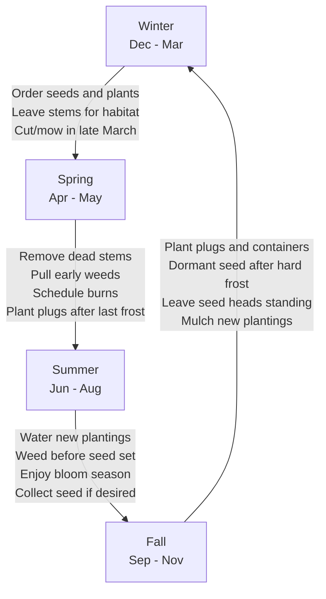
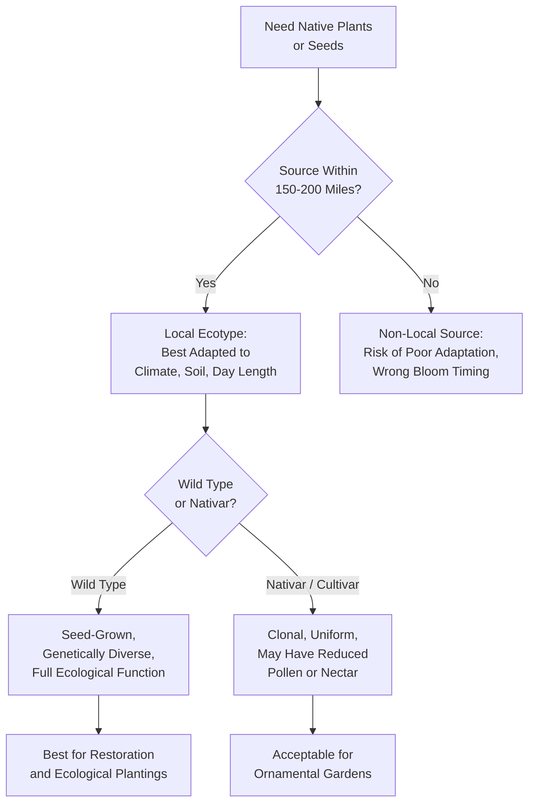

# Planting, Maintenance, and Sourcing

!!! mascot-welcome "Time to Get Your Hands Dirty!"
    
    Welcome to the chapter where knowledge meets action! I'm Bree, and now
    that you have a garden design in hand from Chapter 10, it's time to learn
    how to prepare your site, get plants in the ground, keep them healthy,
    and find the best sources for genuine Minnesota native plants.

## Summary

This chapter walks you through every practical step of establishing and maintaining a native planting in Minnesota. You will learn how to prepare a site, suppress weeds, start seeds, install plugs and container plants, and manage your planting through its first year and beyond. We also cover where to find high-quality native plants and seeds in Minnesota, why local genetics matter, and how to make ethical choices about seed collection and plant selection.

## Site Preparation

Before you plant a single seed or plug, you need to prepare your site. Proper site preparation is the single most important factor in whether a native planting succeeds or fails. Skipping this step is the number one reason native plantings disappoint.

Site preparation has three goals:

- **Remove existing vegetation** — especially turf grass and perennial weeds
- **Reduce the weed seed bank** — the reservoir of dormant weed seeds in the soil
- **Create conditions** that favor the native species you want to establish

### Methods for Removing Existing Vegetation

There are several approaches, and you can combine them:

- **Smothering** — Cover the area with cardboard or multiple layers of newspaper, then top with 4 to 6 inches of mulch. Leave in place for at least one full growing season. This kills grass and many weeds without herbicides.
- **Solarization** — Cover the area with clear plastic sheeting during the hottest months (June through August). The trapped heat kills vegetation and some weed seeds in the top layer of soil.
- **Sod removal** — Use a sod cutter to strip away the top layer of turf. This is fast but removes topsoil and is physically demanding.
- **Repeated mowing and tilling** — Mow low, till the soil, wait for weeds to sprout, then till again. Repeat three to four times over a growing season. Each cycle depletes the weed seed bank.
- **Herbicide application** — A non-selective herbicide can kill existing vegetation. Many restoration professionals use this method, sometimes in combination with others. Always follow label directions and local regulations.

### How Long Does Site Prep Take?

Plan on at least one full growing season for site preparation. For sites with aggressive perennial weeds like quackgrass or Canada thistle, plan on two seasons. Starting in fall and planting the following fall or the spring after that is a common and effective timeline in Minnesota.

!!! mascot-warning "Don't Skip Site Prep!"
    
    I know it's tempting to jump straight to planting, but weeds are the
    top killer of new native plantings. Every week you invest in site prep
    saves you months of weeding later. Trust me on this one.

## Weed Suppression Methods

Even after site preparation, weeds will return. Native plantings need active weed management, especially in the first two to three years before native plants fill in and shade out competitors.

Effective weed suppression methods include:

- **Hand weeding** — Pull weeds when the soil is moist. Remove the entire root system, especially for perennials like thistle and dandelion.
- **Targeted mowing** — Mow the entire planting to a height of 6 to 8 inches during the first growing season. This cuts above most native seedlings while knocking back taller annual weeds.
- **Mulching** — Apply 2 to 3 inches of weed-free mulch between plants. Avoid burying the crowns of native plants.
- **Cover crops** — Short-lived annual cover crops like oats can be seeded along with native seed mixes. They provide quick ground cover that suppresses weeds, then die off as perennial natives establish.
- **Spot herbicide** — Carefully apply herbicide to individual weeds using a wick applicator or spray shield. This targets weeds without harming adjacent natives.

## Seed Starting Natives

Many Minnesota native plants can be started from seed indoors, giving you a head start on the growing season and saving money compared to buying plugs or containers.

### Indoor Seed Starting Basics

- **Timing** — Start seeds 8 to 12 weeks before your last expected frost date (mid-May in most of Minnesota). Some species need earlier starts.
- **Containers** — Use cell trays, peat pots, or recycled containers with drainage holes.
- **Growing medium** — Use a sterile, soilless seed-starting mix. Native seeds do not need rich potting soil.
- **Light** — Most native seedlings need 14 to 16 hours of light per day. A simple shop light with fluorescent or LED tubes works well, positioned 2 to 4 inches above the seedlings.
- **Watering** — Keep the medium consistently moist but not soggy. Bottom watering (setting trays in shallow water) reduces damping off.

### Species That Start Well Indoors

- [Black-Eyed Susan](../../plants/black-eyed-susan/) (*Rudbeckia hirta*) — germinates in 7 to 14 days, no stratification needed
- [Wild Bergamot](../../plants/wild-bergamot/) (*Monarda fistulosa*) — germinates in 10 to 14 days with light
- [Purple Coneflower](../../plants/purple-coneflower/) (*Echinacea purpurea*) — benefits from 4 weeks of cold stratification before sowing
- [Butterfly Milkweed](../../plants/butterfly-milkweed/) (*Asclepias tuberosa*) — needs 4 to 6 weeks cold stratification

## Plug Planting Techniques

Plugs are small native plants grown in narrow, deep cells (typically 2 to 3 inches wide and 5 to 7 inches deep). They are the most common and cost-effective way to establish native perennials in garden-scale plantings.

### How to Plant Plugs

1. Water plugs thoroughly before planting — dry root balls resist moisture after planting.
2. Dig a hole the same depth as the plug and slightly wider.
3. Gently squeeze the plug out of its cell. If roots are circling, lightly tease them apart.
4. Place the plug in the hole so the soil surface of the plug is level with the surrounding ground.
5. Firm the soil around the plug and water it in immediately.

### Spacing

Follow the spacing recommended for each species. As a general guide:

- **Short forbs** (6 to 18 inches tall) — plant 8 to 12 inches apart
- **Medium forbs** (18 to 36 inches) — plant 12 to 18 inches apart
- **Tall forbs and grasses** (36 inches and above) — plant 18 to 24 inches apart

### When to Plant Plugs in Minnesota

- **Spring** (mid-May to mid-June) — after the last frost, when soil has warmed
- **Fall** (September to early October) — gives roots time to establish before freeze-up

Fall planting is often preferred because plants experience less transplant stress and get a head start in spring.

## Container Plant Install

Container plants (quart, gallon, or larger pots) are bigger and more expensive than plugs, but they provide instant visual impact and establish faster.

### Installation Steps

1. Water the container plant thoroughly the day before planting.
2. Dig a hole twice as wide as the container and the same depth.
3. Remove the plant from the pot. Inspect the root ball — if roots are circling tightly, score the sides with a knife or use your fingers to pull roots outward.
4. Set the plant so the top of the root ball is level with the surrounding soil. Planting too deep smothers the crown and can kill the plant.
5. Backfill with the original soil. Do not amend the backfill with compost or peat unless your soil is extremely poor — native plants are adapted to lean soils.
6. Water deeply and apply 2 to 3 inches of mulch around (not on top of) the plant.

## Bare Root Planting

Bare root plants are dormant plants shipped without soil around their roots. They are common for native shrubs, trees, and some prairie perennials. They are lighter and cheaper to ship than container plants, and many Minnesota nurseries offer them in spring.

### How to Handle and Plant Bare Root Stock

- **Keep roots moist** at all times. Soak roots in water for 2 to 4 hours before planting.
- **Plant promptly** — bare root stock does not store well. Plant within a day or two of receiving it.
- **Dig a hole** wide enough to spread the roots without bending or cramping them.
- **Look for the soil line** — a color change on the stem showing the previous planting depth. Set the plant at this same depth.
- **Backfill carefully**, working soil in around the roots to eliminate air pockets. Water thoroughly to settle the soil.

## Seeding Methods

Direct seeding is the most economical way to establish native plants over large areas. Minnesota's climate actually helps — our cold winters provide the stratification many native seeds need to germinate.

### Broadcast Seeding

The simplest method. Mix seed with a carrier material like damp sand or vermiculite (at a ratio of about 4 parts carrier to 1 part seed) to help distribute tiny seeds evenly. Scatter the mix over prepared soil by hand or with a broadcast spreader. After seeding, press seeds into the soil surface with a roller or by walking over the area. Do not bury seeds deeply — most native seeds need light to germinate.

### Drill Seeding

For larger areas (a quarter acre and up), a native seed drill places seeds at a controlled depth and spacing. The Minnesota Board of Water and Soil Resources (BWSR) and local Soil and Water Conservation Districts sometimes have seed drills available for loan.

### When to Seed in Minnesota

- **Fall dormant seeding** (November to freeze-up) — Seeds overwinter in place and germinate in spring. This is the preferred method for most Minnesota native species because winter cold naturally provides stratification.
- **Spring frost seeding** (March to April) — Scatter seed on frozen ground or snow. Freeze-thaw cycles work seeds into the soil surface.
- **Spring seeding** (May to June) — Works for species that do not require stratification, but soil moisture can be unreliable.

## Seed Stratification

Many Minnesota native plant seeds have built-in dormancy mechanisms that prevent germination until conditions are right. **Stratification** is the process of breaking this dormancy, usually by exposing seeds to a period of cold, moist conditions that mimic a Minnesota winter.

### Cold Moist Stratification

This is the most common type needed for Minnesota natives:

1. Mix seeds with damp (not wet) sand, vermiculite, or a moist paper towel.
2. Place the mixture in a sealed plastic bag or container.
3. Refrigerate at 33 to 40 degrees Fahrenheit for the required period — typically 30 to 90 days depending on species.
4. Check periodically for mold or premature germination.
5. Sow seeds after the stratification period is complete.

### Species-Specific Requirements

- **No stratification needed**: Black-Eyed Susan, Wild Bergamot, Partridge Pea
- **30 days cold**: Purple Coneflower, Butterfly Milkweed, Prairie Blazing Star
- **60 days cold**: Big Bluestem, Little Bluestem, Leadplant
- **90 days cold**: Wild Lupine, Shooting Star, some woodland species

!!! mascot-tip "Bree's Tip"
    
    The easiest stratification method? Fall dormant seeding! Let Minnesota's
    winter do the work for you. Seeds sown in November will stratify naturally
    in the frozen ground and germinate on their own schedule in spring.

## Watering Establishment

Native plants are famously drought-tolerant once established — but "once established" is the key phrase. New plantings need consistent moisture during their first one to two growing seasons while roots develop.

### Watering Guidelines for New Plantings

- **Plugs and container plants** — Water deeply at planting, then provide 1 inch of water per week for the first growing season if rain does not provide it. Water deeply and less frequently rather than shallowly and often — this encourages deep root growth.
- **Seeded areas** — Keep the soil surface consistently moist (not saturated) for the first 4 to 6 weeks after germination. Light, frequent watering is appropriate at this stage. Once seedlings are 2 to 3 inches tall, transition to deeper, less frequent watering.
- **Bare root and dormant plants** — Water thoroughly at planting. Continue watering 1 inch per week through the first growing season.

### When to Stop Supplemental Watering

Most native perennials are well-established after two full growing seasons. Grasses often establish faster. Deep-rooted prairie species like Compass Plant and Prairie Dock may take three years to build their root systems but will then be virtually indestructible.

## Native Plant Mulching

Mulch serves several purposes in a native planting: it suppresses weeds, retains soil moisture, moderates soil temperature, and gives the planting a tidy appearance during establishment.

### Best Mulch Choices for Native Plantings

- **Shredded hardwood bark** — Widely available, stays in place, decomposes slowly. A good general-purpose choice.
- **Leaf litter** — Free, natural, and beneficial for soil biology. Shredded leaves stay in place better than whole leaves. Excellent for woodland plantings.
- **Prairie hay or straw** — Appropriate for large seeded areas. Use weed-free straw (not hay with seed heads) applied lightly so seedlings can push through.
- **Wood chips** — Good for paths and shrub plantings. Avoid using fresh wood chips directly around herbaceous perennials, as they can tie up nitrogen at the soil surface.

### Mulching Don'ts

- Do not pile mulch against plant stems or tree trunks (no "mulch volcanoes")
- Do not use dyed or rubber mulch — these offer no ecological benefit
- Do not mulch prairie seedings too thickly — a light scattering of straw is sufficient
- Do not use landscape fabric under native plantings — it prevents self-seeding and soil building

## First Year Maintenance

The first year after planting is the most critical period. Your native plants are establishing roots and competing with fast-growing weeds. What you do this year determines the long-term success of the planting.

### What to Expect in Year One

Most native perennials put their energy into root growth during the first year. Above ground, they may look small, sparse, and unimpressive. This is completely normal. The saying in native plant circles is: "First year they sleep, second year they creep, third year they leap."

### First Year Tasks

- **Weed relentlessly** — This is your single most important task. Remove weeds before they set seed. Hand-pull or carefully spot-treat.
- **Mow high** — If weeds are overwhelming a seeded area, mow to 6 to 8 inches. This sets back annual weeds while leaving most native seedlings unharmed.
- **Water as needed** — Maintain consistent moisture for new transplants and seedlings.
- **Do not fertilize** — Native plants thrive in lean soils. Fertilizer encourages weeds.
- **Do not worry about blooms** — Most native perennials will not flower in their first year. Focus on root development.
- **Monitor for problems** — Watch for signs of stress, disease, or herbivory. Address issues early.

## Long-Term Maintenance

Once established (typically after year three), native plantings require far less maintenance than conventional landscapes — but they are not zero-maintenance.

### Ongoing Tasks

- **Annual burn or mow** — Native prairies benefit from periodic disturbance. Fire is the traditional and most effective tool, removing thatch, recycling nutrients, and stimulating native growth. Where burning is not practical, a late-winter mow (cutting to 4 to 6 inches in March or April before new growth emerges) serves a similar purpose.
- **Selective weeding** — Continue removing invasive species and aggressive non-natives. Garlic mustard, buckthorn seedlings, and thistle will keep trying.
- **Overseeding** — Add seed of underrepresented species to fill gaps and increase diversity over time.
- **Observation** — Walk your planting regularly. Notice what is thriving, what is struggling, and what new species are appearing. A good native planting changes year to year.

## Seasonal Maintenance

The following diagram shows the annual cycle of planting and maintenance tasks across Minnesota's four seasons.

Each season brings specific tasks for maintaining a native planting in Minnesota.

### Spring (April to May)

- Remove last year's dead stems if not done in late winter — but leave some standing for early-season pollinator shelter
- Assess winter damage and plan replacements
- Begin weeding as soon as the ground thaws — early weeds are easy to pull
- Plan and schedule prescribed burns if applicable

### Summer (June to August)

- Water new plantings as needed
- Weed regularly, prioritizing species that are about to set seed
- Enjoy the bloom sequence and note which species are performing well
- Deadhead aggressive self-sowers if you want to limit their spread (though many native gardens benefit from self-seeding)

### Fall (September to November)

- Plant plugs and container plants in September and early October
- Sow seed after the first hard frost for dormant seeding
- Leave seed heads standing for winter interest and bird food
- Apply mulch to new plantings before freeze-up

### Winter (December to March)

- Leave the planting standing — dead stems provide overwintering habitat for native bees and beneficial insects
- Plan next year's additions and improvements
- Order seeds and plants from nurseries (many sell out of popular species early)
- Cut or mow standing vegetation in late winter (March) if you did not burn

## Maintenance Calendar

A month-by-month reference keeps you on track:

- **January/February** — Order seeds and plants from nurseries. Review the previous year and plan changes.
- **March** — Mow or burn standing dead vegetation before new growth starts. Begin early weed patrol.
- **April** — Pull cool-season weeds. Assess winter survival of fall plantings. Prepare new planting sites.
- **May** — Plant plugs and containers after last frost. Begin watering new plantings. Weed emerging beds.
- **June** — Continue watering and weeding. First wave of native blooms begins.
- **July** — Peak bloom season. Water during dry spells. High-mow seeded areas if weeds are overwhelming.
- **August** — Continue watering first-year plantings. Collect seed from your own plants if desired.
- **September** — Fall planting window opens. Divide and transplant established natives.
- **October** — Finish fall planting. Begin dormant seeding late in the month.
- **November** — Complete dormant seeding after the ground freezes. Apply mulch to new plantings.
- **December** — Rest. Enjoy the winter silhouettes of your native planting.

Explore the interactive calendar below to see what planting and maintenance tasks are recommended for each month in Minnesota.

<iframe src="../../sims/planting-calendar/main.html" width="100%" height="500px" scrolling="no"></iframe>

Interactive Planting Calendar MicroSim

Type: microsim

**Learning Objective:** Students will understand the seasonal rhythm of native plant establishment and maintenance in Minnesota, learning which tasks belong in which months and why timing matters.

**Controls:**

- Clickable month buttons (January through December) to select a month
- Filter checkboxes for task categories (planting, watering, weeding, mowing/burning, seed collection, ordering)
- Toggle between first-year tasks and established-planting tasks

**Visual Elements:**

- A circular or linear calendar displaying all twelve months
- The selected month expands to show a task list with brief descriptions
- Color-coded task icons distinguishing planting, maintenance, and planning activities
- A temperature and daylight bar showing average conditions for the selected month
- Highlighted critical windows (e.g., "last frost mid-May," "first frost early October")

**Behavior:**

- Clicking a month highlights it and displays the associated tasks in a detail panel
- Toggling between first-year and established-planting views changes which tasks appear
- Hovering over a task reveals a tooltip with additional timing details and tips
- Tasks that span multiple months show connecting lines across the calendar

**Instructional Rationale:**
Visualizing the full annual cycle helps students plan ahead rather than reacting to seasonal changes. Understanding that maintenance timing (e.g., mowing before nesting season, seeding after hard frost) is driven by ecological reasoning deepens their connection between practice and ecology.

## Mowing Native Plantings

Mowing is a versatile management tool for native plantings, serving different purposes at different times.

### Types of Mowing

- **Establishment mowing** — During the first year, mow seeded areas to 6 to 8 inches when annual weeds reach 12 to 15 inches. This prevents weeds from shading out native seedlings and from setting seed.
- **Spring cleanup mowing** — In late winter or early spring (March), mow the entire planting to 4 to 6 inches to remove last year's growth and let sunlight reach emerging natives. This is the mowing equivalent of a prescribed burn.
- **Selective mowing** — Mow specific areas or patches where weeds or undesirable species are concentrated, leaving the rest undisturbed.
- **Path mowing** — Mow paths through taller plantings to provide access and create visual structure. Paths also serve as firebreaks.

### Mowing Cautions

- Never mow lower than 4 inches in an established native planting — this can damage plant crowns
- Avoid mowing between May and September when ground-nesting birds may be present
- Leave at least one-third of the planting unmowed each year to provide continuous habitat

## Dividing Native Plants

Many native perennials benefit from division every three to five years. Division rejuvenates plants, controls spread, and gives you free plants to expand your planting or share with neighbors.

### When to Divide

- **Spring-blooming plants** — Divide in early fall (September)
- **Summer- and fall-blooming plants** — Divide in early spring (April to May), before new growth exceeds a few inches

### How to Divide

1. Water the plant thoroughly the day before dividing.
2. Cut back top growth to 4 to 6 inches to reduce stress.
3. Dig up the entire clump, working outward from the crown.
4. Pull or cut the clump into sections, each with roots and at least two to three growing points.
5. Replant divisions immediately at the same depth as the original plant.
6. Water well and mulch.

### Species That Divide Well

- Black-Eyed Susan, Purple Coneflower, Wild Bergamot, Bee Balm
- Most native grasses (Big Bluestem, Little Bluestem, Prairie Dropseed)
- Asters, Goldenrods, and native sedges

### Species to Avoid Dividing

- Deep-taprooted species like Compass Plant, Prairie Dock, Butterfly Milkweed, and Wild Lupine resist division. Propagate these from seed instead.

## Native Plant Nurseries MN

Minnesota is fortunate to have a strong network of native plant nurseries that specialize in locally sourced, genetically appropriate stock. Buying from these nurseries supports local businesses, gives you better-adapted plants, and ensures you are getting true native species — not look-alike cultivars.

### Major Minnesota Native Plant Nurseries

- **Prairie Moon Nursery** (Winona, MN) — One of the most respected native plant nurseries in the Midwest. Offers an extensive catalog of seeds, plugs, and bare root plants with detailed growing information for every species. An outstanding resource for both beginners and experienced native gardeners.
- **Shooting Star Native Seeds** (Spring Grove, MN) — Specializes in native seed mixes for prairie restoration, conservation plantings, and stormwater management. Works extensively with landowners, agencies, and conservation organizations across southern Minnesota.
- **Prairie Restorations, Inc.** (Princeton, MN) — Offers seeds, plants, and full-service restoration design and installation. A good choice if you want professional help establishing a large planting.
- **Landscape Alternatives** (Shafer, MN) — Retail nursery with a strong selection of native perennials, grasses, shrubs, and trees. Knowledgeable staff and a beautiful demonstration garden.
- **Morning Sky Greenery** (Morris, MN) — Grows native plants from seed collected in western Minnesota. A great source for prairie species adapted to the western part of the state.
- **Out Back Nursery** (Hastings, MN) — Native trees, shrubs, and perennials with a focus on plants for southern Minnesota landscapes.
- **Minnesota Native Landscapes** (Otsego, MN) — Large-scale seed production and restoration services. Supplies seed to agencies, developers, and landowners statewide.

!!! mascot-tip "Bree's Tip"
    
    Order early! Many native plant nurseries sell out of popular species by
    late spring. Place your orders in January or February for the best
    selection. Most nurseries ship bare root plants in April and May.

## Seed Sources Minnesota

In addition to nurseries that sell seed, several organizations and programs in Minnesota can help you find or fund native seed:

- **Minnesota Board of Water and Soil Resources (BWSR)** — Provides technical and financial assistance for native plantings on agricultural land, including cost-share for native seed.
- **USDA Natural Resources Conservation Service (NRCS)** — Offers conservation programs (such as CRP and EQIP) that fund native seedings on private land.
- **Local Soil and Water Conservation Districts (SWCDs)** — Many SWCDs sell native seed mixes and provide planting advice tailored to your county.
- **The Nature Conservancy** — Manages preserves across Minnesota and sometimes offers seed from managed burns.
- **Local native plant societies and garden clubs** — Members often share seed from their own gardens, an excellent way to get locally adapted stock for free.

## Seed Mix Selection

Choosing the right seed mix is essential for a successful planting. The mix must match your site conditions and your goals.

### Factors to Consider

- **Site conditions** — Sun exposure, soil type, moisture level. A dry prairie mix will fail on a wet site and vice versa.
- **Region** — Choose mixes formulated for your part of Minnesota. A mix designed for the western prairies may contain species not well-suited to the Twin Cities or the northeast.
- **Goals** — Are you planting for pollinators? Erosion control? Visual beauty? Wildlife habitat? Each goal may call for a different mix composition.
- **Diversity** — Higher diversity mixes (30 to 60+ species) create more resilient and ecologically valuable plantings. Budget mixes with only 5 to 10 species are less expensive but provide fewer ecosystem benefits.
- **Grass-to-forb ratio** — Most prairie seed mixes contain both grasses and wildflowers (forbs). For maximum visual impact and pollinator value, choose mixes with a higher proportion of forbs (60 to 70 percent forbs by species count). Grass-heavy mixes are less expensive but produce a planting dominated by grasses with few flowers.

### Common Mix Categories

- **Dry prairie** — For well-drained, sandy, or gravelly soils in full sun
- **Mesic prairie** — For average, well-drained loam soils in full sun
- **Wet prairie/wet meadow** — For low areas with consistently moist to seasonally wet soils
- **Woodland edge** — For partially shaded sites with moderate moisture
- **Rain garden/bioretention** — Engineered mixes for managing stormwater
- **Pollinator mix** — Heavy on flowering forbs with long bloom seasons
- **Short grass/low grow** — For areas where a shorter, mowed appearance is desired

## Local Ecotype Importance

An **ecotype** is a genetically distinct population of a species that has adapted to the specific conditions of a local area. The Big Bluestem growing in sandy western Minnesota soils is genetically different from the Big Bluestem growing in clay soils along the Mississippi River — even though they are the same species.

The following diagram shows the decision process for sourcing native plants, from choosing local ecotypes to evaluating nativars versus wild types.

### Why Local Ecotypes Matter

- **Adaptation** — Local ecotypes are adapted to your specific climate, soil, and day length. They are more likely to thrive than plants or seeds sourced from distant regions.
- **Bloom timing** — Local ecotypes bloom in sync with local pollinators. A plant sourced from 500 miles south may bloom weeks too early for Minnesota pollinators.
- **Winter hardiness** — Ecotypes from warmer climates may not survive Minnesota winters, even if they are the same species.
- **Genetic integrity** — Planting non-local ecotypes near wild populations can lead to genetic mixing that may reduce the fitness of local wild plants.

### How Close Is "Local"?

As a general guideline, source seeds and plants from within 150 to 200 miles of your site and from a similar latitude. Many Minnesota nurseries identify the collection origin of their seed, making it easier to choose appropriately.

## Provenance And Genetics

**Provenance** refers to the geographic origin of a plant or seed lot. It is closely related to the concept of ecotype but also includes information about the specific habitat and conditions where the source population grows.

### Why Provenance Matters

When you buy native seed, you are not just buying a species — you are buying a specific genetic lineage. That lineage carries information about:

- **Climate tolerance** — How cold, hot, dry, or wet the parent population experienced
- **Soil adaptation** — Whether the parents grew in sand, clay, or organic soils
- **Disease resistance** — Which local pathogens the population has been exposed to
- **Phenology** — When the population leafs out, blooms, and goes dormant

### Genetic Diversity in Seed Lots

A healthy seed lot should come from a genetically diverse source population — ideally seed collected from many individual plants across a site, not from a single parent plant. Genetic diversity gives the planting resilience against environmental change and disease.

Reputable nurseries like Prairie Moon Nursery and Shooting Star Native Seeds maintain diverse seed production fields and document the provenance of their stock.

## Plant Labeling Standards

When you buy native plants, the label should tell you more than just the species name. Understanding plant labels helps you make informed purchasing decisions.

### What to Look For on a Label

- **Scientific name** — The Latin binomial (genus and species). This is the most reliable identifier.
- **Common name** — Helpful but can be ambiguous. Always confirm with the scientific name.
- **Cultivar name** (if applicable) — Appears in single quotes after the scientific name, e.g., *Echinacea purpurea* 'Magnus'. Indicates a selected form, not a wild type.
- **Provenance or seed source** — Where the original seed was collected. Better nurseries provide this.
- **Hardiness zone** — Confirms the plant is suited to your zone (most of Minnesota is USDA Zone 3b to 4b).
- **Light and moisture requirements** — Full sun, partial shade, dry, mesic, wet.

### Red Flags

- No scientific name on the label
- No provenance information
- "Improved" or "enhanced" in the description — this may indicate a nativar (see below)
- Seed or plants shipped from far outside your region

## Nativars Vs Wild Types

A **nativar** is a cultivar (cultivated variety) derived from a native species. Nativars are selected and bred for specific traits — showier flowers, compact growth, unusual foliage color, or longer bloom time. They are sold under cultivar names like *Echinacea purpurea* 'PowWow Wild Berry' or *Panicum virgatum* 'Shenandoah'.

### The Debate

Nativars occupy a gray area in native plant gardening. The key questions are:

- **Do nativars support pollinators and wildlife as well as wild types?** Research is mixed. Some nativars with doubled flowers produce less pollen and nectar because the extra petals replace reproductive structures. Others appear to function similarly to wild types.
- **Do nativars maintain genetic diversity?** No. Nativars are clones or heavily selected lines. They lack the genetic diversity of wild-type seed-grown populations.
- **Are nativars "native"?** Technically, the species is native. But a heavily selected, clonally propagated nativar with purple leaves and compact growth is a very different plant from its wild ancestor.

### Guidelines

- For ecological plantings and restoration, use wild-type, seed-grown plants from local provenance.
- For ornamental gardens where you want reliable aesthetics, nativars can be a reasonable choice — they are still better than non-native ornamentals.
- Avoid nativars with doubled flowers, as these are least likely to support pollinators.
- When in doubt, ask your nursery whether a plant is wild-type or a named cultivar.

!!! mascot-thinking "Something to Consider"
    
    A wild-type Purple Coneflower grown from locally collected seed is not
    the same thing as *Echinacea purpurea* 'PowWow Wild Berry' from a
    garden center. Both are "native" in a loose sense, but they differ in
    genetics, ecological function, and provenance. For restoration work,
    wild type is the way to go.

## Seed Collection Ethics

Collecting seed from wild native plant populations can be a rewarding way to obtain locally adapted material — but it comes with ethical responsibilities.

### Principles of Ethical Seed Collection

- **Never collect from rare or threatened species** without explicit permission from land managers and appropriate permits.
- **Collect no more than 10 percent** of the available seed from any population. Leave the majority for natural regeneration and for wildlife that depends on those seeds.
- **Collect from many individual plants** — at least 20 to 50 different plants per species — to capture genetic diversity.
- **Never collect from private land** without the landowner's permission.
- **Never collect from public lands** (parks, wildlife management areas, scientific and natural areas) without a permit from the managing agency. In Minnesota, collecting from state lands without a permit is illegal.
- **Record your collection data** — species, location, date, habitat, and number of parent plants. This information is the provenance record for your seed.

### When to Collect

Most Minnesota native seeds ripen between late July and October. Ripe seeds typically detach easily from the plant when touched or shaken. If you have to tug hard, the seed is not ready.

### Processing and Storage

- Clean seeds by removing chaff, stems, and debris.
- Dry seeds thoroughly in a warm, well-ventilated area for one to two weeks.
- Store seeds in paper envelopes or breathable containers in a cool, dry location. Many native seeds remain viable for two to five years when stored properly.

## Chapter Summary

!!! mascot-celebration "You're Ready to Plant!"
    
    You now have the practical knowledge to go from an empty plot to a
    thriving native planting. Remember: patience is your greatest tool.
    Native plants build from the roots up, and the best plantings get
    better every year. See you in the garden!

In this chapter, you learned:

- **Site preparation** is the most critical step — invest the time to remove existing vegetation and reduce the weed seed bank
- Multiple **planting methods** (plugs, containers, bare root, direct seeding) each have advantages depending on your site and budget
- **Seed stratification** mimics Minnesota's winter to break seed dormancy — or let nature do it with fall dormant seeding
- **First-year maintenance** centers on weed control, watering, and patience
- **Long-term maintenance** includes periodic mowing or burning, selective weeding, and overseeding
- Minnesota has excellent **native plant nurseries** including Prairie Moon, Shooting Star, and many others
- **Local ecotype** and **provenance** matter — plants from your region are genetically adapted to thrive there
- **Nativars** differ from wild types in genetics, diversity, and ecological function
- **Ethical seed collection** protects wild populations while providing locally adapted material

## Concepts Covered

This chapter covers the following 24 concepts from the learning graph:

1. Site Preparation
2. Weed Suppression Methods
3. Seed Starting Natives
4. Plug Planting Techniques
5. Container Plant Install
6. Bare Root Planting
7. Seeding Methods
8. Seed Stratification
9. Watering Establishment
10. Native Plant Mulching
11. First Year Maintenance
12. Long-Term Maintenance
13. Seasonal Maintenance
14. Maintenance Calendar
15. Mowing Native Plantings
16. Dividing Native Plants
17. Native Plant Nurseries MN
18. Seed Sources Minnesota
19. Seed Mix Selection
20. Local Ecotype Importance
21. Provenance And Genetics
22. Plant Labeling Standards
23. Nativars Vs Wild Types
24. Seed Collection Ethics

## Prerequisites

Before starting this chapter, you should have completed [Chapter 10: Garden Design with Native Plants](../10-garden-design-native-plants/index.md), which covers site assessment, design principles, and plant selection — the planning steps that precede the hands-on work covered here.

## What's Next

In Chapter 12, we'll scale up from garden-level plantings to landscape-level work, exploring the science and practice of ecological restoration — repairing damaged ecosystems and rebuilding native plant communities across larger sites.

[See Annotated References](./references.md)
