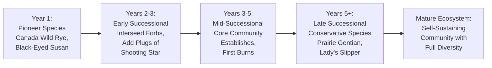
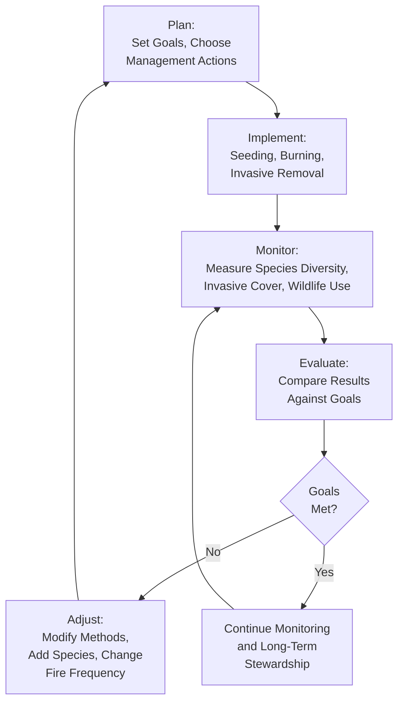

# Ecological Restoration

!!! mascot-welcome "Welcome to Restoration!"
    
    Ready to heal the land? I'm Bree, and in this chapter we're going to explore
    one of the most rewarding things you can do with native plants — bring damaged
    ecosystems back to life. Whether it's a former farm field, an eroded
    shoreline, or a woodland choked with buckthorn, restoration gives us the
    tools to help nature recover.

## Summary

This chapter covers the science and practice of ecological restoration in Minnesota. You will learn how to assess a restoration site, set meaningful goals, and choose strategies for restoring prairies, woodlands, wetlands, and shorelines. We explore how reference ecosystems guide our work, how successional planting mimics natural processes, and why monitoring and adaptive management keep a project on track. The chapter also covers seasonal bloom planning — from spring ephemerals to winter seed heads — so your restoration provides beauty and wildlife value every month of the year.

## Restoration Ecology Basics

Restoration ecology is the scientific study of how to repair damaged, degraded, or destroyed ecosystems. It draws on botany, soil science, hydrology, wildlife biology, and traditional ecological knowledge to guide practical, on-the-ground work.

The core idea is straightforward: if we understand how a healthy ecosystem functions, we can help a damaged one recover. That might mean removing invasive species, replanting native seeds, restoring natural water flow, or simply stepping back and letting nature do the work.

Restoration is not the same as gardening. A garden is designed primarily for human enjoyment. A restoration project aims to re-establish the ecological processes — nutrient cycling, pollination, natural disturbance, seed dispersal — that allow a plant community to sustain itself over time.

Key principles of restoration ecology include:

- **Ecosystem function over appearance** — A restoration is successful when ecological processes are working, not just when it looks pretty
- **Local genetics matter** — Using locally sourced seed preserves the genetic adaptations that help plants thrive in Minnesota's specific conditions
- **Disturbance is natural** — Fire, flooding, and grazing shaped Minnesota's ecosystems for millennia and remain essential management tools
- **Patience is required** — Ecosystems develop over years and decades, not weeks

## Restoration Site Assessment

Before you plant a single seed, you need to understand what you are working with. A thorough site assessment saves time, money, and frustration.

### Physical Conditions

Survey these basic site characteristics:

- **Soil type and quality** — Is it sandy, loamy, or clay? Has it been compacted by heavy equipment? Is the topsoil intact or has it been scraped away?
- **Hydrology** — Where does water come from and where does it go? Does the site flood seasonally? Is the water table high or low?
- **Topography** — Note slopes, low spots, and aspect (which direction slopes face). South-facing slopes are warmer and drier; north-facing slopes are cooler and moister.
- **Sunlight** — Full sun, partial shade, or deep shade? This determines which plant communities are appropriate.

### Biological Conditions

Document what is already growing on the site:

- **Existing native plants** — Even degraded sites often retain native species in the seed bank or as scattered survivors. These are valuable starting points.
- **Invasive species** — Identify and map all invasive species present. These must be addressed before or during restoration.
- **Wildlife use** — Note which birds, pollinators, and other animals are using the site. Their presence indicates what habitat values already exist.

### Land Use History

Understanding what happened on the site helps explain current conditions:

- **Former agricultural land** — May have compacted soil, altered pH from lime application, and a depleted native seed bank
- **Recently cleared woodland** — May have intact soil biology but need replanting
- **Construction disturbance** — Often has severely compacted subsoil with topsoil removed

!!! mascot-thinking "Key Insight"
    
    A soil test is one of the best investments you can make before starting a
    restoration. Knowing your soil pH, organic matter content, and nutrient
    levels helps you choose the right species and avoid costly mistakes. Many
    native prairie plants actually prefer low-fertility soil — rich soil often
    favors weeds.

## Prairie Restoration

Prairie restoration is the most common large-scale restoration activity in Minnesota. Less than 2 percent of Minnesota's original 18 million acres of prairie remains, making every restored acre significant.

### Site Preparation

Good preparation is the foundation of a successful prairie:

- **Remove existing vegetation** — Smother with black plastic or cardboard, apply herbicide to persistent weeds, or use repeated mowing. This may take an entire growing season.
- **Address invasive species first** — Buckthorn, Reed Canary Grass, and Smooth Brome must be dealt with before seeding or they will dominate the restoration.
- **Consider soil conditions** — Compacted soil may need light disking. Avoid deep tillage, which brings weed seeds to the surface.

### Seed Selection

A diverse prairie seed mix is essential. Aim for a mix that includes:

- **Warm-season grasses** — Big Bluestem, Indian Grass, Little Bluestem, Switchgrass, and Prairie Dropseed form the structural backbone of the prairie
- **Cool-season grasses** — June Grass and Canada Wild Rye establish quickly and provide early cover
- **Forbs (wildflowers)** — The more species, the better. A high-quality restoration mix includes 40 to 100 or more forb species
- **Sedges and rushes** — Often overlooked but important components of mesic and wet prairies

### Seeding Methods

- **Broadcast seeding** — Scatter seed by hand or with a broadcast spreader. Works well for small sites.
- **Drill seeding** — A native seed drill plants seeds at the correct depth. Preferred for large sites.
- **Frost seeding** — Scatter seed on frozen ground in late winter. Freeze-thaw cycles work seeds into the soil naturally.

### First-Year Management

The first year of a prairie restoration looks weedy. This is normal. Annual weeds germinate quickly and appear to dominate, but native perennials are investing energy in root growth below the surface.

- Mow the site to a height of 6 to 8 inches two to three times during the first growing season to prevent weeds from shading out native seedlings
- Do not mow lower than 6 inches — you risk cutting native seedlings
- Do not use herbicide broadly during the first year

## Woodland Restoration

Restoring a degraded woodland typically begins with removing invasive shrubs and re-establishing the native understory.

### The Buckthorn Problem

Common Buckthorn and Glossy Buckthorn have invaded the vast majority of Minnesota's woodlands. Their dense shade eliminates native wildflowers, ferns, and tree seedlings. Woodland restoration almost always starts with buckthorn removal.

After removing buckthorn, the sudden flood of light can trigger a flush of weed growth. Be prepared to manage this transition by:

- **Overseeding with native woodland species** immediately after removal — Wild Geranium, Zigzag Goldenrod, Pennsylvania Sedge, and Jack-in-the-Pulpit are good choices
- **Planting woodland shrubs** — Pagoda Dogwood, Nannyberry, and American Hazelnut fill the shrub layer that buckthorn occupied
- **Monitoring for buckthorn resprouts** — Cut stumps will resprout vigorously unless treated with herbicide or pulled when small

### Canopy Considerations

If the woodland canopy is intact, focus on restoring the understory and shrub layers. If the canopy has been lost, you may need to plant native trees, but be aware that trees grow slowly — woodland restoration measured in canopy recovery takes decades.

Good canopy tree choices for Minnesota woodland restorations include:

- **Red Oak** and **Bur Oak** — Long-lived, wildlife-valuable, and well-adapted to a range of conditions
- **Sugar Maple** and **Basswood** — Dominant trees in Minnesota's mesic forests
- **White Pine** — For northern and central Minnesota sites with sandy or loamy soils

## Wetland Restoration

Minnesota has lost approximately 50 percent of its original wetlands, primarily to agricultural drainage. Restoring wetlands provides flood control, water filtration, and critical wildlife habitat.

### Hydrology First

The most important step in wetland restoration is restoring the water. Without the right hydrology, wetland plants cannot establish and wetland functions cannot return.

- **Plug drainage ditches and drain tiles** — This is often the single most effective restoration action
- **Regrade the site** — Create shallow depressions and gentle slopes that hold and slow water
- **Connect to natural water sources** — Ensure the site receives water from rain, runoff, snowmelt, or groundwater

### Planting Wetland Species

Once hydrology is restored, many wetland plants will colonize naturally from the existing seed bank. To accelerate recovery and increase diversity, plant or seed species matched to specific water depths:

- **Deep water (12+ inches)** — Bulrushes, Cattails (native species only), Water Lilies
- **Shallow water (0-12 inches)** — Blue Flag Iris, Marsh Marigold, Arrowhead
- **Wet meadow (saturated soil)** — Blue Joint Grass, Tussock Sedge, Joe-Pye Weed, Swamp Milkweed
- **Upland buffer** — Big Bluestem, Prairie Blazing Star, Black-Eyed Susan

## Shoreline Restoration

Minnesota's 10,000-plus lakes and thousands of miles of rivers and streams make shoreline restoration an important specialty. Healthy shorelines prevent erosion, filter runoff, and provide critical fish and wildlife habitat.

### Natural Shoreline Principles

The traditional approach of mowing lawn to the water's edge and installing riprap (loose rock) degrades shoreline habitat. A natural shoreline uses plants to stabilize the bank and filter runoff.

A restored shoreline typically has three zones:

- **Aquatic zone** — Submerged and floating-leaf plants in the water. Wild Celery, Pondweeds, and Water Lilies stabilize lake-bottom sediments and provide fish habitat.
- **Emergent zone** — Plants growing in shallow water at the waterline. Bulrushes, Sedges, and Blue Flag Iris absorb wave energy and prevent erosion.
- **Upland buffer zone** — Dense plantings of native grasses, shrubs, and wildflowers extending at least 25 to 50 feet from the water's edge. This buffer filters runoff and provides wildlife cover.

### Common Shoreline Restoration Plants

- **Lake Sedge** (*Carex lacustris*) — Excellent bank stabilizer in shallow water
- **Soft-Stem Bulrush** (*Schoenoplectus tabernaemontani*) — Tall emergent that absorbs wave energy
- **Red-Osier Dogwood** (*Cornus sericea*) — Shrub with fibrous roots that hold banks in place; provides winter color with bright red stems
- **Swamp Milkweed** (*Asclepias incarnata*) — Buffer-zone wildflower that supports Monarch butterflies

## Restoration Goals Setting

Clear, measurable goals are the difference between a successful restoration and an expensive weed patch. Goals should reflect both ecological function and practical reality.

### Writing Good Restoration Goals

Effective goals are specific, measurable, and time-bound:

- **Weak goal**: "Restore the prairie"
- **Strong goal**: "Establish a diverse mesic prairie with at least 40 native plant species and fewer than 10 percent invasive cover within 5 years"

Consider goals across multiple dimensions:

- **Vegetation structure** — What should the plant community look like? How tall? How dense? How many layers?
- **Species diversity** — How many native species should be present? Which key indicator species must be included?
- **Invasive species thresholds** — What percentage of invasive cover is acceptable? Zero is rarely realistic.
- **Wildlife use** — Which bird, pollinator, or other wildlife species should the restoration support?
- **Hydrology** — For wetland and shoreline projects, what water levels and flow patterns should the site achieve?

## Reference Ecosystems

A reference ecosystem is a model of what your restoration should eventually resemble. It provides a benchmark for setting goals, selecting species, and measuring progress.

### Finding a Reference

Look for high-quality remnant ecosystems near your restoration site:

- **State Scientific and Natural Areas (SNAs)** — Minnesota's best-preserved natural communities
- **DNR Native Plant Community maps** — Show what historically grew in your area
- **County biological surveys** — Document remaining high-quality sites by county
- **Pre-settlement vegetation maps** — Show the landscape before European agriculture

### Using the Reference

A reference ecosystem tells you:

- Which species should be present and in what proportions
- What the soil conditions and hydrology should look like
- What natural disturbance regime (fire frequency, flooding) maintained the community
- What successional stage the community naturally occupies

You are not trying to create an exact replica of the reference. Conditions have changed — climate is shifting, some species are locally extinct, and the surrounding landscape is different. The reference gives you a target to work toward, not a blueprint to copy exactly.

## Successional Planting

Natural ecosystems develop through a process called succession — a predictable sequence of plant communities that replace one another over time. Smart restoration mimics this process.

The following diagram shows how successional planting phases species introductions over time to mimic natural ecosystem development.

### Primary Succession Stages

- **Pioneer species** — Fast-establishing grasses and annual wildflowers that colonize bare ground, stabilize soil, and begin building organic matter
- **Early successional species** — Short-lived perennials and aggressive native grasses that create the initial structure
- **Mid-successional species** — Longer-lived perennials that form the core of the mature community
- **Late successional species** — Slow-establishing, long-lived species like some conservative prairie forbs and woodland trees

### Applying Succession to Restoration

Rather than planting all species at once, you can phase your planting over several years:

- **Year 1** — Seed fast-establishing grasses and hardy forbs. Include cover crops like Canada Wild Rye and Black-Eyed Susan that fill space quickly.
- **Years 2-3** — Interseed with slower-establishing forbs. Add plugs of species that are difficult to establish from seed, such as Bottle Gentian and Shooting Star.
- **Years 5+** — Introduce conservative species that need an established community to thrive, such as Prairie Gentian and Small White Lady's Slipper.

This approach is more realistic and often more successful than a single massive seeding, especially for species that need nurse plants, mycorrhizal networks, or specific microhabitats.

!!! mascot-tip "Bree's Tip"
    
    Think of restoration like building a house. Pioneer species are the
    foundation — they may not be flashy, but without them the whole structure
    fails. Once the foundation is solid, you can add the beautiful details.

## Monitoring Restoration

You cannot manage what you do not measure. Monitoring tells you whether your restoration is on track or needs adjustment.

### What to Monitor

- **Species composition** — Which native species are present? Are they increasing in cover and diversity over time?
- **Invasive species cover** — Is invasive cover decreasing? Are new invasive species appearing?
- **Vegetation structure** — Is the plant community developing the right height, density, and layering?
- **Soil conditions** — Is organic matter increasing? Is soil biology recovering?
- **Wildlife use** — Are target bird, pollinator, or amphibian species using the site?
- **Photo documentation** — Take photos from fixed points at the same time each year. These visual records are invaluable for tracking change.

### Monitoring Schedule

- **Year 1** — Monitor monthly during the growing season to catch problems early
- **Years 2-5** — Monitor two to three times per growing season (spring, midsummer, fall)
- **Years 5+** — Annual monitoring is usually sufficient for established restorations

### Simple Monitoring Methods

You do not need expensive equipment. Effective monitoring methods include:

- **Meander surveys** — Walk the entire site and record all species observed
- **Photo points** — Permanent stakes where you take photos each visit
- **Quadrat sampling** — Place a 1-meter-square frame at random points and record species and percent cover within it
- **Transect surveys** — Walk a straight line across the site and record species at regular intervals

## Adaptive Management

No restoration plan survives contact with reality unchanged. Adaptive management is the process of adjusting your approach based on what monitoring tells you.

The following diagram shows the adaptive management cycle that drives every successful restoration project.

### The Adaptive Management Cycle

1. **Plan** — Set goals and choose management actions based on the best available information
2. **Implement** — Carry out the planned actions (seeding, burning, invasive removal)
3. **Monitor** — Measure results against your goals
4. **Evaluate** — Determine what worked and what didn't
5. **Adjust** — Modify the plan and try again

This cycle repeats continuously throughout the life of the restoration.

### Common Adjustments

- **More fire** — If the prairie is becoming dominated by woody plants or cool-season grasses, increase burn frequency
- **Less fire** — If fire-sensitive species you want are being suppressed, reduce burn frequency or create fire refugia (unburned patches)
- **Additional seeding** — If species diversity is lower than expected, interseed with additional forb species
- **Targeted invasive control** — If a particular invasive is expanding, intensify control efforts on that species
- **Altered hydrology** — If a wetland is too dry or too wet, adjust water control structures

## Restoration Timelines

Restoration takes time. Understanding realistic timelines helps you set expectations and avoid discouragement.

### Prairie Restoration Timeline

- **Year 1** — Looks weedy. Native grasses begin to emerge but are small and sparse. Annual weeds dominate.
- **Years 2-3** — Native grasses become visible. First native forbs bloom. Site begins to look like a rough prairie.
- **Years 3-5** — Prairie structure develops. Diversity increases. First prescribed burn is usually appropriate at year 3.
- **Years 5-10** — Prairie matures. Full bloom display develops. Wildlife use increases significantly.
- **Years 10-20+** — Conservative species establish. The prairie increasingly resembles a remnant. Soil biology recovers.

### Woodland Restoration Timeline

- **Year 1** — Invasive removal and initial planting. Understory looks bare.
- **Years 2-5** — Understory plants fill in. Shrub plantings begin to provide structure.
- **Years 5-15** — Shrub layer establishes. Ground layer diversifies. Site begins to feel like a woodland.
- **Years 15-50+** — Tree canopy matures. Full woodland structure develops with canopy, subcanopy, shrub, and ground layers.

### Wetland Restoration Timeline

- **Year 1** — Hydrology restored. Mudflats appear. Pioneer wetland species colonize naturally.
- **Years 2-3** — Emergent plants establish. Wetland begins filtering water and providing habitat.
- **Years 3-10** — Plant diversity increases. Wildlife use grows. Wetland functions approach those of natural wetlands.
- **Years 10+** — Organic soils develop. Wetland is largely self-sustaining.

Use the slider in the simulation below to watch how a prairie restoration develops over a ten-year period.

<iframe src="../../sims/restoration-timeline-sim/main.html" width="100%" height="500px" scrolling="no"></iframe>

Restoration Timeline Simulator MicroSim

Type: microsim

**Learning Objective:** Students will understand that ecological restoration is a multi-year process with distinct phases, and that patience and ongoing management are essential for success.

**Controls:**

- Year slider (1 through 10) to advance through the restoration timeline
- Dropdown to select restoration type (prairie, woodland, wetland)
- Play/pause button for automatic year-by-year animation
- Speed control for animation playback

**Visual Elements:**

- A landscape illustration that changes as the year slider advances, showing vegetation growth, species diversity, and structural development
- A species count indicator showing how many native species are present at each stage
- An invasive cover percentage bar that decreases over time with management
- A management activity log listing what actions are recommended at each year (mowing, burning, interseeding, monitoring)
- Color and height changes in the vegetation reflecting seasonal and annual maturation

**Behavior:**

- Moving the slider forward shows progressive changes: bare soil to weedy first year, emerging natives in years two and three, recognizable prairie structure by year five, and mature community by year ten
- Selecting different restoration types changes the visual, timeline, and species information
- The management log updates with year-appropriate actions, reinforcing that restoration requires ongoing effort
- Pausing at any year displays detailed information about what to expect and what to do at that stage

**Instructional Rationale:**
Compressing a decade of change into an interactive slider helps students viscerally understand that restoration is slow and incremental. Seeing the contrast between year one (weedy, discouraging) and year ten (diverse, beautiful) builds realistic expectations and motivates long-term commitment to restoration projects.

## Spring Bloom Plants

Spring-blooming native plants provide the first color of the year and offer critical early-season food for pollinators emerging from winter dormancy. In Minnesota, spring bloom generally runs from late March through May.

### Prairie and Meadow Spring Bloomers

- **Pasque Flower** (*Anemone patens*) — One of Minnesota's earliest wildflowers, blooming in April on dry prairies. Soft purple flowers push through last year's dead grass.
- **Prairie Smoke** (*Geum triflorum*) — Pink nodding flowers in May followed by feathery seed heads that give the plant its name
- **Golden Alexanders** (*Zizia aurea*) — Bright yellow umbels that provide food for early-season native bees and flies
- **Shooting Star** (*Dodecatheon meadia*) — Elegant swept-back petals in pink or white, a showstopper in May prairies

### Woodland Spring Bloomers

Minnesota woodlands produce a spectacular display of spring ephemeral wildflowers that bloom before the tree canopy leafs out:

- **Bloodroot** (*Sanguinaria canadensis*) — Pristine white flowers in early April, one of the first woodland wildflowers
- **Hepatica** (*Hepatica nobilis*) — Delicate blue, pink, or white flowers that bloom through fallen leaves
- **Trout Lily** (*Erythronium americanum*) — Yellow nodding flowers above mottled leaves that carpet woodland floors
- **Wild Ginger** (*Asarum canadense*) — Subtle maroon flowers at ground level, hidden beneath heart-shaped leaves
- **Jack-in-the-Pulpit** (*Arisaema triphyllum*) — Unmistakable hooded flower, a favorite with children

### Wetland Spring Bloomers

- **Marsh Marigold** (*Caltha palustris*) — Brilliant yellow flowers lighting up wet meadows and stream banks in April and May
- **Skunk Cabbage** (*Symplocarpus foetidus*) — Generates its own heat to melt through snow and bloom before anything else in boggy areas

## Summer Bloom Plants

Summer is the peak bloom season in Minnesota, with hundreds of native species flowering from June through August. These plants form the backbone of pollinator habitat.

### Prairie Summer Bloomers

- **Purple Coneflower** (*Echinacea purpurea*) — Perhaps Minnesota's most recognizable native wildflower, beloved by butterflies and native bees
- **Wild Bergamot** (*Monarda fistulosa*) — Lavender flower clusters that hum with bumblebees and hummingbird moths throughout July
- **Black-Eyed Susan** (*Rudbera hirta*) — Cheerful yellow flowers that bloom prolifically in the first years after seeding
- **Butterfly Milkweed** (*Asclepias tuberosa*) — Brilliant orange flowers essential for Monarch butterflies
- **Blazing Stars** (*Liatris* species) — Spikes of purple that bloom from the top down, drawing Monarchs and swallowtails
- **Culver's Root** (*Veronicastrum virginicum*) — Elegant white flower spires visited by dozens of native bee species
- **Prairie Phlox** (*Phlox pilosa*) — Fragrant pink clusters that bridge the gap between spring and summer

### Woodland Summer Bloomers

- **Wild Geranium** (*Geranium maculatum*) — Pink flowers from May into June, one of the easiest woodland plants to establish
- **Harebell** (*Campanula rotundifolia*) — Delicate blue bells on thin stems, nodding in the slightest breeze
- **Zigzag Goldenrod** (*Solidago flexicaulis*) — Late summer yellow in shaded sites, important for late-season pollinators

### Wetland Summer Bloomers

- **Joe-Pye Weed** (*Eutrochium maculatum*) — Towering pink flower heads that attract enormous numbers of butterflies
- **Swamp Milkweed** (*Asclepias incarnata*) — Pink milkweed for wet sites, a Monarch host plant
- **Blue Flag Iris** (*Iris versicolor*) — Elegant blue flowers along pond edges and stream banks
- **Cardinal Flower** (*Lobelia cardinalis*) — Stunning red spikes, one of the few plants pollinated primarily by hummingbirds in Minnesota

## Fall Bloom Plants

Fall-blooming native plants provide essential late-season nectar and pollen for pollinators building winter reserves. They also extend the visual beauty of a restoration well into October.

### Prairie Fall Bloomers

- **New England Aster** (*Symphyotrichum novae-angliae*) — Rich purple flowers that dominate the fall prairie and attract migrating Monarchs
- **Stiff Goldenrod** (*Solidago rigida*) — Flat-topped golden clusters essential for late-season bees. Despite common belief, goldenrod does not cause hay fever — ragweed is the culprit.
- **Smooth Blue Aster** (*Symphyotrichum laeve*) — Sky-blue flowers on smooth purple stems, one of the most elegant fall prairie plants
- **Showy Goldenrod** (*Solidago speciosa*) — Dense golden plumes that light up roadsides and prairies in September
- **Rough Blazing Star** (*Liatris aspera*) — Late-blooming blazing star that extends the purple season into October
- **Closed Gentian** (*Gentiana andrewsii*) — Unusual bottle-shaped blue flowers that only bumblebees are strong enough to open

### Woodland Fall Bloomers

- **White Snakeroot** (*Ageratina altissima*) — Bright white clusters that illuminate shaded understories in September
- **Blue-Stemmed Goldenrod** (*Solidago caesia*) — Graceful arching goldenrod for woodland edges

### Wetland Fall Bloomers

- **Swamp Aster** (*Symphyotrichum puniceum*) — Tall lavender-blue asters along stream banks and wet meadows
- **Sneezeweed** (*Helenium autumnale*) — Yellow daisy-like flowers in wet prairies and meadows through September

## Winter Interest Plants

A well-planned restoration does not go dormant when the flowers fade. Winter interest comes from persistent seed heads, bark texture, evergreen foliage, and structural forms that catch snow and frost.

### Grasses with Winter Presence

- **Little Bluestem** (*Schizachyrium scoparium*) — Turns brilliant copper-orange in fall and holds its color through winter, glowing in low-angle sunlight
- **Indian Grass** (*Sorghastrum nutans*) — Golden plumes persist above the snow
- **Switchgrass** (*Panicum virgatum*) — Airy seed heads that catch frost beautifully
- **Prairie Dropseed** (*Sporobolus heterolepis*) — Fine texture and golden color through winter

### Shrubs and Trees with Winter Interest

- **Red-Osier Dogwood** (*Cornus sericea*) — Brilliant red stems stand out against snow
- **Paper Birch** (*Betula papyrifera*) — Striking white bark provides year-round beauty
- **American Cranberrybush Viburnum** (*Viburnum trilobum*) — Persistent red berries that feed birds through winter
- **Staghorn Sumac** (*Rhus typhina*) — Dark red fruit clusters and dramatic antler-shaped branches against winter sky

### Evergreens

- **White Cedar** (*Thuja occidentalis*) — Provides green color and critical winter cover for wildlife
- **White Spruce** (*Picea glauca*) — Conical form and year-round green in northern Minnesota landscapes
- **Bearberry** (*Arctostaphylos uva-ursi*) — Evergreen groundcover with red berries on sandy or rocky sites

## Seed Head Interest

Many native plants develop seed heads that are as beautiful as their flowers, extending visual interest from late summer through winter and providing food for songbirds.

### Outstanding Seed Heads

- **Purple Coneflower** (*Echinacea purpurea*) — Dark brown seed heads stand stiff through winter, a favorite feeding station for goldfinches
- **Prairie Blazing Star** (*Liatris pycnostachya*) — Fluffy seed heads catch the light after blooming
- **Rattlesnake Master** (*Eryngium yuccifolium*) — Spiky globe-shaped seed heads that look architectural and otherworldly
- **Prairie Smoke** (*Geum triflorum*) — Feathery pink seed plumes that gave the plant its common name
- **Wild Bergamot** (*Monarda fistulosa*) — Seed heads remain attractive and provide winter food for small birds
- **Cup Plant** (*Silphium perfoliatum*) — Seeds attract goldfinches that cling acrobatically to the tall stalks
- **Compass Plant** (*Silphium laciniatum*) — Dramatic seed heads on towering stems that point the way through winter prairies

### Management Note

Leave seed heads standing through winter rather than cutting them down in fall. They provide:

- **Food** for overwintering songbirds like goldfinches, chickadees, and juncos
- **Shelter** for overwintering insects, including native bees and beneficial predators
- **Visual beauty** when rimmed with frost or dusted with snow
- **Erosion protection** by catching and holding snow on the ground

## Fall Foliage Color

Minnesota's native plants offer spectacular fall color that rivals any ornamental landscape. Planning for fall foliage extends the visual impact of a restoration and adds another season of beauty.

### Trees with Outstanding Fall Color

- **Red Maple** (*Acer rubrum*) — Brilliant scarlet, one of Minnesota's most vivid fall trees
- **Sugar Maple** (*Acer saccharum*) — Orange and gold, the classic fall foliage tree
- **Quaking Aspen** (*Populus tremuloides*) — Clear golden yellow, often the first tree to turn color in northern Minnesota
- **Tamarack** (*Larix laricina*) — The only native conifer that drops its needles, turning brilliant gold in October before they fall

### Shrubs with Fall Color

- **Highbush Cranberry** (*Viburnum trilobum*) — Deep red leaves with persistent red berries
- **Smooth Sumac** (*Rhus glabra*) — Among the earliest and most brilliant red fall color of any native shrub
- **Virginia Creeper** (*Parthenocissus quinquefolia*) — Intense scarlet vine that lights up fences and tree trunks
- **American Hazelnut** (*Corylus americana*) — Warm yellow to orange, adding fall interest to woodland edges

### Grasses and Forbs with Fall Color

- **Little Bluestem** — Copper-orange, the signature color of a Minnesota fall prairie
- **Big Bluestem** (*Andropogon gerardii*) — Burgundy-red stems and foliage
- **Amsonia** (*Amsonia tabernaemontana*) — Bright golden-yellow, one of the best fall colors among native forbs
- **Wild Geranium** — Leaves turn deep red in shade, adding ground-level color to the fall woodland

## Year-Round Landscape Plan

A thoughtfully planned restoration provides beauty and ecological value in every season. The goal is continuous bloom, structural interest, and wildlife support from January through December.

### Seasonal Planning Framework

**Spring (April-May):**

- Pasque Flower, Bloodroot, Hepatica, and Marsh Marigold provide the first colors
- Migrating warblers and sparrows forage among emerging vegetation
- Early native bees (mining bees, mason bees) visit spring ephemerals

**Summer (June-August):**

- Peak bloom season with Coneflowers, Blazing Stars, Milkweeds, and Joe-Pye Weed
- Maximum pollinator activity — butterflies, native bees, hummingbird moths
- Nesting habitat for grassland birds like Bobolinks and Meadowlarks

**Fall (September-November):**

- Asters and Goldenrods dominate, supporting migrating Monarchs and late-season pollinators
- Little Bluestem and Big Bluestem turn copper and burgundy
- Trees and shrubs provide vivid foliage color
- Seeds and berries fuel bird migration

**Winter (December-March):**

- Persistent seed heads attract goldfinches and other overwintering songbirds
- Red-Osier Dogwood stems and Paper Birch bark add color against snow
- Evergreens provide wildlife cover and year-round green
- Snow-covered grass clumps provide small mammal shelter

!!! mascot-encourage "You Can Do This!"
    
    When you plan for four seasons of beauty, your restoration becomes a place
    people want to visit year-round. That connection to the land is what turns
    neighbors into advocates and one restoration into many.

### Designing for Continuous Bloom

To ensure something is always blooming, make a simple chart listing each month and the species that bloom during that period. Look for gaps — June is rarely a problem, but April and October often need extra attention. Add species to fill those gaps.

A practical approach:

- Select at least 3 to 5 species that bloom in each month from April through October
- Include plants of different heights and colors for visual variety
- Plant in drifts (groups of 5 to 20 of the same species) rather than scattered individuals for visual impact and pollinator efficiency

## Phenology Basics

Phenology is the study of seasonal timing in nature — when plants leaf out, when they bloom, when birds migrate, when frogs begin calling. Understanding phenology helps you plan restorations, schedule management activities, and connect with the rhythms of the natural year.

### Key Phenological Events in Minnesota

- **Snowmelt and soil thaw** (March-April) — Triggers germination of cool-season grasses and emergence of spring ephemerals
- **Spring ephemeral bloom** (April-May) — Woodland wildflowers bloom before tree canopy closes
- **Bird migration arrival** (April-May) — Warblers, sparrows, and shorebirds return, needing insect food supplied by native plants
- **Prairie bloom peak** (July-August) — Maximum wildflower diversity and pollinator activity
- **Monarch migration** (August-September) — Southward migration fueled by asters and goldenrods
- **First frost** (September-October) — Ends the growing season for most herbaceous plants
- **Leaf drop** (October-November) — Trees drop leaves, recycling nutrients into the soil
- **Dormancy** (November-March) — Above-ground growth ceases, but root systems remain alive below the frost line

### Phenology and Restoration Management

Phenological timing guides practical decisions:

- **Prescribed burns** — Conduct in early spring (April) before native warm-season grasses break dormancy but after ground-nesting birds have not yet started nesting
- **Invasive removal** — Time herbicide application when invasive species are actively growing but native species are dormant (early spring or late fall for many woodland invasives)
- **Seeding** — Match seeding timing to species needs. Most prairie species do best with dormant seeding (November-March). Wetland species often establish best when planted as live plugs in spring.
- **Mowing** — Avoid mowing during bird nesting season (May-August) whenever possible

### Tracking Phenology

You can contribute to phenology science while managing your restoration:

- **Keep a nature journal** — Record bloom dates, bird arrival dates, and first frost each year
- **Use the USA National Phenology Network** — Citizen science platform where you can submit your observations
- **Compare years** — Phenological timing varies from year to year with weather. Tracking these patterns helps you adapt management timing to actual conditions rather than calendar dates

!!! mascot-tip "Bree's Tip"
    
    Start a simple phenology journal for your restoration site. Just note the
    date and what is blooming, what birds are present, and what insects you see.
    After a few years, you will know your site more intimately than any field
    guide could teach you.

## Chapter Summary

!!! mascot-celebration "Amazing Work!"
    
    You are now equipped to plan, implement, and manage a real ecological
    restoration. Whether you start with a backyard rain garden or a ten-acre
    prairie planting, the knowledge in this chapter gives you the foundation
    to bring Minnesota's native landscapes back to life. Every restored acre
    matters — for pollinators, for wildlife, for water, and for us.

In this chapter, you learned:

- **Restoration ecology** is the science of repairing damaged ecosystems by re-establishing native plant communities and ecological processes
- A thorough **site assessment** — soil, hydrology, sunlight, existing vegetation, and land use history — is essential before beginning any restoration
- **Prairie, woodland, wetland, and shoreline restorations** each have distinct approaches, species palettes, and timelines
- Clear, measurable **restoration goals** guided by **reference ecosystems** keep projects focused and successful
- **Successional planting** mimics natural processes by phasing species introductions over time
- **Monitoring** and **adaptive management** are ongoing — you continually measure results and adjust your approach
- Restoration requires **patience** — prairies take 5 to 10 years to mature, woodlands may take decades
- **Spring, summer, fall, and winter** each offer native plants with unique beauty — blooms, foliage, seed heads, bark, and berries
- Planning for **year-round interest** creates landscapes that inspire people and support wildlife in every season
- **Phenology** — understanding seasonal timing — guides management decisions and deepens your connection to the land

## Concepts Covered

187. Restoration Ecology Basics
188. Restoration Site Assessment
189. Prairie Restoration
190. Woodland Restoration
191. Wetland Restoration
192. Shoreline Restoration
193. Restoration Goals Setting
194. Reference Ecosystems
195. Successional Planting
196. Monitoring Restoration
197. Adaptive Management
198. Restoration Timelines
199. Spring Bloom Plants
200. Summer Bloom Plants
201. Fall Bloom Plants
202. Winter Interest Plants
203. Seed Head Interest
204. Fall Foliage Color
205. Year-Round Landscape Plan
206. Phenology Basics

## Prerequisites

Before studying this chapter, you should be familiar with concepts from:

- **Chapter 1: Introduction to Native Plants and Ecology** — Native vs. non-native species, ecosystems, biodiversity, and habitat
- **Chapter 2: Ecoregions and Growing Conditions** — Minnesota's ecoregions, soil types, and climate zones
- **Chapter 3: Prairie Plants and Grasslands** — Prairie plant communities and species
- **Chapter 4: Woodland and Forest Plants** — Woodland plant communities, canopy layers, and understory species
- **Chapter 5: Wetland and Shoreline Plants** — Wetland types, hydrology, and aquatic plant communities
- **Chapter 9: Invasive Species Removal** — Techniques for removing invasive species before and during restoration
- **Chapter 10: Garden Design with Native Plants** — Design principles applicable to restoration planning
- **Chapter 11: Planting, Maintenance, and Sourcing** — Seed sourcing, planting techniques, and establishment care

## What's Next

In **Chapter 13: Cultural and Indigenous Uses**, you will explore the deep relationships between Minnesota's native plants and the Indigenous peoples who have stewarded them for thousands of years. You will learn how traditional ecological knowledge informs modern restoration practice and how cultural connections to plants enrich our understanding of the landscape.

[See Annotated References](./references.md)
