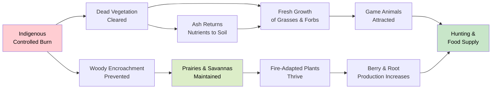

# Cultural and Indigenous Plant Uses

!!! mascot-welcome "A Chapter of Respect and Gratitude"
    
    Welcome to one of the most important chapters in this book. The native
    plants we have been studying are not just ecological resources — they are
    relatives, teachers, and sacred gifts in the worldviews of the Dakota and
    Ojibwe peoples who have called Minnesota home for thousands of years.
    Let's learn together with open hearts and deep respect.

## Summary

This chapter explores the deep and living relationships between Minnesota's Indigenous peoples and native plants. We introduce the field of ethnobotany and survey how the Dakota (also known as the Dakotah or Sioux) and Ojibwe (Anishinaabe) peoples have used plants for medicine, food, fiber, ceremony, and land stewardship. We also address the ethics of wild harvesting and the critical role of Indigenous land management practices — including intentional burning — in shaping the landscapes we see today. Throughout, we emphasize that Indigenous plant knowledge is not a historical curiosity. It is a living tradition held by sovereign nations, and engaging with it requires humility, respect, and a willingness to listen.

**A note on language:** This chapter uses the terms Dakota and Ojibwe as they are commonly used in Minnesota today. We recognize that these nations include many bands and communities with their own preferred names. When possible, we defer to the language and terminology used by the communities themselves.

## Indigenous Plant Knowledge

Long before European botanists arrived in Minnesota, the Dakota and Ojibwe peoples held vast, sophisticated knowledge of the plants around them. This knowledge was not written in textbooks. It was carried in oral traditions, songs, ceremonies, and daily practices passed from generation to generation over millennia.

Indigenous plant knowledge is not simply a list of "uses" for various species. It is embedded in a worldview that sees plants as living relatives rather than passive resources. In many Indigenous traditions, plants have spirit, agency, and purpose. Gathering a plant is a relationship, not a transaction — it involves asking permission, offering thanks (often through tobacco or prayer), and taking only what is needed.

### Key Characteristics of Indigenous Plant Knowledge

- **Relational** — Plants are understood through relationships, not just categories. A healer knows not only what a plant does but when and where to gather it, how to prepare it, and what songs or prayers accompany its use.

- **Place-based** — Knowledge is tied to specific landscapes, seasons, and ecological contexts. The same species may be understood differently depending on where it grows and when it is gathered.

- **Holistic** — Plants are rarely reduced to a single "active ingredient." Their use considers the whole plant, the whole person, and the whole community.

- **Dynamic** — Indigenous knowledge is not frozen in the past. It continues to evolve as communities adapt, innovate, and reclaim traditional practices.

!!! mascot-thinking "A Different Way of Knowing"
    
    Western science tends to ask, "What chemical compounds does this plant
    contain?" Indigenous knowledge asks, "What is my relationship with this
    plant, and what responsibilities come with that relationship?" Both
    approaches have value. Neither is complete without the other.

### Intellectual Sovereignty

It is important to understand that Indigenous plant knowledge belongs to the communities that hold it. Not all knowledge is meant to be shared publicly, and some knowledge is sacred or restricted to certain people, clans, or ceremonies. Throughout this chapter, we share only information that has been published with the consent of Indigenous communities or that is considered general public knowledge. We encourage readers to seek out Indigenous-led educational programs and publications rather than extracting knowledge from communities without permission.

## Ethnobotany Overview

The following diagram illustrates the many dimensions of Indigenous ethnobotanical knowledge, showing how a single native plant connects to multiple categories of use and cultural significance.

```mermaid
graph TD
    A["Native Plant"] --> B["Food"]
    A --> C["Medicine"]
    A --> D["Fiber & Craft"]
    A --> E["Ceremony & Ritual"]
    A --> F["Land Management"]

    B --> B1["Wild Rice"]
    B --> B2["Maple Sugar"]
    B --> B3["Berries & Roots"]

    C --> C1["Teas & Poultices"]
    C --> C2["Wound Care"]
    C --> C3["Respiratory Remedies"]

    D --> D1["Cordage & Rope"]
    D --> D2["Birch Bark Canoes"]
    D --> D3["Dyes & Weaving"]

    E --> E1["Tobacco Offerings"]
    E --> E2["Sweetgrass Smudging"]
    E --> E3["Cedar Purification"]

    F --> F1["Controlled Burning"]
    F --> F2["Selective Harvesting"]
    F --> F3["Transplanting & Tending"]

    style A fill:#C8E6C9,color:#000
    style B fill:#DCEDC8,color:#000
    style C fill:#FFCDD2,color:#000
    style D fill:#FFE0B2,color:#000
    style E fill:#E1BEE7,color:#000
    style F fill:#D7CCC8,color:#000
```

**Ethnobotany** is the scientific study of relationships between people and plants. The term combines "ethno" (relating to cultures and peoples) and "botany" (the study of plants). Ethnobotanists document how different cultures identify, name, classify, and use plants — for food, medicine, shelter, tools, dyes, ceremony, and more.

Explore the many dimensions of ethnobotanical knowledge with this interactive simulation, where you can browse native plants and discover their traditional uses across food, medicine, fiber, and ceremony.

<iframe src="../../sims/ethnobotany-explorer/main.html" width="100%" height="500px" scrolling="no"></iframe>

Ethnobotany Explorer

Type: microsim

**Learning Objective:** Students will understand how a single native plant connects to multiple categories of traditional use -- food, medicine, fiber, and ceremony -- reflecting the holistic nature of Indigenous ethnobotanical knowledge.

**Controls:**
- Category filter buttons (Food, Medicine, Fiber, Ceremony, All) to display plants by use type
- Clickable plant cards to reveal detailed information about each species

**Visual Elements:**
- Grid of illustrated plant cards showing common name, scientific name, and primary use icons
- Expanded card view with description of traditional uses, cultural context, and associated Indigenous nation(s)
- Color-coded category indicators on each card

**Behavior:**
- Selecting a category filter highlights plants with that use and dims others
- Clicking a plant card expands it to show full ethnobotanical details
- Plants with multiple uses appear under all relevant categories

**Instructional Rationale:**
By letting students explore plants across multiple use categories, this simulation reinforces the holistic and relational nature of Indigenous plant knowledge -- showing that plants are not reducible to a single purpose but participate in interconnected systems of food, healing, craft, and spiritual life.

### Ethnobotany in Minnesota

Minnesota has a rich ethnobotanical record. Early European observers, fur traders, and missionaries documented some Dakota and Ojibwe plant uses, though these accounts are often incomplete, biased, or taken out of context. More respectful and community-directed ethnobotanical work has emerged in recent decades, led by Indigenous scholars and collaborative research partnerships.

Key ethnobotanical resources related to Minnesota include:

- Published works by Ojibwe and Dakota scholars and community organizations
- Ethnobotanical collections at the University of Minnesota and the Minnesota Historical Society
- Tribal college programs in natural resource management and traditional ecological knowledge
- Community-based language revitalization projects that preserve plant names and associated knowledge in Dakota and Ojibwemowin (the Ojibwe language)

### The Ethics of Ethnobotany

Modern ethnobotany has grappled seriously with questions of power, consent, and intellectual property. Historically, outside researchers sometimes collected Indigenous knowledge without permission and published it for academic credit — or worse, used it to develop commercial products without compensation to the communities that originated the knowledge. This practice is known as **biopiracy**.

Today, ethical ethnobotany follows principles such as:

- **Free, prior, and informed consent** from participating communities
- **Community ownership** of data and publications
- **Benefit-sharing** when research leads to commercial or academic gain
- **Respect for restrictions** on sacred or private knowledge

## Medicinal Plant Uses

Indigenous peoples of Minnesota have used native plants for healing for thousands of years. This knowledge represents one of the longest-running systems of medicine on the continent. It is important to emphasize that traditional Indigenous medicine is a complete system of healing — not a collection of folk remedies. It encompasses physical, spiritual, emotional, and community dimensions of health.

### General Principles

In both Dakota and Ojibwe traditions, plant medicine is typically guided by trained practitioners — healers, medicine people, or elders who have received specific teachings. The identity and preparation of medicinal plants are often considered sacred knowledge, and not all of it is meant for public sharing.

That said, some medicinal uses of common Minnesota native plants are widely known and have been published with community consent:

- **Echinacea** (*Echinacea angustifolia*) — Used across many Indigenous nations for a variety of ailments. The roots were chewed, made into teas, or applied as poultices.

- **Wild Bergamot** (*Monarda fistulosa*) — Used as a tea for respiratory ailments and as an antiseptic. The Ojibwe also used it to treat colds and fevers.

- **Yarrow** (*Achillea millefolium*) — Applied to wounds to slow bleeding and prevent infection. Used internally as a tea for digestive complaints.

- **White Sage** (*Artemisia ludoviciana*) — Used in smudging and purification ceremonies across many Plains nations, including the Dakota.

- **Wild Ginger** (*Asarum canadense*) — The root was used by the Ojibwe as a mild stimulant, a digestive aid, and a flavoring for medicines.

### A Caution

This chapter does not provide medical advice. Traditional plant medicines were used within cultural systems that included extensive training, spiritual practices, and community support. Attempting to self-treat with wild plants based on incomplete information can be dangerous. Some plants that are safe when properly prepared can be toxic when misused. If you are interested in herbal medicine, seek guidance from qualified practitioners and respect the cultural contexts from which these traditions come.

## Food Plants Traditional

Native plants were central to the diets of Minnesota's Indigenous peoples. Far from simple foraging, traditional food systems involved sophisticated knowledge of plant identification, seasonal timing, processing techniques, storage methods, and sustainable harvest practices.

### Staple Food Plants

- **Wild Rice** (*Zizania palustris*) — Called *manoomin* in Ojibwemowin, wild rice is perhaps the most culturally important plant food in Minnesota. It grows in shallow lakes and rivers across the northern part of the state and has been a staple of the Ojibwe diet for centuries. The annual wild rice harvest is a communal event with deep spiritual significance. Wild rice is hand-harvested from canoes using wooden knockers — a practice that has remained essentially unchanged for generations.

- **Maple Sugar** — Sugar maples (*Acer saccharum*) provided the primary sweetener for both Dakota and Ojibwe peoples. The spring sugaring season (*iskigamizigan* in Ojibwemowin) was a major social and economic event. Sap was collected and boiled down into syrup, sugar cakes, and granulated sugar that could be stored and traded.

- **Prairie Turnip** (*Psoralea esculenta*) — Known as *tipsin* or *tipsinna* in Dakota, this starchy root vegetable was a staple food of the Dakota and other Plains peoples. The roots were dug in early summer, peeled, and dried for winter storage. Prairie turnips were also an important trade item.

### Fruits and Berries

Minnesota's native berry plants provided essential nutrition, especially vitamins during the long winter months. Many were dried, mixed with animal fats, and stored as concentrated food:

- **Chokecherry** (*Prunus virginiana*) — Dried and pounded into cakes or mixed with dried meat and fat to make pemmican
- **Wild Plum** (*Prunus americana*) — Eaten fresh or dried for winter
- **Juneberry / Serviceberry** (*Amelanchier* spp.) — Eaten fresh, dried, or cooked
- **Blueberry** (*Vaccinium* spp.) — Gathered in large quantities in northern Minnesota
- **Cranberry** (*Vaccinium macrocarpon*) — Harvested from bogs and used in food and medicine

### Other Food Plants

- **Wild Onion** (*Allium cernuum*) — Used as a seasoning and vegetable
- **Jerusalem Artichoke** (*Helianthus tuberosus*) — The starchy tubers were dug and eaten raw or cooked
- **Cattail** (*Typha latifolia*) — Nearly every part of the cattail was used: young shoots eaten as vegetables, pollen used as flour, roots processed for starch

!!! mascot-tip "Bree's Tip"
    
    Wild rice (*manoomin*) is not just food — it is a sacred gift in Ojibwe
    tradition. If you buy wild rice, look for hand-harvested, lake-grown rice
    from Indigenous producers. Cultivated paddy rice is a different product
    and does not support traditional harvesting communities.

## Fiber And Craft Plants

Native plants provided the raw materials for an enormous range of practical and artistic objects. From cordage to baskets to shelters, plant fibers and materials were essential to daily life.

### Key Fiber and Craft Plants

- **Basswood** (*Tilia americana*) — The inner bark (bast) of basswood was one of the most important fiber sources. It was soaked, stripped, and twisted into cordage, rope, bags, mats, and fishing nets. Basswood fiber is remarkably strong and flexible.

- **Birch Bark** (*Betula papyrifera*) — Paper birch bark was used by the Ojibwe for canoes, containers, housing covers, and scrolls. Birch bark is waterproof, lightweight, and can be peeled in large sheets without killing the tree when done properly. The iconic birch bark canoe is one of the great engineering achievements of Indigenous North America.

- **Cattail** (*Typha latifolia*) — The leaves were woven into mats for flooring, wall coverings, and temporary shelters. Cattail down (the fluffy seed heads) was used for insulation, padding, and wound dressing.

- **Bulrush** (*Schoenoplectus* spp.) — Woven into mats, bags, and other household items by both Dakota and Ojibwe peoples.

- **Dogbane** (*Apocynum cannabinum*) — The stem fibers were processed into strong cordage used for fishing line, snares, and netting. The process of extracting dogbane fiber is labor-intensive but produces remarkably strong thread.

- **Nettle** (*Urtica dioica*) — Like dogbane, nettle stems provided fine, strong fibers suitable for cordage and textiles.

### Dye Plants

Many native plants also provided dyes for coloring porcupine quills, fibers, and other materials:

- **Bloodroot** (*Sanguinaria canadensis*) — Produced red and orange dyes
- **Black Walnut** (*Juglans nigra*) — Hulls produced rich brown and black dyes
- **Goldthread** (*Coptis trifolia*) — Roots provided yellow dye
- **Wild Grape** (*Vitis riparia*) — Berries produced purple dye

## Ceremony And Ritual Plants

Certain plants hold deep spiritual significance in Dakota and Ojibwe traditions. It is important to approach this topic with particular care and humility. We share only what has been made publicly available by Indigenous communities and scholars, and we urge readers not to attempt to replicate ceremonies or spiritual practices outside their proper cultural context.

### Sacred Plants

Many Indigenous nations across North America recognize a group of sacred plants that play central roles in prayer, ceremony, and daily spiritual life. In the upper Midwest, these commonly include:

- **Tobacco** (*Nicotiana* spp.) — Tobacco is often described as the most sacred plant. It is used as an offering to the Creator, to the spirits, and to the land. When gathering plants, entering a sacred place, or beginning a ceremony, offering tobacco is a way of showing respect and asking permission. This is not the commercial tobacco found in cigarettes — it is a sacred, ceremonial substance.

- **Sweetgrass** (*Hierochloe odorata*) — Called *wiingashk* in Ojibwemowin, sweetgrass is braided and burned as a smudge (purifying smoke). Its sweet fragrance is associated with kindness, healing, and positive energy. Sweetgrass is often described as the hair of Mother Earth.

- **Sage** (*Artemisia* spp.) — Used for smudging, purification, and protection. Prairie sage and white sage are both used in various traditions.

- **Cedar** (*Thuja occidentalis*) — Northern white cedar is used in smudging, in medicine, and as a purifying agent. Cedar boughs are placed on the floor of sweat lodges and used in many healing practices.

### Respect for Sacred Practices

These plants and the ceremonies associated with them are not "traditions of the past." They are living spiritual practices observed by thousands of people today. Non-Indigenous people should not harvest sacred plants for personal spiritual use without invitation and guidance from Indigenous practitioners. Doing so removes the cultural context that gives these practices meaning and can cause real harm to communities that depend on these plant populations for their spiritual lives.

## Wild Harvest Ethics

As interest in foraging, herbalism, and wild foods has grown among the general public, questions about the ethics of wild harvesting have become increasingly important. This is especially true in Minnesota, where many of the plants being sought by recreational foragers are the same plants that Indigenous communities have relied on for millennia.

### Principles of Ethical Wild Harvesting

- **Know whose land you are on.** Minnesota is the homeland of the Dakota and Ojibwe peoples. Even on public land, consider the long history of Indigenous presence and use. On tribal lands, harvesting by non-tribal members is generally prohibited without permission.

- **Take only what you need.** This principle is central to Indigenous harvesting ethics. Never take all of a plant population from a site. A common guideline is to harvest no more than one-tenth of what you find.

- **Give thanks.** In many Indigenous traditions, gatherers offer tobacco or a prayer before harvesting. Even if you do not follow these specific practices, cultivating an attitude of gratitude toward the plants you gather is a meaningful shift away from purely extractive thinking.

- **Learn before you pick.** Misidentification can be dangerous. Some edible plants have toxic look-alikes. Invest time in learning from experienced mentors, field guides, and classes before harvesting wild plants.

- **Consider sustainability.** Some native plants are slow-growing or already under pressure from habitat loss, invasive species, and climate change. Before harvesting, ask whether the population can sustain the removal. Some species — such as wild ginseng and certain orchids — should never be wild-harvested.

- **Respect legal protections.** Many parks, nature preserves, and public lands prohibit or restrict plant harvesting. Always check regulations before gathering.

!!! mascot-tip "Bree's Tip"
    
    The best way to have a sustainable supply of native plants for food or
    medicine is to grow them yourself! Many native plant nurseries sell
    species that were traditionally used for food and medicine. Growing
    your own reduces pressure on wild populations.

### Avoiding Appropriation

There is an important distinction between learning about Indigenous plant uses and appropriating them. Appropriation occurs when people from outside a culture adopt its practices without understanding, permission, or respect — and especially when they profit from doing so while the originating community receives nothing.

To engage respectfully:

- Support Indigenous-led businesses, educational programs, and land stewardship initiatives
- Buy directly from Indigenous producers when purchasing wild rice, maple syrup, or other traditional foods
- Credit Indigenous knowledge rather than presenting it as generic "folk wisdom"
- Listen more than you speak, and accept that some knowledge is not yours to have

## Traditional Land Mgmt

One of the most important — and most overlooked — aspects of Indigenous plant knowledge is land management. For thousands of years, the Dakota, Ojibwe, and other Indigenous peoples actively managed Minnesota's landscapes. The prairies, savannas, and open woodlands that European settlers encountered were not "untouched wilderness." They were cultural landscapes, shaped by generations of intentional human stewardship.

### Methods of Traditional Land Management

- **Fire** — The most significant management tool, discussed in detail in the next section
- **Selective harvesting** — Taking specific plants while leaving others to maintain plant community diversity
- **Transplanting and tending** — Moving useful plants to favorable locations and caring for important patches of food or medicine plants
- **Trail and camp maintenance** — Clearing, burning, and managing vegetation along travel routes and at gathering sites
- **Hydrology management** — Modifying waterways to support wild rice beds and other aquatic food plants

### The Myth of Wilderness

The idea that pre-contact North America was an "untouched wilderness" is historically inaccurate. Indigenous peoples were active participants in shaping their environments. When European settlers arrived and described vast open prairies, parklike oak savannas, and productive wild rice lakes, they were seeing landscapes that had been managed — often through fire — for centuries or longer.

Understanding this history changes how we think about ecological restoration. Restoring a prairie is not about returning to a "natural" state that existed before humans. It is about reviving a human-plant partnership that sustained both the land and the people who lived on it.

## Indigenous Burning Practice

The following diagram shows the cyclical relationship between Indigenous burning practices and the ecosystem responses they produce.

Fire is arguably the single most important tool that Indigenous peoples used to manage Minnesota's landscapes. The practice of intentional, controlled burning — sometimes called cultural burning or prescribed fire — shaped the ecology of the entire region.

### Why Burn?

Indigenous peoples burned the land for many interconnected reasons:

- **Promoting fresh growth** — Fire clears dead vegetation and stimulates new shoots of grasses and forbs. This fresh growth attracted bison, deer, and other game animals, making hunting more productive.

- **Maintaining prairies and savannas** — Without regular fire, trees and shrubs encroach on grasslands. Burning kept prairies open and maintained the oak savannas that were once widespread in central Minnesota.

- **Encouraging food plants** — Many berry-producing shrubs, including blueberries and hazelnuts, fruit more abundantly after fire. Burning also promoted the growth of edible roots and tubers.

- **Reducing pest insects and disease** — Fire removed habitat for ticks, mosquitoes, and plant pathogens.

- **Clearing travel routes** — Burning kept trails and corridors open for movement and trade.

- **Nutrient recycling** — Ash from burned vegetation returned nutrients to the soil, promoting vigorous new growth the following season.

### Fire and Plant Adaptation

Many of Minnesota's native plants are not merely tolerant of fire — they depend on it. Prairie grasses such as Big Bluestem and Indian Grass have their growing points below the soil surface, where fire cannot reach them. After a burn, these grasses regenerate quickly from their roots while competing woody plants are killed back. Wildflowers like Prairie Smoke, Blazing Star, and many others flower more prolifically after fire.

This is not a coincidence. These plant communities co-evolved with Indigenous burning practices over thousands of years. The plants adapted to fire because fire was a regular, predictable part of their environment — maintained by human hands.

### The Consequences of Fire Suppression

When European settlers arrived, they suppressed fire across the landscape. The results were dramatic:

- Prairies were invaded by trees and shrubs, converting grasslands to woodland
- Oak savannas — one of Minnesota's most distinctive ecosystems — nearly disappeared
- Fuel accumulated on forest floors, leading to catastrophic wildfires rather than low-intensity, beneficial burns
- Fire-dependent plant species declined

Today, land managers across Minnesota use prescribed burns to restore and maintain prairies, savannas, and other fire-dependent ecosystems. Many of these modern practices draw directly from Indigenous burning knowledge — though this debt is not always acknowledged.

### Reviving Cultural Burning

In recent years, there has been a growing movement to return fire management authority to Indigenous communities and to integrate traditional burning knowledge with modern land management. Several tribal nations in Minnesota and across the country are leading cultural burning initiatives that restore both the ecological and cultural dimensions of this practice.

!!! mascot-celebration "Honoring the Knowledge Keepers"
    
    The prairies, savannas, and forests of Minnesota are not just natural
    wonders — they are living testaments to thousands of years of Indigenous
    stewardship. Every time we restore a prairie or conduct a prescribed
    burn, we are continuing a tradition that long predates our own arrival
    on this land. Let's carry that forward with gratitude and respect.

## Chapter Summary

In this chapter, you learned:

- **Indigenous plant knowledge** is relational, place-based, holistic, and dynamic — it is a living tradition, not a historical artifact
- **Ethnobotany** studies the relationships between peoples and plants, and modern ethical practice requires consent, respect, and benefit-sharing
- **Medicinal plant uses** among the Dakota and Ojibwe are part of complete healing systems that integrate physical, spiritual, and community dimensions
- **Traditional food systems** — including wild rice, maple sugar, prairie turnip, and many berries — reflect sophisticated ecological knowledge and sustainable practices
- **Fiber and craft plants** such as basswood, birch bark, cattail, and dogbane provided essential materials for daily life and artistic expression
- **Ceremony and ritual plants** including tobacco, sweetgrass, sage, and cedar hold deep spiritual significance and should be approached with respect
- **Wild harvest ethics** require knowing whose land you are on, taking only what you need, and avoiding cultural appropriation
- **Traditional land management** by Indigenous peoples actively shaped Minnesota's prairies, savannas, and forests for thousands of years
- **Indigenous burning practices** maintained fire-dependent ecosystems and co-evolved with native plant communities — a legacy that modern restoration efforts continue

## Concepts Covered

This chapter covers the following 9 concepts from the learning graph:

1. Indigenous Plant Knowledge
2. Ethnobotany Overview
3. Medicinal Plant Uses
4. Food Plants Traditional
5. Fiber And Craft Plants
6. Ceremony And Ritual Plants
7. Wild Harvest Ethics
8. Traditional Land Mgmt
9. Indigenous Burning Practice

## Prerequisites

A solid understanding of Minnesota's native plant communities (Chapters 1-5) will help you appreciate the ecological context for the cultural practices described here. Familiarity with prairie plants (Chapter 3), woodland plants (Chapter 4), and wetland plants (Chapter 5) is especially relevant, as many of the species discussed in this chapter appear in those earlier chapters.

## What's Next

In Chapter 14, we explore Minnesota-specific resources for native plant enthusiasts — including nurseries, organizations, online tools, and field guides that can support your learning and stewardship efforts.

[See Annotated References](./references.md)
