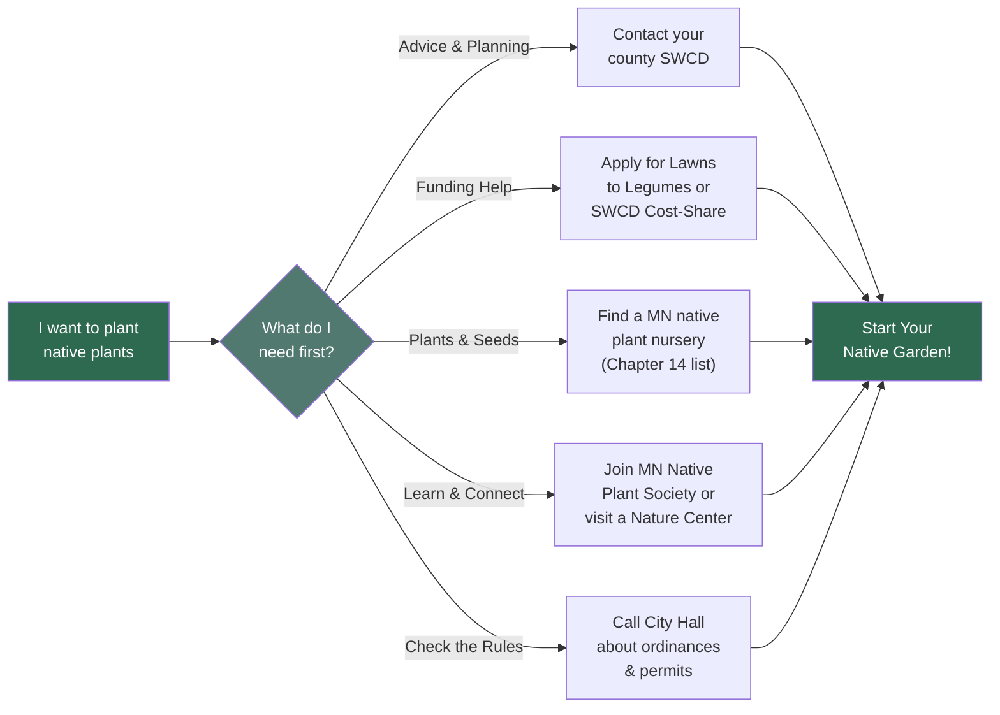
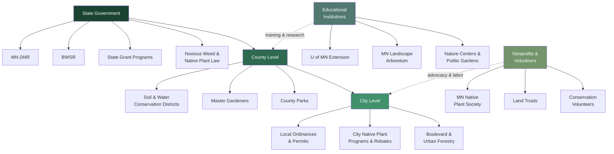

# Minnesota Native Plant Resources

!!! mascot-welcome "Welcome to Your Resource Guide!"
    
    Ready to take action? This chapter is your field guide to the organizations,
    programs, and people across Minnesota who can help you grow native plants,
    restore habitat, and connect with a community of like-minded gardeners and
    land stewards. Bookmark this one -- you'll come back to it often!

## Summary

Minnesota has a remarkably deep network of agencies, institutions, and volunteer organizations devoted to native plants, pollinators, and land conservation. This chapter organizes those resources from the broadest level (state government programs) down to your neighborhood (city ordinances and community gardens), then covers the educational institutions and nonprofit groups that tie it all together. Whether you need seeds, grant funding, technical advice, or volunteer opportunities, the right starting point is somewhere in this chapter.

---

## Part 1: State-Level Programs and Laws

State agencies set the regulatory framework and provide funding, data, and technical assistance that flow down to every county and city in Minnesota.

The following diagram shows the practical pathway for a Minnesota resident looking to start a native plant project, connecting the key resource types to common starting actions.

### MN DNR Programs

The Minnesota Department of Natural Resources is the state's primary agency for managing fish, wildlife, forests, and native plant communities. For native plant enthusiasts, the DNR offers several important resources:

- **Native Plant Community Classification** -- The DNR maintains the most comprehensive mapping and classification system for Minnesota's native plant communities, available through the Minnesota Biological Survey.

- **Scientific and Natural Areas (SNAs)** -- Over 160 protected sites across the state preserve the best remaining examples of native prairies, forests, and wetlands. Many are open to the public for hiking and nature study.

- **Seed Harvest Permits** -- The DNR issues permits for collecting native plant seeds from state-managed lands, allowing restoration projects to use locally sourced genetics.

- **Invasive Species Programs** -- The DNR coordinates statewide invasive species management, including public reporting tools, identification resources, and treatment guidelines.

- **Prescribed Burn Assistance** -- For landowners managing prairies or oak savannas, the DNR provides guidance and sometimes direct assistance with prescribed fire, which is essential for maintaining many native plant communities.

### BWSR Programs

The Board of Water and Soil Resources (BWSR) is a state agency focused on protecting Minnesota's water and soil through conservation practices. BWSR works primarily through local partners -- your county Soil and Water Conservation District (SWCD) and watershed districts.

Key BWSR programs relevant to native plants include:

- **Reinvest in Minnesota (RIM) Reserve** -- A permanent conservation easement program that pays landowners to retire marginal agricultural land and restore it to native vegetation, particularly around wetlands and waterways.

- **Minnesota Conservation Reserve Enhancement Program (MN CREP)** -- A state-federal partnership that targets the Minnesota River basin, paying farmers to convert cropland to native buffers and wetlands.

- **Wetland Conservation Act** -- BWSR administers Minnesota's wetland protection law, which requires that wetlands lost to development be replaced with restored or created wetlands planted with native species.

- **Buffer Law** -- Minnesota's buffer law requires perennial vegetative buffers of native or approved species along public waterways, providing habitat corridors and water quality benefits.

- **Technical Training** -- BWSR funds training for local conservation staff in native seed mixes, planting techniques, and restoration monitoring.

!!! mascot-tip "Finding Your Local Connection"
    
    Most BWSR programs are delivered through your county's Soil and Water
    Conservation District (SWCD). If you want to apply for cost-share funding
    or get free technical advice on a restoration project, your local SWCD
    office is the best first stop.

### MN Noxious Weed Law

Minnesota's Noxious Weed Law (Minnesota Statutes 18.75-18.91) requires landowners to control designated noxious weeds on their property. The law divides weeds into categories:

- **Prohibited Eradicate** -- Species that must be destroyed wherever found. These include Palmer amaranth and Oriental bittersweet.

- **Prohibited Control** -- Species that must be controlled to prevent spread. These include Canada thistle, leafy spurge, and purple loosestrife.

- **Restricted Noxious Weeds** -- Species that may not be sold, transported, or planted. These include common tansy and wild parsnip.

- **Specially Regulated Plants** -- Species with specific management requirements, such as poison ivy in certain settings.

Understanding the noxious weed law matters for native plant gardeners because some municipalities have used weed ordinances to target tall native plantings. Knowing the law helps you distinguish between genuinely harmful weeds and native plants that are sometimes mistakenly reported as "weeds."

### State Grant Programs

Minnesota offers several grant programs that fund native plant projects:

- **Lessard-Sams Outdoor Heritage Council (LSOHC)** -- Funded by the Clean Water, Land and Legacy Amendment, this council distributes tens of millions of dollars annually for habitat restoration, including prairie and wetland projects.

- **Environment and Natural Resources Trust Fund (ENRTF)** -- Funds research and management projects related to Minnesota's natural resources, including native plant restoration and invasive species control.

- **Clean Water Fund** -- Supports projects that protect and restore water quality, many of which involve planting native buffers, rain gardens, and shoreline restorations.

- **Lawns to Legumes** -- A state-funded program that provides coaching and cost-share grants to homeowners who convert portions of their lawns to pollinator-friendly native plantings. This is one of the most accessible programs for individual homeowners.

- **SWCD Cost-Share Programs** -- Many SWCDs administer local cost-share grants for native plantings, rain gardens, and conservation practices, often funded through a combination of state and local sources.

### MN Native Plant Law

Minnesota does not have a single comprehensive "native plant law," but several statutes and policies affect how native plants are used and protected:

- **Endangered and Threatened Species** -- Minnesota maintains its own state list of endangered, threatened, and special concern plant species, separate from the federal list. It is illegal to harvest, transplant, or destroy these species without a permit.

- **State Seed Law** -- Regulates the sale and labeling of seeds in Minnesota, including native plant seed mixes. Seed vendors must meet labeling requirements for species composition, purity, and germination rates.

- **Right to Dry / Right to Garden Legislation** -- While not specific to native plants, Minnesota has considered legislation protecting homeowners' rights to garden and landscape with native species against restrictive HOA covenants.

- **Roadside Vegetation Management** -- MnDOT and county highway departments are required to consider native species in roadside plantings and to manage roadsides in ways that support pollinator habitat.

### Pollinator Protection in Minnesota

Minnesota has been a national leader in pollinator protection. The state's efforts include:

- **Governor's Pollinator Protection Plan** -- Established a framework for protecting pollinators through habitat creation, pesticide management, and public education.

- **Lawns to Legumes Program** -- Directly funds homeowners converting lawn to pollinator habitat (see State Grant Programs above).

- **MnDOT Pollinator Habitat** -- The Minnesota Department of Transportation manages over 800,000 acres of roadsides and has adopted pollinator-friendly mowing schedules and native seeding practices.

- **Neonicotinoid Awareness** -- Minnesota has enacted restrictions and labeling requirements on certain neonicotinoid pesticides that harm pollinators.

- **Bee and Pollinator Research** -- The University of Minnesota Bee Lab conducts research on wild and managed bee populations, and its findings directly inform state policy.

---

## Part 2: County-Level Programs

Counties are where state programs meet local landscapes. Minnesota's 87 counties each have their own conservation infrastructure.

### County SWCD Programs

Every Minnesota county has a Soil and Water Conservation District. SWCDs are the front line for conservation technical assistance and typically offer:

- **Free site visits** to assess your property for native planting opportunities

- **Native seed mix design** tailored to your soil type, moisture conditions, and goals

- **Cost-share funding** for rain gardens, native plantings, shoreline restorations, and erosion control

- **Tree and shrub sales** -- Many SWCDs hold annual sales of native trees and shrubs at below-market prices

- **Conservation planning** for larger properties, including CRP and RIM enrollment assistance

- **Equipment loans** -- Some SWCDs loan out native seed drills, brush cutters, and other specialized restoration equipment

Your SWCD may also coordinate local prescribed burn cooperatives, invasive species removal events, and native plant workshops.

### County Master Gardeners

University of Minnesota Extension Master Gardener volunteers are active in nearly every Minnesota county. These trained volunteers provide free, research-based gardening advice to the public. For native plant gardeners, Master Gardeners can help with:

- **Plant selection** for your specific site conditions

- **Diagnostic services** -- Bring in a sick plant or a mystery weed, and Master Gardeners can help identify it and recommend treatment

- **Native plant demonstration gardens** -- Many county Master Gardener groups maintain public demonstration gardens showcasing native species

- **Community education** -- Workshops, plant sales, and garden tours focused on native and pollinator-friendly landscaping

- **Youth programs** -- Junior Master Gardener programs introduce young people to native plants and ecology

### County Park Programs

Minnesota's county parks are increasingly incorporating native plants into their management and programming:

- **Prairie and woodland restoration** -- Many county parks are actively restoring native plant communities through invasive removal, prescribed fire, and native seeding.

- **Interpretive programs** -- Naturalists at county parks lead wildflower hikes, prairie walks, and native plant identification programs.

- **Volunteer restoration days** -- County parks often host public volunteer events for invasive species removal and native planting.

- **Seed collection programs** -- Some county parks have organized seed collection events, teaching participants to identify and harvest native seeds.

- **Natural resource management plans** -- County parks with significant natural areas often publish management plans that describe their native plant communities and restoration goals.

---

## Part 3: City-Level Programs

Cities shape the day-to-day rules and opportunities for native plant gardening through ordinances, programs, and public land management.

### Local Ordinances

City ordinances can either support or hinder native plant gardening. Key ordinance areas to understand include:

- **Weed and vegetation height** -- Many cities have ordinances requiring vegetation to be kept below a certain height (often 8 to 12 inches). These ordinances were written with mowed lawns in mind and can conflict with native plantings. Some cities have adopted exemptions for managed native landscapes.

- **Native landscape permits** -- A growing number of Minnesota cities offer permits or registration for native plant gardens, protecting them from weed complaints as long as they meet certain standards (maintained edges, signage, setbacks from sidewalks).

- **Stormwater management** -- Cities increasingly require or incentivize rain gardens and native plantings for stormwater management in new development.

- **HOA restrictions** -- While cities cannot override private HOA covenants, some Minnesota cities have adopted "right to garden" policies that limit HOAs' ability to ban native plantings outright.

!!! mascot-thinking "Know Before You Grow"
    
    Before you rip out your lawn and plant prairie, check your city's
    ordinances and your HOA rules. A quick call to city hall can save you from
    a code violation. Many cities are supportive -- some even offer grants --
    but you may need to apply for a managed landscape permit first.

### City Native Plant Programs

Many Minnesota cities actively promote native plantings:

- **Adopt-a-Median and Adopt-a-Park Programs** -- Volunteer groups maintain native plantings in public spaces.

- **Residential cost-share programs** -- Cities like Woodbury, Minnetonka, Bloomington, and many others offer rebates or cost-share grants for homeowners who install rain gardens or convert lawn to native plantings.

- **City pollinator resolutions** -- Dozens of Minnesota cities have passed pollinator-friendly resolutions committing to reduced pesticide use and increased native habitat on public land.

- **City nature preserves** -- Many cities maintain natural areas with native plant communities, often with trails and interpretive signage.

- **Native plant giveaways** -- Some cities distribute free native plants or seed packets to residents at community events.

### Boulevard Planting Rules

Boulevards -- the strips of land between the sidewalk and the street -- are typically city-owned but maintained by adjacent property owners. Boulevard planting rules vary significantly by city:

- **Some cities allow only turf grass** on boulevards.

- **Many cities now permit low-growing native plants** on boulevards, often with restrictions on height (typically 18 to 24 inches maximum) and sight-line requirements near intersections.

- **Boulevard garden permits** may be required in some cities, specifying approved plant lists and maintenance standards.

- **Utilities and access** -- Boulevard plantings must allow access to underground utilities. Cities may require that plants be easily removable or set back from utility markers.

- **Snow storage and salt tolerance** -- Boulevard plants must tolerate road salt, snowplow damage, and compacted soil. Hardy native species like prairie dropseed, little bluestem, and black-eyed Susan are common boulevard choices.

### Urban Forestry Programs

Trees are native plants too, and many Minnesota cities have active urban forestry programs:

- **Tree planting programs** -- Cities often provide free or subsidized native trees to replace ash trees lost to emerald ash borer and elms lost to Dutch elm disease.

- **Approved tree lists** -- Most cities maintain lists of approved boulevard and yard trees. Native species like bur oak, sugar maple, hackberry, and ironwood are well represented.

- **Tree preservation ordinances** -- Some cities require permits to remove significant trees and may require replacement plantings with native species.

- **Community canopy goals** -- Many cities have adopted urban canopy goals and are prioritizing native species diversity to build resilience against future pest and disease outbreaks.

### Community Gardens

Community gardens offer another avenue for native plant education and growing:

- **Pollinator plots** -- Some community gardens designate plots or borders specifically for native pollinator plants.

- **Native plant education** -- Garden coordinators may offer workshops on incorporating native plants into vegetable gardens as companion plants, pest control, and pollinator attractors.

- **Shared native plant starts** -- Community gardeners often share native plant divisions, seeds, and knowledge.

- **School and youth gardens** -- Many school gardens in Minnesota incorporate native plant sections, connecting students to local ecology.

---

## Part 4: Educational Institutions

Minnesota's colleges, universities, and public gardens provide research, training, and hands-on learning opportunities for native plant enthusiasts at every level.

### University of Minnesota Extension

U of M Extension is the single most accessible source of research-based information on native plants for Minnesota residents:

- **Publication library** -- Extension publishes detailed guides on native plant selection, rain garden design, prairie establishment, invasive species management, and much more. Most publications are free online.

- **Yard and Garden website** -- A comprehensive online resource covering native plants, pollinators, lawn alternatives, and sustainable landscaping, all tailored to Minnesota's climate and soils.

- **Ask Extension** -- A free online service where you can submit questions about native plants, pest identification, or landscaping and receive answers from Extension specialists.

- **Master Gardener Program** -- Extension trains and coordinates Master Gardener volunteers statewide (see County Master Gardeners above and the dedicated section below).

- **Research plots and field days** -- Extension research stations around the state host field days where the public can see native plant trials and research in progress.

### MN Landscape Arboretum

The Minnesota Landscape Arboretum, operated by the University of Minnesota, is a 1,200-acre public garden and research facility in Chanhassen:

- **Native plant collections** -- The Arboretum maintains extensive collections of Minnesota native trees, shrubs, wildflowers, and grasses in naturalistic settings, including restored prairies and woodlands.

- **Classes and workshops** -- The Arboretum offers year-round classes on native plant gardening, prairie restoration, rain garden design, and landscape ecology.

- **Plant evaluation** -- The Arboretum tests native plant cultivars and species for landscape performance in Minnesota's climate, providing valuable information for gardeners choosing plants.

- **Seed and plant sales** -- Annual sales feature native plants and seeds suited to Minnesota gardens.

- **Trails and self-guided tours** -- Miles of trails wind through native plant communities, offering opportunities for informal plant identification practice.

### MN State College Programs

Several Minnesota colleges and universities offer programs related to native plants and ecological restoration:

- **University of Minnesota** -- Offers degrees in ecology, conservation biology, forestry, and horticulture. The College of Biological Sciences and College of Food, Agricultural and Natural Resource Sciences both conduct native plant research.

- **Bemidji State University** -- Offers programs in environmental studies with fieldwork in northern Minnesota's native ecosystems.

- **Minnesota State University, Mankato** -- Its biology department studies prairie ecology in the Minnesota River valley.

- **Community and Technical Colleges** -- Several offer natural resources technician programs that include native plant identification and restoration skills, such as Vermilion Community College's Wilderness and Park Management program.

- **Continuing education** -- Many institutions offer non-credit workshops and certificate programs in ecological restoration, sustainable landscaping, and native plant propagation open to the general public.

### Eloise Butler Wildflower Garden

The Eloise Butler Wildflower Garden and Bird Sanctuary in Minneapolis is the oldest public wildflower garden in the United States, established in 1907:

- **Living collection** -- The garden contains over 500 species of native plants in naturalistic bog, wetland, woodland, and prairie settings within Theodore Wirth Park.

- **Guided walks** -- Naturalists lead seasonal walks focusing on wildflower identification, bird-plant relationships, and ecological concepts.

- **Volunteer opportunities** -- The Friends of the Wild Flower Garden supports the site with volunteer gardening, invasive removal, and educational programming.

- **Martha Crone Visitors Shelter** -- The garden's interpretive center provides exhibits, reference materials, and a starting point for self-guided exploration.

- **Historical significance** -- The garden's century-plus history makes it a living record of changes in Minnesota's native plant communities and a model for public native plant education.

### Como Park Conservatory

The Marjorie McNeely Conservatory at Como Park in Saint Paul, while best known for its tropical collections, also supports native plant education:

- **Outdoor gardens** -- The grounds around the conservatory include native plant gardens, a Japanese garden, and seasonal displays that sometimes feature Minnesota native species.

- **Ordway Japanese Garden** -- Demonstrates principles of naturalistic design that can inspire native plant garden layouts.

- **Educational programs** -- Como Zoo and Conservatory offers school and public programs on pollinators, plant science, and local ecology.

- **Free admission** -- Como operates on a suggested-donation model, making it one of the most accessible public gardens in the state.

- **Seasonal shows** -- The spring flower show and fall mum show occasionally feature native species alongside ornamentals.

### Nature Center Programs

Minnesota has dozens of nature centers across the state, and they are among the best places to learn about native plants in the field:

- **Naturalist-led programs** -- Wildflower hikes, bird walks, mushroom forays, and seasonal ecology programs introduce participants to native plant communities in context.

- **Demonstration gardens** -- Many nature centers maintain native rain gardens, pollinator gardens, and prairie demonstration plots.

- **Youth and school programs** -- Nature centers are primary providers of outdoor environmental education for Minnesota students, covering plant identification, ecosystem concepts, and habitat.

- **Volunteer restoration** -- Nature centers frequently organize volunteer events for invasive species removal and native planting.

- **Notable nature centers** -- Eastman Nature Center (Maple Grove), Wood Lake Nature Center (Richfield), Dodge Nature Center (West Saint Paul), Westwood Hills Nature Center (Saint Louis Park), Lee & Rose Warner Nature Center (Marine on Saint Croix), Hartley Nature Center (Duluth), and Quarry Hill Nature Center (Rochester) are just a few of the many nature centers active in native plant programming.

!!! mascot-tip "Visit a Nature Center"
    
    Want to see what native plants look like in the wild before you plant
    them in your yard? A visit to your nearest nature center is the best
    way to start. Most offer free or low-cost admission, and naturalists
    are happy to answer questions.

### Master Gardener Program

The University of Minnesota Extension Master Gardener Program is one of the most impactful volunteer training programs in the state for native plant education:

- **Training** -- Volunteers complete 50 hours of classroom training covering horticulture, plant science, soils, pest management, and sustainable landscaping, including significant content on native plants.

- **Service commitment** -- After training, Master Gardeners contribute a minimum of 50 volunteer hours annually, providing free gardening advice through clinics, hotlines, farmers markets, and public events.

- **Continuing education** -- Master Gardeners receive ongoing training each year, with many choosing to specialize in native plants, pollinators, or ecological landscaping.

- **Community reach** -- Minnesota has thousands of active Master Gardener volunteers across the state, making them one of the most widely available sources of free, expert gardening advice.

- **Becoming a Master Gardener** -- Applications are typically accepted in late summer and fall through your county Extension office. The program is open to anyone with a passion for gardening and a willingness to serve the community.

---

## Part 5: Nonprofit and Volunteer Organizations

Minnesota's native plant movement is powered by a passionate network of nonprofit organizations and volunteer groups.

### MN Native Plant Society

The Minnesota Native Plant Society (MNNPS) is the state's dedicated native plant organization:

- **Field trips** -- MNNPS organizes botanical field trips to prairies, forests, wetlands, and other native plant communities across the state, led by knowledgeable botanists.

- **Meetings and presentations** -- Monthly meetings (often held at the Minnesota Landscape Arboretum) feature talks by researchers, land managers, and native plant experts.

- **Plant sales** -- The society's annual plant sale is a top source for hard-to-find native species, with plants propagated by members and local native plant nurseries.

- **Newsletter and resources** -- MNNPS publishes a newsletter with articles on native plant identification, conservation, and gardening.

- **Advocacy** -- The society advocates for native plant conservation in state policy, land management, and public education.

### Pollinator Nonprofits in Minnesota

Several organizations focus specifically on pollinator conservation in Minnesota:

- **Xerces Society** -- While national in scope, the Xerces Society has staff and projects in Minnesota focused on pollinator habitat, pesticide reduction, and monarch butterfly conservation.

- **Pollinate Minnesota** -- A state-focused nonprofit that promotes pollinator-friendly landscaping, offers educational programs, and advocates for pollinator protection policies.

- **Monarch Joint Venture** -- Headquartered at the University of Minnesota, this partnership coordinates monarch butterfly conservation across the monarch's migratory range, with particular emphasis on milkweed and nectar plant habitat in Minnesota.

- **Bee Lab at the University of Minnesota** -- While a research lab rather than a nonprofit, the Bee Lab engages the public through outreach events, publications, and citizen science projects.

- **Local pollinator groups** -- Many communities have local pollinator advocacy groups that organize plantings, education events, and neighborhood habitat corridors.

### Land Trust Organizations

Land trusts permanently protect land through conservation easements and land acquisition:

- **The Trust for Public Land** -- Works in Minnesota to protect land for public parks, trails, and conservation, including native habitat.

- **Minnesota Land Trust** -- The state's largest land trust, protecting tens of thousands of acres through conservation easements. Works with private landowners who want to permanently protect native prairies, forests, wetlands, and shorelines on their property.

- **The Nature Conservancy in Minnesota** -- Manages preserves across the state, including some of Minnesota's finest remaining prairies and forests. Offers volunteer days and public programs at many sites.

- **Local and regional land trusts** -- Organizations like the Great River Greening, Mississippi Park Connection, and Saint Croix Valley Foundation protect land and restore native habitat at the regional level.

### Conservation Volunteers

Volunteer organizations provide the people-power for hands-on native plant restoration:

- **Conservation Corps Minnesota & Iowa** -- A youth and young adult conservation corps that provides crews for large-scale restoration projects, invasive species removal, and native planting on public and private lands.

- **Great River Greening** -- Organizes thousands of volunteers annually for tree planting, prairie seeding, invasive removal, and shoreline restoration projects across the Twin Cities metro and greater Minnesota.

- **Friends groups** -- Many state parks, scientific and natural areas, county parks, and nature centers have "friends" organizations that coordinate volunteers for restoration and stewardship.

- **Master Naturalists** -- The University of Minnesota Extension Master Naturalist program trains volunteers in ecology and natural resource stewardship, with graduates contributing to conservation projects statewide.

- **Corporate and faith-based volunteer groups** -- Many restoration organizations welcome group volunteer events, making native plant restoration accessible to people of all backgrounds.

### Prairie Enthusiasts

The Prairie Enthusiasts is a regional nonprofit focused on prairie conservation in the upper Midwest:

- **Prairie protection** -- The organization acquires and manages prairie remnants and conducts restoration on degraded sites in southeastern and southwestern Minnesota.

- **Seed harvesting** -- The Prairie Enthusiasts organize volunteer seed harvesting events on protected prairies, collecting locally adapted seed for restoration projects.

- **Prescribed burning** -- The organization coordinates volunteer burn crews that help maintain prairie health through prescribed fire.

- **Education and outreach** -- Field trips, workshops, and public presentations introduce participants to prairie ecology, plant identification, and restoration techniques.

- **Chapters** -- The Prairie Enthusiasts operates through local chapters, allowing volunteers to participate in conservation close to home. The Minnesota chapters focus on the bluff prairies, sand prairies, and tallgrass prairies of the state's western and southern regions.

---

## Resource Hierarchy

The following diagram shows how Minnesota's native plant resources are organized from state-level programs down to local community organizations, illustrating how support flows through multiple levels.

Use this interactive tool to filter Minnesota native plant resources by type and find the organizations, programs, and services most relevant to your needs and location.

<iframe src="../../sims/mn-resource-finder/main.html" width="100%" height="500px" scrolling="no"></iframe>

Minnesota Resource Finder

Type: microsim

**Learning Objective:** Students will be able to navigate the multi-layered landscape of Minnesota native plant resources by filtering organizations and programs by type (state, county, city, education, nonprofit) and focus area.

**Controls:**
- Dropdown or button filters for resource level (State, County, City, Educational, Nonprofit)
- Text search box to filter by keyword
- Toggle to show or hide program descriptions

**Visual Elements:**
- Filterable list or card grid of Minnesota native plant resources
- Icons indicating resource type (government, education, nonprofit, funding)
- Brief description and link placeholder for each resource

**Behavior:**
- Selecting a resource level filter displays only resources at that level
- Keyword search narrows results across all fields (name, description, type)
- Clicking a resource card expands it to show full details and related programs

**Instructional Rationale:**
The sheer number of resources available in Minnesota can be overwhelming for newcomers. This simulation helps students develop a mental model of how resources are organized -- from state agencies down to neighborhood groups -- and practice finding the right starting point for their specific needs.

## How to Get Started

With so many resources available, it can be hard to know where to begin. Here is a practical starting path:

1. **Check your city's website** for native plant programs, rain garden rebates, or managed landscape permits.

2. **Contact your county SWCD** for a free site visit and advice on what to plant.

3. **Visit a nature center or the Eloise Butler Wildflower Garden** to see native plants in natural settings.

4. **Apply for the Lawns to Legumes program** if you are a homeowner interested in converting lawn to pollinator habitat.

5. **Join the Minnesota Native Plant Society** to connect with fellow enthusiasts and attend field trips.

6. **Volunteer with Great River Greening or a local friends group** to gain hands-on restoration experience.

7. **Explore U of M Extension's online resources** for plant selection guides, planting instructions, and troubleshooting.

## Chapter Summary

!!! mascot-celebration "You've Got Resources!"
    
    Minnesota is one of the best places in the country to be a native plant
    gardener. From state grant programs to neighborhood nature centers,
    you have an incredible support network ready to help you get started
    and keep growing. Now go explore!

In this chapter, you explored the full landscape of Minnesota native plant resources:

- **State programs** from the DNR, BWSR, and legislature provide funding, data, technical assistance, and legal frameworks for native plant conservation and restoration.

- **State laws** on noxious weeds, endangered species, and seed quality protect both native ecosystems and gardeners.

- **Pollinator protection** initiatives make Minnesota a national leader in habitat creation and pesticide management.

- **County SWCDs and Master Gardeners** deliver hands-on help and cost-share funding directly to landowners and gardeners.

- **County and city parks** demonstrate native plant management and offer volunteer restoration opportunities.

- **City ordinances** can support or complicate native landscaping -- knowing the rules is essential.

- **Educational institutions** including U of M Extension, the Landscape Arboretum, Eloise Butler Garden, and nature centers provide classes, resources, and inspiration.

- **Nonprofits and volunteer groups** from the MN Native Plant Society to the Prairie Enthusiasts provide community, advocacy, and hands-on conservation opportunities.

## Concepts Covered

This chapter covers the following 26 concepts from the learning graph:

1. MN DNR Programs
2. BWSR Programs
3. MN Noxious Weed Law
4. State Grant Programs
5. MN Native Plant Law
6. Pollinator Protection MN
7. County SWCD Programs
8. County Master Gardeners
9. County Park Programs
10. Local Ordinances
11. City Native Plant Programs
12. Boulevard Planting Rules
13. Urban Forestry Programs
14. Community Gardens
15. U Of MN Extension
16. MN Landscape Arboretum
17. MN State College Programs
18. Eloise Butler Garden
19. Como Park Conservatory
20. Nature Center Programs
21. MN Native Plant Society
22. Pollinator Nonprofits MN
23. Land Trust Organizations
24. Conservation Volunteers
25. Prairie Enthusiasts
26. Master Gardener Program

## Prerequisites

This chapter assumes you have completed [Chapter 1: Introduction to Native Plants and Ecology](../01-intro-native-plants-ecology/index.md), which provides the foundational vocabulary for native plants, ecosystems, and biodiversity referenced throughout this resource guide.

## What's Next

In Chapter 15, we'll step back and look at the big picture -- how systems thinking and ecological principles connect everything you've learned into a holistic understanding of Minnesota's native plant communities.
