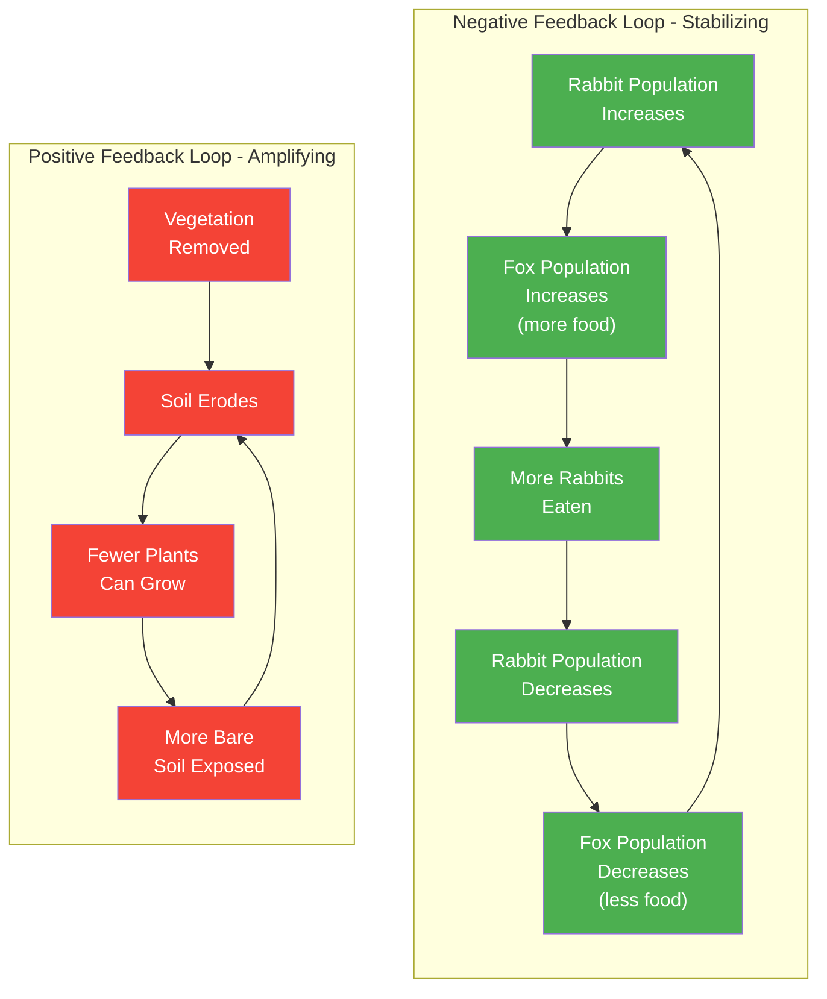
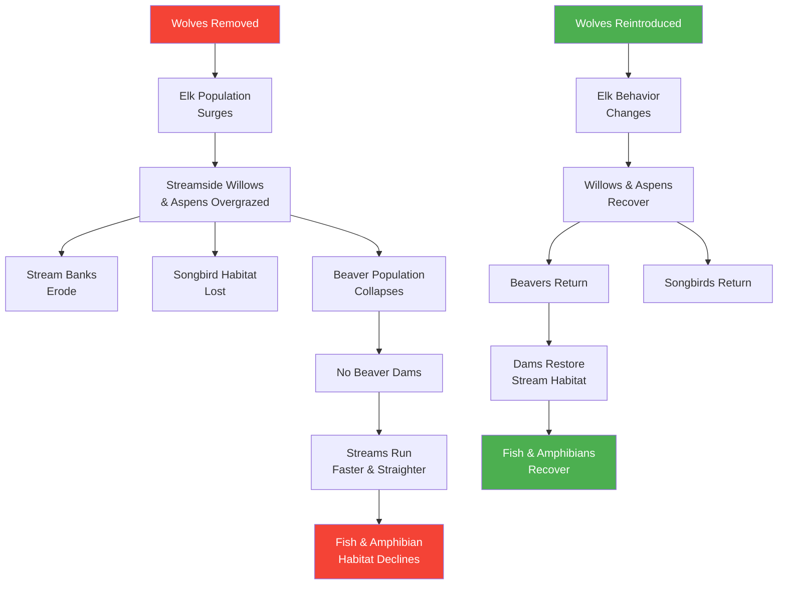

# Systems Thinking in Ecology

!!! mascot-welcome "Welcome, Systems Thinkers!"
    
    Ready to see the big picture? In this chapter, we step back from individual
    plants and species to examine the vast web of connections that holds
    ecosystems together. Once you start thinking in systems, you will never
    look at a prairie, forest, or wetland the same way again.

## Summary

This chapter introduces systems thinking as a framework for understanding ecological complexity. You will learn how feedback loops, trophic cascades, and emergent properties shape the natural world. We explore how nutrients cycle, how carbon is stored, how underground fungal networks connect trees, and why biodiversity is essential for ecosystem stability. By the end, you will be equipped to see Minnesota's native plant communities not as collections of individual species, but as deeply interconnected living systems.

## What Is Systems Thinking?

Most of the time, we think in straight lines. We plant a seed, it grows, we enjoy the flower. But nature does not work in straight lines. It works in circles, webs, and feedback loops.

**Systems thinking** is a way of understanding the world by looking at the relationships between parts, rather than studying each part in isolation. Instead of asking "What does this plant do?" a systems thinker asks "How does this plant interact with everything around it, and what happens when it is removed?"

A system has three essential characteristics:

- **Components** — the individual parts (plants, animals, soil, water, sunlight)
- **Interconnections** — the relationships between those parts (pollination, predation, nutrient exchange)
- **Purpose or function** — the overall behavior that emerges from the interactions (a healthy prairie that sustains itself year after year)

!!! mascot-thinking "Think About It"
    
    Consider a car. You can study the engine, the wheels, and the seats
    separately, but a pile of car parts is not a car. It only becomes a car
    when everything is connected and working together. Ecosystems are the
    same way -- the magic is in the connections.

Understanding systems thinking is essential because ecological problems rarely have single causes or simple fixes. When we intervene in a system without understanding its connections, we often create new problems worse than the ones we set out to solve.

## Ecosystem Interconnections

Every organism in an ecosystem is connected to others through multiple pathways. A single oak tree in a Minnesota forest participates in hundreds of relationships simultaneously:

- Its roots exchange nutrients with mycorrhizal fungi
- Its acorns feed squirrels, deer, turkeys, and blue jays
- Its branches shelter nesting birds and overwintering insects
- Its leaves shade the forest floor, determining which wildflowers can grow beneath it
- Its fallen leaves feed soil organisms that build the humus other plants depend on
- Its trunk hosts lichens, mosses, and wood-boring beetles

Remove that oak tree and you do not lose just one species. You disrupt an entire constellation of relationships. Some species will decline. Others may temporarily increase. The ripple effects can take decades to fully play out.

This interconnectedness means that when we manage or restore ecosystems, we must think broadly. Planting a native prairie is not just about selecting pretty wildflowers. It is about rebuilding a network of relationships among plants, pollinators, soil microbes, fungi, and wildlife.

## Feedback Loops in Ecology

A **feedback loop** occurs when the output of a process circles back to influence the input. Ecosystems are full of feedback loops, and understanding them is key to understanding why systems behave the way they do.

### Negative Feedback Loops (Stabilizing)

Negative feedback loops keep systems in balance. They are the thermostats of nature.

- **Predator-prey cycles**: When rabbit populations grow, fox populations also grow (more food means more foxes). More foxes eat more rabbits, bringing the rabbit population back down. Fewer rabbits mean fewer foxes. The cycle repeats, keeping both populations within a sustainable range.
- **Plant competition for light**: When a canopy gap opens in a forest, many seedlings rush to fill it. As the fastest-growing trees shade out competitors, growth slows and the canopy stabilizes.
- **Soil nutrient regulation**: As plants absorb nutrients and grow, they produce leaf litter that decomposes and returns nutrients to the soil, replenishing what was taken.

The following diagram contrasts a stabilizing negative feedback loop with a destructive positive feedback loop, both common in Minnesota ecosystems.

### Positive Feedback Loops (Amplifying)

Positive feedback loops amplify change. They can drive rapid transformation, for better or worse.

- **Erosion spirals**: When vegetation is removed from a hillside, rain erodes soil. Less soil means fewer plants can grow. Fewer plants mean more erosion. The cycle accelerates until the hillside is bare.
- **Invasive species takeover**: Garlic mustard releases chemicals that kill beneficial soil fungi. Without those fungi, native plants struggle. As natives decline, garlic mustard spreads further, releasing more chemicals. The invasion feeds itself.
- **Wetland drying**: When a wetland loses water, peat begins to decompose and compact. The basin shrinks, holding even less water. Less water accelerates decomposition. The wetland can disappear entirely.

!!! mascot-thinking "Think About It"
    
    Positive feedback loops are not "good" -- the word "positive" here means
    the loop amplifies a trend. An erosion spiral is a positive feedback loop,
    even though its effects are destructive. Negative feedback loops are not
    "bad" -- they are stabilizing forces that keep ecosystems in balance.

Build your own feedback loops by connecting ecosystem components in this interactive simulation, and observe how positive and negative feedback dynamics shape ecological outcomes.

<iframe src="../../sims/feedback-loop-explorer/main.html" width="100%" height="500px" scrolling="no"></iframe>

Feedback Loop Explorer

Type: microsim

**Learning Objective:** Students will understand how positive (amplifying) and negative (stabilizing) feedback loops operate in ecosystems by constructing and visualizing their own loop diagrams from ecosystem components.

**Controls:**
- Draggable ecosystem component nodes (e.g., vegetation, soil, herbivores, predators, water, nutrients)
- Arrow-drawing tool to connect components and define influence direction
- Toggle to label each connection as positive (+) or negative (-) influence
- Reset button to clear the canvas and start over

**Visual Elements:**
- Canvas with ecosystem component icons that can be placed and connected
- Arrows between components colored by influence type (green for positive, red for negative)
- Automatic detection and highlighting of completed loops with label (reinforcing or balancing)
- Example starter loops that students can modify

**Behavior:**
- Dragging components onto the canvas and drawing arrows between them creates a systems diagram
- When a closed loop is formed, the simulation highlights it and identifies whether it is reinforcing (positive) or balancing (negative)
- Hovering over a loop displays a plain-language explanation of how the feedback operates
- Students can build multiple loops on the same canvas to see how they interact

**Instructional Rationale:**
Feedback loops are central to systems thinking but difficult to grasp from static diagrams alone. By actively constructing loops and receiving immediate visual feedback on loop type and behavior, students develop intuition for how small changes can either stabilize or destabilize ecosystems.

## Trophic Cascades

A **trophic cascade** is one of the most dramatic demonstrations of systems thinking in ecology. It occurs when changes at one level of a food chain ripple up or down to transform an entire ecosystem.

The most famous example comes from Yellowstone National Park. In the 1920s, wolves were eliminated from Yellowstone. Without their top predator, elk populations surged. The growing herds overgrazed streamside willows, aspens, and other vegetation. Without that vegetation:

- Stream banks eroded
- Songbird populations declined (no nesting habitat)
- Beaver populations collapsed (no willows to eat or build dams with)
- Without beaver dams, streams ran faster and straighter, reducing habitat for fish and amphibians
- The physical shape of rivers changed

Then, in 1995, wolves were reintroduced to Yellowstone. As wolf packs re-established territories, elk behavior changed. The herds moved more frequently and avoided lingering in open valleys where they were vulnerable. Willows and aspens began to recover along streams. Beavers returned. Songbirds returned. Stream channels stabilized and began to meander again. The wolves did not just reduce elk numbers -- they changed how elk used the landscape, and the effects cascaded through the entire ecosystem.

!!! mascot-thinking "Think About It"
    
    The Yellowstone wolf story illustrates a profound systems principle:
    removing or adding a single species can reshape an entire landscape.
    When you plant a native garden, you are participating in trophic
    relationships -- every plant you choose feeds something, shelters
    something, and connects to something else.

The following diagram illustrates the trophic cascade effect, showing how changes at the top predator level ripple down through an entire ecosystem.

### Trophic Cascades in Minnesota

Minnesota has its own trophic cascade stories. The decline of wolves across much of the state has contributed to deer overpopulation in some areas. Overbrowsing by white-tailed deer prevents the regeneration of forest understory plants, including trilliums, native orchids, and young tree seedlings. This affects ground-nesting birds, insects that depend on those plants, and the long-term composition of the forest itself.

## Unintended Consequences

Systems thinking teaches us to expect surprises. When we intervene in a complex system, the results are often different from what we intended.

**Historical examples in Minnesota**:

- **Draining wetlands for agriculture** seemed like a simple improvement -- more farmland, more crops. But removing wetlands eliminated natural flood control, destroyed wildlife habitat, removed natural water filtration, and contributed to downstream water quality problems that persist today.
- **Planting non-native grasses for erosion control** solved the immediate erosion problem but created monocultures that provide almost no food for native insects or wildlife.
- **Suppressing all wildfires** protected property in the short term but allowed woody shrubs and trees to invade prairies that depend on periodic fire for renewal. Without fire, prairies accumulate thatch, shade out wildflowers, and eventually convert to woodland.

The lesson is not that we should never intervene. It is that we should think carefully about the full web of consequences before acting, and we should monitor the results of our actions and be willing to adapt.

## Emergent Properties

An **emergent property** is a characteristic of a system that does not exist in any of its individual parts. It arises only from the interactions among parts.

Consider these examples:

- A single prairie plant cannot sustain a population of bison. But a prairie ecosystem with hundreds of species, deep root networks, fire cycles, and nutrient recycling can support enormous herds across vast landscapes. The capacity to sustain large grazers is an emergent property of the whole system.
- No individual tree produces "forest climate." But a forest of thousands of trees collectively moderates temperature, increases humidity, reduces wind, and creates microclimates that would not exist without the forest as a whole.
- A single bee cannot pollinate a prairie. But a diverse community of pollinators -- bumblebees, solitary bees, butterflies, moths, beetles, flies -- collectively ensures that nearly every flower gets pollinated. Effective pollination is an emergent property of pollinator diversity.

Emergent properties explain why we cannot understand ecosystems by studying their components in isolation. The whole is genuinely more than the sum of its parts.

## Resilience in Ecosystems

**Resilience** is the ability of an ecosystem to absorb disturbance and still maintain its essential structure and function. A resilient prairie can survive drought, fire, and grazing and bounce back. A degraded system with low diversity may collapse under the same pressures.

What makes ecosystems resilient?

- **Biodiversity** -- if one species fails, others can fill its role
- **Functional redundancy** -- multiple species performing similar functions (several bee species that all pollinate the same flowers)
- **Genetic diversity** -- variation within species allows adaptation to changing conditions
- **Intact food webs** -- complete trophic structures with predators, herbivores, and decomposers
- **Healthy soils** -- deep organic soils buffer against drought and flood

Minnesota's remaining native prairies are remarkably resilient. They have survived thousands of years of drought, fire, grazing, and extreme weather. But even resilient systems have limits. When disturbance is too severe or too prolonged -- decades of overgrazing, widespread herbicide application, complete destruction for development -- the system can cross a threshold beyond which recovery is no longer possible without intensive intervention.

## Keystone Species

A **keystone species** is one whose impact on its ecosystem is disproportionately large relative to its abundance. Remove a keystone species and the entire system changes dramatically.

The concept comes from architecture: remove the keystone from an arch and the whole structure collapses, even though the keystone is just one of many stones.

**Examples relevant to Minnesota**:

- **Beavers** are ecosystem engineers. Their dams create ponds, wetlands, and meadows that support an enormous diversity of other species. A single beaver family can transform a narrow stream into a complex mosaic of aquatic and terrestrial habitats.
- **Prairie dogs** (found in western Minnesota historically) excavate burrow systems used by dozens of other species. Their grazing maintains the short-grass areas that certain birds and insects require.
- **Oak trees** in Minnesota forests produce acorns that are a critical food source for dozens of mammal and bird species. Their deep litter layer and wide canopy create conditions that define the woodland ecosystem beneath them.
- **Wolves** as discussed in the trophic cascades section, regulate herbivore behavior and populations, with cascading effects throughout the food web.

Keystone species remind us that not all species are interchangeable. Losing a keystone species can trigger changes far beyond what the loss of a single species might suggest.

## Edge Effects

An **edge effect** occurs where two different ecosystems or habitat types meet. The boundary zone -- the ecotone -- often has characteristics distinct from either adjacent habitat.

In Minnesota, common edges include:

- **Prairie-forest borders** -- these transitional zones (sometimes called savannas) support species from both communities plus unique edge-adapted species
- **Wetland-upland transitions** -- gradients of moisture create zones where wetland species and upland species intermingle
- **Agricultural field margins** -- where cropland meets native habitat, creating corridors and refugia for wildlife

Edge effects can be positive or negative:

- **Positive**: Edges often support higher species diversity because organisms from both habitats overlap. Many birds and mammals prefer edge habitats for feeding and nesting.
- **Negative**: When habitat is fragmented into small patches, the ratio of edge to interior increases. Species that require large areas of unbroken habitat -- certain forest-interior birds, for example -- decline as edges proliferate. Edges also serve as invasion corridors for aggressive non-native species.

For land managers and gardeners, understanding edge effects helps with design. A native garden at the edge of a woodland and a lawn creates a transitional zone that can support a wider variety of species than either habitat alone.

## Ecological Succession

**Ecological succession** is the process by which the species composition of an ecosystem changes over time. It is a system-level phenomenon -- no individual species "decides" to succeed; the changes emerge from the interactions among species and their environment.

### Primary Succession

Primary succession occurs on surfaces with no prior biological community -- bare rock, volcanic lava, or glacial till. In Minnesota, primary succession began after the glaciers retreated roughly 10,000 years ago. Lichens colonized bare rock, slowly breaking it down. Mosses followed, building thin soil. Grasses and wildflowers took root. Eventually, forests developed on land that was once solid ice.

### Secondary Succession

Secondary succession occurs after a disturbance that removes vegetation but leaves soil intact -- a fire, flood, logged forest, or abandoned farm field.

A typical sequence in Minnesota might look like this:

- **Year 1-3**: Annual weeds and grasses colonize bare ground
- **Year 3-10**: Perennial grasses and wildflowers establish
- **Year 10-30**: Shrubs and fast-growing trees (aspens, birches) move in
- **Year 30-100**: Shade-tolerant species (oaks, maples, basswood) gradually replace the pioneers
- **Year 100+**: A mature forest with a complex canopy, understory, and ground layer develops

Understanding succession is important for restoration. If you plant a prairie but do not manage it with fire or mowing, succession will eventually convert it to woodland. Prairies are maintained by periodic disturbance -- primarily fire -- that resets the succession clock and prevents woody plants from dominating.

## Nutrient Cycling

Nutrients do not flow through ecosystems in one direction. They cycle. The same atoms of nitrogen, phosphorus, and potassium are used over and over again, passed from soil to plant to animal to decomposer and back to soil.

**Key nutrient cycles**:

- **Nitrogen cycle**: Atmospheric nitrogen is fixed by soil bacteria (many living in symbiosis with legume roots like wild lupine and prairie clovers). Plants absorb it, animals eat plants, and decomposition returns nitrogen to the soil. Fires release some nitrogen back to the atmosphere, completing the cycle.
- **Phosphorus cycle**: Phosphorus weathers from bedrock, enters soil, is absorbed by plants, passed through the food web, and returned to soil through decomposition. Unlike nitrogen, phosphorus does not have a significant atmospheric component.
- **Carbon cycle**: Plants absorb carbon dioxide from the atmosphere during photosynthesis, building carbon into their tissues. When plants die and decompose -- or are eaten -- carbon returns to the atmosphere or is stored in soil.

Native plants play essential roles in nutrient cycling. Their deep root systems access nutrients from deep soil layers and bring them to the surface through leaf litter. Legumes fix atmospheric nitrogen, enriching the soil for neighboring plants. Decomposing prairie roots build deep, carbon-rich soils that took thousands of years to develop.

## Carbon Sequestration

**Carbon sequestration** is the process of capturing carbon dioxide from the atmosphere and storing it in a stable form. Native plant communities are powerful carbon sinks.

Prairie soils are among the most effective carbon storage systems on Earth. The deep root systems of native prairie grasses -- some reaching 10 to 15 feet below the surface -- deposit enormous amounts of carbon underground. Unlike forest carbon, which is largely stored in aboveground wood (vulnerable to fire, logging, and storms), prairie carbon is safely locked in soil organic matter.

How much carbon can native plants store?

- **Native prairies** can store 1 to 3 tons of carbon per acre per year in their soils
- **Native forests** store large amounts of carbon in wood and soil, with old-growth forests being especially significant
- **Wetlands** store carbon in waterlogged peat, where decomposition is extremely slow

When we convert prairie to cropland or drain a wetland, we release thousands of years of accumulated carbon back into the atmosphere. Restoring native plant communities reverses this process, pulling carbon back out of the atmosphere and locking it underground.

!!! mascot-tip "Bree's Tip"
    
    Every native garden is a carbon garden! Even a small backyard planting
    of deep-rooted native grasses and wildflowers is sequestering carbon in
    the soil. It may be modest compared to a 200-acre prairie restoration,
    but multiplied across thousands of yards, the effect adds up.

## Mycorrhizal Networks

Beneath every native plant community lies a hidden network that rivals the internet in its complexity. **Mycorrhizal fungi** form symbiotic partnerships with plant roots, creating underground networks that connect individual plants into a functioning community.

How the partnership works:

- The fungus extends hair-thin filaments (hyphae) far beyond the reach of plant roots, dramatically increasing the plant's access to water and nutrients -- especially phosphorus
- In return, the plant provides the fungus with sugars produced through photosynthesis
- A single plant can be connected to dozens of fungal species, and a single fungal network can link dozens of plants

These mycorrhizal networks do something remarkable: they allow plants to share resources. Research has shown that large established trees transfer carbon and nutrients to smaller seedlings growing in shade through fungal connections. Stressed plants can receive support from healthier neighbors. Warning signals about insect attacks can travel through the network, allowing connected plants to activate chemical defenses before the insects arrive.

!!! mascot-thinking "Think About It"
    
    Scientists sometimes call mycorrhizal networks the "Wood Wide Web."
    A forest that looks like a collection of individual trees competing
    for light is actually a cooperative community sharing resources
    underground. This is systems thinking in action -- the behavior of
    the whole cannot be predicted from studying individual trees.

Minnesota's native prairies and forests depend on intact mycorrhizal networks. When soil is tilled, paved, or treated with fungicides, these networks are destroyed. Rebuilding them is one of the most challenging aspects of ecological restoration, and it is one reason why restored prairies often take many years to approach the diversity and function of remnant native prairies.

## Food Web Dynamics

A **food web** is a map of who eats whom in an ecosystem. Unlike a simple food chain (grass > rabbit > fox), a food web shows the full complexity of feeding relationships. Most organisms eat multiple food sources and are eaten by multiple predators.

**A simplified Minnesota prairie food web**:

- **Producers**: Big bluestem, purple coneflower, wild bergamot, prairie clover (convert sunlight to biomass)
- **Primary consumers (herbivores)**: Caterpillars, grasshoppers, meadow voles, white-tailed deer
- **Secondary consumers**: Songbirds eating insects, spiders catching grasshoppers, garter snakes eating voles
- **Tertiary consumers**: Hawks hunting songbirds, foxes eating snakes, owls taking voles
- **Decomposers**: Fungi, bacteria, earthworms, and beetles breaking down dead material and returning nutrients to the soil

Every link in the food web matters. If native plants are replaced with non-native species that local insects cannot eat, the entire web is affected from the bottom up. Doug Tallamy's research has shown that native oak trees support over 500 species of caterpillars, while non-native ginkgo trees support almost none. Replace the oaks with ginkgos and you do not just lose trees -- you lose the insect base that feeds the birds, bats, and other animals that depend on those caterpillars.

## Biodiversity and Stability

There is a deep relationship between **biodiversity** and **ecosystem stability**. More diverse communities tend to be more stable, more productive, and more resilient to disturbance.

Why does diversity create stability?

- **Insurance effect**: With many species present, the odds are good that some will thrive under any given set of conditions. A drought may suppress some prairie grasses but favor others, keeping overall productivity stable.
- **Niche complementarity**: Different species use resources in slightly different ways -- different root depths, different bloom times, different nutrient needs. Together, they make more complete use of available resources than any single species could.
- **Resistance to invasion**: Diverse communities leave fewer empty niches for invasive species to exploit. A thick, species-rich prairie is far more resistant to weed invasion than a simple planting of two or three species.

Research from Minnesota's own Cedar Creek Ecosystem Science Reserve (one of the world's longest-running ecological experiments) has confirmed these principles. Plots with more native plant species consistently produce more biomass, store more carbon, support more insects, and resist drought better than plots with fewer species.

The practical takeaway: when planting a native garden or conducting a restoration, use as many species as possible. A diverse planting will outperform a simple one in every measurable way.

## Ecosystem Services

**Ecosystem services** are the benefits that healthy ecosystems provide to human communities -- often without anyone noticing until they are lost.

Minnesota's native plant communities provide services worth billions of dollars annually:

- **Water filtration**: Wetlands and prairies filter pollutants from runoff before it enters lakes and rivers. A single acre of healthy wetland can process and purify thousands of gallons of water per day.
- **Flood control**: Native prairies and wetlands absorb and slowly release rainfall, reducing downstream flooding. Deep prairie roots create soil that absorbs rain like a sponge.
- **Pollination**: Native pollinators sustained by native plant communities pollinate agricultural crops, contributing to food production.
- **Air purification**: Trees and other plants filter particulates and absorb pollutants from the air.
- **Recreation and mental health**: Natural areas provide spaces for hiking, birding, fishing, and reflection that support human wellbeing.
- **Climate regulation**: Carbon sequestration by native plants helps moderate global climate change.
- **Erosion prevention**: Root systems hold soil in place, preventing the loss of topsoil that took millennia to build.
- **Pest control**: Diverse ecosystems support predators that keep pest populations in check, reducing the need for chemical pesticides.

When we destroy native ecosystems, we lose these services and must replace them with expensive engineering -- water treatment plants, flood walls, imported pollinators, and chemical inputs. Protecting and restoring native plant communities is often far more cost-effective than building technological substitutes.

## The Role of Plants in the Water Cycle

Plants are not passive participants in the water cycle. They are active drivers of it.

**How native plants move water**:

- **Interception**: Leaves and stems catch rainfall, slowing it down before it reaches the ground. A mature tree canopy can intercept 15 to 40 percent of rainfall.
- **Infiltration**: Root channels create pathways for water to soak into the soil rather than running off the surface. Native prairie roots create especially deep infiltration channels.
- **Transpiration**: Plants absorb water through their roots and release it as vapor through their leaves. A single large tree can transpire hundreds of gallons of water per day, cooling the surrounding air and contributing moisture to the atmosphere.
- **Groundwater recharge**: Deep-rooted native plants help water percolate down to underground aquifers, replenishing the water supplies that communities depend on.

When native vegetation is replaced with impervious surfaces (roads, buildings, parking lots) or shallow-rooted lawns, the water cycle is disrupted. Rainfall runs off quickly instead of soaking in, causing flooding downstream and reducing groundwater recharge. Restoring native plants -- even in small urban rain gardens -- helps repair these disruptions.

Minnesota's 10,000+ lakes and extensive river systems depend on healthy vegetation across the landscape to maintain water quality and quantity. Every native planting, from a backyard garden to a large-scale restoration, contributes to the health of the water cycle.

## Systems Maps in Ecology

A **systems map** is a visual tool for representing the components and connections within an ecosystem. Drawing systems maps is one of the most practical applications of systems thinking.

### How to Create a Simple Systems Map

1. **Identify the key components** -- list the species, resources, and processes you want to include

2. **Draw the connections** -- use arrows to show flows of energy, nutrients, or influence between components

3. **Label the connections** -- note what is flowing (energy, water, nutrients, pollination services) and in what direction

4. **Identify feedback loops** -- look for circular pathways where outputs become inputs

5. **Mark leverage points** -- identify places where a small change could have large effects

### A Minnesota Prairie Systems Map Example

Imagine mapping a small prairie patch:

- **Sun** provides energy to **prairie plants**
- **Prairie plants** provide nectar and pollen to **pollinators**
- **Pollinators** enable **prairie plants** to reproduce
- **Prairie plants** provide food to **herbivores** (caterpillars, voles)
- **Herbivores** provide food to **predators** (birds, foxes)
- **Dead plants and animals** feed **decomposers** (fungi, bacteria)
- **Decomposers** release nutrients back to **soil**
- **Soil** supports new **prairie plant** growth
- **Fire** removes accumulated thatch, recycles nutrients, and resets succession
- **Deep roots** store carbon, create soil structure, and channel water to **groundwater**

Even this simplified map reveals multiple feedback loops, trophic levels, and critical connections. In reality, a complete prairie systems map would be far more complex, with hundreds of species and thousands of connections.

Systems maps are powerful tools for planning restorations, predicting the effects of management actions, and communicating ecological complexity to others.

## Chapter Summary

!!! mascot-celebration "Congratulations, Systems Thinker!"
    
    You did it! You have graduated from thinking about individual plants to
    thinking about entire systems. This perspective will transform how you
    approach gardening, restoration, and conservation. You now see that
    every native plant you grow is not just a pretty flower -- it is a node
    in a living network that sustains all of us.

In this chapter, you learned:

- **Systems thinking** examines relationships and feedback loops rather than isolated components
- **Ecosystem interconnections** mean that every species is linked to many others through multiple pathways
- **Feedback loops** can stabilize (negative) or amplify (positive) change within ecosystems
- **Trophic cascades** -- as demonstrated by Yellowstone's wolves -- show how changes at one level can transform an entire ecosystem
- **Unintended consequences** arise when we intervene in complex systems without understanding the full web of connections
- **Emergent properties** are characteristics of whole systems that do not exist in their individual parts
- **Resilience** depends on biodiversity, functional redundancy, and intact food webs
- **Keystone species** like beavers and wolves have outsized effects on their ecosystems
- **Edge effects** create unique conditions where habitats meet
- **Ecological succession** is the process by which plant communities change over time
- **Nutrient cycling** moves nitrogen, phosphorus, and carbon through ecosystems repeatedly
- **Carbon sequestration** by native plants stores atmospheric carbon in soils and biomass
- **Mycorrhizal networks** connect plants underground, enabling resource sharing and communication
- **Food web dynamics** show how energy and nutrients flow through complex webs of feeding relationships
- **Biodiversity and stability** are deeply linked -- more diverse systems are more resilient
- **Ecosystem services** are the essential benefits that healthy ecosystems provide to humans
- **Plants drive the water cycle** through interception, infiltration, transpiration, and groundwater recharge
- **Systems maps** are practical tools for visualizing and communicating ecological complexity

## Concepts Covered

This chapter covers the following 18 concepts from the learning graph:

1. Systems Thinking Overview
2. Ecosystem Interconnections
3. Feedback Loops Ecology
4. Trophic Cascades
5. Unintended Consequences
6. Emergent Properties
7. Resilience In Ecosystems
8. Keystone Species Concept
9. Edge Effects
10. Ecological Succession
11. Nutrient Cycling
12. Carbon Sequestration
13. Mycorrhizal Networks
14. Food Web Dynamics
15. Biodiversity And Stability
16. Ecosystem Services
17. Water Cycle Plants Role
18. Systems Maps Ecology

## Prerequisites

This chapter builds on concepts from Chapters 1 through 6. You should be familiar with native plant definitions, ecosystem basics, biodiversity, habitat, Minnesota's ecoregions, plant communities (prairie, woodland, wetland), and pollinator-wildlife relationships before diving into systems thinking.

## What's Next

In Chapter 16, we will apply our systems thinking skills to a different kind of challenge: evaluating information critically, recognizing misinformation about ecology and native plants, and developing the habits of mind that distinguish careful thinkers from casual ones.
