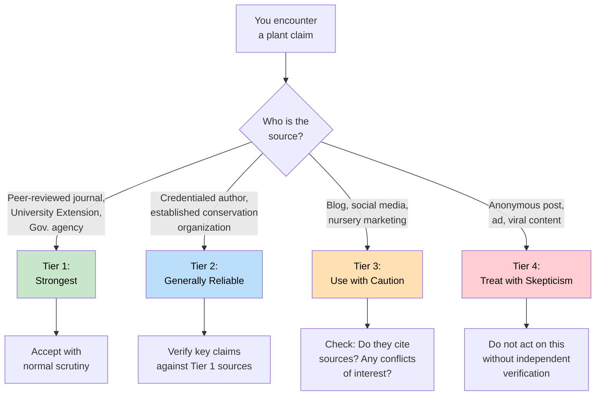
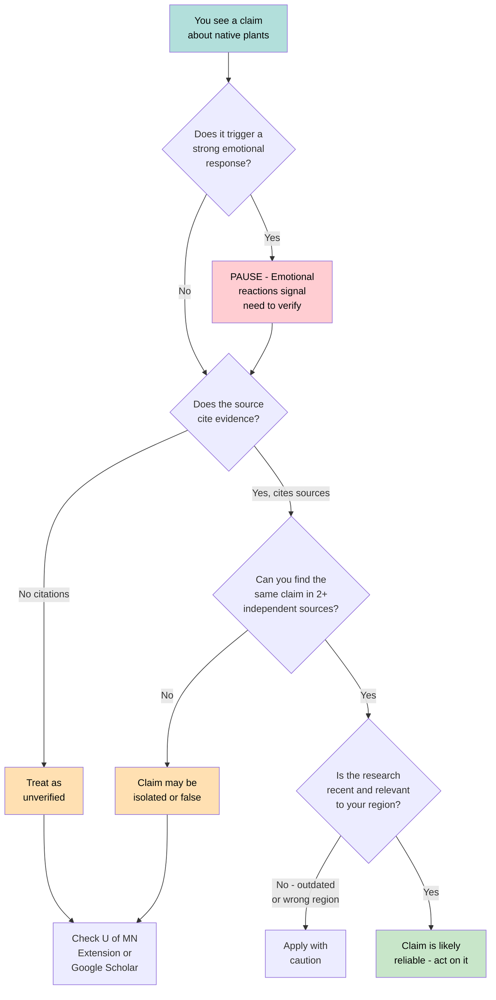

# Critical Thinking and Misinformation Detection

!!! mascot-welcome "Time to Sharpen Your Thinking!"
    
    Welcome to one of the most practical chapters in this entire course! I'm
    going to help you become a confident, clear-eyed evaluator of plant claims,
    product labels, social media posts, and marketing hype. The skills you build
    here will serve you in every corner of your life — not just gardening.

## Summary

This chapter equips you with the critical thinking tools needed to navigate the flood of information — and misinformation — surrounding native plants, gardening products, and ecological claims. You will learn how science works, how to evaluate sources, how to spot logical fallacies and greenwashing, and how to make well-reasoned decisions about your landscape. We tackle real myths about Minnesota native plants and invasive species head-on, give you practical fact-checking strategies, and help you distinguish marketing spin from genuine science.

## Evidence-Based Practices

Evidence-based practice means making decisions based on the best available scientific evidence, combined with practical experience and the specific conditions of your site. It is the opposite of relying on tradition alone, gut feeling, or a single persuasive anecdote.

In the context of native plant gardening and ecological restoration, evidence-based practice means:

- Choosing plant species based on documented ecological research, not just what looks good in a catalog photo
- Following planting and management techniques supported by field trials and long-term studies
- Being willing to change your approach when new evidence contradicts what you previously believed

For example, the Minnesota Department of Natural Resources publishes restoration guides based on decades of field research across the state's ecoregions. These guides recommend specific seed mixes, planting densities, and management schedules because they have been tested and refined over time. That is evidence-based practice in action.

The alternative — planting whatever a well-meaning neighbor recommends without checking whether it suits your soil type, moisture conditions, or ecoregion — often leads to wasted money and failed plantings.

## Scientific Method Basics

The scientific method is the systematic process by which researchers investigate questions about the natural world. Understanding it, even at a basic level, helps you evaluate whether a claim about plants or ecology is grounded in solid research or just speculation.

The core steps are:

- **Observation** — Noticing something in nature that prompts a question (e.g., "Why do monarch butterflies only lay eggs on milkweed?")
- **Hypothesis** — Proposing a testable explanation (e.g., "Milkweed contains specific chemicals that monarchs need for larval development")
- **Experiment** — Designing a study to test the hypothesis under controlled conditions
- **Data collection** — Recording results carefully and systematically
- **Analysis** — Looking for patterns in the data using statistics
- **Conclusion** — Determining whether the data supports or contradicts the hypothesis
- **Peer review and replication** — Other scientists review the work and attempt to reproduce the results

The scientific method is not a rigid recipe — it is a flexible framework for building reliable knowledge. What makes it powerful is its emphasis on testing ideas against reality, rather than simply arguing from authority or tradition.

### Why This Matters for You

When someone claims that a particular plant "fixes nitrogen," "repels deer," or "attracts 50 species of pollinators," you can ask: What is the evidence? Was it tested? By whom? Under what conditions? These questions put you in a much stronger position than simply accepting or rejecting claims based on how they make you feel.

## Peer Review Process

Peer review is the process by which scientific research is evaluated by other experts in the same field before it is published. It is one of the most important quality-control mechanisms in science.

Here is how it works:

- A researcher submits a paper to a scientific journal
- The journal editor sends the paper to two or more independent reviewers who are experts in that topic
- The reviewers evaluate the study's methods, data analysis, and conclusions
- They may approve the paper, request revisions, or recommend rejection
- Only papers that survive this scrutiny get published

Peer review is not perfect. Reviewers can miss errors, and the process can be slow. But it is far more rigorous than a blog post, a YouTube video, or a product advertisement. When you see a claim backed by peer-reviewed research, it carries more weight than one backed by a single person's experience.

### Where to Find Peer-Reviewed Research

You do not need a university library card to access good science. Several resources make research accessible:

- **Google Scholar** (scholar.google.com) — A free search engine for academic papers
- **University of Minnesota Extension** — Publishes research summaries written for general audiences
- **Minnesota Department of Natural Resources** — Provides management guides based on peer-reviewed science
- **The Xerces Society** — Publishes evidence-based pollinator conservation resources

## Source Credibility Evaluation

Not all sources of information are equally reliable. Evaluating source credibility is one of the most important skills you can develop. Here is a practical framework:

**Tier 1 — Strongest sources:**

- Peer-reviewed scientific journals
- University extension services (e.g., University of Minnesota Extension)
- Government scientific agencies (e.g., USDA, Minnesota DNR, EPA)

**Tier 2 — Generally reliable, but verify claims:**

- Books by credentialed authors with citations
- Established conservation organizations (e.g., The Nature Conservancy, Xerces Society)
- Reputable news outlets reporting on published research

**Tier 3 — Use with caution:**

- Gardening blogs and personal websites
- Social media posts, even from popular accounts
- Nursery and seed company marketing materials

**Tier 4 — Treat with skepticism:**

- Anonymous forum posts
- Product advertisements
- Viral social media content without sources
- "Influencer" recommendations with undisclosed sponsorships

The tier system is not about dismissing lower-tier sources entirely. A gardening blog written by an experienced native plant gardener can be extremely valuable. But you should look for whether they cite their sources, whether their claims align with higher-tier sources, and whether they acknowledge uncertainty.

!!! mascot-thinking "Consider the Source"
    
    When you read a claim about native plants, ask yourself three questions:
    Who is making this claim? What evidence do they provide? Do they have
    anything to gain financially from you believing it? These three questions
    will filter out a surprising amount of bad information.

The following diagram provides a quick visual framework for evaluating the credibility of any source you encounter.

Practice evaluating the credibility of a claim by checking its source, evidence, peer review status, and potential conflicts of interest with this interactive tool.

<iframe src="../../sims/source-credibility-evaluator/main.html" width="100%" height="500px" scrolling="no"></iframe>

Source Credibility Evaluator

Type: microsim

**Learning Objective:** Students will be able to systematically assess the credibility of a plant or ecology claim by evaluating its source tier, supporting evidence, peer review status, and potential conflicts of interest.

**Controls:**
- Dropdown to select a sample claim (or text input to enter a custom claim)
- Slider or checklist for source tier rating (Tier 1 through Tier 4)
- Toggle checkboxes for evidence indicators (cites peer-reviewed research, provides data, acknowledges limitations)
- Toggle checkboxes for conflict of interest flags (seller of product, funded by industry, undisclosed sponsorship)
- "Evaluate" button to generate a credibility score

**Visual Elements:**
- Credibility meter or gauge that updates in real time as the user adjusts evaluation criteria
- Color-coded breakdown showing how each factor (source, evidence, peer review, conflict of interest) contributes to the overall score
- Sample claims drawn from real native plant scenarios (myth vs. fact examples)

**Behavior:**
- Adjusting any evaluation criterion immediately updates the credibility score and visual breakdown
- Selecting a sample claim pre-fills a scenario for the student to evaluate
- The simulation provides feedback explaining why each factor raises or lowers credibility
- Students can compare their evaluation against a reference assessment

**Instructional Rationale:**
Critical evaluation of sources is a skill that improves with structured practice. By breaking credibility assessment into discrete, adjustable factors, this simulation helps students internalize a repeatable framework they can apply to any claim they encounter -- in gardening, ecology, or daily life.

## Conflict of Interest

A conflict of interest occurs when a person or organization has a financial, professional, or personal stake in the outcome of a claim they are making. Conflicts of interest do not automatically make a claim wrong — but they are a reason to look more carefully at the evidence.

Common conflicts of interest in the native plant world include:

- A nursery claiming that the specific cultivar they sell is "just as good as the straight species for pollinators" — they profit from that claim
- A chemical company funding research on whether their herbicide is safe for use near waterways
- A landscaping company recommending expensive interventions when simpler approaches might work
- An organization exaggerating a threat to increase donations

The presence of a conflict of interest means you should seek independent verification. Look for studies conducted by researchers who do not have a financial stake in the outcome.

## Marketing vs. Science

Marketing and science have fundamentally different goals. Marketing exists to sell products. Science exists to understand reality. When marketing borrows the language of science, it can be very convincing — and very misleading.

**Signs that a claim is marketing, not science:**

- Vague language: "scientifically formulated," "nature-inspired," "eco-friendly blend"
- No specific citations to published research
- Testimonials instead of data
- Before-and-after photos without controlled comparisons
- Claims that a product works for "all soil types" or "any climate"
- Urgency language: "limited time," "act now," "don't miss out"

**Signs that a claim is grounded in science:**

- Specific references to published studies
- Acknowledgment of limitations ("this works best in well-drained soils")
- Data presented with context (sample sizes, conditions, timeframes)
- Information available for free, not hidden behind a purchase

A seed company that lists the specific native species in their mix, provides germination rates, and references the ecoregion research behind their recommendations is operating transparently. One that simply promises "instant prairie in a can" is marketing.

## Common Plant Myths

Myths about plants persist because they sound plausible and get repeated often enough to seem like common knowledge. Here are some of the most widespread myths relevant to Minnesota native plant gardening:

**Myth: Native plants are just weeds.**
Reality: Native plants are the ecological backbone of every healthy landscape in Minnesota. Species like Big Bluestem, Purple Coneflower, and Wild Bergamot are the result of thousands of years of evolution and support complex food webs. Calling them weeds reflects cultural bias, not biology.

**Myth: Native plant gardens are messy and unattractive.**
Reality: Native plant gardens can be designed with clear structure, intentional plant placement, and seasonal interest. Many award-winning public gardens feature native plants prominently. Design is a choice — messiness is not inherent to native species.

**Myth: You should add sand to clay soil to improve drainage.**
Reality: Adding sand to clay soil can create a concrete-like mixture. Instead, add organic matter like compost, or choose native plants that thrive in clay — many prairie species do beautifully in heavy clay soils.

**Myth: All native plants are drought-tolerant.**
Reality: Minnesota's native flora includes species from wetlands, bogs, and stream banks that require consistent moisture. "Native" does not mean "xeric." Always match the plant to your site's actual moisture conditions.

**Myth: Planting native cultivars (nativars) is the same as planting straight species.**
Reality: Research from the Mt. Cuba Center and other institutions has shown that some cultivars — particularly those with altered flower color, double petals, or compact growth habits — provide reduced value to pollinators compared to straight species. The evidence is nuanced: some cultivars perform well, while others do not. The safest approach is to prioritize straight species when possible and research specific cultivars before planting.

**Myth: You can just scatter wildflower seeds on your lawn and get a prairie.**
Reality: Establishing native plants from seed requires soil preparation (usually removing existing vegetation), proper seed-to-soil contact, and patience. Most prairie plantings take three to five years to mature. Simply scattering seeds on an established lawn almost always fails because the existing turf outcompetes the seedlings.

## Invasive Species Myths

Invasive species generate their own set of persistent myths, many of which can lead to harmful inaction or misguided action:

**Myth: If a plant has been here for a long time, it's basically native now.**
Reality: Ecological adaptation takes thousands of years, not decades or centuries. Common Buckthorn has been in Minnesota for over 100 years, yet it continues to degrade forest understories because native insects and diseases have not evolved to control it. Time does not make an invasive plant native.

**Myth: Invasive plants provide food for wildlife, so they're helpful.**
Reality: While birds may eat buckthorn berries, the berries have a laxative effect that reduces the birds' ability to build fat reserves for migration. The dense shade cast by buckthorn eliminates the native understory plants that provide higher-quality food, nesting habitat, and insect prey. A food source that degrades the overall ecosystem is not a net benefit.

**Myth: Cutting down buckthorn will just make it grow back worse.**
Reality: Buckthorn does resprout vigorously from stumps if they are not treated. But this is an argument for proper technique (cut-stump herbicide treatment or repeated cutting), not for giving up. Effective buckthorn removal is well documented and widely practiced across Minnesota.

**Myth: Invasive species are only a problem in wild areas, not in cities.**
Reality: Urban areas are often invasion hotspots. Buckthorn, garlic mustard, and wild parsnip thrive along roadsides, in parks, and in residential yards. Urban management is a critical part of invasive species control.

!!! mascot-warning "Don't Fall for This One"
    
    One of the most damaging myths is that invasive species are "too established
    to fight." This defeatist attitude leads to inaction, which allows the problem
    to get worse. Successful removal projects across Minnesota prove that
    persistent effort works. Every buckthorn you remove is a win.

## Social Media Misinformation

Social media platforms are a major source of plant and gardening information — and a major source of misinformation. The algorithms that drive these platforms reward engagement, not accuracy. Content that provokes strong emotions (outrage, amazement, fear) spreads faster than careful, nuanced information.

Common patterns of social media misinformation about native plants and ecology include:

- **Oversimplified advice** — "Just plant milkweed and save the monarchs!" (Monarch conservation requires far more than milkweed — it requires habitat across their entire migration corridor, reduction of pesticide use, and protection of overwintering sites.)
- **Misidentified plants** — Photos labeled as one species when they are actually another. This happens constantly and can lead people to plant the wrong species or misidentify invasives.
- **Out-of-context claims** — A study conducted in one region or climate zone being presented as universal truth.
- **Manufactured urgency** — "This plant is going EXTINCT — share now!" when the species is actually common.
- **Undisclosed sponsorships** — Influencers promoting specific products or nurseries without revealing they are being paid.

### Protecting Yourself

- Verify claims before sharing them. Check the original source.
- Be skeptical of posts that use extreme language ("miracle plant," "deadly invasive," "scientists are hiding this").
- Look for posts that cite specific sources and acknowledge complexity.
- Follow accounts run by extension services, botanical gardens, and established conservation organizations rather than anonymous viral pages.

## Product Label Claims

Product labels in the gardening industry are not regulated the way food or drug labels are. Terms like "organic," "natural," "eco-friendly," and "pollinator-safe" can mean very different things — or nothing at all — depending on who is using them.

**Claims that have regulated definitions:**

- **USDA Certified Organic** — Means the product meets specific federal standards for organic production. This is a regulated term with real enforcement.
- **EPA-registered pesticide** — Means the product has been reviewed by the Environmental Protection Agency for safety and efficacy.

**Claims that have NO regulated definition in gardening products:**

- "All-natural"
- "Eco-friendly"
- "Pollinator-safe" or "bee-friendly"
- "Chemical-free" (everything is a chemical)
- "Native wildflower mix" (may contain non-native species or aggressive cultivars)

When evaluating product labels, read the ingredient list or species list, not just the front-of-package marketing. A "Minnesota Wildflower Mix" that lists species native to the Great Plains but not to Minnesota is misleading, even if technically composed of native North American plants.

## Greenwashing Detection

Greenwashing is the practice of making a product, service, or company appear more environmentally responsible than it actually is. It has become increasingly common as consumer demand for sustainable products has grown.

**Real examples of greenwashing in the native plant and gardening space:**

- A major home improvement chain selling "pollinator garden kits" that contain mostly non-native annual flowers with limited pollinator value and seeds treated with neonicotinoid pesticides
- "Wildflower seed bombs" marketed as ecological restoration tools that contain aggressive non-native species like Crown Vetch or Bird's-foot Trefoil, which are actually invasive in Minnesota
- Lawn care companies advertising "eco-friendly" programs that still rely heavily on synthetic fertilizers and herbicides, but use slightly lower application rates
- "Bee-friendly" plant labels on nursery stock that was treated with systemic insecticides during production

**How to spot greenwashing:**

- Vague claims with no supporting details ("we care about the planet")
- Green packaging or nature imagery on products that have no ecological benefit
- Highlighting one small positive attribute while ignoring larger negative impacts
- No third-party certification or independent verification
- Claims that cannot be checked because no specifics are provided

The antidote to greenwashing is specificity. A company that lists exactly which native species are in their seed mix, where the seeds were sourced, and what research supports their product is being transparent. A company that wraps a generic product in leaf-green packaging and calls it "Earth's Choice" is greenwashing.

## Fact-Checking Strategies

Developing a personal fact-checking habit does not take much time, and it saves you from spreading bad information or wasting money on products that do not work. Here is a practical system:

The following decision tree walks you through a practical fact-checking process you can use for any claim you encounter.

**Step 1: Pause before sharing or acting.** If a claim triggers a strong emotional response — excitement, outrage, fear — that is a signal to slow down and verify before you share it or spend money on it.

**Step 2: Check the source.** Who made this claim? Are they credentialed? Do they cite evidence? Do they have a conflict of interest?

**Step 3: Look for corroboration.** Can you find the same claim supported by at least two independent, credible sources? University extension services and scientific agencies are good places to check.

**Step 4: Check the date.** Science evolves. A recommendation from 1990 may have been superseded by more recent research. Look for the most current guidance.

**Step 5: Read beyond the headline.** Headlines are designed to grab attention, not to convey nuance. Read the full article or study summary before drawing conclusions.

**Step 6: Consult an expert.** Your local University of Minnesota Extension office, Master Gardener program, or Soil and Water Conservation District can help you evaluate claims relevant to your area.

!!! mascot-tip "Bree's Fact-Check Shortcut"
    
    When you see a plant claim online, try this quick test: search for the claim
    plus "University Extension" or "peer-reviewed." If credible sources confirm
    it, great. If you can only find the claim on blogs and social media, treat
    it as unverified. This 30-second check can save you from costly mistakes.

## Confirmation Bias

Confirmation bias is the tendency to seek out, notice, and remember information that confirms what you already believe — while ignoring or dismissing information that contradicts it. It is one of the most powerful cognitive biases, and everyone is susceptible to it.

In the native plant world, confirmation bias shows up in many ways:

- A gardener who believes nativars are "just as good" may notice every instance of a butterfly visiting a cultivar while overlooking the data showing reduced pollinator visits to certain nativars
- A homeowner who dislikes the idea of removing their buckthorn may latch onto the one blog post claiming buckthorn is "not that bad" while dismissing dozens of scientific studies documenting its harm
- A person who invested in an expensive "organic" lawn treatment may overestimate the improvement and underestimate the persistent problems

**How to counter confirmation bias:**

- Actively seek out information that challenges your current views
- Ask yourself: "What evidence would change my mind?"
- Pay attention to the strength of evidence, not just whether it agrees with you
- Be especially skeptical of information that feels satisfying or vindicating — those feelings are often confirmation bias at work

## Anecdotal Evidence vs. Data

An anecdote is a single person's experience. Data is the systematic collection of many observations under controlled or documented conditions. Both have value, but they are not equal as evidence.

**Anecdotal evidence is useful for:**

- Generating questions ("I noticed my coneflowers did poorly in shade — is that typical?")
- Providing real-world context for scientific findings
- Sharing practical tips that can be tested

**Anecdotal evidence is NOT reliable for:**

- Establishing cause and effect ("I planted marigolds and my tomato pests disappeared" — was it the marigolds, the weather, or something else entirely?)
- Generalizing to other situations ("This worked in my yard, so it will work in yours")
- Overriding controlled research ("I know the studies say otherwise, but in my experience...")

One person's successful experience with a planting technique does not mean the technique works in general. It means it worked once, under that person's specific conditions. Science exists precisely because individual experience is unreliable as a guide to general truth.

When someone says "I've been gardening for 30 years and I've never had a problem with buckthorn," that tells you about their yard and their definition of "problem." It does not contradict the extensive research documenting buckthorn's ecological damage across the state.

## Native Plant Misconceptions

Beyond the common myths covered earlier, there are several persistent misconceptions specific to native plant gardening in Minnesota:

**Misconception: Native plants don't need any care once planted.**
Reality: Native plants are lower-maintenance than conventional landscapes, but they are not zero-maintenance. New plantings need watering during establishment (typically one to two growing seasons). Prairie plantings benefit from periodic prescribed burning or mowing. Invasive species must be managed in and around native plantings. The claim of "no maintenance" sets people up for disappointment and failure.

**Misconception: If it's sold at a local nursery, it must be native to Minnesota.**
Reality: Many nurseries sell plants from across North America or even other continents without clearly labeling their origin. A plant native to the southeastern United States may not be adapted to Minnesota's climate, soils, or ecological relationships. Always check the species' native range, not just where it was purchased.

**Misconception: More species is always better.**
Reality: Biodiversity is generally beneficial, but randomly mixing dozens of species without regard for their growing requirements, competitive dynamics, and site conditions often produces a planting where a few aggressive species dominate and the rest die out. Thoughtful species selection based on site conditions produces better long-term results than maximizing species count.

**Misconception: Native plants will spread and take over my yard.**
Reality: Some native species are aggressive spreaders (e.g., Common Milkweed via rhizomes, or certain goldenrods), but most native plants are well-behaved garden subjects. Understanding individual species' growth habits before planting prevents surprises. The fear that native plants are "uncontrollable" is largely unfounded.

## Critical Thinking Basics

Critical thinking is the discipline of evaluating information and arguments carefully before accepting them. It is not about being negative or contrarian — it is about being rigorous and honest in your reasoning.

The core principles of critical thinking include:

- **Questioning assumptions** — What am I taking for granted? Is that assumption justified?
- **Evaluating evidence** — Is the evidence strong, relevant, and sufficient? Or is it weak, irrelevant, or cherry-picked?
- **Considering alternatives** — Are there other explanations for what I'm seeing? Have I considered them fairly?
- **Recognizing uncertainty** — Am I comfortable saying "I don't know" or "the evidence is mixed"?
- **Separating facts from opinions** — Is this a verifiable claim or someone's interpretation?

Critical thinking is a skill, not a personality trait. It can be practiced and improved. Every time you pause to evaluate a claim rather than accepting it at face value, you are exercising critical thinking.

## Evaluating Claims

When you encounter a specific claim about native plants, ecology, or gardening products, use this systematic approach:

**What is the claim?** State it clearly. ("This soil amendment increases root growth by 40%.")

**Who is making the claim?** A university researcher? A product manufacturer? An anonymous social media account?

**What evidence supports it?** Published research? Lab tests? Field trials? Personal experience? Nothing?

**Is the evidence relevant?** Was the research conducted in conditions similar to yours? A study from the American Southwest may not apply to Minnesota.

**Is the evidence sufficient?** A single small study is a starting point, not proof. Look for replication and consistency across multiple studies.

**Are there alternative explanations?** Could the observed results be explained by something other than what the claimant suggests?

**What do independent experts say?** Does the claim align with guidance from university extension services and scientific agencies?

This framework works for everything from evaluating a new mulch product to assessing a neighbor's advice about when to plant prairie seeds.

## Logical Fallacies

A logical fallacy is an error in reasoning that undermines the logic of an argument. Recognizing common fallacies helps you spot weak arguments, whether they come from advertisers, social media, or well-meaning friends.

**Appeal to Nature** — "It's natural, so it must be safe/good." Poison ivy is natural. So is arsenic. "Natural" does not equal "safe" or "beneficial."

**Appeal to Authority** — "A famous gardener recommends it, so it must be right." Expertise matters, but even experts can be wrong. Look at the evidence behind the recommendation, not just who said it.

**Appeal to Tradition** — "We've always done it this way." Traditional practices can be valuable, but they can also be based on outdated information or conditions that have changed.

**False Dilemma** — "Either we spray herbicide on all invasives or we do nothing." In reality, there are many management approaches, including mechanical removal, targeted application, biological control, and combinations of methods.

**Slippery Slope** — "If we let native plants grow in front yards, the whole neighborhood will become an overgrown wilderness." This ignores the many well-designed, well-maintained native plant landscapes that exist.

**Cherry-Picking** — Selecting only the evidence that supports your position while ignoring evidence that contradicts it. This is especially common in debates about nativars, herbicide use, and restoration methods.

**Ad Hominem** — Attacking the person making the argument rather than the argument itself. "She's not a real gardener, so her research on pollinators doesn't matter."

## Cost-Benefit Analysis

Cost-benefit analysis is a structured way of comparing the total costs of an action to its total benefits. In ecological decision-making, both financial costs and ecological costs must be considered.

**Example: Converting a traditional lawn to native prairie**

Costs:

- Seed and plant material ($200-$1,500 depending on size)
- Site preparation (removing existing turf, possible herbicide application)
- Time investment during establishment (two to three years of active management)
- Potential neighborhood friction during the "messy" establishment phase

Benefits:

- Elimination of ongoing mowing costs (fuel, equipment, time)
- No need for fertilizer, irrigation, or pesticides once established
- Stormwater management (deep roots absorb more rainfall)
- Habitat for pollinators, birds, and beneficial insects
- Carbon sequestration in deep root systems
- Increased property value (studies have shown native landscapes can increase property values in some markets)

A thorough cost-benefit analysis reveals that native prairie conversion typically pays for itself within five to seven years in reduced maintenance costs alone — before accounting for the ecological benefits that are harder to quantify in dollar terms.

## Risk Assessment in Ecology

Risk assessment in ecology involves evaluating the likelihood and severity of potential ecological harms. It is essential for making informed decisions about land management, species introductions, and restoration projects.

Key questions in ecological risk assessment:

- **What is the hazard?** (e.g., a potentially invasive plant, a new herbicide, habitat loss)
- **What is the probability that harm will occur?** (e.g., what percentage of introduced species become invasive?)
- **What is the severity of the harm if it occurs?** (e.g., localized damage vs. ecosystem-wide degradation)
- **Is the harm reversible?** (e.g., can an invasive species be removed, or is the damage permanent?)
- **Who or what is affected?** (e.g., a single garden, a wetland, an endangered species)

Risk assessment helps explain why ecologists and land managers are cautious about introducing new species, even ones that seem beneficial. The potential downside of introducing a species that becomes invasive is enormous and often irreversible, while the benefits of any single introduction are typically modest and achievable through alternative means.

### The Precautionary Principle

When the potential harm is severe and irreversible, but the evidence is uncertain, the precautionary principle recommends erring on the side of caution. This is why Minnesota maintains a list of prohibited and restricted invasive species — the cost of preventing an invasion is far less than the cost of managing one after it becomes established.

## Trade-Off Analysis

Every ecological and gardening decision involves trade-offs. There is no perfect option — only options with different combinations of advantages and disadvantages. Recognizing trade-offs explicitly leads to better decision-making.

**Common trade-offs in native plant gardening:**

- **Straight species vs. cultivars** — Straight species generally offer higher ecological value, but cultivars may offer more predictable size, color, or bloom time for designed landscapes. The trade-off is between ecological function and design control.
- **Herbicide use vs. manual removal** — Herbicides are efficient for large-scale invasive removal but carry risks to non-target species and water quality. Manual removal is labor-intensive but avoids chemical exposure. The trade-off is between efficiency and environmental safety.
- **Prescribed burning vs. mowing** — Burning is the most ecologically authentic management tool for prairie, but it requires training, permits, and careful planning. Mowing is simpler but does not provide the same ecological benefits. The trade-off is between ecological quality and practical simplicity.
- **Local ecotype seed vs. regional seed** — Local ecotype seed is most genetically adapted to your area but may be harder to source and more expensive. Regional seed is more available but may be less well-adapted. The trade-off is between genetic fidelity and accessibility.

Making trade-offs explicit — rather than pretending one option is universally best — is a hallmark of good critical thinking.

## Long-Term vs. Short-Term Thinking

One of the most important distinctions in ecological decision-making is between short-term and long-term outcomes. Actions that look good in the short term can be harmful in the long term, and vice versa.

**Short-term thinking examples:**

- Planting fast-growing non-native trees for quick shade, even though they provide little wildlife value and may become invasive
- Using synthetic fertilizer for an immediate green-up, which can degrade soil biology over time
- Choosing the cheapest seed mix available without checking whether the species are appropriate for your ecoregion
- Mowing a new prairie planting because it "looks like weeds" during its first year, when the plants are actually establishing roots

**Long-term thinking examples:**

- Planting native oaks that may take 20 years to provide full shade but will support over 500 species of caterpillars (a critical food source for songbirds)
- Building soil health through organic matter additions and native plant root systems, which improves fertility gradually but sustainably
- Investing in proper site preparation before seeding, which costs more upfront but dramatically improves establishment success
- Accepting three to five years of "awkward-looking" prairie establishment because the long-term result is a self-sustaining, low-maintenance landscape

!!! mascot-celebration "You're Thinking Like an Ecologist!"
    
    If you have made it through this chapter, you now have a toolkit that most
    gardeners and even some professionals lack. You can evaluate claims, spot
    greenwashing, recognize logical fallacies, and make decisions based on
    evidence rather than hype. That is a genuine superpower. Go use it wisely!

## Putting It All Together

The skills in this chapter are not abstract exercises. They are practical tools you will use every time you:

- Read a plant label at a nursery
- See a gardening tip on social media
- Evaluate a landscaping company's proposal
- Decide whether to buy an "eco-friendly" product
- Discuss invasive species management with your neighbors
- Plan a restoration project for your property

The common thread is simple: slow down, ask questions, look at the evidence, consider trade-offs, and think about the long term. These habits will make you a better gardener, a better steward of the land, and a better consumer.

## Concepts Covered

This chapter covers the following 22 concepts from the learning graph:

1. Evidence-Based Practices
2. Scientific Method Basics
3. Peer Review Process
4. Source Credibility Evaluation
5. Conflict of Interest
6. Marketing vs. Science
7. Common Plant Myths
8. Invasive Species Myths
9. Social Media Misinformation
10. Product Label Claims
11. Greenwashing Detection
12. Fact-Checking Strategies
13. Confirmation Bias
14. Anecdotal Evidence vs. Data
15. Native Plant Misconceptions
16. Critical Thinking Basics
17. Evaluating Claims
18. Logical Fallacies
19. Cost-Benefit Analysis
20. Risk Assessment in Ecology
21. Trade-Off Analysis
22. Long-Term vs. Short-Term Thinking

## Prerequisites

This chapter builds on the foundational knowledge from [Chapter 1: Introduction to Native Plants and Ecology](../01-intro-native-plants-ecology/index.md). Familiarity with basic ecological concepts such as ecosystems, biodiversity, native vs. invasive species, and plant identification will help you engage with the examples and case studies throughout this chapter.

## What's Next

In [Chapter 17: Capstone Projects](../17-capstone-projects/index.md), you will apply everything you have learned — including the critical thinking skills from this chapter — to real-world projects that bring together ecology, design, restoration, and community engagement.
