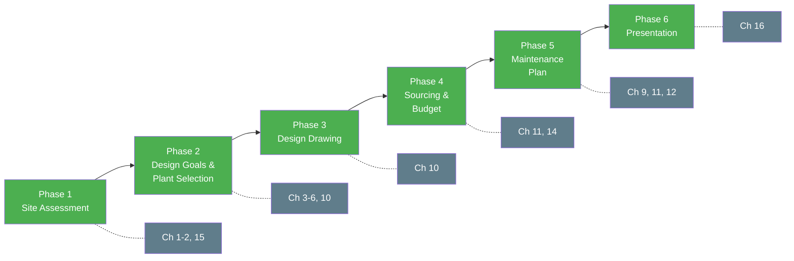
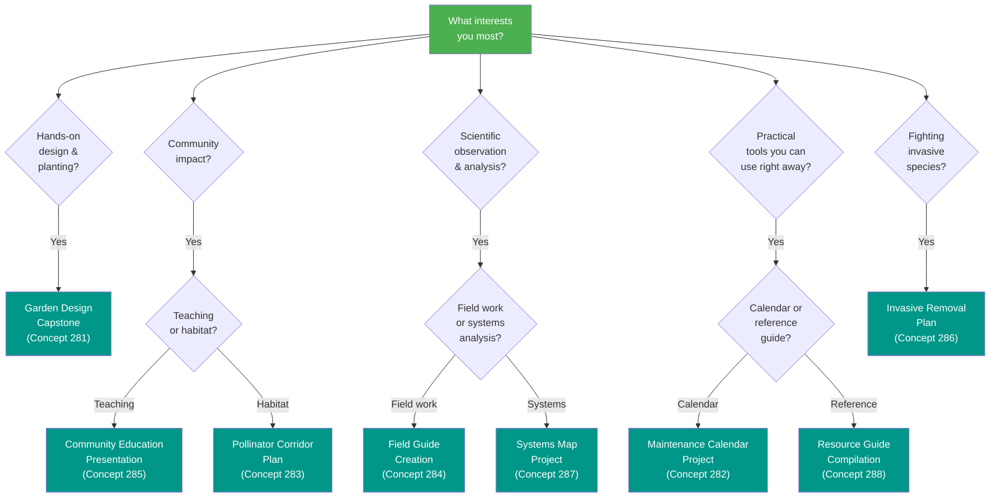

# Capstone Projects

!!! mascot-welcome "You Made It!"
    
    Welcome to the final chapter! You have spent sixteen chapters learning about
    Minnesota's native plants, ecosystems, pollinators, invasive species, garden
    design, restoration, and critical thinking. Now it is time to put all of that
    knowledge to work. These eight capstone projects will challenge you to
    synthesize what you have learned and create something meaningful for your
    community and landscape.

## Summary

This chapter presents eight capstone projects that integrate knowledge from every prior chapter. Each project asks you to apply concepts from ecology, plant identification, garden design, invasive species management, systems thinking, and community engagement in a real-world context. The Garden Design Capstone is the primary and most comprehensive project, drawing on the full breadth of the course. The remaining seven projects offer focused alternatives or complementary work. Every project includes detailed instructions, a list of deliverables, and a rubric so you know exactly what success looks like.

---

## Concept 281. Garden Design Capstone

This is the primary capstone project for the course. It asks you to design a complete native plant garden for a real site in Minnesota, from initial site assessment through planting plan, maintenance schedule, and presentation. This project draws on nearly every chapter and concept you have studied.

### Project Overview

You will select a real outdoor site — your yard, a school campus, a community garden plot, a church property, a park — and design a native plant garden tailored to that location. Your design must be ecologically sound, aesthetically thoughtful, and practical to install and maintain.

The following diagram shows the six phases of the Garden Design Capstone and how they build on each other.

Use this interactive garden design planner to experiment with site conditions, select native plants, and generate a layout and maintenance plan -- a hands-on preview of the full capstone process.

<iframe src="../../sims/garden-design-planner/main.html" width="100%" height="500px" scrolling="no"></iframe>

Garden Design Planner

Type: microsim

**Learning Objective:** Students will synthesize knowledge from across the course by inputting real site conditions, selecting appropriate native plants, and generating a garden layout with a basic maintenance plan -- practicing the full design workflow before committing to a final capstone project.

**Controls:**
- Input fields for site conditions (sun exposure, soil type, moisture level, ecoregion, garden size)
- Searchable plant palette with filters for bloom time, height, light requirement, and wildlife value
- Drag-and-drop plant placement on a grid-based garden layout canvas
- "Generate Maintenance Plan" button to produce a seasonal care summary based on selected plants

**Visual Elements:**
- Interactive garden grid where plants are placed and displayed with color-coded icons by bloom season
- Side panel showing the selected plant list with key attributes (height, bloom, wildlife value)
- Seasonal timeline bar showing when each selected species blooms
- Generated maintenance plan displayed as a month-by-month summary

**Behavior:**
- Entering site conditions filters the plant palette to show only species suited to those conditions
- Dragging plants onto the grid snaps them to position and updates the plant list and bloom timeline
- The maintenance plan auto-generates based on the species selected, covering watering, weeding, and burn/mow timing
- Students can export or print their design as a starting point for the full capstone project

**Instructional Rationale:**
The Garden Design Capstone is the most comprehensive project in the course. This simulation lowers the barrier to entry by letting students experiment with the design process interactively before committing to a full written project, building confidence and revealing the connections between site assessment, plant selection, and maintenance planning.

### Step-by-Step Instructions

**Phase 1: Site Assessment (Chapters 1-2, 15)**

1. Choose your site and document it with photographs from multiple angles.
2. Measure the site dimensions and sketch a rough footprint.
3. Determine the ecoregion and hardiness zone for your location using the resources from Chapter 2.
4. Conduct a soil assessment — note soil type (sand, clay, loam), drainage patterns, and whether the soil is compacted or amended.
5. Map the sun exposure across the site. Note which areas receive full sun, part shade, and full shade throughout the day.
6. Identify any existing plants on the site, noting which are native, non-native, or invasive.
7. Note water sources, slopes, structures, property lines, and any underground utilities.

**Phase 2: Design Goals and Plant Selection (Chapters 3-6, 10)**

1. Write a one-paragraph design statement describing the goals of your garden. Consider whether you want to support pollinators, create a rain garden, establish prairie, provide seasonal beauty, grow food for wildlife, or a combination.
2. Select a plant palette of at least 15 native species appropriate for your site conditions. For each species, record:

    - Common name and scientific name
    - Bloom time and flower color
    - Height and spread at maturity
    - Light, soil, and moisture requirements
    - Wildlife value (which pollinators or birds it supports)

3. Include plants from at least two of the three major plant community types covered in Chapters 3-5 (prairie, woodland, wetland/shoreline) as appropriate for your site.
4. Plan for three-season interest — spring, summer, and fall bloom.
5. Include at least three species that specifically support pollinators, referencing what you learned in Chapter 6.

**Phase 3: Design Drawing (Chapter 10)**

1. Create a scaled site plan showing the garden layout. This can be hand-drawn or digital.
2. Place each plant species on the plan using symbols or labels. Group plants according to their growing requirements and natural community associations.
3. Include a plant key or legend that identifies each species on the plan.
4. Note any hardscape elements (paths, edging, seating, water features).
5. Indicate plant spacing and quantities.

!!! mascot-tip "Bree's Tip"
    
    When designing your layout, think about how the garden will look in every
    season — not just peak bloom. Include grasses and seedheads that provide
    winter structure. Nature does not plant in rows, so try grouping plants in
    odd-numbered clusters the way they appear in wild plant communities.

**Phase 4: Sourcing and Budget (Chapters 11, 14)**

1. Identify at least two Minnesota native plant nurseries where you could purchase your plants. Use the resources from Chapter 14.
2. Create a simple budget estimating costs for plants, soil amendments, mulch, and any hardscape materials.
3. Note whether any of your species are available as seed, plugs, or container plants, and explain your choice for each.

**Phase 5: Maintenance Plan (Chapters 9, 11, 12)**

1. Write a first-year maintenance calendar covering watering, weeding, and monitoring tasks by month (May through October).
2. Describe your invasive species management strategy for the site, referencing Chapter 9.
3. Outline a long-term maintenance plan for years two through five, including plans for prescribed burning or mowing if appropriate.

**Phase 6: Presentation (Chapter 16)**

1. Compile your work into a clear, organized presentation or portfolio.
2. Present your design to a peer, mentor, family member, or community group.
3. Be prepared to explain and defend your plant choices using evidence-based reasoning from the course.

### Deliverables

- Site assessment report with photographs and measurements
- Written design statement
- Plant selection table (minimum 15 species)
- Scaled site plan with plant key
- Sourcing list and budget estimate
- First-year maintenance calendar
- Long-term maintenance plan (years 2-5)
- Presentation or portfolio

### Rubric

| Criterion | Excellent (4) | Proficient (3) | Developing (2) | Beginning (1) |
|---|---|---|---|---|
| Site Assessment | Thorough documentation with photos, measurements, soil data, sun mapping, and existing plant inventory | Complete but missing one element | Missing two or more elements | Incomplete or superficial assessment |
| Plant Selection | 15+ appropriate natives with full data; three-season bloom; pollinator support; multiple community types | 12-14 species with most data complete | 8-11 species or significant data gaps | Fewer than 8 species or poor site match |
| Design Plan | Scaled, clear, creative layout with legend; ecologically sound groupings | Scaled plan with legend; reasonable groupings | Rough plan with some labels; groupings need work | Sketch only; no scale or legend |
| Sourcing and Budget | Realistic budget with two or more nursery sources; format choices explained | Budget present with one nursery source | Budget incomplete or unrealistic | No budget or sourcing information |
| Maintenance Plan | Detailed month-by-month calendar; invasive strategy; long-term plan | Calendar present; some gaps in detail | General maintenance notes only | No maintenance plan |
| Presentation | Clear, well-organized, confident; evidence-based reasoning throughout | Organized; most choices explained | Disorganized or missing key explanations | Not presented or incomplete |

---

## Concept 282. Maintenance Calendar Project

This project focuses on the practical, ongoing work of caring for a native plant garden through the full growing season and beyond.

### Project Overview

Create a comprehensive twelve-month maintenance calendar for a native plant garden in your Minnesota ecoregion. The calendar should cover every task a gardener needs to perform from January through December, with specific timing adjusted for your local conditions.

### Instructions

1. Select a garden type and ecoregion for your calendar. You may use the garden you designed in the Garden Design Capstone or choose a hypothetical garden type (prairie, shade garden, rain garden, shoreline planting).
2. Research the typical growing season for your ecoregion, including average last frost date, first frost date, and precipitation patterns.
3. For each month, list specific maintenance tasks. At minimum, address the following categories:

    - Watering and irrigation
    - Weeding and invasive species monitoring
    - Mulching and soil care
    - Pruning, deadheading, and cutting back
    - Planting and transplanting windows
    - Pest and disease monitoring
    - Wildlife and pollinator observations
    - Prescribed burn or mow timing (if applicable)
    - Seed collection and propagation
    - Tool maintenance and winter preparation

4. For each task, explain why it is done at that time of year. Connect your reasoning to plant biology, seasonal ecology, or best practices from Chapters 11 and 12.
5. Include notes on what to avoid — for example, why you should not cut back native grasses in fall (overwintering habitat for pollinators) or why spring burning must happen before certain dates.

### Deliverables

- Twelve-month calendar (table, chart, or illustrated format)
- Task descriptions with ecological reasoning for timing
- Ecoregion-specific notes and frost date references
- At least five "do not" guidelines with explanations

### Rubric

| Criterion | Excellent (4) | Proficient (3) | Developing (2) | Beginning (1) |
|---|---|---|---|---|
| Completeness | All 12 months covered with multiple task categories each | 10-11 months or minor category gaps | 6-9 months or significant gaps | Fewer than 6 months |
| Ecological Reasoning | Every task linked to clear ecological or biological rationale | Most tasks explained | Some reasoning provided | Tasks listed without explanation |
| Ecoregion Specificity | Calendar tailored to a specific ecoregion with local data | General Minnesota timing | Generic calendar not localized | No regional adaptation |
| Practical Usefulness | A gardener could follow this calendar immediately | Mostly actionable with minor gaps | Needs significant detail to be usable | Not usable as a guide |

---

## Concept 283. Pollinator Corridor Plan

This project tackles one of the most pressing ecological challenges — habitat fragmentation — by asking you to design a connected pollinator pathway through a real neighborhood or community.

### Project Overview

Design a pollinator corridor that connects at least three sites across a neighborhood, school campus, park system, or rural landscape. Your plan should create stepping stones of habitat that allow bees, butterflies, and other pollinators to move safely between food and nesting resources.

### Instructions

1. Define your corridor area. Use a map (printed or digital) to mark the boundaries of the area you are planning for. This could be a neighborhood of several blocks, a campus, or a stretch of rural road.
2. Identify at least three existing or potential pollinator habitat sites within your corridor. These could include:

    - Existing native gardens
    - Parks, prairies, or natural areas
    - Vacant lots or underused green spaces
    - Boulevard strips or road right-of-ways
    - School grounds or community gardens

3. Assess the gaps between these sites. Pollinators — especially native bees — may only travel a few hundred meters between food sources. Note where the gaps are largest and where new habitat is most needed.
4. For each gap, propose a habitat installation. Specify:

    - Location and approximate size
    - Plant species (minimum 8 per site) selected for sequential bloom from spring through fall
    - Nesting habitat provisions (bare soil patches, brush piles, bee hotels, or dead wood)
    - Water sources if needed

5. Create a corridor map showing all existing and proposed sites, with connections indicated.
6. Write a one-page community engagement plan describing how you would involve neighbors, schools, businesses, or local government in building the corridor.
7. Address potential obstacles — property ownership, maintenance responsibilities, public awareness — and propose solutions.

!!! mascot-encourage "You Can Do This!"
    
    Pollinator corridors are one of the most impactful things communities can do
    for native insects. Even a small garden on a boulevard strip can serve as a
    critical refueling station for a bee traveling between larger habitat patches.
    Your plan does not have to be perfect — it just has to get people started.

### Deliverables

- Annotated corridor map showing existing and proposed sites
- Plant lists for each proposed habitat installation (minimum 8 species per site)
- Nesting habitat and water source recommendations
- One-page community engagement plan
- Obstacles and solutions summary

### Rubric

| Criterion | Excellent (4) | Proficient (3) | Developing (2) | Beginning (1) |
|---|---|---|---|---|
| Corridor Design | Three or more sites connected; gaps identified and addressed with specific proposals | Three sites identified; most gaps addressed | Two sites; gaps partially addressed | Fewer than two sites; no gap analysis |
| Plant Selection | 8+ species per site; sequential bloom; pollinator-specific choices | 6-7 species per site; reasonable bloom coverage | 4-5 species; limited bloom planning | Fewer than 4 species or poor pollinator fit |
| Community Engagement | Realistic, detailed plan with specific outreach strategies | General engagement plan | Vague mention of community involvement | No engagement plan |
| Feasibility | Obstacles identified with practical solutions | Some obstacles addressed | Obstacles mentioned but no solutions | No feasibility analysis |

---

## Concept 284. Field Guide Creation

Creating your own field guide is one of the most effective ways to deepen your plant identification skills and produce a resource that others can use.

### Project Overview

Create a portable field guide covering at least 20 native plants found in a specific Minnesota habitat or location. Your guide should be designed so that someone with no botanical training could use it to identify plants in the field.

### Instructions

1. Choose a specific location and habitat type for your guide. Examples:

    - A local nature center or park
    - Your school campus or neighborhood
    - A specific habitat type within your ecoregion (dry prairie, mesic woodland, wetland margin)

2. Select at least 20 native plant species that are commonly found at your chosen location. Include a mix of wildflowers, grasses, sedges, shrubs, and trees if present.
3. For each species, create a field guide entry that includes:

    - Common name and scientific name
    - A clear description of key identification features (leaf shape, flower structure, height, stem characteristics)
    - Bloom time and habitat preference
    - At least one original photograph, sketch, or detailed illustration
    - One interesting ecological or cultural fact about the species
    - Any look-alike species that might cause confusion, with notes on how to tell them apart

4. Organize your guide in a way that makes field use practical. Consider organizing by:

    - Flower color
    - Bloom season
    - Habitat within the site
    - Plant family

5. Include an introduction that describes the site, its ecological context, and how to use the guide.
6. Include a glossary of any botanical terms you use (refer to Chapter 7 for identification vocabulary).

### Deliverables

- Field guide with at least 20 species entries
- Original photographs, sketches, or illustrations for each species
- Introduction describing the site and how to use the guide
- Organizational system (by color, season, habitat, or family)
- Glossary of botanical terms
- Guide formatted for practical field use (printable, pocket-sized, or digital)

### Rubric

| Criterion | Excellent (4) | Proficient (3) | Developing (2) | Beginning (1) |
|---|---|---|---|---|
| Species Coverage | 20+ species with diverse plant types (forbs, grasses, shrubs, trees) | 16-19 species; mostly diverse | 10-15 species; limited diversity | Fewer than 10 species |
| Identification Quality | Clear, accurate descriptions with look-alike comparisons; original images | Accurate descriptions; most with images | Descriptions present but vague; few images | Incomplete or inaccurate descriptions |
| Organization | Logical, user-friendly system; easy to navigate in the field | Organized but could be more intuitive | Some organization but hard to use | No clear organization |
| Ecological Context | Site introduction and species facts demonstrate deep understanding | Site introduction present; some ecological facts | Minimal context | No ecological context |

---

## Concept 285. Community Education Presentation

Sharing your knowledge with others multiplies its impact. This project asks you to design and deliver an educational presentation about Minnesota native plants for a real audience.

### Project Overview

Create and deliver a 15-to-20-minute educational presentation on a Minnesota native plant topic for a community audience. Your audience might be a garden club, a school class, a neighborhood association, a library program, a church group, or a family gathering.

### Instructions

1. Choose a specific topic and audience. The topic should be focused enough to cover well in 15-20 minutes. Examples:

    - "Five Native Plants Every Minnesota Yard Should Have"
    - "How to Start a Pollinator Garden on a Budget"
    - "Buckthorn: Why It Matters and What You Can Do"
    - "Rain Gardens for Stormwater Management"
    - "Native Plants of [Your Local Park]"

2. Research your topic thoroughly using course materials and additional reliable sources. Apply the source evaluation skills from Chapter 16.
3. Structure your presentation with:

    - A compelling opening that captures attention
    - Three to five key points organized logically
    - Visual aids (photographs, maps, diagrams, plant samples)
    - A clear call to action — what should your audience do after your talk?
    - Time for questions

4. Practice your presentation at least twice before delivering it.
5. Deliver the presentation to a real audience of at least three people. Record it or have someone take notes for your portfolio.
6. After the presentation, write a brief reflection (one page) on what went well, what you would change, and what questions the audience asked.

### Deliverables

- Presentation slides or visual aids
- Speaker notes or outline
- Evidence of delivery (recording, photos, audience sign-in, or witness statement)
- Post-presentation reflection (one page)
- Source list for all information used

### Rubric

| Criterion | Excellent (4) | Proficient (3) | Developing (2) | Beginning (1) |
|---|---|---|---|---|
| Content Accuracy | All information accurate and well-sourced; strong evidence-based reasoning | Mostly accurate with minor gaps | Some inaccuracies or unsupported claims | Significant errors or misinformation |
| Audience Engagement | Compelling opening; clear structure; strong call to action; questions handled well | Good structure; adequate engagement | Loosely organized; limited audience connection | No clear structure or engagement |
| Visual Quality | High-quality visuals that enhance understanding | Adequate visuals | Few or low-quality visuals | No visuals |
| Reflection | Thoughtful, specific reflection showing genuine learning | General reflection | Brief or superficial reflection | No reflection |

---

## Concept 286. Invasive Removal Plan

Invasive species are one of the greatest threats to Minnesota's native plant communities. This project asks you to create a detailed, site-specific plan for removing invasive species from a real location.

### Project Overview

Develop a comprehensive invasive species removal plan for a specific site where invasive plants are present. Your plan should cover identification, prioritization, removal methods, disposal, native replanting, and long-term monitoring.

### Instructions

1. Select a site where invasive plants are present. This could be a backyard, a section of a park, a school woodland, a streambank, or a roadside area. Get permission from the landowner or land manager before conducting your assessment.
2. Conduct a site survey and inventory all invasive species present. For each species, document:

    - Species name (common and scientific)
    - Approximate area covered or number of individuals
    - Growth stage (seedling, juvenile, mature, fruiting)
    - Severity of infestation (light, moderate, heavy)

3. Prioritize your removal targets. Consider:

    - Which species pose the greatest ecological threat
    - Which infestations are most feasible to control
    - Which areas have the highest ecological value to protect

4. For each target species, write a detailed removal protocol:

    - Best time of year for removal
    - Recommended removal method (hand pulling, cutting, girdling, herbicide — with specific guidance)
    - Safety precautions (especially for species like Wild Parsnip)
    - Disposal method (bagging, on-site drying, burn pile)
    - Expected regrowth and follow-up schedule

5. Create a replanting plan for each cleared area. Select native species that will fill the niche left by the invasive and resist reinvasion.
6. Outline a three-year monitoring schedule to check for regrowth and evaluate success.

### Deliverables

- Site survey with invasive species inventory and photographs
- Prioritized removal target list with rationale
- Detailed removal protocols for each species
- Safety plan
- Native replanting plan for cleared areas
- Three-year monitoring schedule

### Rubric

| Criterion | Excellent (4) | Proficient (3) | Developing (2) | Beginning (1) |
|---|---|---|---|---|
| Site Survey | Thorough inventory with species data, coverage estimates, photos | Complete inventory with most data | Partial inventory | Incomplete or missing survey |
| Removal Protocols | Species-specific methods with timing, safety, and disposal details | General methods for each species | Some methods described | No removal protocols |
| Replanting Plan | Ecologically appropriate natives selected; niche replacement explained | Natives selected with some rationale | General replanting mentioned | No replanting plan |
| Monitoring Plan | Three-year schedule with specific indicators of success | One-to-two year plan | General monitoring mentioned | No monitoring plan |

---

## Concept 287. Systems Map Project

Ecological systems are complex webs of interaction. This project uses systems thinking tools from Chapter 15 to map the relationships within a native plant community.

### Project Overview

Create a detailed systems map of a Minnesota native plant community showing the interconnections among plants, animals, insects, fungi, soil organisms, water, nutrients, and human influences. Your map should reveal feedback loops, dependencies, and leverage points for conservation.

### Instructions

1. Choose a specific native plant community to map. Examples:

    - A tallgrass prairie remnant
    - A maple-basswood forest
    - A sedge meadow or cattail marsh
    - A restored rain garden
    - A backyard native planting

2. Identify the key components of the system. Aim for at least 20 components across these categories:

    - Plants (at least 6 species)
    - Animals and birds (at least 3)
    - Insects and pollinators (at least 3)
    - Soil organisms and fungi (at least 2)
    - Abiotic factors (sunlight, water, soil nutrients, temperature)
    - Human influences (mowing, development, restoration, climate change)

3. Map the relationships between components. For each connection, indicate:

    - Direction of influence (one-way or mutual)
    - Type of relationship (energy flow, nutrient cycling, pollination, predation, competition, mutualism)
    - Whether the connection is a reinforcing or balancing feedback loop

4. Identify at least three feedback loops in your system and explain how they work. For example:

    - Native plants build soil organic matter, which holds more water, which supports more native plants (reinforcing loop)
    - Invasive species shade out native wildflowers, reducing pollinator food, reducing pollination of native plants, further reducing native populations (reinforcing loop)

5. Identify at least two leverage points — places where a small intervention could produce large positive effects. Explain why these are high-leverage.
6. Create your systems map as a visual diagram. Use arrows, color coding, and clear labels. The map can be hand-drawn or digital.
7. Write a one-page narrative explaining your map, its key feedback loops, and its leverage points.

### Deliverables

- Systems map diagram with at least 20 components and labeled connections
- Identification of at least three feedback loops with explanations
- Identification of at least two leverage points with rationale
- One-page written narrative

### Rubric

| Criterion | Excellent (4) | Proficient (3) | Developing (2) | Beginning (1) |
|---|---|---|---|---|
| System Components | 20+ components across all categories; accurately represents the community | 15-19 components; most categories covered | 10-14 components; some categories missing | Fewer than 10 components |
| Relationships | Connections clearly labeled with type and direction; accurate ecology | Most connections labeled | Some connections shown but unlabeled | Few or no connections |
| Feedback Loops | Three or more loops identified and clearly explained | Two loops identified and explained | One loop identified | No feedback loops identified |
| Leverage Points | Two or more leverage points with strong ecological reasoning | One leverage point with reasoning | Leverage points mentioned but not explained | No leverage points identified |

---

## Concept 288. Resource Guide Compilation

Throughout this course, you have encountered dozens of organizations, websites, books, nurseries, and tools related to Minnesota native plants. This project asks you to compile, organize, and evaluate those resources into a guide that others can use.

### Project Overview

Create a comprehensive, annotated resource guide for Minnesota native plant enthusiasts. Your guide should help someone who has just completed this course find the organizations, nurseries, references, and tools they need to continue their learning and take action.

### Instructions

1. Gather resources from across the course, your own research, and Chapter 14 in particular. Aim for at least 40 total entries across the following categories:

    - Native plant nurseries and seed sources (at least 6)
    - Conservation organizations and land trusts (at least 5)
    - Government agencies and programs (at least 4)
    - Books and printed references (at least 5)
    - Websites and online tools (at least 5)
    - Plant identification apps and databases (at least 3)
    - Community groups and volunteer opportunities (at least 4)
    - Educational programs and workshops (at least 3)
    - Funding sources and cost-share programs (at least 3)
    - Social media accounts and podcasts (at least 2)

2. For each resource, write an annotation that includes:

    - Name and full contact information or URL
    - A two-to-three sentence description of what the resource offers
    - Who would find it most useful (beginners, advanced gardeners, restoration professionals, educators)
    - A quality rating (your honest assessment based on Chapter 16 evaluation criteria)

3. Organize the guide so that users can quickly find what they need. Consider organizing by category, by region, or by use case.
4. Include a "Getting Started" section that recommends the top five resources for someone just beginning their native plant journey.
5. Evaluate your sources for reliability using the critical thinking skills from Chapter 16. Flag any resources that should be used with caution and explain why.

!!! mascot-tip "Bree's Tip"
    
    A great resource guide is not just a list of links. The value you add is your
    annotation — your honest evaluation of each resource based on everything you
    have learned. Think of yourself as a trusted guide helping someone navigate
    a large and sometimes confusing landscape of information.

### Deliverables

- Resource guide with at least 40 annotated entries across 10 categories
- "Getting Started" top-five recommendations
- Quality ratings and reliability evaluations for each entry
- Clear organizational structure with table of contents or index
- Source evaluation notes identifying any resources to use with caution

### Rubric

| Criterion | Excellent (4) | Proficient (3) | Developing (2) | Beginning (1) |
|---|---|---|---|---|
| Coverage | 40+ entries across all 10 categories | 30-39 entries; 8-9 categories | 20-29 entries; 6-7 categories | Fewer than 20 entries |
| Annotation Quality | Every entry has a clear, useful description; audience and rating included | Most entries annotated; some depth | Brief annotations; inconsistent | No annotations; list only |
| Source Evaluation | Critical evaluation using Chapter 16 criteria; cautions flagged | Most sources evaluated | Some evaluation present | No evaluation |
| Organization | Clear, intuitive structure with table of contents; easy to navigate | Organized by category | Some organization | No clear structure |

---

## Choosing Your Project

The following flowchart helps you select a capstone project based on your interests and goals.

You may complete one project or several, depending on your goals. Here are some recommendations:

- **If you want the most comprehensive experience**, complete the Garden Design Capstone (Concept 281). It integrates the greatest number of concepts and chapters.
- **If you want a practical tool you can use immediately**, try the Maintenance Calendar (282) or Resource Guide (288).
- **If you want to make a community impact**, the Pollinator Corridor Plan (283) or Community Education Presentation (285) will put your knowledge to work for others.
- **If you want to strengthen your scientific skills**, the Field Guide (284) and Systems Map (287) demand careful observation and analysis.
- **If you have invasive species on your property**, the Invasive Removal Plan (286) turns your learning into direct ecological action.

Projects can also be combined. For example, the Garden Design Capstone pairs naturally with the Maintenance Calendar, and the Invasive Removal Plan could feed into the replanting phase of your garden design.

!!! mascot-celebrate "Celebrate Your Work!"
    
    Whatever project you choose, you are taking real action for Minnesota's
    native plants and ecosystems. That is worth celebrating. Share your work
    with others — post it, present it, plant it. Every native garden, every
    field guide, every corridor plan makes Minnesota a little wilder and a
    lot healthier.

---

## Concepts Covered

This chapter covers the following 8 concepts from the learning graph:

1. Garden Design Capstone
2. Maintenance Calendar Project
3. Pollinator Corridor Plan
4. Field Guide Creation
5. Community Education Presentation
6. Invasive Removal Plan
7. Systems Map Project
8. Resource Guide Compilation

## Prerequisites

This capstone chapter draws on knowledge and skills from all prior chapters:

- Chapter 1: Introduction to Native Plants and Ecology
- Chapter 2: Ecoregions and Growing Conditions
- Chapter 3: Prairie Plants and Grasslands
- Chapter 4: Woodland and Forest Plants
- Chapter 5: Wetland and Shoreline Plants
- Chapter 6: Pollinators and Wildlife
- Chapter 7: Plant Identification Skills
- Chapter 8: Invasive Species Identification
- Chapter 9: Invasive Species Removal
- Chapter 10: Garden Design with Native Plants
- Chapter 11: Planting, Maintenance, and Sourcing
- Chapter 12: Ecological Restoration
- Chapter 13: Cultural and Indigenous Uses
- Chapter 14: Minnesota Resources
- Chapter 15: Systems Thinking in Ecology
- Chapter 16: Critical Thinking and Misinformation

## Congratulations

You have reached the end of the Minnesota Native Plants course. Whether you arrived here as a complete beginner or with years of gardening experience, you now have the knowledge to make informed, ecologically sound decisions about the plants in your landscape. You understand what makes a plant native, why that matters, how to identify species in the field, how to design and maintain a native garden, how to fight invasive species, and how to think critically about the information you encounter.

But knowledge only matters when you use it. The prairie that once stretched across a third of Minnesota did not disappear overnight, and it will not return overnight. It comes back one garden at a time, one pollinator corridor at a time, one buckthorn removal at a time — through the work of people like you.

Go plant something native.
