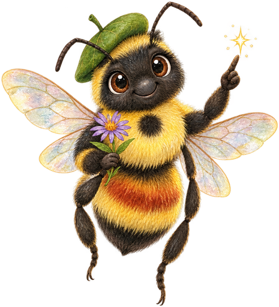

# Downloads

This book is a website, which is the wrong format for a few of the things in
it. A site assessment happens standing in a yard with a shovel. A maintenance
calendar is most useful stuck to a shed wall. A bloom chart wants to be held up
next to an actual garden bed in April.

So those parts are also here as a printable booklet.

!!! mascot-tip "Print it double-sided"
    
    It is laid out for two-sided printing on letter paper. Staple the corner
    and it lives in a back pocket. Let's grow together!

## Field Companion

<div class="download-card" markdown>

**[Minnesota Native Plants — Field Companion](mn-native-plants-field-companion.pdf)**
:material-file-pdf-box: PDF · 11 pages · letter · 1.6 MB

A site-assessment checklist with room to write, a month-by-month maintenance
calendar, the three bloom-succession charts, and two ruled pages for notes.

</div>

**What's in it:**

| Pages | Section | What it does |
|---|---|---|
| 2–3 | Site assessment | Sun hours, the percolation test, the jar test, the two free lookups ([Web Soil Survey](https://websoilsurvey.nrcs.usda.gov/app/) and the [Marschner map](https://mnatlas.org/resources/vegetation-presettlement/)), the local-rules checklist, and a gridded box to sketch the bed |
| 4–5 | Maintenance calendar | What to do each month, and — for December — permission to do nothing |
| 6–8 | Bloom succession | Prairie, woodland and wetland species by month, so you can see your own gaps |
| 9–10 | Notes | Ruled pages: what is blooming today, what to look up later |

## Bloom Charts

The three bloom charts are also in the chapters themselves, where they are
inline SVG and scale to any screen:

- [Prairie bloom succession](../chapters/03-prairie-plants-grasslands/index.md) — 37 native species
- [Woodland bloom succession](../chapters/04-woodland-forest-plants/index.md) — 45 native species
- [Wetland and shoreline bloom succession](../chapters/05-wetland-shoreline-plants/index.md) — 26 native species

Non-native and invasive species are left out of all three. A succession chart
reads as a list of things to plant, and Smooth Brome and Kentucky Bluegrass
both flower in the prairie window.

## How the Bloom Data Was Built

Bloom months come from `.plant-gallery/traits.json`, the same hand-authored
Minnesota trait data behind the [Plant Gallery](../plants/index.md) Quick Facts
tables. Bars show the typical window in the Twin Cities — expect a week or two
later in the north, a little earlier in the far southeast.

They are planning figures, not a phenology dataset. A cold May moves everything.

## Licence

Everything here is [CC BY-NC-SA 4.0](../license.md), the same as the rest of the
book. Print it, copy it, hand it out at a garden club, adapt it for a class —
all fine, with attribution and non-commercially.

## Regenerating These Files

```bash
python3 scripts/bloom-charts.py       # inline SVG charts into chapters 3, 4, 5
python3 scripts/bloom-charts-png.py   # same charts, rendered for print
python3 scripts/field-companion.py    # build the booklet PDF
```

The booklet is built with the `booklet-pdf` skill's page helpers. The charts
have one source — the chapter markdown — so the printed and on-screen versions
cannot drift apart.
