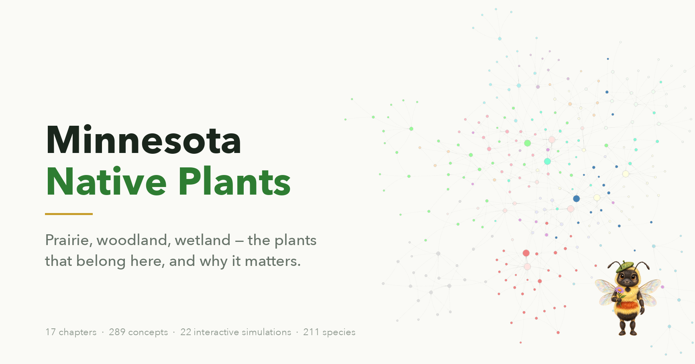
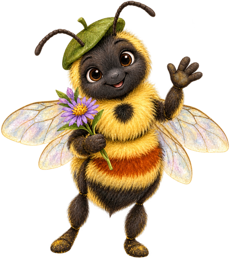

# Minnesota Native Plants

{ .book-cover }

!!! mascot-welcome "Welcome, Garden Friends!"
    
    Let's explore the prairie! I'm Bree, a rusty-patched bumble bee — Minnesota's
    state bee — and I'll be your guide through the native plants of this state.

## About This Textbook

This interactive intelligent textbook introduces the native plants of Minnesota — from tallgrass prairies and hardwood forests to wetlands and shorelines. Whether you're planning your first native garden or restoring a degraded landscape, this book gives you the knowledge and tools to make a difference.

**No prior botany or ecology background is required.** Every concept is explained from the ground up with clear language, helpful diagrams, and interactive simulations you can explore at your own pace.

## What You'll Learn

- **Identify** common native plants and invasive species of Minnesota
- **Understand** prairie, woodland, and wetland ecosystems
- **Design** native plant gardens for your home landscape
- **Remove** invasive species like buckthorn and garlic mustard
- **Think critically** about ecological claims and misinformation
- **Connect** with Minnesota's state, county, and nonprofit resources

## What's Inside

- **17 chapters** covering 289 concepts
- **22 interactive MicroSims** — hands-on learning tools you can use in your browser
- **34 diagrams** illustrating ecosystems, processes, and decision trees
- **340 quiz questions** — a recall quiz and an applied, scenario-based quiz for every chapter
- **289-term glossary** for quick reference
- **70 frequently asked questions** with detailed answers
- **211 species cards** in the [Plant Gallery](plants/index.md), each with photos, growing conditions, and the chapters that mention it
- **A printable [Field Companion](downloads/index.md)** — site-assessment checklist, maintenance calendar and bloom charts, for the parts that work better on paper

## How to Use This Book

Start with [Chapter 1: Introduction to Native Plants](chapters/01-intro-native-plants-ecology/index.md) and work through the chapters in order — each one builds on the concepts before it. Or jump to any topic that interests you using the navigation sidebar.

Every chapter includes interactive simulations, Mermaid diagrams, and a quiz to check your understanding.

## Get Started

- **[Course Description](course-description.md)**
  Overview of topics, learning objectives, and Bloom's Taxonomy outcomes

- **[Chapter 1: Introduction](chapters/01-intro-native-plants-ecology/index.md)**
  Start learning — what makes a plant "native" and why it matters

- **[Learning Graph](learning-graph/index.md)**
  Explore the 289-concept knowledge map powering this textbook

- **[Glossary](glossary.md)**
  Look up any term used in the book

---

*This textbook is licensed under [CC BY-NC-SA 4.0](license.md) for non-commercial use.*
