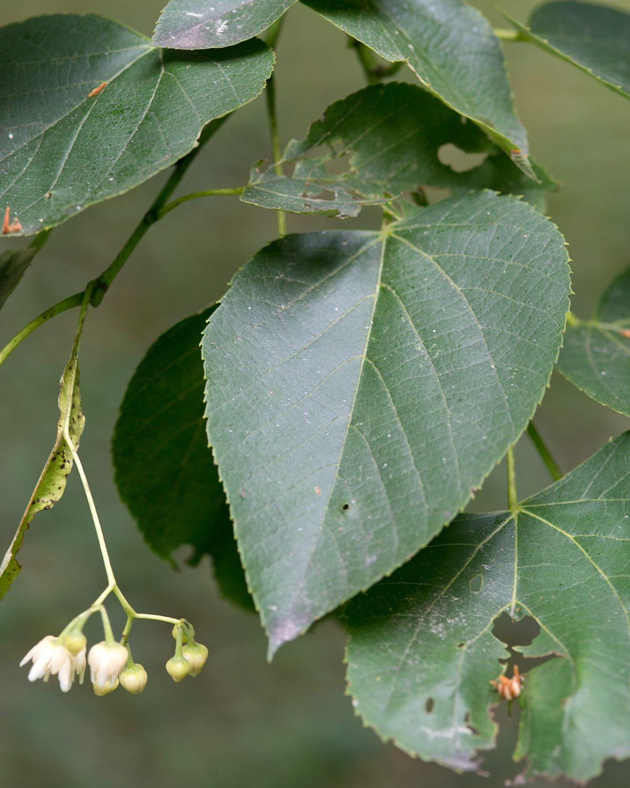

# American Basswood

*Tilia americana*

Tilia americana is a species of tree in the family Malvaceae. It is native to eastern North America, from southeast Manitoba east to New Brunswick, southwest to northeast Oklahoma, southeast to South Carolina, and west along the Niobrara River to Cherry County, Nebraska. It is the sole representative of its genus in the Western Hemisphere, assuming T. caroliniana is treated as a subspecies or local ecotype of T. americana.

## Quick Facts

| | |
|---|---|
| **Scientific name** | *Tilia americana* |
| **Family** | — |
| **Height** | — |
| **Bloom time** | — |
| **Sun** | — |
| **Moisture** | — |
| **Soil** | — |
| **Wildlife value** | — |

## Mentioned In

- [Ecoregions Growing Conditions](../chapters/02-ecoregions-growing-conditions/index.md)
- [Cultural Indigenous Uses](../chapters/13-cultural-indigenous-uses/index.md)

## Image Credits

- Daderot (Public domain)
- Plant Image Library (CC BY-SA 2.0)

## Learn More

- [Wikipedia: Tilia americana](https://en.wikipedia.org/wiki/Tilia_americana)
