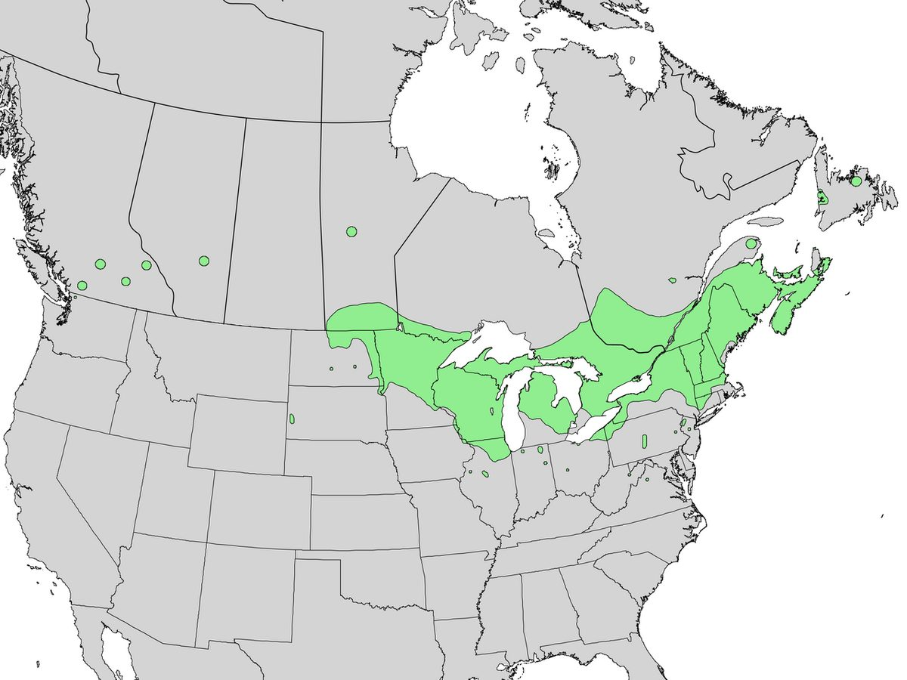

# American Cranberrybush Viburnum

*Viburnum trilobum*

Viburnum trilobum (cranberrybush viburnum, American cranberrybush, high bush cranberry, or highbush cranberry) is a species of Viburnum native to northern North America, from Newfoundland west to British Columbia, south to Washington state and east to northern Virginia. It is very closely related to the European and Asian Viburnum opulus, and is often treated as a variety of it, as Viburnum opulus L. var. americanum Ait., or as a subspecies, Viburnum opulus subsp.

## Quick Facts

| | |
|---|---|
| **Scientific name** | *Viburnum trilobum* |
| **Family** | — |
| **Height** | — |
| **Bloom time** | — |
| **Sun** | — |
| **Moisture** | — |
| **Soil** | — |
| **Wildlife value** | — |

## Mentioned In

- [Ecological Restoration](../chapters/12-ecological-restoration/index.md)

## Image Credits

- Edward Tremel (Edward Tremel) (CC BY-SA 3.0)
- U.S. Geological Survey (Public domain)

## Learn More

- [Wikipedia: Viburnum trilobum](https://en.wikipedia.org/wiki/Viburnum_trilobum)
