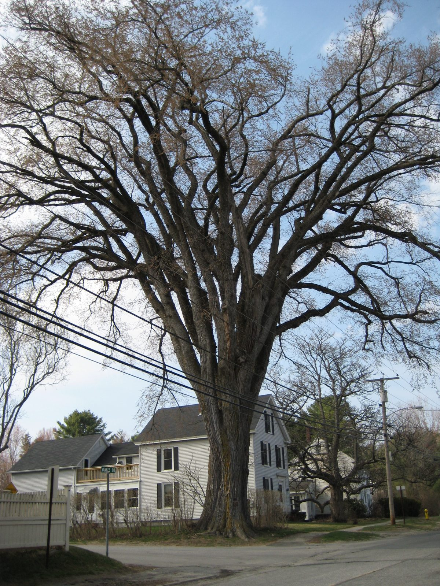

# American Elm

*Ulmus americana*

Ulmus americana, generally known as the American elm or, less commonly, as the white elm or water elm, is a species of elm native to eastern North America. The trees can live for several hundred years. It is a very hardy species that can withstand low winter temperatures.

## Quick Facts

| | |
|---|---|
| **Scientific name** | *Ulmus americana* |
| **Family** | — |
| **Height** | — |
| **Bloom time** | — |
| **Sun** | — |
| **Moisture** | — |
| **Soil** | — |
| **Wildlife value** | — |

## Mentioned In

- [Plant Identification Skills](../chapters/07-plant-identification-skills/index.md)

## Image Credits

- Marty Aligata (CC BY-SA 4.0)
- Dudesleeper (CC BY-SA 4.0)

## Learn More

- [Wikipedia: Ulmus americana](https://en.wikipedia.org/wiki/Ulmus_americana)
