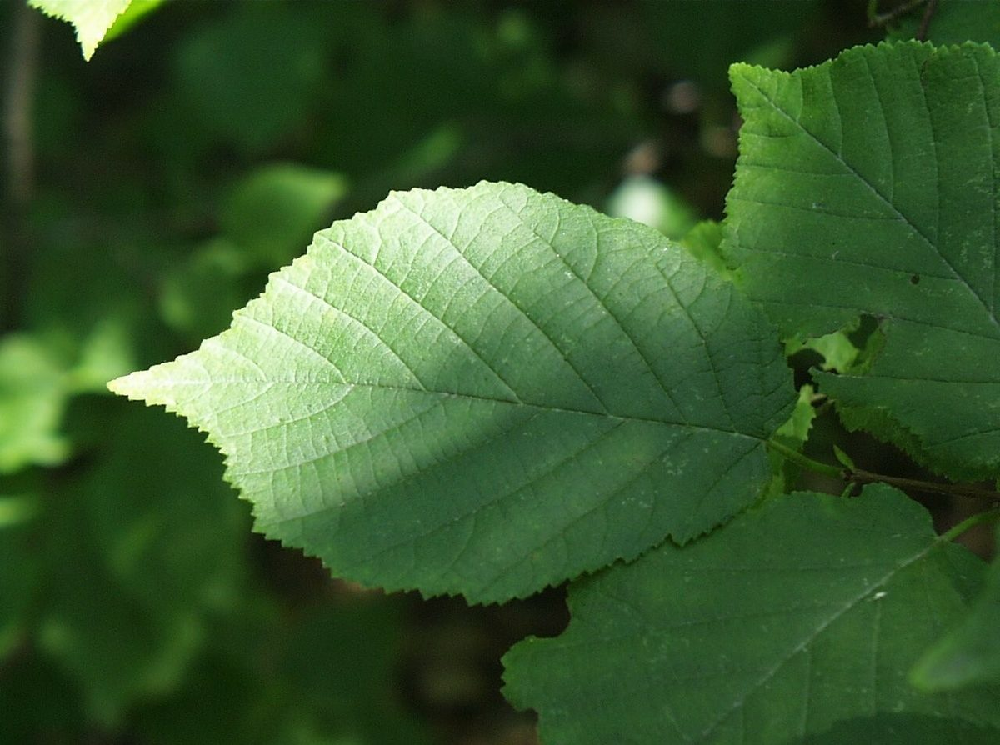

# American Hazelnut

*Corylus americana*

Corylus americana, the American hazelnut or American hazel, is a species of deciduous shrub in the genus Corylus, native to the eastern and central United States and extreme southern parts of eastern and central Canada.

## Quick Facts

| | |
|---|---|
| **Scientific name** | *Corylus americana* |
| **Family** | — |
| **Height** | — |
| **Bloom time** | — |
| **Sun** | — |
| **Moisture** | — |
| **Soil** | — |
| **Wildlife value** | — |

## Mentioned In

- [Woodland Forest Plants](../chapters/04-woodland-forest-plants/index.md)
- [Ecological Restoration](../chapters/12-ecological-restoration/index.md)

## Image Credits

- Unknown (Public domain)
- Unknown (Public domain)

## Learn More

- [Wikipedia: Corylus americana](https://en.wikipedia.org/wiki/Corylus_americana)
