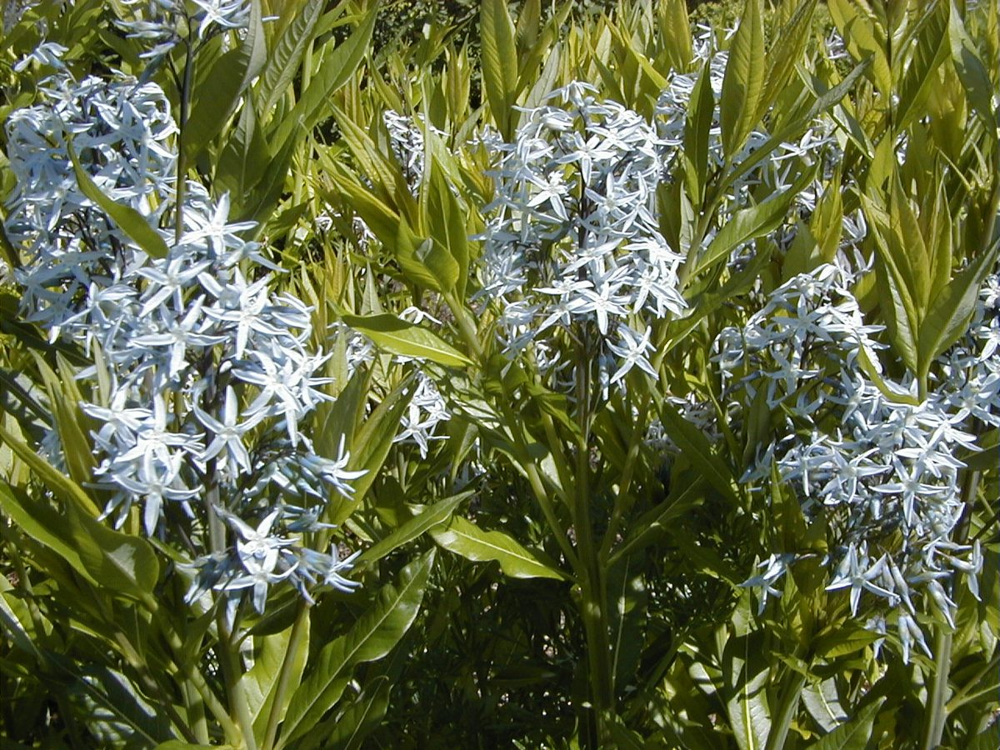

# Amsonia

*Amsonia tabernaemontana*

Amsonia tabernaemontana, the eastern bluestar, is a North American species of flowering plant in the family Apocynaceae, found in central and eastern North America.
It is valued as an ornamental perennial for its pale blue spring flowers, yellow fall foliage, and adaptability to dry, low-input landscapes.

## Quick Facts

| | |
|---|---|
| **Scientific name** | *Amsonia tabernaemontana* |
| **Family** | — |
| **Height** | — |
| **Bloom time** | — |
| **Sun** | — |
| **Moisture** | — |
| **Soil** | — |
| **Wildlife value** | — |

## Mentioned In

- [Ecological Restoration](../chapters/12-ecological-restoration/index.md)

## Image Credits

- Vinayaraj (CC BY-SA 3.0)
- A. Barra (CC BY-SA 4.0)

## Learn More

- [Wikipedia: Amsonia tabernaemontana](https://en.wikipedia.org/wiki/Amsonia_tabernaemontana)
