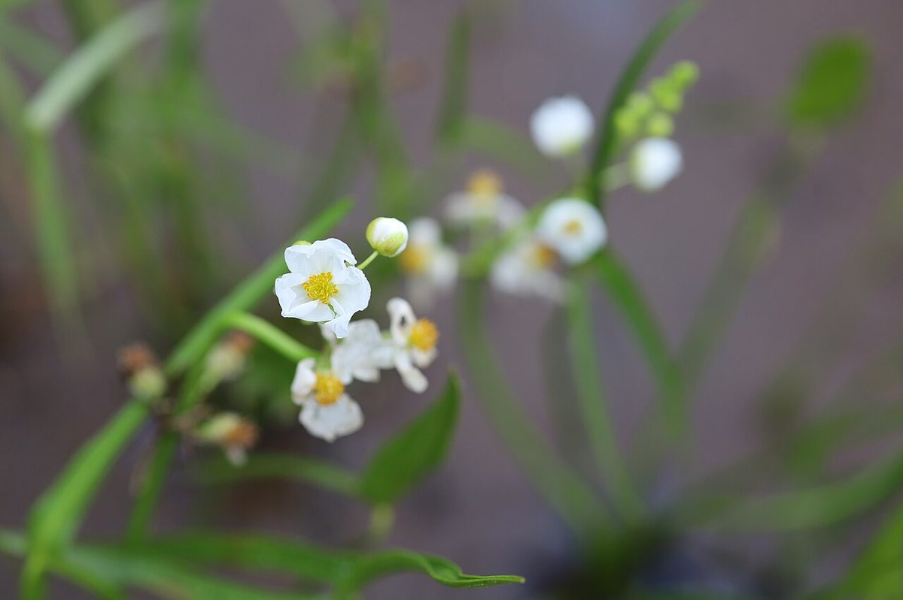

# Arrowhead

*Sagittaria latifolia*

Sagittaria latifolia is a wetland plant in the family Alismataceae, native to North America and northern South America; common names include broadleaf arrowhead, duck-potato, Indian potato, or wapato. This plant produces edible tubers that have traditionally been extensively used by Native Americans.

## Quick Facts

| | |
|---|---|
| **Scientific name** | *Sagittaria latifolia* |
| **Family** | — |
| **Height** | — |
| **Bloom time** | — |
| **Sun** | — |
| **Moisture** | — |
| **Soil** | — |
| **Wildlife value** | — |

## Mentioned In

- [Wetland Shoreline Plants](../chapters/05-wetland-shoreline-plants/index.md)

## Image Credits

- Unknown (CC BY-SA 3.0)
- Nichole Ouellette (CC BY-SA 4.0)

## Learn More

- [Wikipedia: Sagittaria latifolia](https://en.wikipedia.org/wiki/Sagittaria_latifolia)
