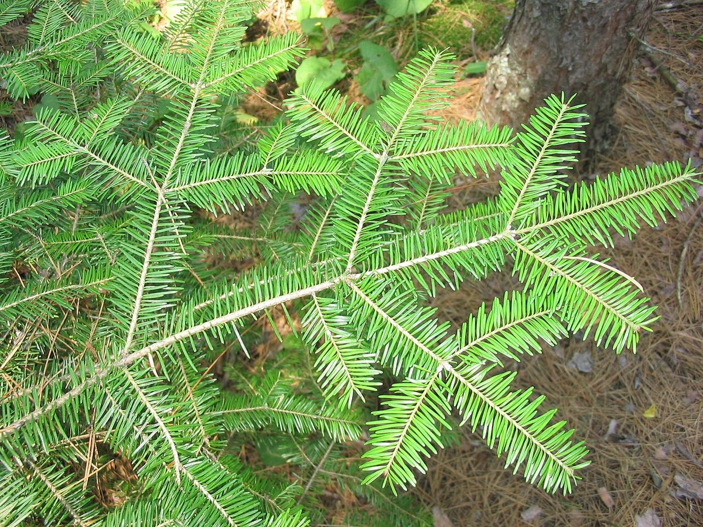

# Balsam Fir

*Abies balsamea*

Abies balsamea or balsam fir is a North American fir, native to most of eastern and central Canada (Newfoundland west to central Alberta) and the northeastern United States (Minnesota east to Maine, and south in the Appalachian Mountains to West Virginia).

## Quick Facts

| | |
|---|---|
| **Scientific name** | *Abies balsamea* |
| **Family** | — |
| **Height** | — |
| **Bloom time** | — |
| **Sun** | — |
| **Moisture** | — |
| **Soil** | — |
| **Wildlife value** | — |

## Mentioned In

- [Ecoregions Growing Conditions](../chapters/02-ecoregions-growing-conditions/index.md)

## Image Credits

- U.S. Fish and Wildlife Service (Public domain)
- Superior National Forest (CC BY 2.0)

## Learn More

- [Wikipedia: Abies balsamea](https://en.wikipedia.org/wiki/Abies_balsamea)
