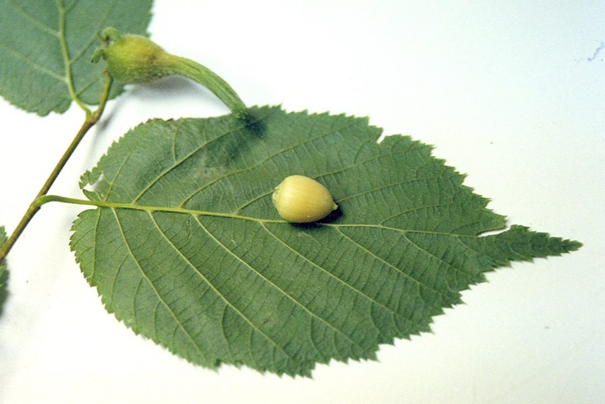
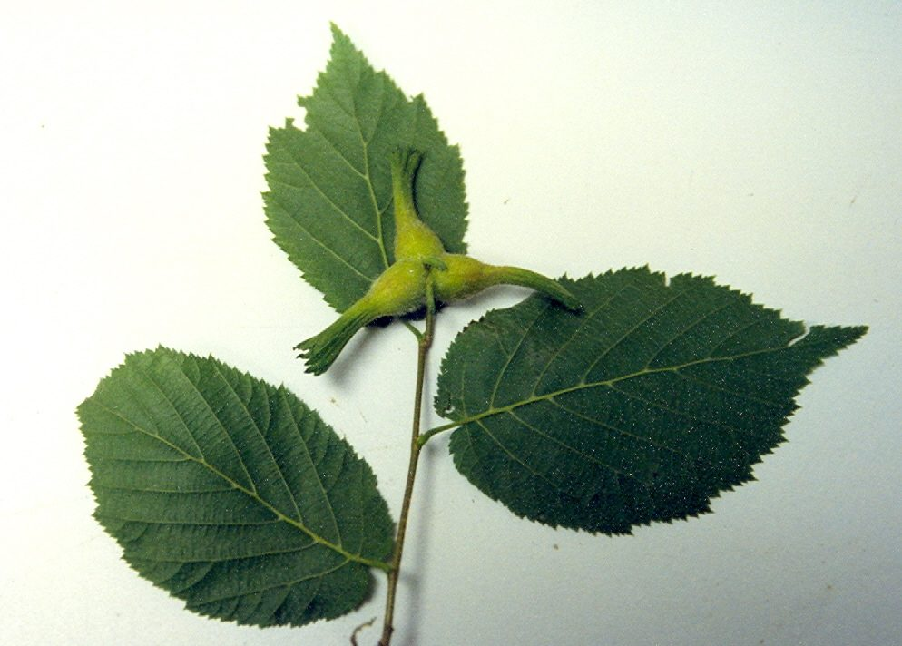

# Beaked Hazelnut

*Corylus cornuta*

Corylus cornuta, the beaked hazelnut (or just beaked hazel), is a deciduous shrubby hazel with two subspecies found throughout most of North America.

## Quick Facts

| | |
|---|---|
| **Scientific name** | *Corylus cornuta* |
| **Family** | Betulaceae |
| **Height** | 6-10 ft |
| **Bloom time** | Mar-Apr |
| **Sun** | Part shade |
| **Moisture** | Dry to mesic |
| **Soil** | Loam |
| **Wildlife value** | Nuts for grouse and squirrels; understory cover |

## Mentioned In

- [Woodland Forest Plants](../chapters/04-woodland-forest-plants/index.md)

## Image Credits

- Unknown (Public domain)
- Unknown (Public domain)

## Learn More

- [Wikipedia: Corylus cornuta](https://en.wikipedia.org/wiki/Corylus_cornuta)
