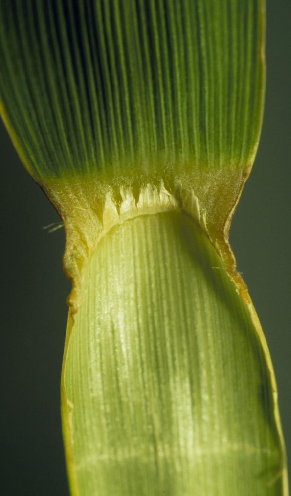

# Big Bluestem

*Andropogon gerardii*

Andropogon gerardi, commonly known as big bluestem, is a species of tall grass native to much of the Great Plains and grassland regions of central and eastern North America. It is also known as tall bluestem, bluejoint, and turkeyfoot.

## Quick Facts

| | |
|---|---|
| **Scientific name** | *Andropogon gerardii* |
| **Family** | — |
| **Height** | — |
| **Bloom time** | — |
| **Sun** | — |
| **Moisture** | — |
| **Soil** | — |
| **Wildlife value** | — |

## Mentioned In

- [Prairie Plants Grasslands](../chapters/03-prairie-plants-grasslands/index.md)
- [Wetland Shoreline Plants](../chapters/05-wetland-shoreline-plants/index.md)

## Image Credits

- Matt Lavin from Bozeman, Montana, USA (CC BY-SA 2.0)
- Matt Lavin from Bozeman, Montana, USA (CC BY-SA 2.0)

## Learn More

- [Wikipedia: Andropogon gerardi](https://en.wikipedia.org/wiki/Andropogon_gerardi)
