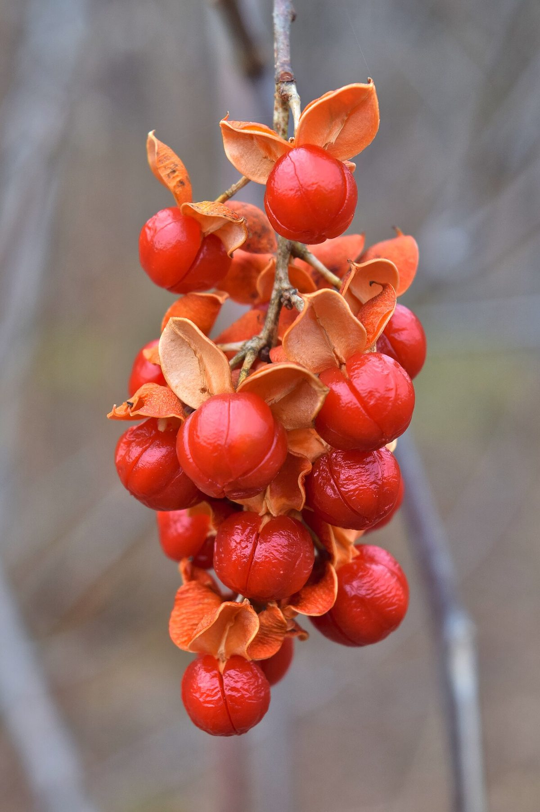

# Bittersweet

*Celastrus scandens*

Celastrus scandens, commonly called American bittersweet, is a species of bittersweet that blooms mostly in June and is commonly found on rich, well-drained soils of woodlands.

## Quick Facts

| | |
|---|---|
| **Scientific name** | *Celastrus scandens* |
| **Family** | Celastraceae |
| **Height** | 15-20 ft vine |
| **Bloom time** | May-Jun |
| **Sun** | Full sun to part shade |
| **Moisture** | Dry to mesic |
| **Soil** | Any |
| **Wildlife value** | Orange fruit for birds. Native - do not confuse with invasive Oriental Bittersweet |

## Mentioned In

- [Woodland Forest Plants](../chapters/04-woodland-forest-plants/index.md)

## Image Credits

- The Cosmonaut (CC BY-SA 2.5 ca)

## Learn More

- [Wikipedia: Celastrus scandens](https://en.wikipedia.org/wiki/Celastrus_scandens)
