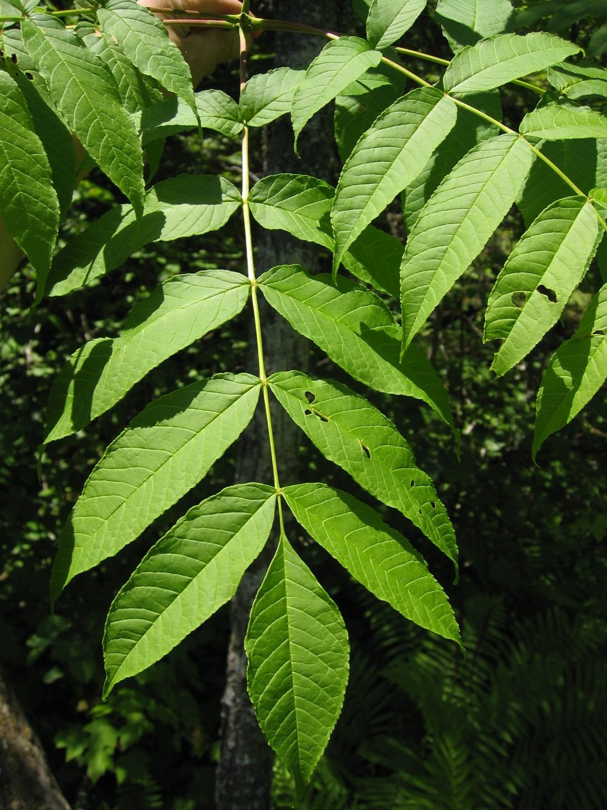

# Black Ash

*Fraxinus nigra*

Fraxinus nigra, or the black ash, is a species of ash native to much of eastern Canada and the northeastern United States, from western Newfoundland west to southeastern Manitoba, and south to Illinois and northern Virginia. Formerly abundant, as of 2017 the species is threatened with near total extirpation throughout its range within the next century as a result of infestation by an invasive parasitic insect known as the emerald ash borer (Agrilus planipennis).

## Quick Facts

| | |
|---|---|
| **Scientific name** | *Fraxinus nigra* |
| **Family** | — |
| **Height** | — |
| **Bloom time** | — |
| **Sun** | — |
| **Moisture** | — |
| **Soil** | — |
| **Wildlife value** | — |

## Mentioned In

- [Ecoregions Growing Conditions](../chapters/02-ecoregions-growing-conditions/index.md)
- [Invasive Species Id](../chapters/08-invasive-species-id/index.md)

## Image Credits

- Kkl456 (CC BY-SA 4.0)
- Keith Kanoti, Maine Forest Service, USA (CC BY 3.0 us)

## Learn More

- [Wikipedia: Fraxinus nigra](https://en.wikipedia.org/wiki/Fraxinus_nigra)
