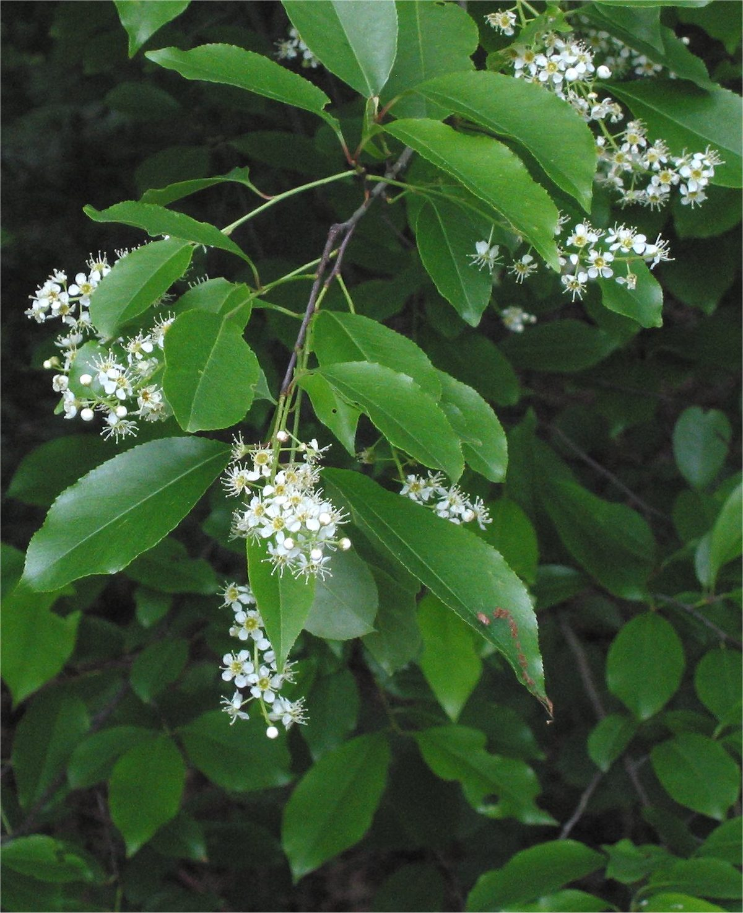

# Black Cherry

*Prunus serotina*

Prunus serotina, commonly called black cherry, wild black cherry, rum cherry, or mountain black cherry, is a deciduous tree or shrub in the rose family Rosaceae. Despite its common names, it is not very closely related to commonly cultivated cherries. It is found in the Americas.

## Quick Facts

| | |
|---|---|
| **Scientific name** | *Prunus serotina* |
| **Family** | — |
| **Height** | — |
| **Bloom time** | — |
| **Sun** | — |
| **Moisture** | — |
| **Soil** | — |
| **Wildlife value** | — |

## Mentioned In

- [Pollinators Wildlife](../chapters/06-pollinators-wildlife/index.md)

## Image Credits

- Famartin (CC BY-SA 4.0)
- Unknown (CC BY-SA 3.0)

## Learn More

- [Wikipedia: Prunus serotina](https://en.wikipedia.org/wiki/Prunus_serotina)
