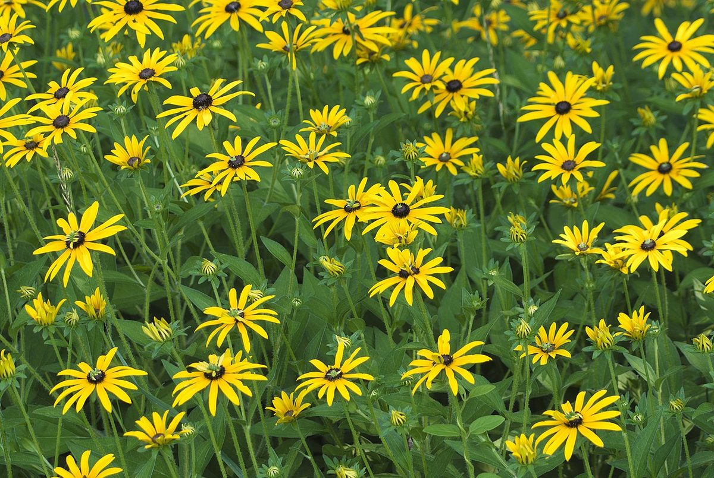
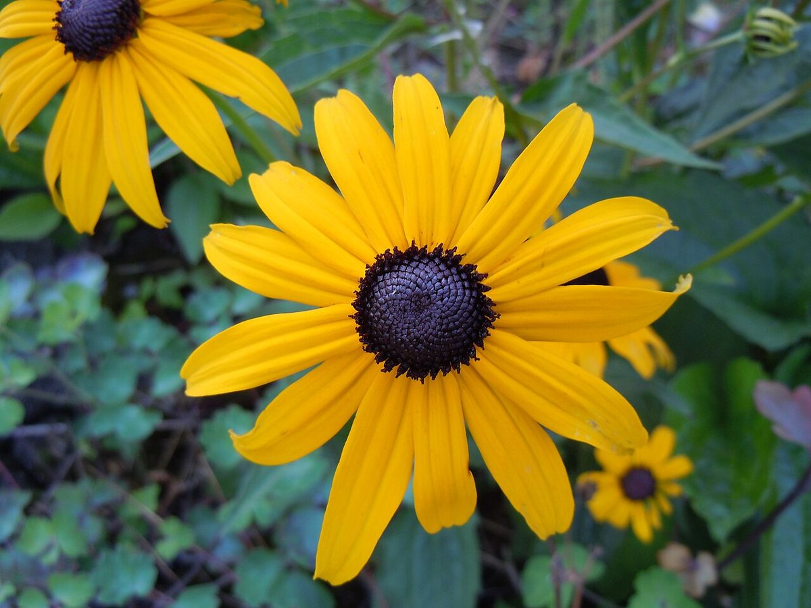

# Black-Eyed Susan

*Rudbeckia hirta*

Rudbeckia hirta, commonly called black-eyed Susan and yellow coneflower, is a North American flowering plant in the family Asteraceae. It grows to 1 metre (3+1⁄2 ft) tall with daisy-like yellow flower heads. There are numerous cultivars.

## Quick Facts

| | |
|---|---|
| **Scientific name** | *Rudbeckia hirta* |
| **Family** | Asteraceae |
| **Height** | 1-3 ft |
| **Bloom time** | Jun-Sep |
| **Sun** | Full sun |
| **Moisture** | Dry to mesic |
| **Soil** | Any |
| **Wildlife value** | Long bloom for bees and butterflies; seed for goldfinches |

## Mentioned In

- [Minnesota's Ecoregions and Growing Conditions](../chapters/02-ecoregions-growing-conditions/index.md)
- [Prairie Plants and Grassland Ecosystems](../chapters/03-prairie-plants-grasslands/index.md)
- [Pollinators, Wildlife, and Plant Relationships](../chapters/06-pollinators-wildlife/index.md)
- [Planting, Maintenance, and Sourcing](../chapters/11-planting-maintenance-sourcing/index.md)
- [Ecological Restoration](../chapters/12-ecological-restoration/index.md)

## Image Credits

- Russ (CC BY 2.0)
- Sebastian Martin Dicke (CC BY-SA 4.0)

## Learn More

- [Wikipedia: Rudbeckia hirta](https://en.wikipedia.org/wiki/Rudbeckia_hirta)
