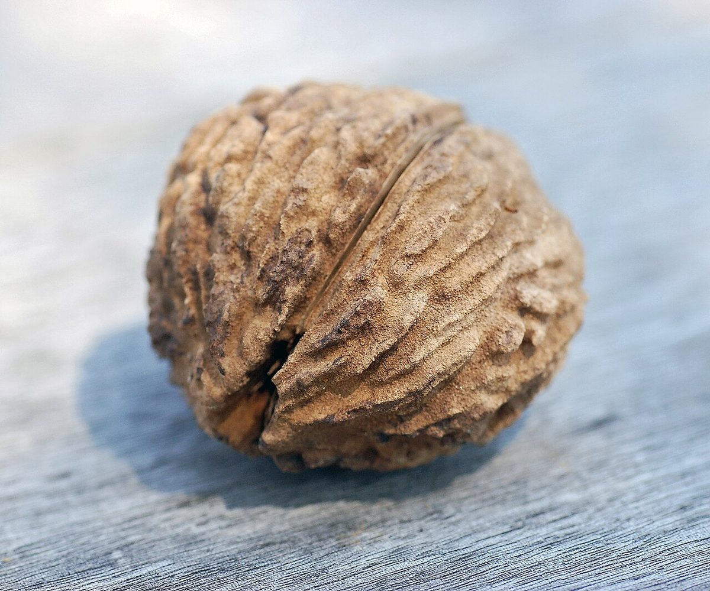

# Black Walnut

*Juglans nigra*

Juglans nigra, the eastern American black walnut, is a species of deciduous tree in the walnut family, Juglandaceae, native to central and eastern North America, growing mostly in riparian zones.
Black walnut is susceptible to thousand cankers disease, which provoked a decline of walnut trees in some regions. Black walnut is allelopathic, releasing chemicals from its roots and other tissues that may harm other organisms and give the tree a competitive advantage, but there is no scientific consensus that this is a primary competitive factor.

## Quick Facts

| | |
|---|---|
| **Scientific name** | *Juglans nigra* |
| **Family** | — |
| **Height** | — |
| **Bloom time** | — |
| **Sun** | — |
| **Moisture** | — |
| **Soil** | — |
| **Wildlife value** | — |

## Mentioned In

- [Cultural Indigenous Uses](../chapters/13-cultural-indigenous-uses/index.md)

## Image Credits

- Famartin (CC BY-SA 4.0)
- Photo by and (c)2007 Derek Ramsey (Ram-Man). Location credit to the Chanticleer Garden. (CC BY-SA 3.0)

## Learn More

- [Wikipedia: Juglans nigra](https://en.wikipedia.org/wiki/Juglans_nigra)
