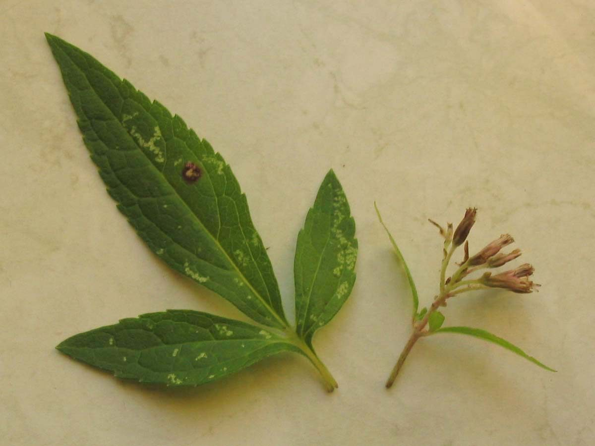

# Blazing Star

*Liatris ligulistylis*

Liatris ligulistylis (Rocky Mountain blazing star, northern plains blazing star, or meadow blazing star) is a flowering plant of the family Asteraceae, native to the central United States and central Canada.

## Quick Facts

| | |
|---|---|
| **Scientific name** | *Liatris ligulistylis* |
| **Family** | Asteraceae |
| **Height** | 2-5 ft |
| **Bloom time** | Aug-Sep |
| **Sun** | Full sun |
| **Moisture** | Mesic |
| **Soil** | Loam |
| **Wildlife value** | The strongest monarch magnet in the Minnesota palette |

## Mentioned In

- [Pollinators Wildlife](../chapters/06-pollinators-wildlife/index.md)

## Image Credits

- Teunie at Dutch Wikipedia (CC BY-SA 3.0)

## Learn More

- [Wikipedia: Liatris ligulistylis](https://en.wikipedia.org/wiki/Liatris_ligulistylis)
