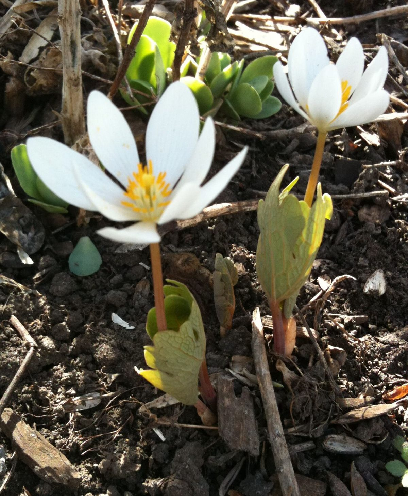

# Bloodroot

*Sanguinaria canadensis*

Sanguinaria canadensis, bloodroot, is a perennial, herbaceous flowering plant native to eastern North America. It is the only species in the genus Sanguinaria, included in the poppy family Papaveraceae, and is most closely related to Eomecon of eastern Asia. 
Sanguinaria canadensis is sometimes known as Canada puccoon, bloodwort, redroot, red puccoon, and black paste.

## Quick Facts

| | |
|---|---|
| **Scientific name** | *Sanguinaria canadensis* |
| **Family** | — |
| **Height** | — |
| **Bloom time** | — |
| **Sun** | — |
| **Moisture** | — |
| **Soil** | — |
| **Wildlife value** | — |

## Mentioned In

- [Woodland Forest Plants](../chapters/04-woodland-forest-plants/index.md)
- [Garden Design Native Plants](../chapters/10-garden-design-native-plants/index.md)

## Image Credits

- Slayerwulfe (CC0)
- Basefilm (CC BY-SA 3.0)

## Learn More

- [Wikipedia: Sanguinaria](https://en.wikipedia.org/wiki/Sanguinaria)
