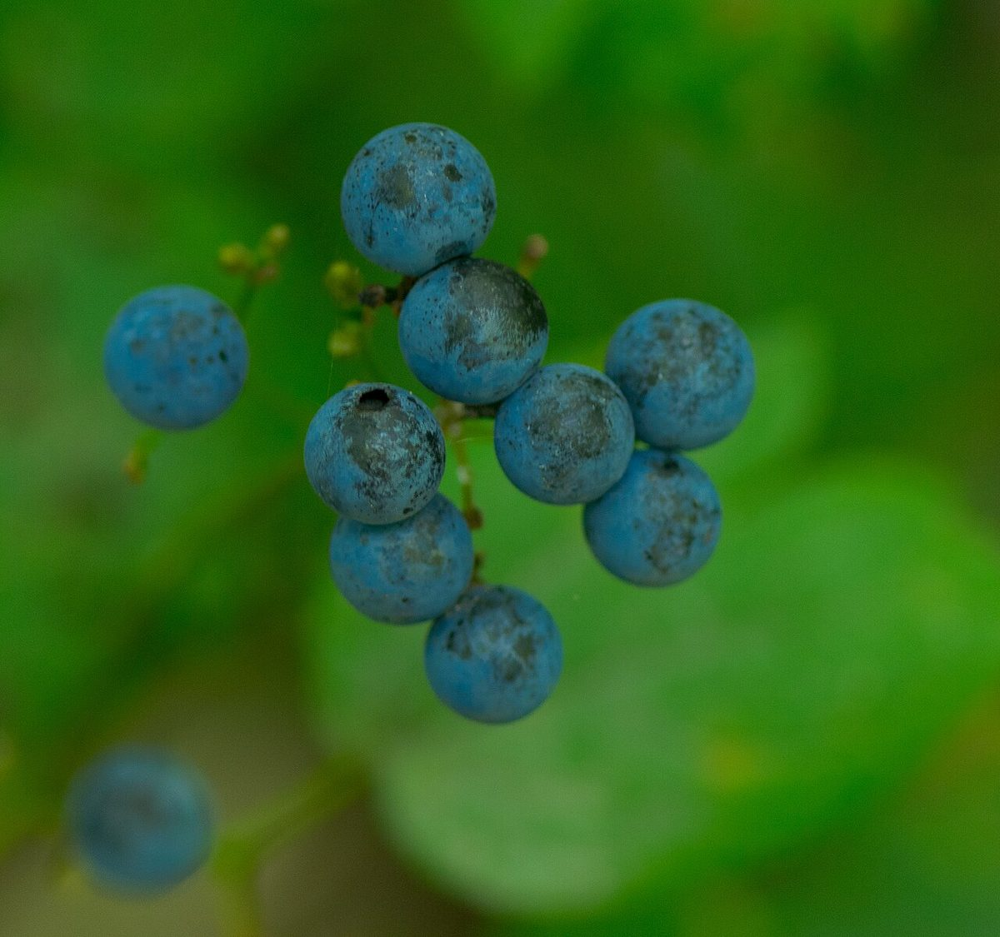

# Blue Cohosh

*Caulophyllum thalictroides*

Caulophyllum thalictroides, the blue cohosh, is a species of flowering plant in the Berberidaceae (barberry) family. It is a medium-tall perennial with blue berry-like fruits and bluish-green foliage. The common name cohosh is probably from an Algonquian word meaning "rough".

## Quick Facts

| | |
|---|---|
| **Scientific name** | *Caulophyllum thalictroides* |
| **Family** | — |
| **Height** | — |
| **Bloom time** | — |
| **Sun** | — |
| **Moisture** | — |
| **Soil** | — |
| **Wildlife value** | — |

## Mentioned In

- [Woodland Forest Plants](../chapters/04-woodland-forest-plants/index.md)

## Image Credits

- Millspaugh, Charles Frederick (Public domain)
- Joshua Mayer from Madison, WI, USA (CC BY-SA 2.0)

## Learn More

- [Wikipedia: Caulophyllum thalictroides](https://en.wikipedia.org/wiki/Caulophyllum_thalictroides)
