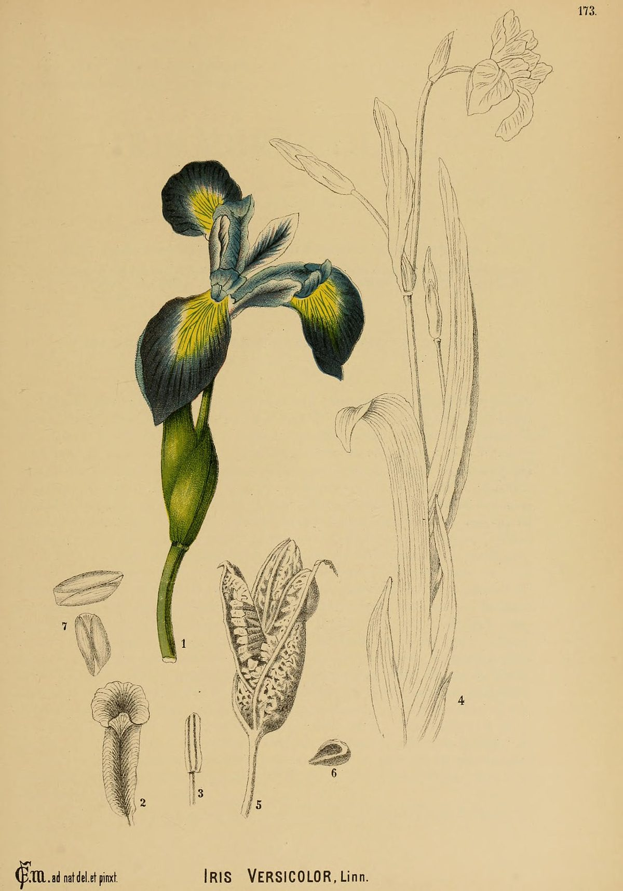
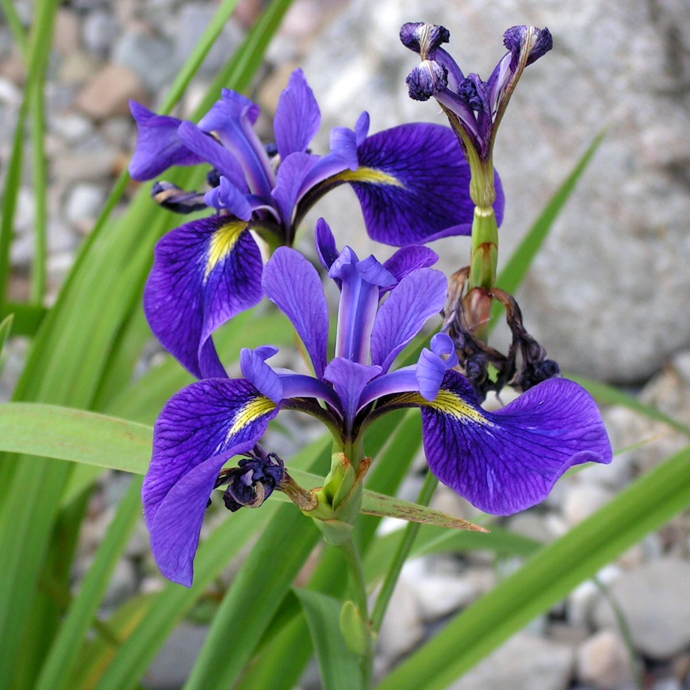

# Blue Flag Iris

*Iris versicolor*

Iris versicolor or Iris versicolour is also commonly known as the blue flag, harlequin blueflag, larger blue flag, northern blue flag, and poison flag, plus other variations of these names, and in Great Britain and Ireland as purple iris.
It is a species of Iris native to North America, in Eastern Canada and the Eastern United States. It is common in sedge meadows, marshes, and along streambanks and shores.

## Quick Facts

| | |
|---|---|
| **Scientific name** | *Iris versicolor* |
| **Family** | — |
| **Height** | — |
| **Bloom time** | — |
| **Sun** | — |
| **Moisture** | — |
| **Soil** | — |
| **Wildlife value** | — |

## Mentioned In

- [Ecoregions Growing Conditions](../chapters/02-ecoregions-growing-conditions/index.md)
- [Wetland Shoreline Plants](../chapters/05-wetland-shoreline-plants/index.md)

## Image Credits

- Charles Frederick Millspaugh (Public domain)
- D. Gordon E. Robertson (CC BY-SA 3.0)

## Learn More

- [Wikipedia: Iris versicolor](https://en.wikipedia.org/wiki/Iris_versicolor)
