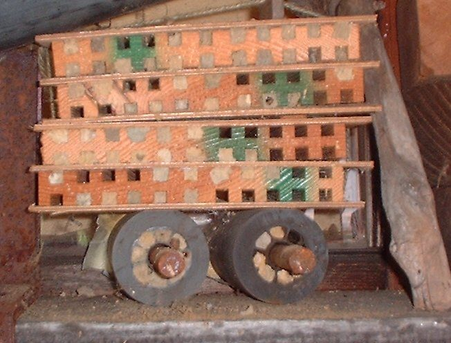

# Blue Orchard Mason Bees

*Osmia lignaria*

Osmia lignaria, commonly known as the orchard mason bee or blue orchard bee, is a megachilid bee that makes nests in natural holes and reeds, creating individual cells for its brood that are separated by mud dividers. Unlike carpenter bees, it cannot drill holes in wood. O. lignaria is a common species used for early spring fruit bloom in the United States and Canada, though a number of other Osmia species are cultured for use in pollination.

## Quick Facts

| | |
|---|---|
| **Scientific name** | *Osmia lignaria* |
| **Family** | — |
| **Height** | — |
| **Bloom time** | — |
| **Sun** | — |
| **Moisture** | — |
| **Soil** | — |
| **Wildlife value** | — |

## Mentioned In

- [Pollinators Wildlife](../chapters/06-pollinators-wildlife/index.md)

## Image Credits

- (c) Doug Wolfe, some rights reserved (CC BY) (CC BY 4.0)
- Red58bill (CC BY 3.0)

## Learn More

- [Wikipedia: Osmia lignaria](https://en.wikipedia.org/wiki/Osmia_lignaria)
