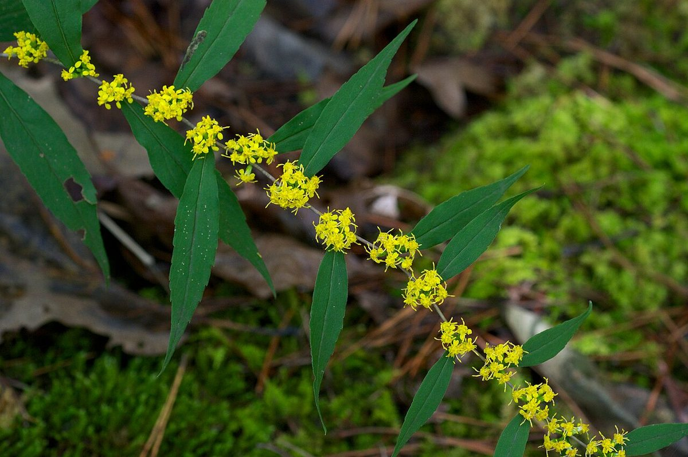

# Blue-stemmed Goldenrod

*Solidago caesia*

Solidago caesia, commonly named blue-stemmed goldenrod, wreath goldenrod, or woodland goldenrod, is a flowering plant native to North America.

## Quick Facts

| | |
|---|---|
| **Scientific name** | *Solidago caesia* |
| **Family** | — |
| **Height** | — |
| **Bloom time** | — |
| **Sun** | — |
| **Moisture** | — |
| **Soil** | — |
| **Wildlife value** | — |

## Mentioned In

- [Woodland Forest Plants](../chapters/04-woodland-forest-plants/index.md)
- [Ecological Restoration](../chapters/12-ecological-restoration/index.md)

## Image Credits

- New York Botanical Garden. (Public domain)
- Eric Hunt (CC BY-SA 4.0)

## Learn More

- [Wikipedia: Solidago caesia](https://en.wikipedia.org/wiki/Solidago_caesia)
