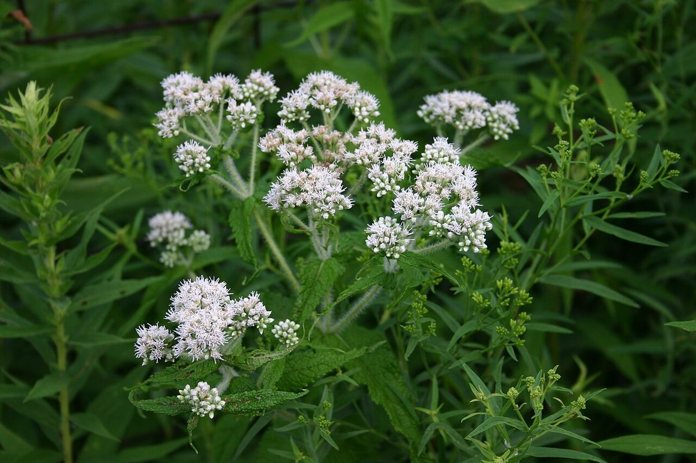
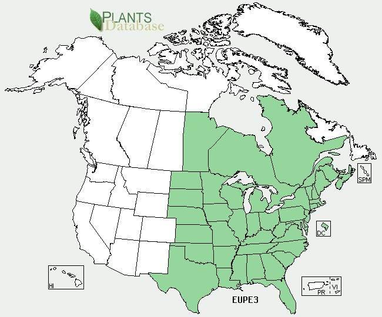

# Boneset

*Eupatorium perfoliatum*

Eupatorium perfoliatum, known as common boneset or just boneset, is a North American perennial plant in the family Asteraceae. It is a common native to the Eastern United States and Canada, widespread from Nova Scotia to Florida, west as far as Texas, Nebraska, the Dakotas, and Manitoba. It is also called agueweed, feverwort, or sweating-plant.

## Quick Facts

| | |
|---|---|
| **Scientific name** | *Eupatorium perfoliatum* |
| **Family** | — |
| **Height** | — |
| **Bloom time** | — |
| **Sun** | — |
| **Moisture** | — |
| **Soil** | — |
| **Wildlife value** | — |

## Mentioned In

- [Wetland Shoreline Plants](../chapters/05-wetland-shoreline-plants/index.md)

## Image Credits

- SB_Johnny (CC BY-SA 3.0)
- USDA (Public domain)

## Learn More

- [Wikipedia: Eupatorium perfoliatum](https://en.wikipedia.org/wiki/Eupatorium_perfoliatum)
