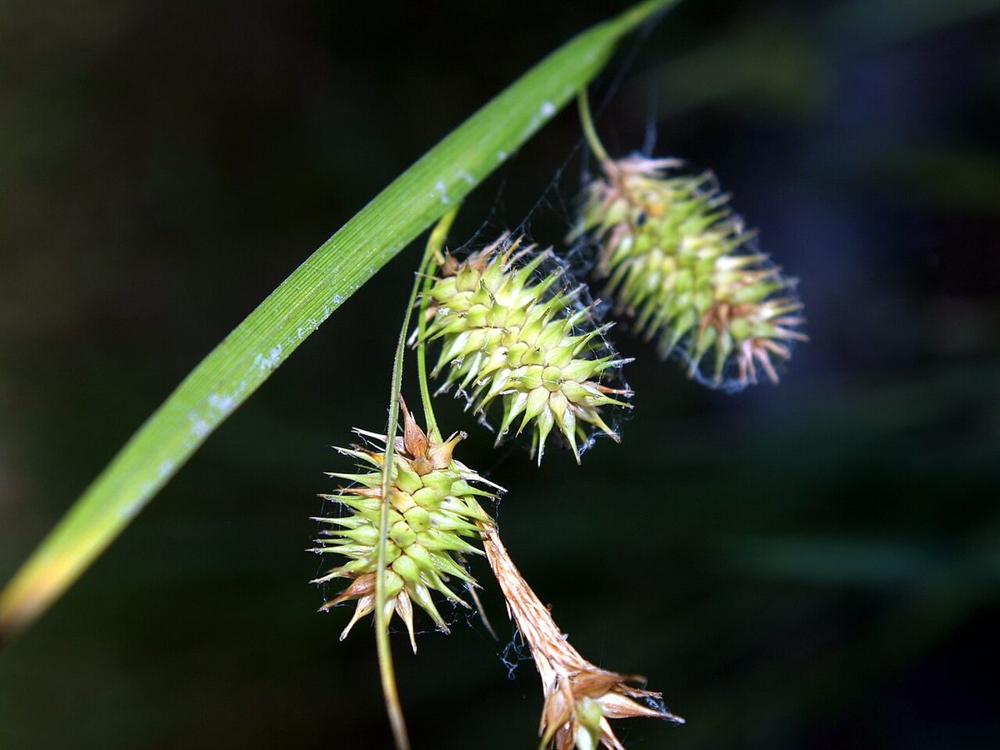

# Bottlebrush Sedge

*Carex hystericina*

Carex hystericina is a species of sedge known by the common names bottlebrush sedge and porcupine sedge. It is native to North America and Canada through to Mexico and Jamaica.

## Quick Facts

| | |
|---|---|
| **Scientific name** | *Carex hystericina* |
| **Family** | Cyperaceae |
| **Height** | 1-3 ft |
| **Bloom time** | May-Jul |
| **Sun** | Full sun to part shade |
| **Moisture** | Wet |
| **Soil** | Muck |
| **Wildlife value** | Wetland restoration workhorse; seed for waterfowl |

## Mentioned In

- [Plant Identification Skills](../chapters/07-plant-identification-skills/index.md)

## Image Credits

- Jim Pisarowicz (Public domain)

## Learn More

- [Wikipedia: Carex hystericina](https://en.wikipedia.org/wiki/Carex_hystericina)
