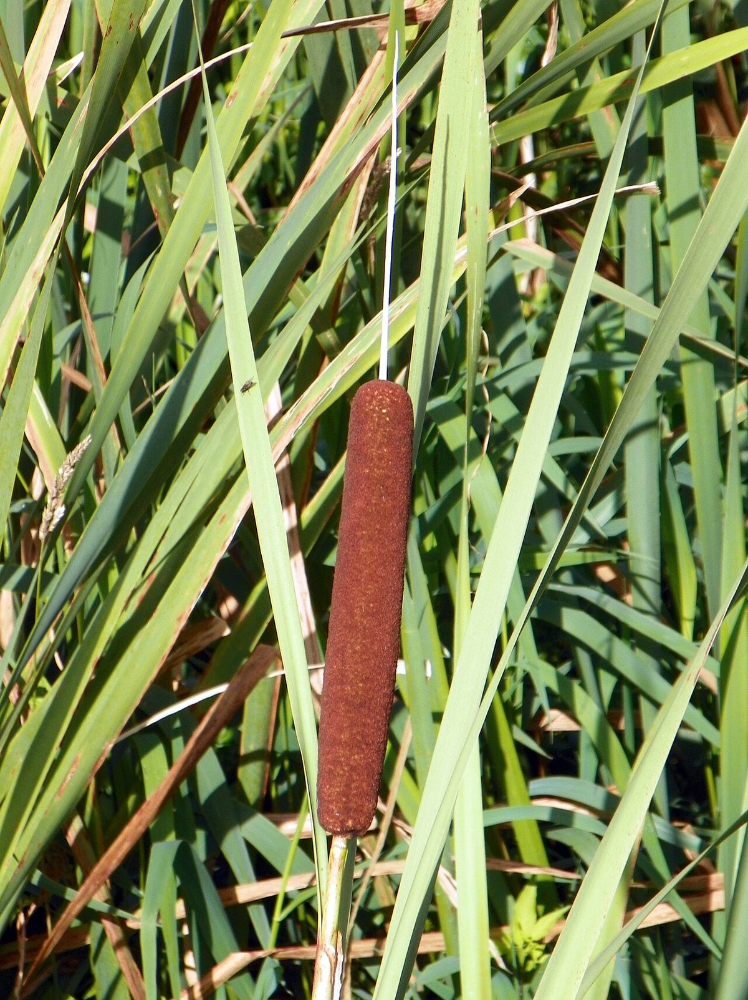
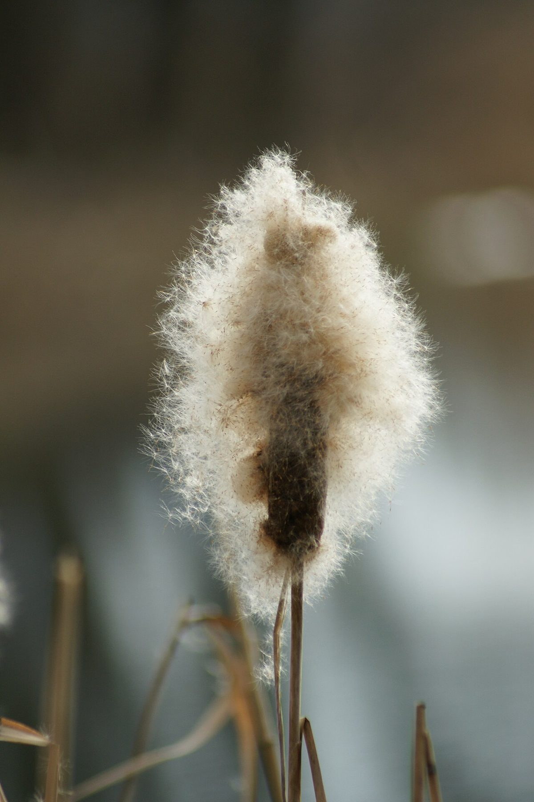

# Broad-Leaved Cattail

*Typha latifolia*

Typha latifolia is a perennial herbaceous wetland plant in the genus Typha. It is known in English as bulrush (sometimes as common bulrush to distinguish from other species of Typha), and in North America as broadleaf cattail. It is found as a native plant species throughout most of Eurasia and North America, and more locally in Africa and South America.

## Quick Facts

| | |
|---|---|
| **Scientific name** | *Typha latifolia* |
| **Family** | — |
| **Height** | — |
| **Bloom time** | — |
| **Sun** | — |
| **Moisture** | — |
| **Soil** | — |
| **Wildlife value** | — |

## Mentioned In

- [Plant Identification Skills](../chapters/07-plant-identification-skills/index.md)

## Image Credits

- Peter O'Connor aka anemoneprojectors from Stevenage, United Kingdom (CC BY-SA 2.0)
- Böhringer Friedrich (CC BY-SA 2.5)

## Learn More

- [Wikipedia: Typha latifolia](https://en.wikipedia.org/wiki/Typha_latifolia)
