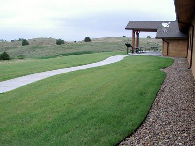

# Buffalograss

*Bouteloua dactyloides*

Bouteloua dactyloides, commonly known as buffalograss or buffalo grass, is a North American prairie grass native to Canada, Mexico, and the United States. It is a short grass found mainly on the High Plains and is co-dominant with blue grama (B. gracilis) over most of the shortgrass prairie. Buffalo grass in North America is not the same species of grass commonly known as buffalo in Australia.

## Quick Facts

| | |
|---|---|
| **Scientific name** | *Bouteloua dactyloides* |
| **Family** | — |
| **Height** | — |
| **Bloom time** | — |
| **Sun** | — |
| **Moisture** | — |
| **Soil** | — |
| **Wildlife value** | — |

## Mentioned In

- [Garden Design Native Plants](../chapters/10-garden-design-native-plants/index.md)

## Image Credits

- Patrick Alexander https://www.inaturalist.org/people/aspidoscelis (CC0)
- Stockseed_dot_com (talk) (Uploads) (Cc-by-sa-3.0)

## Learn More

- [Wikipedia: Bouteloua dactyloides](https://en.wikipedia.org/wiki/Bouteloua_dactyloides)
