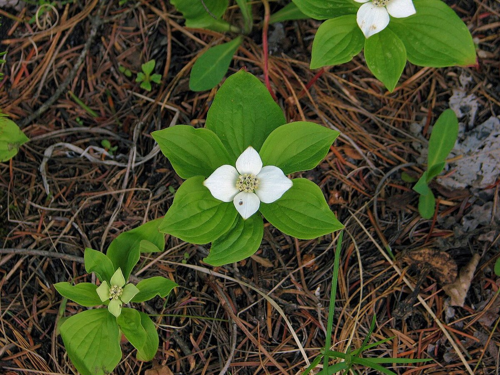

# Bunchberry

*Cornus canadensis*

Cornus canadensis is a species of flowering plant in the dogwood family Cornaceae, native to eastern Asia and North America. Common names include Canadian dwarf cornel, Canadian bunchberry, quatre-temps, crackerberry, and creeping dogwood. It is a creeping, rhizomatous perennial growing to about 20 centimetres (8 inches) tall.

## Quick Facts

| | |
|---|---|
| **Scientific name** | *Cornus canadensis* |
| **Family** | — |
| **Height** | — |
| **Bloom time** | — |
| **Sun** | — |
| **Moisture** | — |
| **Soil** | — |
| **Wildlife value** | — |

## Mentioned In

- [Ecoregions Growing Conditions](../chapters/02-ecoregions-growing-conditions/index.md)

## Image Credits

- Flowersinmyyard (CC BY-SA 4.0)
- D. Gordon E. Robertson (CC BY-SA 3.0)

## Learn More

- [Wikipedia: Cornus canadensis](https://en.wikipedia.org/wiki/Cornus_canadensis)
