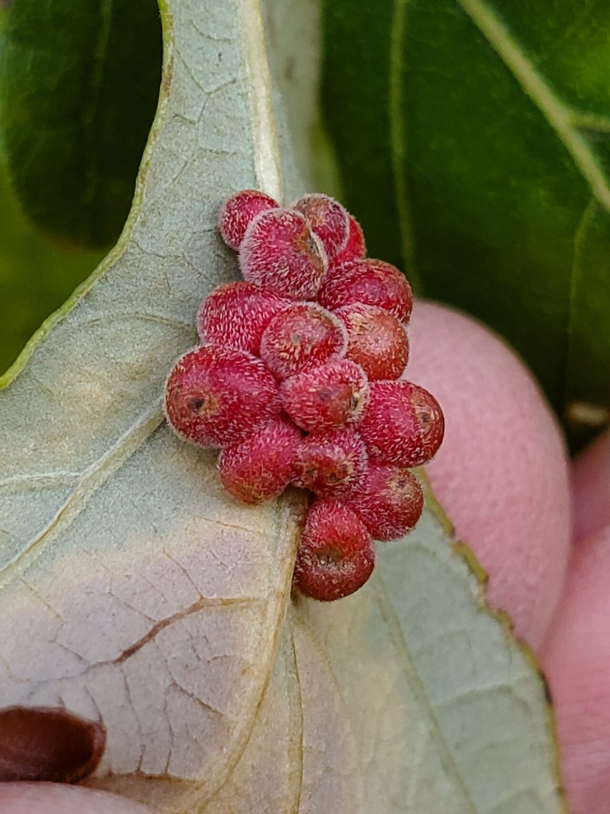
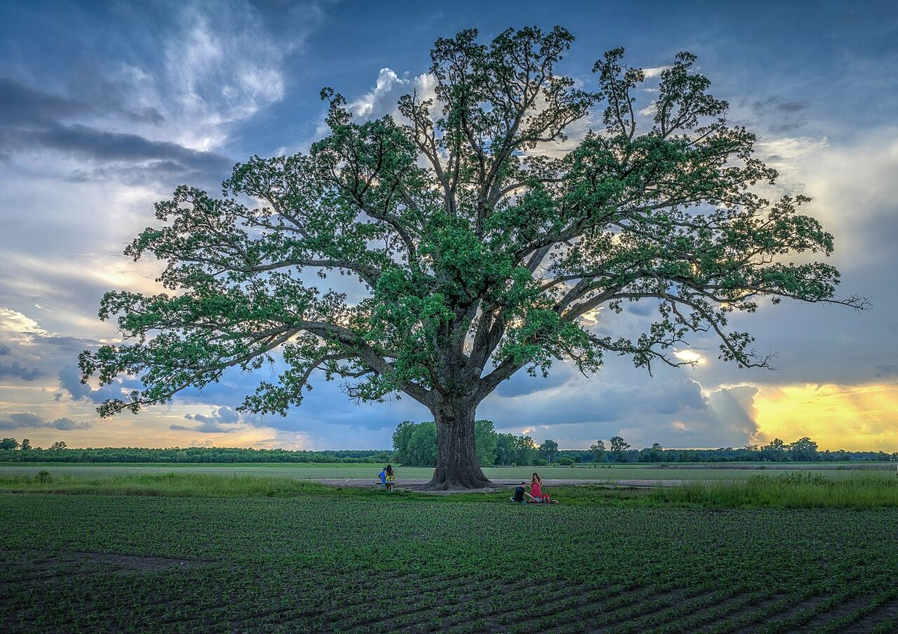

# Bur Oak

*Quercus macrocarpa*

Quercus macrocarpa, the bur oak or burr oak, is a species of oak tree native to central and eastern North America. It is in the white oak section, Quercus sect. Quercus, and is also called mossycup oak, mossycup white oak, or scrub oak.

## Quick Facts

| | |
|---|---|
| **Scientific name** | *Quercus macrocarpa* |
| **Family** | — |
| **Height** | — |
| **Bloom time** | — |
| **Sun** | — |
| **Moisture** | — |
| **Soil** | — |
| **Wildlife value** | — |

## Mentioned In

- [Ecoregions Growing Conditions](../chapters/02-ecoregions-growing-conditions/index.md)

## Image Credits

- Friesen5000 (CC BY-SA 4.0)
- Heath Cajandig (CC BY 2.0)

## Learn More

- [Wikipedia: Quercus macrocarpa](https://en.wikipedia.org/wiki/Quercus_macrocarpa)
