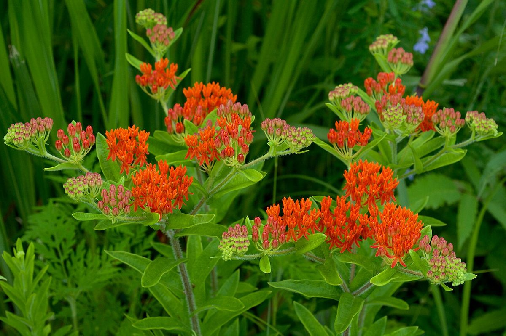

# Butterfly Milkweed

*Asclepias tuberosa*

Asclepias tuberosa, commonly known as butterfly weed, is a species of milkweed native to eastern and southwestern North America. It is commonly known as butterfly weed because of the butterflies that are attracted to the plant by its color and its copious production of nectar.

## Quick Facts

| | |
|---|---|
| **Scientific name** | *Asclepias tuberosa* |
| **Family** | — |
| **Height** | — |
| **Bloom time** | — |
| **Sun** | — |
| **Moisture** | — |
| **Soil** | — |
| **Wildlife value** | — |

## Mentioned In

- [Ecoregions Growing Conditions](../chapters/02-ecoregions-growing-conditions/index.md)
- [Pollinators Wildlife](../chapters/06-pollinators-wildlife/index.md)
- [Garden Design Native Plants](../chapters/10-garden-design-native-plants/index.md)
- [Planting Maintenance Sourcing](../chapters/11-planting-maintenance-sourcing/index.md)

## Image Credits

- H. Zell (CC BY-SA 3.0)
- Eric Hunt (CC BY-SA 4.0)

## Learn More

- [Wikipedia: Asclepias tuberosa](https://en.wikipedia.org/wiki/Asclepias_tuberosa)
