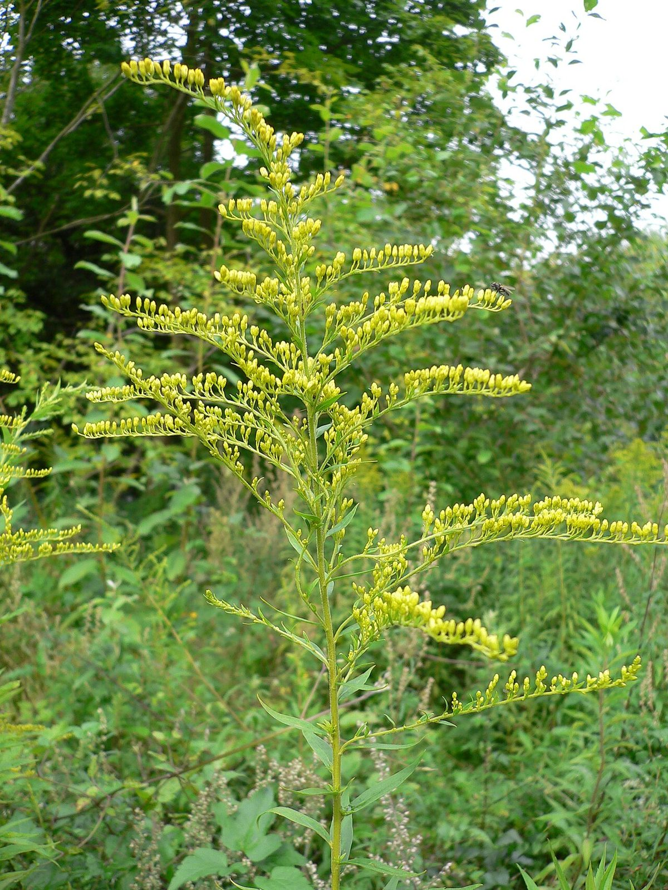

# Canada Goldenrod

*Solidago canadensis*

Solidago canadensis, known as Canada goldenrod or Canadian goldenrod, is an herbaceous perennial plant of the family Asteraceae. It forms colonies of upright growing plants, with many small yellow flowers in a branching inflorescence held above the foliage. It is native to northeastern and north-central North America and is an invasive plant in other parts of the continent and several areas worldwide, including Eurasia.

## Quick Facts

| | |
|---|---|
| **Scientific name** | *Solidago canadensis* |
| **Family** | — |
| **Height** | — |
| **Bloom time** | — |
| **Sun** | — |
| **Moisture** | — |
| **Soil** | — |
| **Wildlife value** | — |

## Mentioned In

- [Prairie Plants Grasslands](../chapters/03-prairie-plants-grasslands/index.md)

## Image Credits

- 松岡明芳 (CC BY-SA 4.0)
- Georg Slickers (CC BY-SA 4.0)

## Learn More

- [Wikipedia: Solidago canadensis](https://en.wikipedia.org/wiki/Solidago_canadensis)
