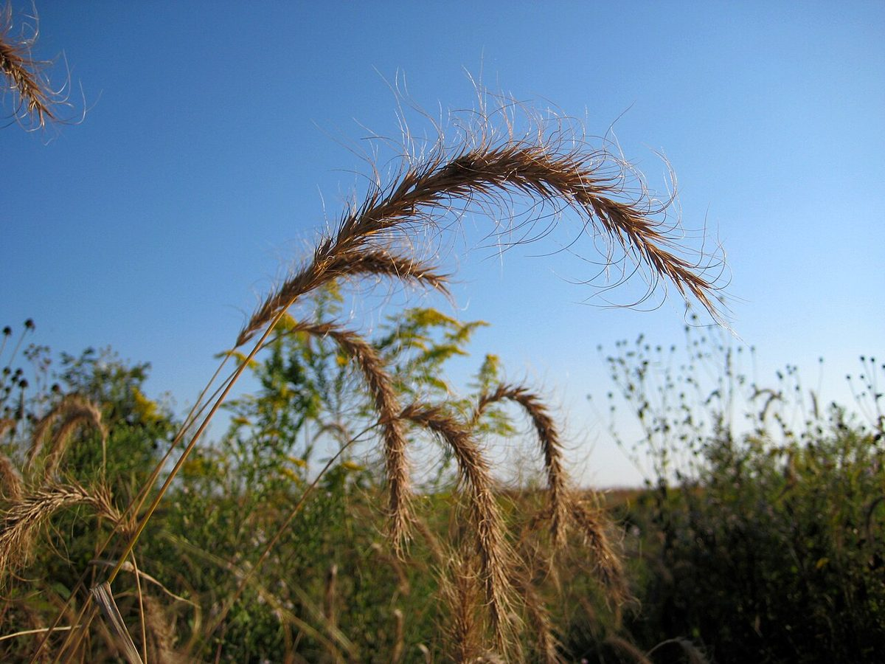

# Canada Wild Rye

*Elymus canadensis*

Elymus canadensis, synonyms including Elymus wiegandii, commonly known as Canada wild rye or Canadian wildrye, is a species of wild rye native to much of North America. It is most abundant in the central plains and Great Plains. It grows in a number of ecosystems, including woodlands, savannas, dunes, and prairies, sometimes in areas that have been disturbed.

## Quick Facts

| | |
|---|---|
| **Scientific name** | *Elymus canadensis* |
| **Family** | Poaceae |
| **Height** | 3-5 ft |
| **Bloom time** | Jul-Aug |
| **Sun** | Full sun to part shade |
| **Moisture** | Dry to mesic |
| **Soil** | Any |
| **Wildlife value** | Fast-establishing nurse grass for new prairie seedings |

## Mentioned In

- [Prairie Plants Grasslands](../chapters/03-prairie-plants-grasslands/index.md)

## Image Credits

- Crazytwoknobs (CC BY 3.0)

## Learn More

- [Wikipedia: Elymus canadensis](https://en.wikipedia.org/wiki/Elymus_canadensis)
