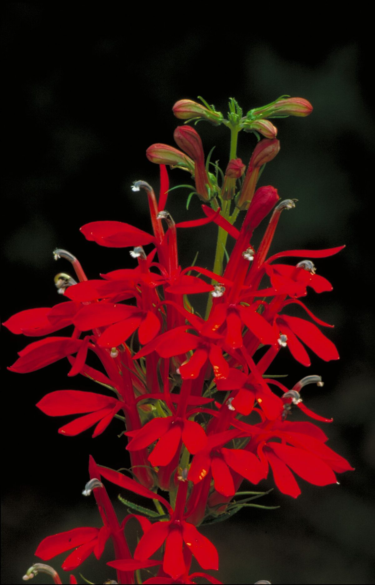

# Cardinal Flower

*Lobelia cardinalis*

Lobelia cardinalis, the cardinal flower (syn. L. fulgens), is a species of flowering plant in the bellflower family   Campanulaceae native to the Americas, from southeastern Canada south through the eastern and southwestern United States, Mexico and Central America to northern Colombia.

## Quick Facts

| | |
|---|---|
| **Scientific name** | *Lobelia cardinalis* |
| **Family** | — |
| **Height** | — |
| **Bloom time** | — |
| **Sun** | — |
| **Moisture** | — |
| **Soil** | — |
| **Wildlife value** | — |

## Mentioned In

- [Pollinators Wildlife](../chapters/06-pollinators-wildlife/index.md)

## Image Credits

- Tim Ross (Public domain)
- Barnes, Dr. Thomas G. (Public domain)

## Learn More

- [Wikipedia: Lobelia cardinalis](https://en.wikipedia.org/wiki/Lobelia_cardinalis)
