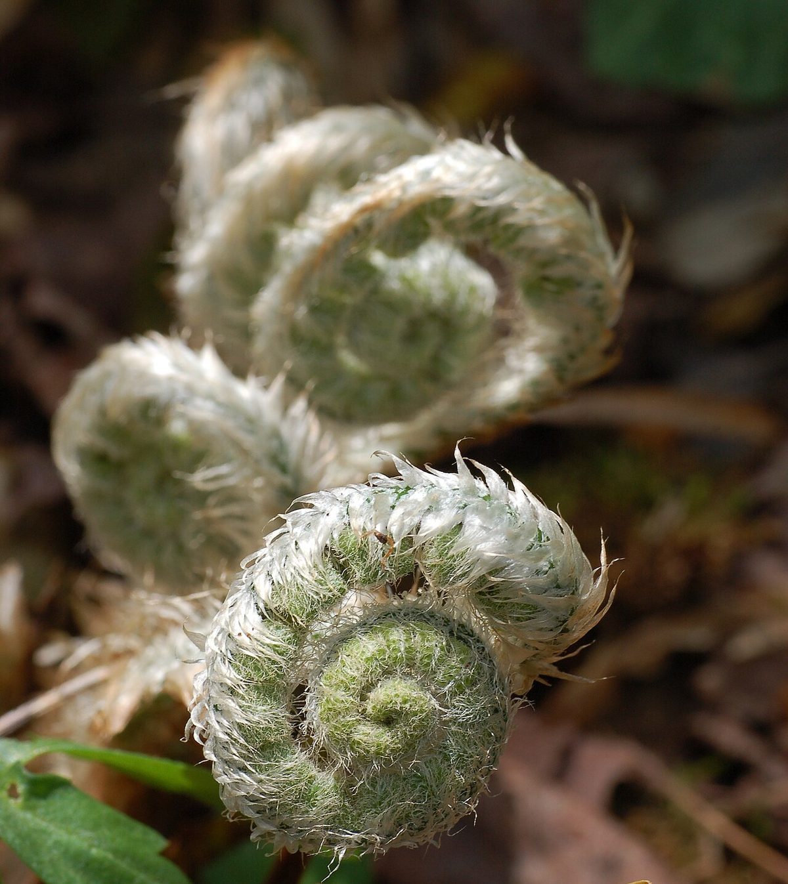
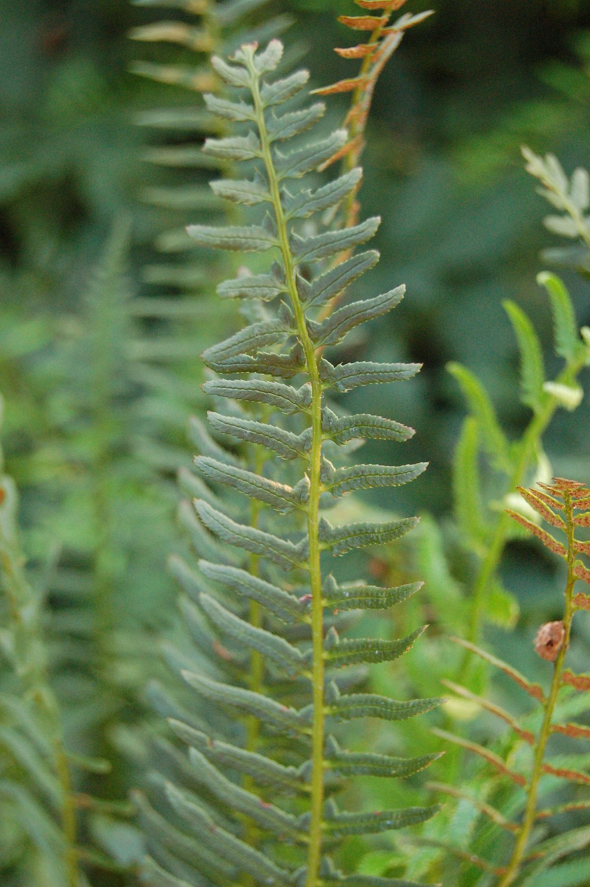

# Christmas Fern

*Polystichum acrostichoides*

Polystichum acrostichoides, commonly denominated Christmas fern, is a perennial, evergreen fern native to eastern North America, from Nova Scotia west to Minnesota and south to Florida and eastern Texas. It is one of the most common ferns in eastern North America, being found in moist and shady habitats in woodlands, stream banks and rocky slopes. The common name derives from the evergreen fronds, which are often still green at Christmas.

## Quick Facts

| | |
|---|---|
| **Scientific name** | *Polystichum acrostichoides* |
| **Family** | — |
| **Height** | — |
| **Bloom time** | — |
| **Sun** | — |
| **Moisture** | — |
| **Soil** | — |
| **Wildlife value** | — |

## Mentioned In

- [Woodland Forest Plants](../chapters/04-woodland-forest-plants/index.md)

## Image Credits

- Photo by and (c)2007 Derek Ramsey (Ram-Man) (CC BY-SA 2.5)
- Photo (c)2006 Derek Ramsey (Ram-Man) (CC BY-SA 2.5)

## Learn More

- [Wikipedia: Polystichum acrostichoides](https://en.wikipedia.org/wiki/Polystichum_acrostichoides)
